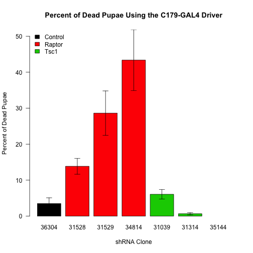

# Analysis of Birth Ratios for Muscle Tsc1/Raptor Flies -- Second Crosses

## Experimental Design

This was for the second batch of knockdown crosses in which only homozygous drivers were used.


These data are the raw data saved in ../Data/Birth Data.csv for the births and ../Data/Pupae Inspection Data.csv for the pupae inspection.  This script was most recently run on Tue Jun 24 12:43:12 2014.

## C179-GAL4 Driver

This analysis is just for the C179 Driver.


### Analysis of Pupae

We inspected the pupae from vials, 21 days after the cross was set up and counted how many pupae were present, and how many had dead flies in them.  These data are summarized in  Table \ref{tab:total-pupae-summary} and in Figure \ref{fig:total-pupae-barplot}.  To analyse these data, first we did an ANOVA testing for whether the UAS has an effect on the percentage of dead pupae.  The p-value for that comparason is **0.4711** for the UAS.  The results of this ANOVA are shown in Table \ref{tab:total-pupae-anova}.  To test if the driver alone had an effect with did a Student's t-test comparing the +/+ and *C179/+* progeny.  The p-value for the Driver having an effect is **0.4458**.  This indicated that there was no significant effect on the number of pupae.

<!-- html table generated in R 3.1.0 by xtable 1.7-3 package -->
<!-- Tue Jun 24 12:43:13 2014 -->
<TABLE border=1>
<CAPTION ALIGN="bottom"> Summary of the Number of Pupae by Driver and UAS for C179-GAL4 </CAPTION>
<TR> <TH> Gene </TH> <TH> UAS </TH> <TH> mean </TH> <TH> se </TH> <TH> sd </TH> <TH> rel.error </TH> <TH> n </TH>  </TR>
  <TR> <TD> Control </TD> <TD> 36304 </TD> <TD align="right"> 117.56 </TD> <TD align="right"> 15.02 </TD> <TD align="right"> 45.05 </TD> <TD align="right"> 38.32 </TD> <TD align="right">   9 </TD> </TR>
  <TR> <TD> Raptor </TD> <TD> 31528 </TD> <TD align="right"> 114.00 </TD> <TD align="right"> 12.76 </TD> <TD align="right"> 28.52 </TD> <TD align="right"> 25.02 </TD> <TD align="right">   5 </TD> </TR>
  <TR> <TD> Raptor </TD> <TD> 31529 </TD> <TD align="right"> 93.60 </TD> <TD align="right"> 9.82 </TD> <TD align="right"> 21.96 </TD> <TD align="right"> 23.46 </TD> <TD align="right">   5 </TD> </TR>
  <TR> <TD> Raptor </TD> <TD> 34814 </TD> <TD align="right"> 93.75 </TD> <TD align="right"> 11.20 </TD> <TD align="right"> 33.60 </TD> <TD align="right"> 35.84 </TD> <TD align="right">   9 </TD> </TR>
  <TR> <TD> Tsc1 </TD> <TD> 31039 </TD> <TD align="right"> 105.80 </TD> <TD align="right"> 18.08 </TD> <TD align="right"> 40.43 </TD> <TD align="right"> 38.21 </TD> <TD align="right">   5 </TD> </TR>
  <TR> <TD> Tsc1 </TD> <TD> 31314 </TD> <TD align="right"> 129.43 </TD> <TD align="right"> 19.61 </TD> <TD align="right"> 55.48 </TD> <TD align="right"> 42.86 </TD> <TD align="right">   8 </TD> </TR>
  <TR> <TD> Tsc1 </TD> <TD> 35144 </TD> <TD align="right">  </TD> <TD align="right">  </TD> <TD align="right">  </TD> <TD align="right">  </TD> <TD align="right">   5 </TD> </TR>
   <A NAME=tab:total-pupae-summary></A>
</TABLE>
<!-- html table generated in R 3.1.0 by xtable 1.7-3 package -->
<!-- Tue Jun 24 12:43:13 2014 -->
<TABLE border=1>
<CAPTION ALIGN="bottom"> ANOVA for the Number of Pupae by Driver and UAS for C179-GAL4 </CAPTION>
<TR> <TH>  </TH> <TH> Df </TH> <TH> Sum Sq </TH> <TH> Mean Sq </TH> <TH> F value </TH> <TH> Pr(&gt;F) </TH>  </TR>
  <TR> <TD> Driver </TD> <TD align="right"> 1 </TD> <TD align="right"> 370.32 </TD> <TD align="right"> 370.32 </TD> <TD align="right"> 0.25 </TD> <TD align="right"> 0.6169 </TD> </TR>
  <TR> <TD> UAS </TD> <TD align="right"> 5 </TD> <TD align="right"> 6779.49 </TD> <TD align="right"> 1355.90 </TD> <TD align="right"> 0.93 </TD> <TD align="right"> 0.4711 </TD> </TR>
  <TR> <TD> Residuals </TD> <TD align="right"> 49 </TD> <TD align="right"> 71595.91 </TD> <TD align="right"> 1461.14 </TD> <TD align="right">  </TD> <TD align="right">  </TD> </TR>
   <A NAME=tab:total-pupae-anova></A>
</TABLE>

 


### Analysis of Dead Pupae

 


```
## Loading required package: mvtnorm
## Loading required package: survival
## Loading required package: splines
## Loading required package: TH.data
```

A summary of the percent of dead pupae for each cross is shown in Table \ref{tab:dead-pupae-summary} and in Figure \ref{fig:dead-pupae-barplot}.
To analyse these data, first we did an ANOVA testing for whether the UAS has an effect on the percentage of dead pupae.  The p-value for that comparason is **5.9407 &times; 10<sup>-10</sup>** for the UAS.  The results of this ANOVA are shown in Table \ref{tab:dead-pupae-anova}.  To test if the driver alone had an effect with did a Student's t-test comparing the +/+ and *C179/+* progeny.  The p-value for the Driver having an effect is **6.03 &times; 10<sup>-4</sup>**.  We therefore excluded the +/+ progeny from the analysis and compared with the *C179-Gal4/+* progeny as a control.  

The ANOVA for this comparason yielded a p-value for the UAS of **9.6092 &times; 10<sup>-7</sup>**.  The results of this ANOVA are in Table \ref{tab:dead-pupae-anova-c179}.  Since this ANOVA was significant, we did a post-hoc test to look at each strain relative to the control.  To test for differences compared to the *C179-GAL4/+* control strain, we did a Dunnett's test.  The results of this test are shown in Table \ref{tab:dead-pupae-dunnett}.  


<!-- html table generated in R 3.1.0 by xtable 1.7-3 package -->
<!-- Tue Jun 24 12:43:13 2014 -->
<TABLE border=1>
<CAPTION ALIGN="bottom"> Summary of Percent of Dead Pupae by Driver and UAS for C179-GAL4 </CAPTION>
<TR> <TH> Gene </TH> <TH> UAS </TH> <TH> mean </TH> <TH> se </TH> <TH> sd </TH> <TH> rel.error </TH> <TH> n </TH>  </TR>
  <TR> <TD> Control </TD> <TD> 36304 </TD> <TD align="right"> 3.50 </TD> <TD align="right"> 1.59 </TD> <TD align="right"> 4.78 </TD> <TD align="right"> 136.52 </TD> <TD align="right">   9 </TD> </TR>
  <TR> <TD> Raptor </TD> <TD> 31528 </TD> <TD align="right"> 13.86 </TD> <TD align="right"> 2.21 </TD> <TD align="right"> 4.95 </TD> <TD align="right"> 35.73 </TD> <TD align="right">   5 </TD> </TR>
  <TR> <TD> Raptor </TD> <TD> 31529 </TD> <TD align="right"> 28.63 </TD> <TD align="right"> 6.18 </TD> <TD align="right"> 13.82 </TD> <TD align="right"> 48.28 </TD> <TD align="right">   5 </TD> </TR>
  <TR> <TD> Raptor </TD> <TD> 34814 </TD> <TD align="right"> 43.37 </TD> <TD align="right"> 8.46 </TD> <TD align="right"> 25.39 </TD> <TD align="right"> 58.55 </TD> <TD align="right">   9 </TD> </TR>
  <TR> <TD> Tsc1 </TD> <TD> 31039 </TD> <TD align="right"> 6.07 </TD> <TD align="right"> 1.31 </TD> <TD align="right"> 2.94 </TD> <TD align="right"> 48.41 </TD> <TD align="right">   5 </TD> </TR>
  <TR> <TD> Tsc1 </TD> <TD> 31314 </TD> <TD align="right"> 0.67 </TD> <TD align="right"> 0.30 </TD> <TD align="right"> 0.84 </TD> <TD align="right"> 125.51 </TD> <TD align="right">   8 </TD> </TR>
  <TR> <TD> Tsc1 </TD> <TD> 35144 </TD> <TD align="right">  </TD> <TD align="right">  </TD> <TD align="right">  </TD> <TD align="right">  </TD> <TD align="right">   5 </TD> </TR>
   <A NAME=tab:dead-pupae-summary></A>
</TABLE>
<!-- html table generated in R 3.1.0 by xtable 1.7-3 package -->
<!-- Tue Jun 24 12:43:13 2014 -->
<TABLE border=1>
<CAPTION ALIGN="bottom"> ANOVA for Percent of Dead Pupae by Driver and UAS for C179-GAL4 </CAPTION>
<TR> <TH>  </TH> <TH> Df </TH> <TH> Sum Sq </TH> <TH> Mean Sq </TH> <TH> F value </TH> <TH> Pr(&gt;F) </TH>  </TR>
  <TR> <TD> Driver </TD> <TD align="right"> 1 </TD> <TD align="right"> 1852.63 </TD> <TD align="right"> 1852.63 </TD> <TD align="right"> 15.75 </TD> <TD align="right"> 0.0002 </TD> </TR>
  <TR> <TD> UAS </TD> <TD align="right"> 5 </TD> <TD align="right"> 10356.94 </TD> <TD align="right"> 2071.39 </TD> <TD align="right"> 17.61 </TD> <TD align="right"> 0.0000 </TD> </TR>
  <TR> <TD> Residuals </TD> <TD align="right"> 49 </TD> <TD align="right"> 5762.95 </TD> <TD align="right"> 117.61 </TD> <TD align="right">  </TD> <TD align="right">  </TD> </TR>
   <A NAME=tab:dead-pupae-anova></A>
</TABLE>
<!-- html table generated in R 3.1.0 by xtable 1.7-3 package -->
<!-- Tue Jun 24 12:43:13 2014 -->
<TABLE border=1>
<CAPTION ALIGN="bottom"> ANOVA for Percent of Dead Pupae by UAS for C179-GAL4 </CAPTION>
<TR> <TH>  </TH> <TH> Df </TH> <TH> Sum Sq </TH> <TH> Mean Sq </TH> <TH> F value </TH> <TH> Pr(&gt;F) </TH>  </TR>
  <TR> <TD> UAS </TD> <TD align="right"> 5 </TD> <TD align="right"> 10356.94 </TD> <TD align="right"> 2071.39 </TD> <TD align="right"> 12.21 </TD> <TD align="right"> 0.0000 </TD> </TR>
  <TR> <TD> Residuals </TD> <TD align="right"> 33 </TD> <TD align="right"> 5597.26 </TD> <TD align="right"> 169.61 </TD> <TD align="right">  </TD> <TD align="right">  </TD> </TR>
   <A NAME=tab:dead-pupae-anova-c179></A>
</TABLE>
<!-- html table generated in R 3.1.0 by xtable 1.7-3 package -->
<!-- Tue Jun 24 12:43:13 2014 -->
<TABLE border=1>
<CAPTION ALIGN="bottom"> Dunnett's Test for the Percent of Dead Pupae Comparing to Control (C179-Gal4/+) </CAPTION>
<TR> <TH>  </TH> <TH> Effect Size (%) </TH> <TH> p-value </TH>  </TR>
  <TR> <TD align="right"> 31039 - 36304 </TD> <TD align="right"> 2.6 </TD> <TD align="right"> 0.9970982 </TD> </TR>
  <TR> <TD align="right"> 31314 - 36304 </TD> <TD align="right"> -2.8 </TD> <TD align="right"> 0.9927393 </TD> </TR>
  <TR> <TD align="right"> 31528 - 36304 </TD> <TD align="right"> 10.4 </TD> <TD align="right"> 0.5156111 </TD> </TR>
  <TR> <TD align="right"> 31529 - 36304 </TD> <TD align="right"> 25.1 </TD> <TD align="right"> 0.0069283 </TD> </TR>
  <TR> <TD align="right"> 34814 - 36304 </TD> <TD align="right"> 39.9 </TD> <TD align="right"> 0.0000013 </TD> </TR>
   <A NAME=tab:dead-pupae-dunnett></A>
</TABLE>
     
### Analysis of Total Number of Flies


 

We inspected the total number of flies eclosed up to 21 days after the cross was set up.  These data are summarized in  Table \ref{tab:total-flies-summary} and in Figure \ref{fig:total-flies-barplot}.  To analyse these data, first we did an ANOVA testing for whether the UAS has an effect on the number of eclosed flies.  The p-value for that comparason is **4.257 &times; 10<sup>-6</sup>** for the UAS.  The results of this ANOVA are shown in Table \ref{tab:total-flies-anova}.  To test if the driver alone had an effect with did a Student's t-test comparing the +/+ and *C179/+* progeny.  The p-value for the Driver having an effect is **0.0631**.  

Due to the significant ANOVA we performed a post-hoc Dunnett's test using the *C179/+* progeny as the controls.  An ANOVA analysis excluding the +/+ flies had a p-value of **2.1537 &times; 10<sup>-5</sup>** for the UAS.  The results of that test are in Table \ref{tab:total-flies-dunnett}.  This test indicates that each of the three Raptor shRNA knockdowns cause a reduction in the number of flies.

<!-- html table generated in R 3.1.0 by xtable 1.7-3 package -->
<!-- Tue Jun 24 12:43:13 2014 -->
<TABLE border=1>
<CAPTION ALIGN="bottom"> Summary of the Number of Flies by Driver and UAS for C179-GAL4 </CAPTION>
<TR> <TH> Gene </TH> <TH> UAS </TH> <TH> mean </TH> <TH> se </TH> <TH> sd </TH> <TH> rel.error </TH> <TH> n </TH>  </TR>
  <TR> <TD> Control </TD> <TD> 36304 </TD> <TD align="right"> 111.38 </TD> <TD align="right"> 13.66 </TD> <TD align="right"> 40.99 </TD> <TD align="right"> 36.80 </TD> <TD align="right">   9 </TD> </TR>
  <TR> <TD> Raptor </TD> <TD> 31528 </TD> <TD align="right"> 65.50 </TD> <TD align="right"> 9.17 </TD> <TD align="right"> 20.51 </TD> <TD align="right"> 31.31 </TD> <TD align="right">   5 </TD> </TR>
  <TR> <TD> Raptor </TD> <TD> 31529 </TD> <TD align="right"> 34.67 </TD> <TD align="right"> 3.39 </TD> <TD align="right"> 7.57 </TD> <TD align="right"> 21.84 </TD> <TD align="right">   5 </TD> </TR>
  <TR> <TD> Raptor </TD> <TD> 34814 </TD> <TD align="right"> 17.00 </TD> <TD align="right"> 1.74 </TD> <TD align="right"> 5.23 </TD> <TD align="right"> 30.75 </TD> <TD align="right">   9 </TD> </TR>
  <TR> <TD> Tsc1 </TD> <TD> 31039 </TD> <TD align="right"> 97.50 </TD> <TD align="right"> 2.85 </TD> <TD align="right"> 6.36 </TD> <TD align="right"> 6.53 </TD> <TD align="right">   5 </TD> </TR>
  <TR> <TD> Tsc1 </TD> <TD> 31314 </TD> <TD align="right"> 154.75 </TD> <TD align="right"> 17.70 </TD> <TD align="right"> 50.06 </TD> <TD align="right"> 32.35 </TD> <TD align="right">   8 </TD> </TR>
  <TR> <TD> Tsc1 </TD> <TD> 35144 </TD> <TD align="right"> 92.60 </TD> <TD align="right"> 4.39 </TD> <TD align="right"> 9.81 </TD> <TD align="right"> 10.60 </TD> <TD align="right">   5 </TD> </TR>
   <A NAME=tab:total-flies-summary></A>
</TABLE>
<!-- html table generated in R 3.1.0 by xtable 1.7-3 package -->
<!-- Tue Jun 24 12:43:13 2014 -->
<TABLE border=1>
<CAPTION ALIGN="bottom"> ANOVA for the Number of Flies by Driver and UAS for C179-GAL4 </CAPTION>
<TR> <TH>  </TH> <TH> Df </TH> <TH> Sum Sq </TH> <TH> Mean Sq </TH> <TH> F value </TH> <TH> Pr(&gt;F) </TH>  </TR>
  <TR> <TD> Driver </TD> <TD align="right"> 1 </TD> <TD align="right"> 5865.15 </TD> <TD align="right"> 5865.15 </TD> <TD align="right"> 4.97 </TD> <TD align="right"> 0.0328 </TD> </TR>
  <TR> <TD> UAS </TD> <TD align="right"> 6 </TD> <TD align="right"> 67665.63 </TD> <TD align="right"> 11277.61 </TD> <TD align="right"> 9.55 </TD> <TD align="right"> 0.0000 </TD> </TR>
  <TR> <TD> Residuals </TD> <TD align="right"> 33 </TD> <TD align="right"> 38968.24 </TD> <TD align="right"> 1180.86 </TD> <TD align="right">  </TD> <TD align="right">  </TD> </TR>
   <A NAME=tab:total-flies-anova></A>
</TABLE>
<!-- html table generated in R 3.1.0 by xtable 1.7-3 package -->
<!-- Tue Jun 24 12:43:13 2014 -->
<TABLE border=1>
<CAPTION ALIGN="bottom"> Dunnett's Test for the Number of Flies Comparing to Control (C179-Gal4/+) </CAPTION>
<TR> <TH>  </TH> <TH> Effect Size (%) </TH> <TH> p-value </TH>  </TR>
  <TR> <TD align="right"> 31039 - 36304 </TD> <TD align="right"> -13.9 </TD> <TD align="right"> 0.9942088 </TD> </TR>
  <TR> <TD align="right"> 31314 - 36304 </TD> <TD align="right"> 43.4 </TD> <TD align="right"> 0.0991866 </TD> </TR>
  <TR> <TD align="right"> 31528 - 36304 </TD> <TD align="right"> -45.9 </TD> <TD align="right"> 0.4347889 </TD> </TR>
  <TR> <TD align="right"> 31529 - 36304 </TD> <TD align="right"> -76.7 </TD> <TD align="right"> 0.0178341 </TD> </TR>
  <TR> <TD align="right"> 34814 - 36304 </TD> <TD align="right"> -94.4 </TD> <TD align="right"> 0.0009227 </TD> </TR>
  <TR> <TD align="right"> 35144 - 36304 </TD> <TD align="right"> -18.8 </TD> <TD align="right"> 0.8906271 </TD> </TR>
   <A NAME=tab:total-flies-dunnett></A>
</TABLE>

### Analysis of Number of Flies by Gender


For the flies which had been born, we could separate these data based on gender.  The separated data is summarized in Tables \ref{tab:total-flies-summary-males} and \ref{tab:total-flies-summary-females}.  These data are graphed in Figure \ref{fig:total-flies-barplot-gendered}.  

For Males, first we did an ANOVA testing for whether the UAS has an effect on the number of eclosed flies.  The p-value for that comparason is **2.8748 &times; 10<sup>-6</sup>** for the UAS.  The results of this ANOVA are shown in Table \ref{tab:total-flies-anova-males}.  To test if the driver alone had an effect with did a Student's t-test comparing the +/+ and *C179/+* progeny.  The p-value for the Driver having an effect is **0.1885**. 

For Females, first we did an ANOVA testing for whether the UAS has an effect on the number of eclosed flies.  The p-value for that comparason is **1.4578 &times; 10<sup>-5</sup>** for the UAS.  The results of this ANOVA are shown in Table \ref{tab:total-flies-anova-females}.  To test if the driver alone had an effect with did a Student's t-test comparing the +/+ and *C179/+* progeny.  The p-value for the Driver having an effect is **0.0204**. 

Due to the significant ANOVA we performed a post-hoc Dunnett's test using the *C179/+* progeny as the controls.  An ANOVA analysis excluding the +/+ flies had a p-value of **1.9151 &times; 10<sup>-5</sup>** for the UAS for males and a p-value of **6.1458 &times; 10<sup>-5</sup>** for the UAS for the females.  The results of that test are in Tables \ref{tab:total-flies-dunnett-gendered}.  This test indicates that each of the three Raptor shRNA knockdowns cause a reduction in the number of male flies, but only 34814 had significantly less females.

<!-- html table generated in R 3.1.0 by xtable 1.7-3 package -->
<!-- Tue Jun 24 12:43:14 2014 -->
<TABLE border=1>
<CAPTION ALIGN="bottom"> Summary of the Number of Male Flies by Driver and UAS for C179-GAL4 </CAPTION>
<TR> <TH> Gene </TH> <TH> UAS </TH> <TH> mean </TH> <TH> se </TH> <TH> sd </TH> <TH> rel.error </TH> <TH> n </TH>  </TR>
  <TR> <TD> Control </TD> <TD> 36304 </TD> <TD align="right"> 55.88 </TD> <TD align="right"> 6.63 </TD> <TD align="right"> 19.90 </TD> <TD align="right"> 35.62 </TD> <TD align="right">   9 </TD> </TR>
  <TR> <TD> Raptor </TD> <TD> 31528 </TD> <TD align="right"> 16.50 </TD> <TD align="right"> 2.21 </TD> <TD align="right"> 4.95 </TD> <TD align="right"> 30.00 </TD> <TD align="right">   5 </TD> </TR>
  <TR> <TD> Raptor </TD> <TD> 31529 </TD> <TD align="right"> 1.00 </TD> <TD align="right"> 0.77 </TD> <TD align="right"> 1.73 </TD> <TD align="right"> 173.21 </TD> <TD align="right">   5 </TD> </TR>
  <TR> <TD> Raptor </TD> <TD> 34814 </TD> <TD align="right"> 7.00 </TD> <TD align="right"> 0.82 </TD> <TD align="right"> 2.45 </TD> <TD align="right"> 34.99 </TD> <TD align="right">   9 </TD> </TR>
  <TR> <TD> Tsc1 </TD> <TD> 31039 </TD> <TD align="right"> 45.00 </TD> <TD align="right"> 1.90 </TD> <TD align="right"> 4.24 </TD> <TD align="right"> 9.43 </TD> <TD align="right">   5 </TD> </TR>
  <TR> <TD> Tsc1 </TD> <TD> 31314 </TD> <TD align="right"> 73.50 </TD> <TD align="right"> 10.52 </TD> <TD align="right"> 29.75 </TD> <TD align="right"> 40.47 </TD> <TD align="right">   8 </TD> </TR>
  <TR> <TD> Tsc1 </TD> <TD> 35144 </TD> <TD align="right"> 45.80 </TD> <TD align="right"> 2.13 </TD> <TD align="right"> 4.76 </TD> <TD align="right"> 10.40 </TD> <TD align="right">   5 </TD> </TR>
   <A NAME=tab:total-flies-summary-males></A>
</TABLE>
<!-- html table generated in R 3.1.0 by xtable 1.7-3 package -->
<!-- Tue Jun 24 12:43:14 2014 -->
<TABLE border=1>
<CAPTION ALIGN="bottom"> Summary of the Number of Female Flies by Driver and UAS for C179-GAL4 </CAPTION>
<TR> <TH> Gene </TH> <TH> UAS </TH> <TH> mean </TH> <TH> se </TH> <TH> sd </TH> <TH> rel.error </TH> <TH> n </TH>  </TR>
  <TR> <TD> Control </TD> <TD> 36304 </TD> <TD align="right"> 55.50 </TD> <TD align="right"> 7.41 </TD> <TD align="right"> 22.23 </TD> <TD align="right"> 40.05 </TD> <TD align="right">   9 </TD> </TR>
  <TR> <TD> Raptor </TD> <TD> 31528 </TD> <TD align="right"> 49.00 </TD> <TD align="right"> 6.96 </TD> <TD align="right"> 15.56 </TD> <TD align="right"> 31.75 </TD> <TD align="right">   5 </TD> </TR>
  <TR> <TD> Raptor </TD> <TD> 31529 </TD> <TD align="right"> 33.67 </TD> <TD align="right"> 3.17 </TD> <TD align="right"> 7.09 </TD> <TD align="right"> 21.07 </TD> <TD align="right">   5 </TD> </TR>
  <TR> <TD> Raptor </TD> <TD> 34814 </TD> <TD align="right"> 10.00 </TD> <TD align="right"> 0.94 </TD> <TD align="right"> 2.83 </TD> <TD align="right"> 28.28 </TD> <TD align="right">   9 </TD> </TR>
  <TR> <TD> Tsc1 </TD> <TD> 31039 </TD> <TD align="right"> 52.50 </TD> <TD align="right"> 4.74 </TD> <TD align="right"> 10.61 </TD> <TD align="right"> 20.20 </TD> <TD align="right">   5 </TD> </TR>
  <TR> <TD> Tsc1 </TD> <TD> 31314 </TD> <TD align="right"> 81.25 </TD> <TD align="right"> 7.93 </TD> <TD align="right"> 22.44 </TD> <TD align="right"> 27.61 </TD> <TD align="right">   8 </TD> </TR>
  <TR> <TD> Tsc1 </TD> <TD> 35144 </TD> <TD align="right"> 46.80 </TD> <TD align="right"> 3.92 </TD> <TD align="right"> 8.76 </TD> <TD align="right"> 18.71 </TD> <TD align="right">   5 </TD> </TR>
   <A NAME=tab:total-flies-summary-females></A>
</TABLE>
<!-- html table generated in R 3.1.0 by xtable 1.7-3 package -->
<!-- Tue Jun 24 12:43:14 2014 -->
<TABLE border=1>
<CAPTION ALIGN="bottom"> ANOVA for the Number of Male Flies by Driver and UAS for C179-GAL4 </CAPTION>
<TR> <TH>  </TH> <TH> Df </TH> <TH> Sum Sq </TH> <TH> Mean Sq </TH> <TH> F value </TH> <TH> Pr(&gt;F) </TH>  </TR>
  <TR> <TD> Driver </TD> <TD align="right"> 1 </TD> <TD align="right"> 796.10 </TD> <TD align="right"> 796.10 </TD> <TD align="right"> 2.30 </TD> <TD align="right"> 0.1389 </TD> </TR>
  <TR> <TD> UAS </TD> <TD align="right"> 6 </TD> <TD align="right"> 20640.70 </TD> <TD align="right"> 3440.12 </TD> <TD align="right"> 9.94 </TD> <TD align="right"> 0.0000 </TD> </TR>
  <TR> <TD> Residuals </TD> <TD align="right"> 33 </TD> <TD align="right"> 11424.18 </TD> <TD align="right"> 346.19 </TD> <TD align="right">  </TD> <TD align="right">  </TD> </TR>
   <A NAME=tab:total-flies-anova-males></A>
</TABLE>
<!-- html table generated in R 3.1.0 by xtable 1.7-3 package -->
<!-- Tue Jun 24 12:43:14 2014 -->
<TABLE border=1>
<CAPTION ALIGN="bottom"> ANOVA for the Number of Female Flies by Driver and UAS for C179-GAL4 </CAPTION>
<TR> <TH>  </TH> <TH> Df </TH> <TH> Sum Sq </TH> <TH> Mean Sq </TH> <TH> F value </TH> <TH> Pr(&gt;F) </TH>  </TR>
  <TR> <TD> Driver </TD> <TD align="right"> 1 </TD> <TD align="right"> 2339.56 </TD> <TD align="right"> 2339.56 </TD> <TD align="right"> 7.77 </TD> <TD align="right"> 0.0087 </TD> </TR>
  <TR> <TD> UAS </TD> <TD align="right"> 6 </TD> <TD align="right"> 15158.53 </TD> <TD align="right"> 2526.42 </TD> <TD align="right"> 8.39 </TD> <TD align="right"> 0.0000 </TD> </TR>
  <TR> <TD> Residuals </TD> <TD align="right"> 33 </TD> <TD align="right"> 9933.47 </TD> <TD align="right"> 301.01 </TD> <TD align="right">  </TD> <TD align="right">  </TD> </TR>
   <A NAME=tab:total-flies-anova-females></A>
</TABLE>
<!-- html table generated in R 3.1.0 by xtable 1.7-3 package -->
<!-- Tue Jun 24 12:43:14 2014 -->
<TABLE border=1>
<CAPTION ALIGN="bottom"> Dunnett's Test for the Number of Males and Females Comparing to Control (C179-Gal4/+) </CAPTION>
<TR> <TH>  </TH> <TH> Male Effect Size (%) </TH> <TH> Male p-value </TH> <TH> Female Effect Size (%) </TH> <TH> Female p-value </TH>  </TR>
  <TR> <TD align="right"> 31039 - 36304 </TD> <TD align="right"> -10.9 </TD> <TD align="right"> 0.9658220 </TD> <TD align="right"> -3.0 </TD> <TD align="right"> 0.9999516 </TD> </TR>
  <TR> <TD align="right"> 31314 - 36304 </TD> <TD align="right"> 17.6 </TD> <TD align="right"> 0.3304213 </TD> <TD align="right"> 25.7 </TD> <TD align="right"> 0.0387423 </TD> </TR>
  <TR> <TD align="right"> 31528 - 36304 </TD> <TD align="right"> -39.4 </TD> <TD align="right"> 0.0774152 </TD> <TD align="right"> -6.5 </TD> <TD align="right"> 0.9961498 </TD> </TR>
  <TR> <TD align="right"> 31529 - 36304 </TD> <TD align="right"> -54.9 </TD> <TD align="right"> 0.0014804 </TD> <TD align="right"> -21.8 </TD> <TD align="right"> 0.3387063 </TD> </TR>
  <TR> <TD align="right"> 34814 - 36304 </TD> <TD align="right"> -48.9 </TD> <TD align="right"> 0.0017312 </TD> <TD align="right"> -45.5 </TD> <TD align="right"> 0.0015885 </TD> </TR>
  <TR> <TD align="right"> 35144 - 36304 </TD> <TD align="right"> -10.1 </TD> <TD align="right"> 0.8995342 </TD> <TD align="right"> -8.7 </TD> <TD align="right"> 0.9231583 </TD> </TR>
   <A NAME=tab:total-flies-dunnett-gendered></A>
</TABLE>

 
     
## Mef-GAL4 Driver


This analysis is just for the *Mef2-GAL4* Driver.


## Analysis of Pupae

We inspected the pupae from vials, 21 days after the cross was set up and counted how many pupae were present, and how many had dead flies in them.  These data are summarized in  Table \ref{tab:total-pupae-summary-mef} and in Figure \ref{fig:total-pupae-barplot-mef}.  To analyse these data, first we did an ANOVA testing for whether the UAS has an effect on the percentage of dead pupae.  The p-value for that comparason is **0.0058** for the UAS.  The results of this ANOVA are shown in Table \ref{tab:total-pupae-anova-mef}.  To test if the driver alone had an effect with did a Student's t-test comparing the +/+ and *Mef/+* progeny.  The p-value for the Driver having an effect is **0.128**.  This indicated that there was no significant effect on the number of pupae.

<!-- html table generated in R 3.1.0 by xtable 1.7-3 package -->
<!-- Tue Jun 24 12:43:14 2014 -->
<TABLE border=1>
<CAPTION ALIGN="bottom"> Summary of the Number of Pupae by Driver and UAS for Mef-GAL4 </CAPTION>
<TR> <TH> Gene </TH> <TH> UAS </TH> <TH> mean </TH> <TH> se </TH> <TH> sd </TH> <TH> rel.error </TH> <TH> n </TH>  </TR>
  <TR> <TD> Control </TD> <TD> 36304 </TD> <TD align="right"> 83.00 </TD> <TD align="right"> 10.18 </TD> <TD align="right"> 24.92 </TD> <TD align="right"> 30.03 </TD> <TD align="right">   6 </TD> </TR>
  <TR> <TD> Raptor </TD> <TD> 31528 </TD> <TD align="right"> 115.50 </TD> <TD align="right"> 6.96 </TD> <TD align="right"> 13.92 </TD> <TD align="right"> 12.05 </TD> <TD align="right">   4 </TD> </TR>
  <TR> <TD> Raptor </TD> <TD> 34814 </TD> <TD align="right"> 124.50 </TD> <TD align="right"> 5.78 </TD> <TD align="right"> 11.56 </TD> <TD align="right"> 9.29 </TD> <TD align="right">   4 </TD> </TR>
  <TR> <TD> Tsc1 </TD> <TD> 31039 </TD> <TD align="right"> 44.33 </TD> <TD align="right"> 14.45 </TD> <TD align="right"> 25.03 </TD> <TD align="right"> 56.45 </TD> <TD align="right">   3 </TD> </TR>
  <TR> <TD> Tsc1 </TD> <TD> 31314 </TD> <TD align="right"> 97.50 </TD> <TD align="right"> 11.50 </TD> <TD align="right"> 16.26 </TD> <TD align="right"> 16.68 </TD> <TD align="right">   2 </TD> </TR>
  <TR> <TD> Tsc1 </TD> <TD> 35144 </TD> <TD align="right">  </TD> <TD align="right">  </TD> <TD align="right">  </TD> <TD align="right">  </TD> <TD align="right">   6 </TD> </TR>
   <A NAME=tab:total-pupae-summary-mef></A>
</TABLE>
<!-- html table generated in R 3.1.0 by xtable 1.7-3 package -->
<!-- Tue Jun 24 12:43:14 2014 -->
<TABLE border=1>
<CAPTION ALIGN="bottom"> ANOVA for the Number of Pupae by Driver and UAS for Mef-GAL4 </CAPTION>
<TR> <TH>  </TH> <TH> Df </TH> <TH> Sum Sq </TH> <TH> Mean Sq </TH> <TH> F value </TH> <TH> Pr(&gt;F) </TH>  </TR>
  <TR> <TD> Driver </TD> <TD align="right"> 1 </TD> <TD align="right"> 929.17 </TD> <TD align="right"> 929.17 </TD> <TD align="right"> 1.22 </TD> <TD align="right"> 0.2784 </TD> </TR>
  <TR> <TD> UAS </TD> <TD align="right"> 4 </TD> <TD align="right"> 13720.83 </TD> <TD align="right"> 3430.21 </TD> <TD align="right"> 4.50 </TD> <TD align="right"> 0.0058 </TD> </TR>
  <TR> <TD> Residuals </TD> <TD align="right"> 30 </TD> <TD align="right"> 22873.64 </TD> <TD align="right"> 762.45 </TD> <TD align="right">  </TD> <TD align="right">  </TD> </TR>
   <A NAME=tab:total-pupae-anova-mef></A>
</TABLE>

 


### Analysis of Dead Pupae


```
## Warning: zero-length arrow is of indeterminate angle and so skipped
```

 


A summary of the percent of dead pupae for each cross is shown in Table \ref{tab:dead-pupae-summary-mef} and in Figure \ref{fig:dead-pupae-barplot}.
To analyse these data, first we did an ANOVA testing for whether the UAS has an effect on the percentage of dead pupae.  The p-value for that comparason is **1.1958 &times; 10<sup>-30</sup>** for the UAS.  The results of this ANOVA are shown in Table \ref{tab:dead-pupae-anova-mef}.  To test if the driver alone had an effect with did a Student's t-test comparing the +/+ and *Mef/+* progeny.  The p-value for the Driver having an effect is **0.0015**.  We therefore excluded the +/+ progeny from the analysis and compared with the *Mef-Gal4/+* progeny as a control.  

The ANOVA for this comparason yielded a p-value for the UAS of **2.7585 &times; 10<sup>-16</sup>**.  The results of this ANOVA are in Table \ref{tab:dead-pupae-anova-Mef}.  Since this ANOVA was significant, we did a post-hoc test to look at each strain relative to the control.  To test for differences compared to the *Mef-GAL4/+* control strain, we did a Dunnett's test.  The results of this test are shown in Table \ref{tab:dead-pupae-dunnett-mef}.  


<!-- html table generated in R 3.1.0 by xtable 1.7-3 package -->
<!-- Tue Jun 24 12:43:14 2014 -->
<TABLE border=1>
<CAPTION ALIGN="bottom"> Summary of Percent of Dead Pupae by Driver and UAS for Mef-GAL4 </CAPTION>
<TR> <TH> Gene </TH> <TH> UAS </TH> <TH> mean </TH> <TH> se </TH> <TH> sd </TH> <TH> rel.error </TH>  </TR>
  <TR> <TD> Control </TD> <TD> 36304 </TD> <TD align="right"> 6.25 </TD> <TD align="right"> 2.16 </TD> <TD align="right"> 5.29 </TD> <TD align="right"> 84.62 </TD> </TR>
  <TR> <TD> Raptor </TD> <TD> 31528 </TD> <TD align="right"> 98.85 </TD> <TD align="right"> 0.88 </TD> <TD align="right"> 1.75 </TD> <TD align="right"> 1.78 </TD> </TR>
  <TR> <TD> Raptor </TD> <TD> 34814 </TD> <TD align="right"> 100.00 </TD> <TD align="right"> 0.00 </TD> <TD align="right"> 0.00 </TD> <TD align="right"> 0.00 </TD> </TR>
  <TR> <TD> Tsc1 </TD> <TD> 31039 </TD> <TD align="right"> 2.33 </TD> <TD align="right"> 2.33 </TD> <TD align="right"> 4.03 </TD> <TD align="right"> 173.21 </TD> </TR>
  <TR> <TD> Tsc1 </TD> <TD> 31314 </TD> <TD align="right"> 5.78 </TD> <TD align="right"> 1.19 </TD> <TD align="right"> 1.69 </TD> <TD align="right"> 29.22 </TD> </TR>
  <TR> <TD> Tsc1 </TD> <TD> 35144 </TD> <TD align="right">  </TD> <TD align="right">  </TD> <TD align="right">  </TD> <TD align="right">  </TD> </TR>
   <A NAME=tab:dead-pupae-summary-mef></A>
</TABLE>
<!-- html table generated in R 3.1.0 by xtable 1.7-3 package -->
<!-- Tue Jun 24 12:43:14 2014 -->
<TABLE border=1>
<CAPTION ALIGN="bottom"> ANOVA for Percent of Dead Pupae by Driver and UAS for Mef-GAL4 </CAPTION>
<TR> <TH>  </TH> <TH> Df </TH> <TH> Sum Sq </TH> <TH> Mean Sq </TH> <TH> F value </TH> <TH> Pr(&gt;F) </TH>  </TR>
  <TR> <TD> Driver </TD> <TD align="right"> 1 </TD> <TD align="right"> 15284.09 </TD> <TD align="right"> 15284.09 </TD> <TD align="right"> 1309.64 </TD> <TD align="right"> 0.0000 </TD> </TR>
  <TR> <TD> UAS </TD> <TD align="right"> 4 </TD> <TD align="right"> 41248.47 </TD> <TD align="right"> 10312.12 </TD> <TD align="right"> 883.61 </TD> <TD align="right"> 0.0000 </TD> </TR>
  <TR> <TD> Residuals </TD> <TD align="right"> 30 </TD> <TD align="right"> 350.11 </TD> <TD align="right"> 11.67 </TD> <TD align="right">  </TD> <TD align="right">  </TD> </TR>
   <A NAME=tab:dead-pupae-anova-mef></A>
</TABLE>
<!-- html table generated in R 3.1.0 by xtable 1.7-3 package -->
<!-- Tue Jun 24 12:43:14 2014 -->
<TABLE border=1>
<CAPTION ALIGN="bottom"> ANOVA for Percent of Dead Pupae by UAS for Mef-GAL4 </CAPTION>
<TR> <TH>  </TH> <TH> Df </TH> <TH> Sum Sq </TH> <TH> Mean Sq </TH> <TH> F value </TH> <TH> Pr(&gt;F) </TH>  </TR>
  <TR> <TD> UAS </TD> <TD align="right"> 4 </TD> <TD align="right"> 41248.47 </TD> <TD align="right"> 10312.12 </TD> <TD align="right"> 782.82 </TD> <TD align="right"> 0.0000 </TD> </TR>
  <TR> <TD> Residuals </TD> <TD align="right"> 14 </TD> <TD align="right"> 184.42 </TD> <TD align="right"> 13.17 </TD> <TD align="right">  </TD> <TD align="right">  </TD> </TR>
   <A NAME=tab:dead-pupae-anova-Mef></A>
</TABLE>
<!-- html table generated in R 3.1.0 by xtable 1.7-3 package -->
<!-- Tue Jun 24 12:43:14 2014 -->
<TABLE border=1>
<CAPTION ALIGN="bottom"> Dunnett's Test for the Percent of Dead Pupae Comparing to Control (Mef-Gal4/+) </CAPTION>
<TR> <TH>  </TH> <TH> Effect Size (%) </TH> <TH> p-value </TH>  </TR>
  <TR> <TD align="right"> 31039 - 36304 </TD> <TD align="right"> -3.9 </TD> <TD align="right"> 0.4184500 </TD> </TR>
  <TR> <TD align="right"> 31314 - 36304 </TD> <TD align="right"> -0.5 </TD> <TD align="right"> 0.9996256 </TD> </TR>
  <TR> <TD align="right"> 31528 - 36304 </TD> <TD align="right"> 92.6 </TD> <TD align="right"> 0.0000000 </TD> </TR>
  <TR> <TD align="right"> 34814 - 36304 </TD> <TD align="right"> 93.7 </TD> <TD align="right"> 0.0000000 </TD> </TR>
   <A NAME=tab:dead-pupae-dunnett-mef></A>
</TABLE>

### Analysis of Total Number of Flies}


 

We inspected the total number of flies eclosed up to 21 days after the cross was set up.  These data are summarized in  Table \ref{tab:total-flies-summary-mef} and in Figure \ref{fig:total-flies-barplot-mef}.  To analyse these data, first we did an ANOVA testing for whether the UAS has an effect on the number of eclosed flies.  The p-value for that comparason is **0.3648** for the UAS.  The results of this ANOVA are shown in Table \ref{tab:total-flies-anova}.  To test if the driver alone had an effect with did a Student's t-test comparing the +/+ and *Mef/+* progeny.  The p-value for the Driver having an effect is **0.0672**.  

Due to the significant ANOVA we performed a post-hoc Dunnett's test using the *Mef/+* progeny as the controls.  An ANOVA analysis excluding the +/+ flies had a p-value of **0.177** for the UAS.  The results of that test are in Table \ref{tab:total-flies-dunnett-mef}.  This test indicates that each of the three Raptor shRNA knockdowns cause a reduction in the number of flies.

<!-- html table generated in R 3.1.0 by xtable 1.7-3 package -->
<!-- Tue Jun 24 12:43:14 2014 -->
<TABLE border=1>
<CAPTION ALIGN="bottom"> Summary of the Number of Flies by Driver and UAS for Mef-GAL4 </CAPTION>
<TR> <TH> Gene </TH> <TH> UAS </TH> <TH> mean </TH> <TH> se </TH> <TH> sd </TH> <TH> rel.error </TH> <TH> n </TH>  </TR>
  <TR> <TD> Control </TD> <TD> 36304 </TD> <TD align="right"> 54.50 </TD> <TD align="right"> 8.58 </TD> <TD align="right"> 21.01 </TD> <TD align="right"> 38.55 </TD> <TD align="right">   6 </TD> </TR>
  <TR> <TD> Raptor </TD> <TD> 31528 </TD> <TD align="right">  </TD> <TD align="right">  </TD> <TD align="right">  </TD> <TD align="right">  </TD> <TD align="right">   4 </TD> </TR>
  <TR> <TD> Raptor </TD> <TD> 34814 </TD> <TD align="right">  </TD> <TD align="right">  </TD> <TD align="right">  </TD> <TD align="right">  </TD> <TD align="right">   4 </TD> </TR>
  <TR> <TD> Tsc1 </TD> <TD> 31039 </TD> <TD align="right"> 30.33 </TD> <TD align="right"> 6.36 </TD> <TD align="right"> 11.02 </TD> <TD align="right"> 36.31 </TD> <TD align="right">   3 </TD> </TR>
  <TR> <TD> Tsc1 </TD> <TD> 31314 </TD> <TD align="right"> 57.00 </TD> <TD align="right"> 31.00 </TD> <TD align="right"> 43.84 </TD> <TD align="right"> 76.91 </TD> <TD align="right">   2 </TD> </TR>
  <TR> <TD> Tsc1 </TD> <TD> 35144 </TD> <TD align="right"> 34.00 </TD> <TD align="right"> 4.07 </TD> <TD align="right"> 9.96 </TD> <TD align="right"> 29.29 </TD> <TD align="right">   6 </TD> </TR>
   <A NAME=tab:total-flies-summary-mef></A>
</TABLE>
<!-- html table generated in R 3.1.0 by xtable 1.7-3 package -->
<!-- Tue Jun 24 12:43:14 2014 -->
<TABLE border=1>
<CAPTION ALIGN="bottom"> ANOVA for the Number of Flies by Driver and UAS for Mef-GAL4 </CAPTION>
<TR> <TH>  </TH> <TH> Df </TH> <TH> Sum Sq </TH> <TH> Mean Sq </TH> <TH> F value </TH> <TH> Pr(&gt;F) </TH>  </TR>
  <TR> <TD> Driver </TD> <TD align="right"> 1 </TD> <TD align="right"> 3495.59 </TD> <TD align="right"> 3495.59 </TD> <TD align="right"> 5.44 </TD> <TD align="right"> 0.0297 </TD> </TR>
  <TR> <TD> UAS </TD> <TD align="right"> 3 </TD> <TD align="right"> 2151.36 </TD> <TD align="right"> 717.12 </TD> <TD align="right"> 1.12 </TD> <TD align="right"> 0.3648 </TD> </TR>
  <TR> <TD> Residuals </TD> <TD align="right"> 21 </TD> <TD align="right"> 13488.17 </TD> <TD align="right"> 642.29 </TD> <TD align="right">  </TD> <TD align="right">  </TD> </TR>
   <A NAME=tab:total-flies-anova-mef></A>
</TABLE>
<!-- html table generated in R 3.1.0 by xtable 1.7-3 package -->
<!-- Tue Jun 24 12:43:14 2014 -->
<TABLE border=1>
<CAPTION ALIGN="bottom"> Dunnett's Test for the Number of Flies Comparing to Control (Mef-Gal4/+) </CAPTION>
<TR> <TH>  </TH> <TH> Effect Size (%) </TH> <TH> p-value </TH>  </TR>
  <TR> <TD align="right"> 31039 - 36304 </TD> <TD align="right"> -24.2 </TD> <TD align="right"> 0.2450152 </TD> </TR>
  <TR> <TD align="right"> 31314 - 36304 </TD> <TD align="right"> 2.5 </TD> <TD align="right"> 0.9975237 </TD> </TR>
  <TR> <TD align="right"> 35144 - 36304 </TD> <TD align="right"> -20.5 </TD> <TD align="right"> 0.2200209 </TD> </TR>
   <A NAME=tab:total-flies-dunnett-mef></A>
</TABLE>

### Analysis of Number of Flies by Gender


For the flies which had been born, we could separate these data based on gender.  The separated data is summarized in Tables \ref{tab:total-flies-summary-males} and \ref{tab:total-flies-summary-females}.  These data are graphed in Figure \ref{fig:total-flies-barplot-gendered}.  

For Males, first we did an ANOVA testing for whether the UAS has an effect on the number of eclosed flies.  The p-value for that comparason is **0.3317** for the UAS.  The results of this ANOVA are shown in Table \ref{tab:total-flies-anova-males-mef}.  To test if the driver alone had an effect with did a Student's t-test comparing the +/+ and *Mef/+* progeny.  The p-value for the Driver having an effect is **0.0537**. 

For Females, first we did an ANOVA testing for whether the UAS has an effect on the number of eclosed flies.  The p-value for that comparason is **0.3461** for the UAS.  The results of this ANOVA are shown in Table \ref{tab:total-flies-anova-females}.  To test if the driver alone had an effect with did a Student's t-test comparing the +/+ and *Mef/+* progeny.  The p-value for the Driver having an effect is **0.0994**. 

Due to the significant ANOVA we performed a post-hoc Dunnett's test using the *Mef/+* progeny as the controls.  An ANOVA analysis excluding the +/+ flies had a p-value of **0.0818** for the UAS for males and a p-value of **0.2561** for the UAS for the females.  The results of that test are in Tables \ref{tab:total-flies-dunnett-gendered}.  This test indicates that each of the three Raptor shRNA knockdowns cause a reduction in the number of male flies, but only 34814 had significantly less females.

<!-- html table generated in R 3.1.0 by xtable 1.7-3 package -->
<!-- Tue Jun 24 12:43:14 2014 -->
<TABLE border=1>
<CAPTION ALIGN="bottom"> Summary of the Number of Male Flies by Driver and UAS for Mef-GAL4 </CAPTION>
<TR> <TH> Gene </TH> <TH> UAS </TH> <TH> mean </TH> <TH> se </TH> <TH> sd </TH> <TH> rel.error </TH> <TH> n </TH>  </TR>
  <TR> <TD> Control </TD> <TD> 36304 </TD> <TD align="right"> 27.33 </TD> <TD align="right"> 3.41 </TD> <TD align="right"> 8.36 </TD> <TD align="right"> 30.58 </TD> <TD align="right">   6 </TD> </TR>
  <TR> <TD> Raptor </TD> <TD> 31528 </TD> <TD align="right">  </TD> <TD align="right">  </TD> <TD align="right">  </TD> <TD align="right">  </TD> <TD align="right">   4 </TD> </TR>
  <TR> <TD> Raptor </TD> <TD> 34814 </TD> <TD align="right">  </TD> <TD align="right">  </TD> <TD align="right">  </TD> <TD align="right">  </TD> <TD align="right">   4 </TD> </TR>
  <TR> <TD> Tsc1 </TD> <TD> 31039 </TD> <TD align="right"> 16.67 </TD> <TD align="right"> 4.06 </TD> <TD align="right"> 7.02 </TD> <TD align="right"> 42.14 </TD> <TD align="right">   3 </TD> </TR>
  <TR> <TD> Tsc1 </TD> <TD> 31314 </TD> <TD align="right"> 23.00 </TD> <TD align="right"> 13.00 </TD> <TD align="right"> 18.38 </TD> <TD align="right"> 79.93 </TD> <TD align="right">   2 </TD> </TR>
  <TR> <TD> Tsc1 </TD> <TD> 35144 </TD> <TD align="right"> 14.67 </TD> <TD align="right"> 1.31 </TD> <TD align="right"> 3.20 </TD> <TD align="right"> 21.85 </TD> <TD align="right">   6 </TD> </TR>
   <A NAME=tab:total-flies-summary-males-mef></A>
</TABLE>
<!-- html table generated in R 3.1.0 by xtable 1.7-3 package -->
<!-- Tue Jun 24 12:43:14 2014 -->
<TABLE border=1>
<CAPTION ALIGN="bottom"> Summary of the Number of Female Flies by Driver and UAS for Mef-GAL4 </CAPTION>
<TR> <TH> Gene </TH> <TH> UAS </TH> <TH> mean </TH> <TH> se </TH> <TH> sd </TH> <TH> rel.error </TH> <TH> n </TH>  </TR>
  <TR> <TD> Control </TD> <TD> 36304 </TD> <TD align="right"> 27.17 </TD> <TD align="right"> 5.49 </TD> <TD align="right"> 13.44 </TD> <TD align="right"> 49.46 </TD> <TD align="right">   6 </TD> </TR>
  <TR> <TD> Raptor </TD> <TD> 31528 </TD> <TD align="right">  </TD> <TD align="right">  </TD> <TD align="right">  </TD> <TD align="right">  </TD> <TD align="right">   4 </TD> </TR>
  <TR> <TD> Raptor </TD> <TD> 34814 </TD> <TD align="right">  </TD> <TD align="right">  </TD> <TD align="right">  </TD> <TD align="right">  </TD> <TD align="right">   4 </TD> </TR>
  <TR> <TD> Tsc1 </TD> <TD> 31039 </TD> <TD align="right"> 13.67 </TD> <TD align="right"> 2.91 </TD> <TD align="right"> 5.03 </TD> <TD align="right"> 36.83 </TD> <TD align="right">   3 </TD> </TR>
  <TR> <TD> Tsc1 </TD> <TD> 31314 </TD> <TD align="right"> 34.00 </TD> <TD align="right"> 18.00 </TD> <TD align="right"> 25.46 </TD> <TD align="right"> 74.87 </TD> <TD align="right">   2 </TD> </TR>
  <TR> <TD> Tsc1 </TD> <TD> 35144 </TD> <TD align="right"> 19.33 </TD> <TD align="right"> 3.46 </TD> <TD align="right"> 8.48 </TD> <TD align="right"> 43.85 </TD> <TD align="right">   6 </TD> </TR>
   <A NAME=tab:total-flies-summary-females-mef></A>
</TABLE>
<!-- html table generated in R 3.1.0 by xtable 1.7-3 package -->
<!-- Tue Jun 24 12:43:14 2014 -->
<TABLE border=1>
<CAPTION ALIGN="bottom"> ANOVA for the Number of Male Flies by Driver and UAS for Mef-GAL4 </CAPTION>
<TR> <TH>  </TH> <TH> Df </TH> <TH> Sum Sq </TH> <TH> Mean Sq </TH> <TH> F value </TH> <TH> Pr(&gt;F) </TH>  </TR>
  <TR> <TD> Driver </TD> <TD align="right"> 1 </TD> <TD align="right"> 1024.73 </TD> <TD align="right"> 1024.73 </TD> <TD align="right"> 6.86 </TD> <TD align="right"> 0.0160 </TD> </TR>
  <TR> <TD> UAS </TD> <TD align="right"> 3 </TD> <TD align="right"> 540.90 </TD> <TD align="right"> 180.30 </TD> <TD align="right"> 1.21 </TD> <TD align="right"> 0.3317 </TD> </TR>
  <TR> <TD> Residuals </TD> <TD align="right"> 21 </TD> <TD align="right"> 3137.33 </TD> <TD align="right"> 149.40 </TD> <TD align="right">  </TD> <TD align="right">  </TD> </TR>
   <A NAME=tab:total-flies-anova-males-mef></A>
</TABLE>
<!-- html table generated in R 3.1.0 by xtable 1.7-3 package -->
<!-- Tue Jun 24 12:43:14 2014 -->
<TABLE border=1>
<CAPTION ALIGN="bottom"> ANOVA for the Number of Female Flies by Driver and UAS for Mef-GAL4 </CAPTION>
<TR> <TH>  </TH> <TH> Df </TH> <TH> Sum Sq </TH> <TH> Mean Sq </TH> <TH> F value </TH> <TH> Pr(&gt;F) </TH>  </TR>
  <TR> <TD> Driver </TD> <TD align="right"> 1 </TD> <TD align="right"> 735.07 </TD> <TD align="right"> 735.07 </TD> <TD align="right"> 3.74 </TD> <TD align="right"> 0.0667 </TD> </TR>
  <TR> <TD> UAS </TD> <TD align="right"> 3 </TD> <TD align="right"> 687.64 </TD> <TD align="right"> 229.21 </TD> <TD align="right"> 1.17 </TD> <TD align="right"> 0.3461 </TD> </TR>
  <TR> <TD> Residuals </TD> <TD align="right"> 21 </TD> <TD align="right"> 4126.83 </TD> <TD align="right"> 196.52 </TD> <TD align="right">  </TD> <TD align="right">  </TD> </TR>
   <A NAME=tab:total-flies-anova-females-mef></A>
</TABLE>
<!-- html table generated in R 3.1.0 by xtable 1.7-3 package -->
<!-- Tue Jun 24 12:43:14 2014 -->
<TABLE border=1>
<CAPTION ALIGN="bottom"> Dunnett's Test for the Number of Males and Females Comparing to Control (Mef-Gal4/+) </CAPTION>
<TR> <TH>  </TH> <TH> Male Effect Size (%) </TH> <TH> Male p-value </TH> <TH> Female Effect Size (%) </TH> <TH> Female p-value </TH>  </TR>
  <TR> <TD align="right"> 31039 - 36304 </TD> <TD align="right"> -10.7 </TD> <TD align="right"> 0.2049360 </TD> <TD align="right"> -13.5 </TD> <TD align="right"> 0.3366059 </TD> </TR>
  <TR> <TD align="right"> 31314 - 36304 </TD> <TD align="right"> -4.3 </TD> <TD align="right"> 0.8643298 </TD> <TD align="right"> 6.8 </TD> <TD align="right"> 0.8540643 </TD> </TR>
  <TR> <TD align="right"> 35144 - 36304 </TD> <TD align="right"> -12.7 </TD> <TD align="right"> 0.0457813 </TD> <TD align="right"> -7.8 </TD> <TD align="right"> 0.5956484 </TD> </TR>
   <A NAME=tab:total-flies-dunnett-gendered-mef></A>
</TABLE>

 

## Session Information

```
## R version 3.1.0 (2014-04-10)
## Platform: x86_64-apple-darwin13.1.0 (64-bit)
## 
## locale:
## [1] en_US.UTF-8/en_US.UTF-8/en_US.UTF-8/C/en_US.UTF-8/en_US.UTF-8
## 
## attached base packages:
## [1] splines   stats     graphics  grDevices utils     datasets  methods  
## [8] base     
## 
## other attached packages:
## [1] multcomp_1.3-3    TH.data_1.0-3     survival_2.37-7   mvtnorm_0.9-99992
## [5] xtable_1.7-3      plyr_1.8.1        reshape2_1.4      knitr_1.6        
## 
## loaded via a namespace (and not attached):
## [1] evaluate_0.5.5  formatR_0.10    grid_3.1.0      lattice_0.20-29
## [5] Rcpp_0.11.2     sandwich_2.3-0  stringr_0.6.2   tools_3.1.0    
## [9] zoo_1.7-11
```
