# Analysis of Birth Ratios for Muscle Tsc1/Raptor Flies -- Second Crosses

## Experimental Design

This was for the second batch of knockdown crosses in which only homozygous drivers were used.


These data are the raw data saved in ../Data/Birth Data.csv for the births and ../Data/Pupae Inspection Data.csv for the pupae inspection.  This script was most recently run on Fri Jun 27 09:08:48 2014.

## C179-GAL4 Driver

This analysis is just for the C179 Driver.


These aggregaged and annotated data are written out to the file ../data/processed/Homozygous Crosses Pupae Data.csv.

### Analysis of Pupae

We inspected the pupae from vials, 21 days after the cross was set up and counted how many pupae were present, and how many had dead flies in them.  These data are summarized below:

<!-- html table generated in R 3.1.0 by xtable 1.7-3 package -->
<!-- Fri Jun 27 09:08:48 2014 -->
<TABLE border=1>
<CAPTION ALIGN="bottom"> Summary of the Number of Pupae by Driver and UAS for C179-GAL4 </CAPTION>
<TR> <TH> Gene </TH> <TH> UAS </TH> <TH> mean </TH> <TH> se </TH> <TH> sd </TH> <TH> rel.error </TH> <TH> n </TH>  </TR>
  <TR> <TD> Control </TD> <TD> 36304 </TD> <TD align="right"> 117.56 </TD> <TD align="right"> 15.02 </TD> <TD align="right"> 45.05 </TD> <TD align="right"> 38.32 </TD> <TD align="right">   9 </TD> </TR>
  <TR> <TD> Raptor </TD> <TD> 31528 </TD> <TD align="right"> 114.00 </TD> <TD align="right"> 12.76 </TD> <TD align="right"> 28.52 </TD> <TD align="right"> 25.02 </TD> <TD align="right">   5 </TD> </TR>
  <TR> <TD> Raptor </TD> <TD> 31529 </TD> <TD align="right"> 93.60 </TD> <TD align="right"> 9.82 </TD> <TD align="right"> 21.96 </TD> <TD align="right"> 23.46 </TD> <TD align="right">   5 </TD> </TR>
  <TR> <TD> Raptor </TD> <TD> 34814 </TD> <TD align="right"> 93.75 </TD> <TD align="right"> 11.20 </TD> <TD align="right"> 33.60 </TD> <TD align="right"> 35.84 </TD> <TD align="right">   9 </TD> </TR>
  <TR> <TD> Tsc1 </TD> <TD> 31039 </TD> <TD align="right"> 105.80 </TD> <TD align="right"> 18.08 </TD> <TD align="right"> 40.43 </TD> <TD align="right"> 38.21 </TD> <TD align="right">   5 </TD> </TR>
  <TR> <TD> Tsc1 </TD> <TD> 31314 </TD> <TD align="right"> 129.43 </TD> <TD align="right"> 19.61 </TD> <TD align="right"> 55.48 </TD> <TD align="right"> 42.86 </TD> <TD align="right">   8 </TD> </TR>
  <TR> <TD> Tsc1 </TD> <TD> 35144 </TD> <TD align="right">  </TD> <TD align="right">  </TD> <TD align="right">  </TD> <TD align="right">  </TD> <TD align="right">   5 </TD> </TR>
   <A NAME=tab:total-pupae-summary></A>
</TABLE>

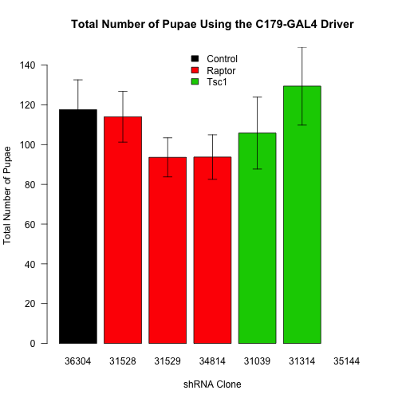 


To analyse these data, first we did an ANOVA testing for whether the UAS has an effect on the percentage of dead pupae.  We then checked wither the residuals were normally distributed.  The p-value for that Shapiro-Wilk test was p=0.8376.  We also checked for equal variance between groups.  The p-value for t hat Levene's test was 0.5465.  

Based on this the ANOVA assumptions were met.  Therefore the p-value for effect of genotype on total pupae is **0.4711** for the UAS.  To test if the driver alone had an effect with did a Student's t-test comparing the +/+ and *C179/+* progeny.  The p-value for the Driver having an effect is **0.4458**.  These data indicatee that there was no significant effect on the number of pupae.

### Raptor Knockdown Only
Looking only at *Raptor* knockdown flies separate from *Tsc1* knockdown flies we see the following.

<!-- html table generated in R 3.1.0 by xtable 1.7-3 package -->
<!-- Fri Jun 27 09:08:49 2014 -->
<TABLE border=1>
<CAPTION ALIGN="bottom"> Summary of the Number of Pupae by Driver and UAS for C179-GAL4 </CAPTION>
<TR> <TH> Gene </TH> <TH> UAS </TH> <TH> mean </TH> <TH> se </TH> <TH> sd </TH> <TH> rel.error </TH> <TH> n </TH>  </TR>
  <TR> <TD> Control </TD> <TD> 36304 </TD> <TD align="right"> 117.56 </TD> <TD align="right"> 15.02 </TD> <TD align="right"> 45.05 </TD> <TD align="right"> 38.32 </TD> <TD align="right">   9 </TD> </TR>
  <TR> <TD> Raptor </TD> <TD> 31528 </TD> <TD align="right"> 114.00 </TD> <TD align="right"> 12.76 </TD> <TD align="right"> 28.52 </TD> <TD align="right"> 25.02 </TD> <TD align="right">   5 </TD> </TR>
  <TR> <TD> Raptor </TD> <TD> 31529 </TD> <TD align="right"> 93.60 </TD> <TD align="right"> 9.82 </TD> <TD align="right"> 21.96 </TD> <TD align="right"> 23.46 </TD> <TD align="right">   5 </TD> </TR>
  <TR> <TD> Raptor </TD> <TD> 34814 </TD> <TD align="right"> 93.75 </TD> <TD align="right"> 11.20 </TD> <TD align="right"> 33.60 </TD> <TD align="right"> 35.84 </TD> <TD align="right">   9 </TD> </TR>
   <A NAME=tab:total-pupae-summary></A>
</TABLE>

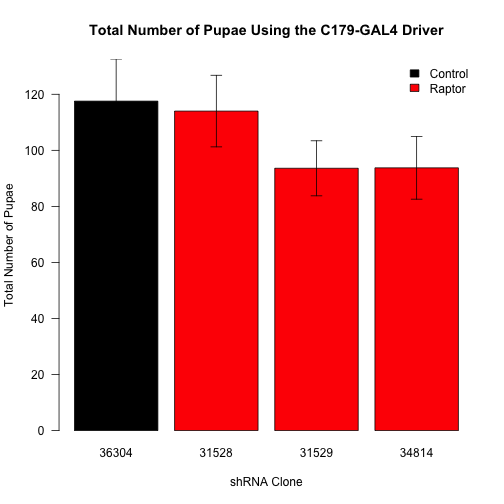 


To analyse these data, first we did an ANOVA testing for whether the UAS has an effect on the percentage of dead pupae.  We then checked wither the residuals were normally distributed.  The p-value for that Shapiro-Wilk test was p=0.2076.  We also checked for equal variance between groups.  The p-value for t hat Levene's test was 0.4476.  

Based on this the ANOVA assumptions were met.  Therefore the p-value for effect of genotype on total pupae is **0.416** for the UAS.  To test if the driver alone had an effect with did a Student's t-test comparing the +/+ and *C179/+* progeny.  The p-value for the Driver having an effect is **0.4458**.  These data indicatee that there was no significant effect on the number of pupae.


### Analysis of Dead Pupae

We next analysed how many pupae were dead, as a percentage of the total number of pupae.


A summary of the percent of dead pupae for each cross is shown below:

<!-- html table generated in R 3.1.0 by xtable 1.7-3 package -->
<!-- Fri Jun 27 09:08:49 2014 -->
<TABLE border=1>
<CAPTION ALIGN="bottom"> Summary of Percent of Dead Pupae by Driver and UAS for C179-GAL4 </CAPTION>
<TR> <TH> Gene </TH> <TH> UAS </TH> <TH> mean </TH> <TH> se </TH> <TH> sd </TH> <TH> rel.error </TH> <TH> n </TH>  </TR>
  <TR> <TD> Control </TD> <TD> 36304 </TD> <TD align="right"> 3.50 </TD> <TD align="right"> 1.59 </TD> <TD align="right"> 4.78 </TD> <TD align="right"> 136.52 </TD> <TD align="right">   9 </TD> </TR>
  <TR> <TD> Raptor </TD> <TD> 31528 </TD> <TD align="right"> 13.86 </TD> <TD align="right"> 2.21 </TD> <TD align="right"> 4.95 </TD> <TD align="right"> 35.73 </TD> <TD align="right">   5 </TD> </TR>
  <TR> <TD> Raptor </TD> <TD> 31529 </TD> <TD align="right"> 28.63 </TD> <TD align="right"> 6.18 </TD> <TD align="right"> 13.82 </TD> <TD align="right"> 48.28 </TD> <TD align="right">   5 </TD> </TR>
  <TR> <TD> Raptor </TD> <TD> 34814 </TD> <TD align="right"> 43.37 </TD> <TD align="right"> 8.46 </TD> <TD align="right"> 25.39 </TD> <TD align="right"> 58.55 </TD> <TD align="right">   9 </TD> </TR>
  <TR> <TD> Tsc1 </TD> <TD> 31039 </TD> <TD align="right"> 6.07 </TD> <TD align="right"> 1.31 </TD> <TD align="right"> 2.94 </TD> <TD align="right"> 48.41 </TD> <TD align="right">   5 </TD> </TR>
  <TR> <TD> Tsc1 </TD> <TD> 31314 </TD> <TD align="right"> 0.67 </TD> <TD align="right"> 0.30 </TD> <TD align="right"> 0.84 </TD> <TD align="right"> 125.51 </TD> <TD align="right">   8 </TD> </TR>
  <TR> <TD> Tsc1 </TD> <TD> 35144 </TD> <TD align="right">  </TD> <TD align="right">  </TD> <TD align="right">  </TD> <TD align="right">  </TD> <TD align="right">   5 </TD> </TR>
   <A NAME=tab:dead-pupae-summary></A>
</TABLE>


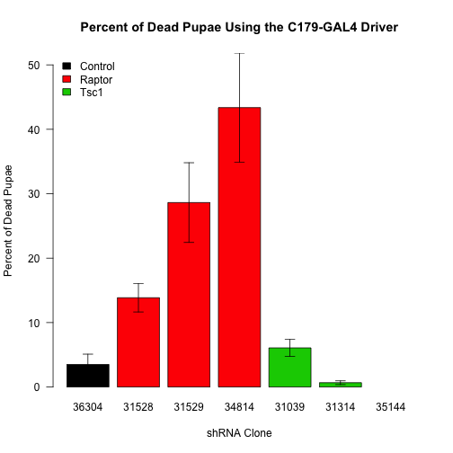 

To analyse these data, first we did an ANOVA testing for whether the UAS has an effect on the percentage of dead pupae.  We then checked wither the residuals were normally distributed.  The p-value for that Shapiro-Wilk test was p=4.6841 &times; 10<sup>-4</sup>.  We also checked for equal variance between groups.  The p-value for that Levene's test was 3.9467 &times; 10<sup>-5</sup>, so neither the assumptions of equal variance or normality were met for these data.

Therefore rather than an ANOVA, we did a Kruskal-Wallis test.  The p-value for that comparason is **9.3852 &times; 10<sup>-6</sup>** for the UAS.  To test if the driver alone had an effect with did a Wilcoxon Rank Sum Test comparing the +/+ and *C179/+* progeny.  The p-value for the Driver having an effect is **0.0155**.  We therefore excluded the +/+ progeny from the analysis and compared with the *C179-Gal4/+* progeny as a control.  

Since this ANOVA was significant, we did post-hoc Wilcoxon-Rank Sum Tests to look at each strain relative to the control.  To test for differences compared to the *C179-GAL4/+* control strain, the results of this test are shown below.

<!-- html table generated in R 3.1.0 by xtable 1.7-3 package -->
<!-- Fri Jun 27 09:08:49 2014 -->
<TABLE border=1>
<CAPTION ALIGN="bottom"> Wilcoxon Rank Sum Tests for the Percent of Dead Pupae Comparing to Control (C179-Gal4/+) </CAPTION>
<TR> <TH>  </TH> <TH> pval </TH> <TH> padj </TH>  </TR>
  <TR> <TD align="right"> 36304 </TD> <TD align="right">  </TD> <TD align="right">  </TD> </TR>
  <TR> <TD align="right"> 31039 </TD> <TD align="right"> 0.12436 </TD> <TD align="right"> 0.15545 </TD> </TR>
  <TR> <TD align="right"> 31314 </TD> <TD align="right"> 0.19216 </TD> <TD align="right"> 0.19216 </TD> </TR>
  <TR> <TD align="right"> 31528 </TD> <TD align="right"> 0.01628 </TD> <TD align="right"> 0.02713 </TD> </TR>
  <TR> <TD align="right"> 31529 </TD> <TD align="right"> 0.00332 </TD> <TD align="right"> 0.00830 </TD> </TR>
  <TR> <TD align="right"> 34814 </TD> <TD align="right"> 0.00063 </TD> <TD align="right"> 0.00315 </TD> </TR>
  <TR> <TD align="right"> 35144 </TD> <TD align="right">  </TD> <TD align="right">  </TD> </TR>
   <A NAME=tab:dead-pupae-wilcoxon></A>
</TABLE>

#### Raptor Knockdown Only


A summary of the percent of dead pupae for each cross is shown below:

<!-- html table generated in R 3.1.0 by xtable 1.7-3 package -->
<!-- Fri Jun 27 09:08:49 2014 -->
<TABLE border=1>
<CAPTION ALIGN="bottom"> Summary of Percent of Dead Pupae by Driver and UAS for C179-GAL4 </CAPTION>
<TR> <TH> Gene </TH> <TH> UAS </TH> <TH> mean </TH> <TH> se </TH> <TH> sd </TH> <TH> rel.error </TH> <TH> n </TH>  </TR>
  <TR> <TD> Control </TD> <TD> 36304 </TD> <TD align="right"> 3.50 </TD> <TD align="right"> 1.59 </TD> <TD align="right"> 4.78 </TD> <TD align="right"> 136.52 </TD> <TD align="right">   9 </TD> </TR>
  <TR> <TD> Raptor </TD> <TD> 31528 </TD> <TD align="right"> 13.86 </TD> <TD align="right"> 2.21 </TD> <TD align="right"> 4.95 </TD> <TD align="right"> 35.73 </TD> <TD align="right">   5 </TD> </TR>
  <TR> <TD> Raptor </TD> <TD> 31529 </TD> <TD align="right"> 28.63 </TD> <TD align="right"> 6.18 </TD> <TD align="right"> 13.82 </TD> <TD align="right"> 48.28 </TD> <TD align="right">   5 </TD> </TR>
  <TR> <TD> Raptor </TD> <TD> 34814 </TD> <TD align="right"> 43.37 </TD> <TD align="right"> 8.46 </TD> <TD align="right"> 25.39 </TD> <TD align="right"> 58.55 </TD> <TD align="right">   9 </TD> </TR>
   <A NAME=tab:dead-pupae-summary></A>
</TABLE>


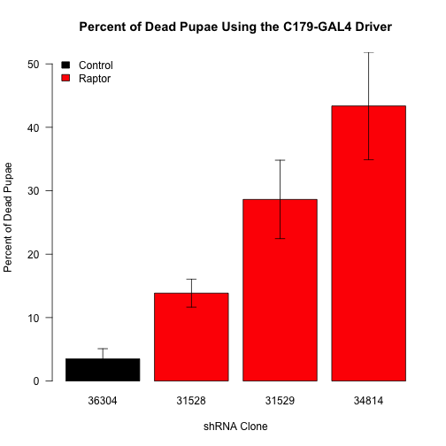 

To analyse these data, first we did an ANOVA testing for whether the UAS has an effect on the percentage of dead pupae.  We then checked wither the residuals were normally distributed.  The p-value for that Shapiro-Wilk test was p=0.0929.  We also checked for equal variance between groups.  The p-value for that Levene's test was 0.0016, so neither the assumptions of equal variance or normality were met for these data.

Therefore rather than an ANOVA, we did a Kruskal-Wallis test.  The p-value for that comparason is **9.3852 &times; 10<sup>-6</sup>** for the UAS.  To test if the driver alone had an effect with did a Wilcoxon Rank Sum Test comparing the +/+ and *C179/+* progeny.  The p-value for the Driver having an effect is **0.0155**.  We therefore excluded the +/+ progeny from the analysis and compared with the *C179-Gal4/+* progeny as a control.  

Since this ANOVA was significant, we did post-hoc Wilcoxon-Rank Sum Tests to look at each strain relative to the *C179-GAL4/+* control strain.  The range was 2.9567-11.3844 times more dead pupae.  The results of these tests are shown below.

<!-- html table generated in R 3.1.0 by xtable 1.7-3 package -->
<!-- Fri Jun 27 09:08:49 2014 -->
<TABLE border=1>
<CAPTION ALIGN="bottom"> Wilcoxon Rank Sum Tests for the Percent of Dead Pupae Comparing to Control (C179-Gal4/+) </CAPTION>
<TR> <TH>  </TH> <TH> pval </TH> <TH> padj </TH>  </TR>
  <TR> <TD align="right"> 36304 </TD> <TD align="right">  </TD> <TD align="right">  </TD> </TR>
  <TR> <TD align="right"> 31528 </TD> <TD align="right"> 0.01628 </TD> <TD align="right"> 0.01628 </TD> </TR>
  <TR> <TD align="right"> 31529 </TD> <TD align="right"> 0.00332 </TD> <TD align="right"> 0.00498 </TD> </TR>
  <TR> <TD align="right"> 34814 </TD> <TD align="right"> 0.00063 </TD> <TD align="right"> 0.00189 </TD> </TR>
   <A NAME=tab:dead-pupae-wilcoxon></A>
</TABLE>
     
### Analysis of Total Number of Flies


We inspected the total number of flies eclosed up to 21 days after the cross was set up.  These data are summarized in the table and figure below:

<!-- html table generated in R 3.1.0 by xtable 1.7-3 package -->
<!-- Fri Jun 27 09:08:49 2014 -->
<TABLE border=1>
<CAPTION ALIGN="bottom"> Summary of the Number of Flies by Driver and UAS for C179-GAL4 </CAPTION>
<TR> <TH> Gene </TH> <TH> UAS </TH> <TH> mean </TH> <TH> se </TH> <TH> sd </TH> <TH> rel.error </TH> <TH> n </TH>  </TR>
  <TR> <TD> Control </TD> <TD> 36304 </TD> <TD align="right"> 99.00 </TD> <TD align="right"> 17.79 </TD> <TD align="right"> 53.37 </TD> <TD align="right"> 53.91 </TD> <TD align="right">   9 </TD> </TR>
  <TR> <TD> Raptor </TD> <TD> 31528 </TD> <TD align="right"> 26.20 </TD> <TD align="right"> 16.69 </TD> <TD align="right"> 37.31 </TD> <TD align="right"> 142.41 </TD> <TD align="right">   5 </TD> </TR>
  <TR> <TD> Raptor </TD> <TD> 31529 </TD> <TD align="right"> 20.80 </TD> <TD align="right"> 8.82 </TD> <TD align="right"> 19.73 </TD> <TD align="right"> 94.85 </TD> <TD align="right">   5 </TD> </TR>
  <TR> <TD> Raptor </TD> <TD> 34814 </TD> <TD align="right"> 7.56 </TD> <TD align="right"> 3.17 </TD> <TD align="right"> 9.51 </TD> <TD align="right"> 125.93 </TD> <TD align="right">   9 </TD> </TR>
  <TR> <TD> Tsc1 </TD> <TD> 31039 </TD> <TD align="right"> 39.00 </TD> <TD align="right"> 23.92 </TD> <TD align="right"> 53.50 </TD> <TD align="right"> 137.17 </TD> <TD align="right">   5 </TD> </TR>
  <TR> <TD> Tsc1 </TD> <TD> 31314 </TD> <TD align="right"> 154.75 </TD> <TD align="right"> 17.70 </TD> <TD align="right"> 50.06 </TD> <TD align="right"> 32.35 </TD> <TD align="right">   8 </TD> </TR>
  <TR> <TD> Tsc1 </TD> <TD> 35144 </TD> <TD align="right"> 92.60 </TD> <TD align="right"> 4.39 </TD> <TD align="right"> 9.81 </TD> <TD align="right"> 10.60 </TD> <TD align="right">   5 </TD> </TR>
   <A NAME=tab:total-flies-summary></A>
</TABLE>

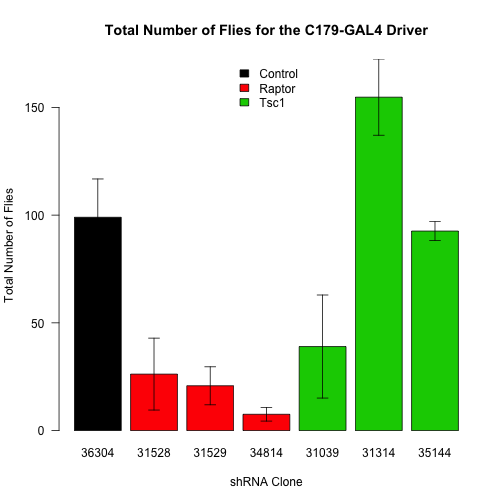 

To analyse these data, first we did an ANOVA testing for whether the UAS has an effect on the number of eclosed flies.  We checked the residuals for this ANOVA by Shapiro-Wilk test (p=0.0572), so the data can be assumed to be normally distributed.  A Levene's test had a p-value of 0.1206, therefore both ANOVA assumptions can be accepted.  

The p-value for the ANOVA is **2.6628 &times; 10<sup>-9</sup>** for the UAS.  The results of this ANOVA are shown in Table \ref{tab:total-flies-anova}.  To test if the driver alone had an effect with did a Student's t-test comparing the +/+ and *C179/+* progeny.  The p-value for the Driver having an effect is **0.0295**.  

Due to the significant ANOVA we performed a post-hoc Dunnett's test using the *C179/+* progeny as the controls.  An ANOVA analysis excluding the +/+ flies had a p-value of **2.1063 &times; 10<sup>-8</sup>** for the UAS.  The results of that test are in the Table below.  This test indicates that each of the three Raptor shRNA knockdowns cause a reduction in the number of flies.

<!-- html table generated in R 3.1.0 by xtable 1.7-3 package -->
<!-- Fri Jun 27 09:08:50 2014 -->
<TABLE border=1>
<CAPTION ALIGN="bottom"> Dunnett's Test for the Number of Males and Females Comparing to Control (C179-Gal4/+) </CAPTION>
<TR> <TH>  </TH> <TH> Effect Size (%) </TH> <TH> p-value </TH>  </TR>
  <TR> <TD align="right"> 31039 - 36304 </TD> <TD align="right"> -60.0 </TD> <TD align="right"> 0.0466827 </TD> </TR>
  <TR> <TD align="right"> 31314 - 36304 </TD> <TD align="right"> 55.8 </TD> <TD align="right"> 0.0297943 </TD> </TR>
  <TR> <TD align="right"> 31528 - 36304 </TD> <TD align="right"> -72.8 </TD> <TD align="right"> 0.0104720 </TD> </TR>
  <TR> <TD align="right"> 31529 - 36304 </TD> <TD align="right"> -78.2 </TD> <TD align="right"> 0.0053656 </TD> </TR>
  <TR> <TD align="right"> 34814 - 36304 </TD> <TD align="right"> -91.4 </TD> <TD align="right"> 0.0000807 </TD> </TR>
  <TR> <TD align="right"> 35144 - 36304 </TD> <TD align="right"> -6.4 </TD> <TD align="right"> 0.9996614 </TD> </TR>
   <A NAME=tab:total-flies-dunnett-gendered></A>
</TABLE>

### Only Raptor Knockdown Flies

<!-- html table generated in R 3.1.0 by xtable 1.7-3 package -->
<!-- Fri Jun 27 09:08:50 2014 -->
<TABLE border=1>
<CAPTION ALIGN="bottom"> Summary of the Number of Flies by Driver and UAS for C179-GAL4 </CAPTION>
<TR> <TH> Gene </TH> <TH> UAS </TH> <TH> mean </TH> <TH> se </TH> <TH> sd </TH> <TH> rel.error </TH> <TH> n </TH>  </TR>
  <TR> <TD> Control </TD> <TD> 36304 </TD> <TD align="right"> 99.00 </TD> <TD align="right"> 17.79 </TD> <TD align="right"> 53.37 </TD> <TD align="right"> 53.91 </TD> <TD align="right">   9 </TD> </TR>
  <TR> <TD> Raptor </TD> <TD> 31528 </TD> <TD align="right"> 26.20 </TD> <TD align="right"> 16.69 </TD> <TD align="right"> 37.31 </TD> <TD align="right"> 142.41 </TD> <TD align="right">   5 </TD> </TR>
  <TR> <TD> Raptor </TD> <TD> 31529 </TD> <TD align="right"> 20.80 </TD> <TD align="right"> 8.82 </TD> <TD align="right"> 19.73 </TD> <TD align="right"> 94.85 </TD> <TD align="right">   5 </TD> </TR>
  <TR> <TD> Raptor </TD> <TD> 34814 </TD> <TD align="right"> 7.56 </TD> <TD align="right"> 3.17 </TD> <TD align="right"> 9.51 </TD> <TD align="right"> 125.93 </TD> <TD align="right">   9 </TD> </TR>
   <A NAME=tab:total-flies-summary></A>
</TABLE>

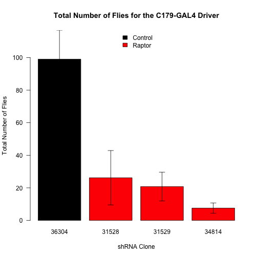 

To analyse these data, first we did an ANOVA testing for whether the UAS has an effect on the number of eclosed flies.  We checked the residuals for this ANOVA by Shapiro-Wilk test (p=0.0939), so the data can be assumed to be normally distributed.  A Levene's test had a p-value of 0.0451, therefore both ANOVA assumptions can be accepted.  

The p-value for the ANOVA is **2.6628 &times; 10<sup>-9</sup>** for the UAS.  To test if the driver alone had an effect with did a Student's t-test comparing the +/+ and *C179/+* progeny.  The p-value for the Driver having an effect is **0.0295**.  

Due to the significant ANOVA we performed a post-hoc Dunnett's test using the *C179/+* progeny as the controls.  An ANOVA analysis excluding the +/+ flies had a p-value of **2.1063 &times; 10<sup>-8</sup>** for the UAS.  The results of that test are in the Table below.  This test indicates that each of the three Raptor shRNA knockdowns cause a reduction in the number of flies.  There was between a 73.5354 and 92.3681% decrease in the number of eclosed flies depending on the strain.

<!-- html table generated in R 3.1.0 by xtable 1.7-3 package -->
<!-- Fri Jun 27 09:08:50 2014 -->
<TABLE border=1>
<CAPTION ALIGN="bottom"> Dunnett's Test for the Number of Males and Females Comparing to Control (C179-Gal4/+) </CAPTION>
<TR> <TH>  </TH> <TH> Effect Size (%) </TH> <TH> p-value </TH>  </TR>
  <TR> <TD align="right"> 31528 - 36304 </TD> <TD align="right"> -72.8 </TD> <TD align="right"> 0.0035492 </TD> </TR>
  <TR> <TD align="right"> 31529 - 36304 </TD> <TD align="right"> -78.2 </TD> <TD align="right"> 0.0019046 </TD> </TR>
  <TR> <TD align="right"> 34814 - 36304 </TD> <TD align="right"> -91.4 </TD> <TD align="right"> 0.0000819 </TD> </TR>
   <A NAME=tab:total-flies-dunnett-raptor></A>
</TABLE>

### Analysis of Number of Flies by Gender


For the flies which had been born, we could separate these data based on gender.  The separated data is summarized in Tables \ref{tab:total-flies-summary-males} and \ref{tab:total-flies-summary-females}.  These data are graphed in Figure \ref{fig:total-flies-barplot-gendered}.  

For Males, first we did an ANOVA testing for whether the UAS has an effect on the number of eclosed flies.  The p-value for that comparason is **9.6415 &times; 10<sup>-10</sup>** for the UAS.  The results of this ANOVA are shown in Table \ref{tab:total-flies-anova-males}.  To test if the driver alone had an effect with did a Student's t-test comparing the +/+ and *C179/+* progeny.  The p-value for the Driver having an effect is **0.0718**. 

For Females, first we did an ANOVA testing for whether the UAS has an effect on the number of eclosed flies.  The p-value for that comparason is **3.4588 &times; 10<sup>-8</sup>** for the UAS.  The results of this ANOVA are shown in Table \ref{tab:total-flies-anova-females}.  To test if the driver alone had an effect with did a Student's t-test comparing the +/+ and *C179/+* progeny.  The p-value for the Driver having an effect is **0.0126**. 

Due to the significant ANOVA we performed a post-hoc Dunnett's test using the *C179/+* progeny as the controls.  An ANOVA analysis excluding the +/+ flies had a p-value of **8.1333 &times; 10<sup>-9</sup>** for the UAS for males and a p-value of **3.3687 &times; 10<sup>-7</sup>** for the UAS for the females.  The results of that test are in the table below.  This test indicates that each of the three Raptor shRNA knockdowns cause a reduction in the number of male flies, but only 34814 had significantly less females.

<!-- html table generated in R 3.1.0 by xtable 1.7-3 package -->
<!-- Fri Jun 27 09:08:50 2014 -->
<TABLE border=1>
<CAPTION ALIGN="bottom"> Summary of the Number of Male Flies by Driver and UAS for C179-GAL4 </CAPTION>
<TR> <TH> Gene </TH> <TH> UAS </TH> <TH> mean </TH> <TH> se </TH> <TH> sd </TH> <TH> rel.error </TH> <TH> n </TH>  </TR>
  <TR> <TD> Control </TD> <TD> 36304 </TD> <TD align="right"> 49.67 </TD> <TD align="right"> 8.78 </TD> <TD align="right"> 26.33 </TD> <TD align="right"> 53.02 </TD> <TD align="right">   9 </TD> </TR>
  <TR> <TD> Raptor </TD> <TD> 31528 </TD> <TD align="right"> 6.60 </TD> <TD align="right"> 4.19 </TD> <TD align="right"> 9.37 </TD> <TD align="right"> 141.97 </TD> <TD align="right">   5 </TD> </TR>
  <TR> <TD> Raptor </TD> <TD> 31529 </TD> <TD align="right"> 0.60 </TD> <TD align="right"> 0.60 </TD> <TD align="right"> 1.34 </TD> <TD align="right"> 223.61 </TD> <TD align="right">   5 </TD> </TR>
  <TR> <TD> Raptor </TD> <TD> 34814 </TD> <TD align="right"> 3.11 </TD> <TD align="right"> 1.33 </TD> <TD align="right"> 3.98 </TD> <TD align="right"> 128.01 </TD> <TD align="right">   9 </TD> </TR>
  <TR> <TD> Tsc1 </TD> <TD> 31039 </TD> <TD align="right"> 18.00 </TD> <TD align="right"> 11.06 </TD> <TD align="right"> 24.74 </TD> <TD align="right"> 137.44 </TD> <TD align="right">   5 </TD> </TR>
  <TR> <TD> Tsc1 </TD> <TD> 31314 </TD> <TD align="right"> 73.50 </TD> <TD align="right"> 10.52 </TD> <TD align="right"> 29.75 </TD> <TD align="right"> 40.47 </TD> <TD align="right">   8 </TD> </TR>
  <TR> <TD> Tsc1 </TD> <TD> 35144 </TD> <TD align="right"> 45.80 </TD> <TD align="right"> 2.13 </TD> <TD align="right"> 4.76 </TD> <TD align="right"> 10.40 </TD> <TD align="right">   5 </TD> </TR>
   <A NAME=tab:total-flies-summary-males></A>
</TABLE>
<!-- html table generated in R 3.1.0 by xtable 1.7-3 package -->
<!-- Fri Jun 27 09:08:50 2014 -->
<TABLE border=1>
<CAPTION ALIGN="bottom"> Summary of the Number of Female Flies by Driver and UAS for C179-GAL4 </CAPTION>
<TR> <TH> Gene </TH> <TH> UAS </TH> <TH> mean </TH> <TH> se </TH> <TH> sd </TH> <TH> rel.error </TH> <TH> n </TH>  </TR>
  <TR> <TD> Control </TD> <TD> 36304 </TD> <TD align="right"> 49.33 </TD> <TD align="right"> 9.28 </TD> <TD align="right"> 27.83 </TD> <TD align="right"> 56.41 </TD> <TD align="right">   9 </TD> </TR>
  <TR> <TD> Raptor </TD> <TD> 31528 </TD> <TD align="right"> 19.60 </TD> <TD align="right"> 12.50 </TD> <TD align="right"> 27.94 </TD> <TD align="right"> 142.57 </TD> <TD align="right">   5 </TD> </TR>
  <TR> <TD> Raptor </TD> <TD> 31529 </TD> <TD align="right"> 20.20 </TD> <TD align="right"> 8.55 </TD> <TD align="right"> 19.11 </TD> <TD align="right"> 94.60 </TD> <TD align="right">   5 </TD> </TR>
  <TR> <TD> Raptor </TD> <TD> 34814 </TD> <TD align="right"> 4.44 </TD> <TD align="right"> 1.85 </TD> <TD align="right"> 5.55 </TD> <TD align="right"> 124.82 </TD> <TD align="right">   9 </TD> </TR>
  <TR> <TD> Tsc1 </TD> <TD> 31039 </TD> <TD align="right"> 21.00 </TD> <TD align="right"> 13.08 </TD> <TD align="right"> 29.24 </TD> <TD align="right"> 139.24 </TD> <TD align="right">   5 </TD> </TR>
  <TR> <TD> Tsc1 </TD> <TD> 31314 </TD> <TD align="right"> 81.25 </TD> <TD align="right"> 7.93 </TD> <TD align="right"> 22.44 </TD> <TD align="right"> 27.61 </TD> <TD align="right">   8 </TD> </TR>
  <TR> <TD> Tsc1 </TD> <TD> 35144 </TD> <TD align="right"> 46.80 </TD> <TD align="right"> 3.92 </TD> <TD align="right"> 8.76 </TD> <TD align="right"> 18.71 </TD> <TD align="right">   5 </TD> </TR>
   <A NAME=tab:total-flies-summary-females></A>
</TABLE>
<!-- html table generated in R 3.1.0 by xtable 1.7-3 package -->
<!-- Fri Jun 27 09:08:50 2014 -->
<TABLE border=1>
<CAPTION ALIGN="bottom"> ANOVA for the Number of Male Flies by Driver and UAS for C179-GAL4 </CAPTION>
<TR> <TH>  </TH> <TH> Df </TH> <TH> Sum Sq </TH> <TH> Mean Sq </TH> <TH> F value </TH> <TH> Pr(&gt;F) </TH>  </TR>
  <TR> <TD> Driver </TD> <TD align="right"> 1 </TD> <TD align="right"> 2098.57 </TD> <TD align="right"> 2098.57 </TD> <TD align="right"> 5.28 </TD> <TD align="right"> 0.0254 </TD> </TR>
  <TR> <TD> UAS </TD> <TD align="right"> 6 </TD> <TD align="right"> 34122.52 </TD> <TD align="right"> 5687.09 </TD> <TD align="right"> 14.30 </TD> <TD align="right"> 0.0000 </TD> </TR>
  <TR> <TD> Residuals </TD> <TD align="right"> 55 </TD> <TD align="right"> 21866.56 </TD> <TD align="right"> 397.57 </TD> <TD align="right">  </TD> <TD align="right">  </TD> </TR>
   <A NAME=tab:total-flies-anova-males></A>
</TABLE>
<!-- html table generated in R 3.1.0 by xtable 1.7-3 package -->
<!-- Fri Jun 27 09:08:50 2014 -->
<TABLE border=1>
<CAPTION ALIGN="bottom"> ANOVA for the Number of Female Flies by Driver and UAS for C179-GAL4 </CAPTION>
<TR> <TH>  </TH> <TH> Df </TH> <TH> Sum Sq </TH> <TH> Mean Sq </TH> <TH> F value </TH> <TH> Pr(&gt;F) </TH>  </TR>
  <TR> <TD> Driver </TD> <TD align="right"> 1 </TD> <TD align="right"> 4178.64 </TD> <TD align="right"> 4178.64 </TD> <TD align="right"> 9.07 </TD> <TD align="right"> 0.0039 </TD> </TR>
  <TR> <TD> UAS </TD> <TD align="right"> 6 </TD> <TD align="right"> 31237.91 </TD> <TD align="right"> 5206.32 </TD> <TD align="right"> 11.30 </TD> <TD align="right"> 0.0000 </TD> </TR>
  <TR> <TD> Residuals </TD> <TD align="right"> 55 </TD> <TD align="right"> 25338.52 </TD> <TD align="right"> 460.70 </TD> <TD align="right">  </TD> <TD align="right">  </TD> </TR>
   <A NAME=tab:total-flies-anova-females></A>
</TABLE>
<!-- html table generated in R 3.1.0 by xtable 1.7-3 package -->
<!-- Fri Jun 27 09:08:50 2014 -->
<TABLE border=1>
<CAPTION ALIGN="bottom"> Dunnett's Test for the Number of Males and Females Comparing to Control (C179-Gal4/+) </CAPTION>
<TR> <TH>  </TH> <TH> Male Effect Size (%) </TH> <TH> Male p-value </TH> <TH> Female Effect Size (%) </TH> <TH> Female p-value </TH>  </TR>
  <TR> <TD align="right"> 31039 - 36304 </TD> <TD align="right"> -31.7 </TD> <TD align="right"> 0.0303625 </TD> <TD align="right"> -28.3 </TD> <TD align="right"> 0.1148192 </TD> </TR>
  <TR> <TD align="right"> 31314 - 36304 </TD> <TD align="right"> 23.8 </TD> <TD align="right"> 0.0782174 </TD> <TD align="right"> 31.9 </TD> <TD align="right"> 0.0226098 </TD> </TR>
  <TR> <TD align="right"> 31528 - 36304 </TD> <TD align="right"> -43.1 </TD> <TD align="right"> 0.0017352 </TD> <TD align="right"> -29.7 </TD> <TD align="right"> 0.0891236 </TD> </TR>
  <TR> <TD align="right"> 31529 - 36304 </TD> <TD align="right"> -49.1 </TD> <TD align="right"> 0.0003413 </TD> <TD align="right"> -29.1 </TD> <TD align="right"> 0.0993667 </TD> </TR>
  <TR> <TD align="right"> 34814 - 36304 </TD> <TD align="right"> -46.6 </TD> <TD align="right"> 0.0000585 </TD> <TD align="right"> -44.9 </TD> <TD align="right"> 0.0004689 </TD> </TR>
  <TR> <TD align="right"> 35144 - 36304 </TD> <TD align="right"> -3.9 </TD> <TD align="right"> 0.9989668 </TD> <TD align="right"> -2.5 </TD> <TD align="right"> 0.9999507 </TD> </TR>
   <A NAME=tab:total-flies-dunnett-gendered></A>
</TABLE>

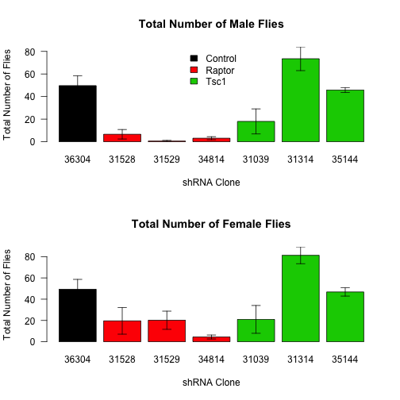 
     
## Mef-GAL4 Driver


This analysis is just for the *Mef2-GAL4* Driver.


## Analysis of Pupae

We inspected the pupae from vials, 21 days after the cross was set up and counted how many pupae were present, and how many had dead flies in them.  These data are summarized below:

<!-- html table generated in R 3.1.0 by xtable 1.7-3 package -->
<!-- Fri Jun 27 09:08:50 2014 -->
<TABLE border=1>
<CAPTION ALIGN="bottom"> Summary of the Number of Pupae by Driver and UAS for Mef-GAL4 </CAPTION>
<TR> <TH> Gene </TH> <TH> UAS </TH> <TH> mean </TH> <TH> se </TH> <TH> sd </TH> <TH> rel.error </TH> <TH> n </TH>  </TR>
  <TR> <TD> Control </TD> <TD> 36304 </TD> <TD align="right"> 83.00 </TD> <TD align="right"> 10.18 </TD> <TD align="right"> 24.92 </TD> <TD align="right"> 30.03 </TD> <TD align="right">   6 </TD> </TR>
  <TR> <TD> Raptor </TD> <TD> 31528 </TD> <TD align="right"> 115.50 </TD> <TD align="right"> 6.96 </TD> <TD align="right"> 13.92 </TD> <TD align="right"> 12.05 </TD> <TD align="right">   4 </TD> </TR>
  <TR> <TD> Raptor </TD> <TD> 34814 </TD> <TD align="right"> 124.50 </TD> <TD align="right"> 5.78 </TD> <TD align="right"> 11.56 </TD> <TD align="right"> 9.29 </TD> <TD align="right">   4 </TD> </TR>
  <TR> <TD> Tsc1 </TD> <TD> 31039 </TD> <TD align="right"> 44.33 </TD> <TD align="right"> 14.45 </TD> <TD align="right"> 25.03 </TD> <TD align="right"> 56.45 </TD> <TD align="right">   3 </TD> </TR>
  <TR> <TD> Tsc1 </TD> <TD> 31314 </TD> <TD align="right"> 97.50 </TD> <TD align="right"> 11.50 </TD> <TD align="right"> 16.26 </TD> <TD align="right"> 16.68 </TD> <TD align="right">   2 </TD> </TR>
  <TR> <TD> Tsc1 </TD> <TD> 35144 </TD> <TD align="right">  </TD> <TD align="right">  </TD> <TD align="right">  </TD> <TD align="right">  </TD> <TD align="right">   6 </TD> </TR>
   <A NAME=tab:total-pupae-summary-mef></A>
</TABLE>


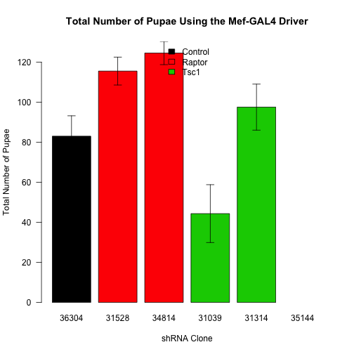 

To analyse these data, first we did an ANOVA testing for whether the UAS has an effect on the percentage of dead pupae.  We then checked wither the residuals were normally distributed.  The p-value for that Shapiro-Wilk test was p=0.4571.  We also checked for equal variance between groups.  The p-value for that Levene's test was 0.1334.  

Based on this the ANOVA assumptions were met.  Therefore the p-value for that comparason is **0.0058** for the UAS.  To test if the driver alone had an effect with did a Student's t-test comparing the +/+ and *Mef/+* progeny.  The p-value for the Driver having an effect is **0.128**.  This indicated that there was no significant effect on the number of pupae.

### Raptor Knockdown Only
Looking only at *Raptor* knockdown flies separate from *Tsc1* knockdown flies we see the following.

<!-- html table generated in R 3.1.0 by xtable 1.7-3 package -->
<!-- Fri Jun 27 09:08:50 2014 -->
<TABLE border=1>
<CAPTION ALIGN="bottom"> Summary of the Number of Pupae by Driver and UAS for C179-GAL4 </CAPTION>
<TR> <TH> Gene </TH> <TH> UAS </TH> <TH> mean </TH> <TH> se </TH> <TH> sd </TH> <TH> rel.error </TH> <TH> n </TH>  </TR>
  <TR> <TD> Control </TD> <TD> 36304 </TD> <TD align="right"> 83.00 </TD> <TD align="right"> 10.18 </TD> <TD align="right"> 24.92 </TD> <TD align="right"> 30.03 </TD> <TD align="right">   6 </TD> </TR>
  <TR> <TD> Raptor </TD> <TD> 31528 </TD> <TD align="right"> 115.50 </TD> <TD align="right"> 6.96 </TD> <TD align="right"> 13.92 </TD> <TD align="right"> 12.05 </TD> <TD align="right">   4 </TD> </TR>
  <TR> <TD> Raptor </TD> <TD> 34814 </TD> <TD align="right"> 124.50 </TD> <TD align="right"> 5.78 </TD> <TD align="right"> 11.56 </TD> <TD align="right"> 9.29 </TD> <TD align="right">   4 </TD> </TR>
   <A NAME=tab:total-pupae-summary></A>
</TABLE>

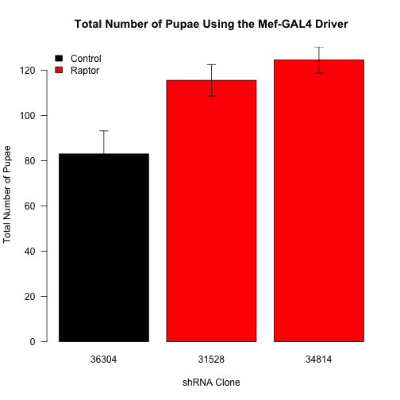 


To analyse these data, first we did an ANOVA testing for whether the UAS has an effect on the percentage of dead pupae.  We then checked wither the residuals were normally distributed.  The p-value for that Shapiro-Wilk test was p=0.375.  We also checked for equal variance between groups.  The p-value for that Levene's test was 0.0663.  

Based on this the ANOVA assumptions were met.  Therefore the p-value for effect of genotype on total pupae is **0.0629** for the UAS.  To test if the driver alone had an effect with did a Student's t-test comparing the +/+ and *C179/+* progeny.  The p-value for the Driver having an effect is **0.128**.  These data indicatee that there was no significant effect on the number of pupae.


### Analysis of Dead Pupae


```
## Warning: zero-length arrow is of indeterminate angle and so skipped
```

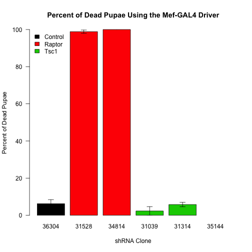 


A summary of the percent of dead pupae for each cross is shown in Table \ref{tab:dead-pupae-summary-mef} and in Figure \ref{fig:dead-pupae-barplot}.
To analyse these data, first we did an ANOVA testing for whether the UAS has an effect on the percentage of dead pupae.  The p-value for that comparason is **1.1958 &times; 10<sup>-30</sup>** for the UAS.  The results of this ANOVA are shown in Table \ref{tab:dead-pupae-anova-mef}.  To test if the driver alone had an effect with did a Student's t-test comparing the +/+ and *Mef/+* progeny.  The p-value for the Driver having an effect is **0.0015**.  We therefore excluded the +/+ progeny from the analysis and compared with the *Mef-Gal4/+* progeny as a control.  

The ANOVA for this comparason yielded a p-value for the UAS of **2.7585 &times; 10<sup>-16</sup>**.  The results of this ANOVA are in Table \ref{tab:dead-pupae-anova-Mef}.  Since this ANOVA was significant, we did a post-hoc test to look at each strain relative to the control.  To test for differences compared to the *Mef-GAL4/+* control strain, we did a Dunnett's test.  The range was 14.8155-14.999 times more dead pupae. The results of this test are shown in Table \ref{tab:dead-pupae-dunnett-mef}.  


<!-- html table generated in R 3.1.0 by xtable 1.7-3 package -->
<!-- Fri Jun 27 09:08:51 2014 -->
<TABLE border=1>
<CAPTION ALIGN="bottom"> Summary of Percent of Dead Pupae by Driver and UAS for Mef-GAL4 </CAPTION>
<TR> <TH> Gene </TH> <TH> UAS </TH> <TH> mean </TH> <TH> se </TH> <TH> sd </TH> <TH> rel.error </TH>  </TR>
  <TR> <TD> Control </TD> <TD> 36304 </TD> <TD align="right"> 6.25 </TD> <TD align="right"> 2.16 </TD> <TD align="right"> 5.29 </TD> <TD align="right"> 84.62 </TD> </TR>
  <TR> <TD> Raptor </TD> <TD> 31528 </TD> <TD align="right"> 98.85 </TD> <TD align="right"> 0.88 </TD> <TD align="right"> 1.75 </TD> <TD align="right"> 1.78 </TD> </TR>
  <TR> <TD> Raptor </TD> <TD> 34814 </TD> <TD align="right"> 100.00 </TD> <TD align="right"> 0.00 </TD> <TD align="right"> 0.00 </TD> <TD align="right"> 0.00 </TD> </TR>
  <TR> <TD> Tsc1 </TD> <TD> 31039 </TD> <TD align="right"> 2.33 </TD> <TD align="right"> 2.33 </TD> <TD align="right"> 4.03 </TD> <TD align="right"> 173.21 </TD> </TR>
  <TR> <TD> Tsc1 </TD> <TD> 31314 </TD> <TD align="right"> 5.78 </TD> <TD align="right"> 1.19 </TD> <TD align="right"> 1.69 </TD> <TD align="right"> 29.22 </TD> </TR>
  <TR> <TD> Tsc1 </TD> <TD> 35144 </TD> <TD align="right">  </TD> <TD align="right">  </TD> <TD align="right">  </TD> <TD align="right">  </TD> </TR>
   <A NAME=tab:dead-pupae-summary-mef></A>
</TABLE>
<!-- html table generated in R 3.1.0 by xtable 1.7-3 package -->
<!-- Fri Jun 27 09:08:51 2014 -->
<TABLE border=1>
<CAPTION ALIGN="bottom"> ANOVA for Percent of Dead Pupae by Driver and UAS for Mef-GAL4 </CAPTION>
<TR> <TH>  </TH> <TH> Df </TH> <TH> Sum Sq </TH> <TH> Mean Sq </TH> <TH> F value </TH> <TH> Pr(&gt;F) </TH>  </TR>
  <TR> <TD> Driver </TD> <TD align="right"> 1 </TD> <TD align="right"> 15284.09 </TD> <TD align="right"> 15284.09 </TD> <TD align="right"> 1309.64 </TD> <TD align="right"> 0.0000 </TD> </TR>
  <TR> <TD> UAS </TD> <TD align="right"> 4 </TD> <TD align="right"> 41248.47 </TD> <TD align="right"> 10312.12 </TD> <TD align="right"> 883.61 </TD> <TD align="right"> 0.0000 </TD> </TR>
  <TR> <TD> Residuals </TD> <TD align="right"> 30 </TD> <TD align="right"> 350.11 </TD> <TD align="right"> 11.67 </TD> <TD align="right">  </TD> <TD align="right">  </TD> </TR>
   <A NAME=tab:dead-pupae-anova-mef></A>
</TABLE>
<!-- html table generated in R 3.1.0 by xtable 1.7-3 package -->
<!-- Fri Jun 27 09:08:51 2014 -->
<TABLE border=1>
<CAPTION ALIGN="bottom"> ANOVA for Percent of Dead Pupae by UAS for Mef-GAL4 </CAPTION>
<TR> <TH>  </TH> <TH> Df </TH> <TH> Sum Sq </TH> <TH> Mean Sq </TH> <TH> F value </TH> <TH> Pr(&gt;F) </TH>  </TR>
  <TR> <TD> UAS </TD> <TD align="right"> 4 </TD> <TD align="right"> 41248.47 </TD> <TD align="right"> 10312.12 </TD> <TD align="right"> 782.82 </TD> <TD align="right"> 0.0000 </TD> </TR>
  <TR> <TD> Residuals </TD> <TD align="right"> 14 </TD> <TD align="right"> 184.42 </TD> <TD align="right"> 13.17 </TD> <TD align="right">  </TD> <TD align="right">  </TD> </TR>
   <A NAME=tab:dead-pupae-anova-Mef></A>
</TABLE>
<!-- html table generated in R 3.1.0 by xtable 1.7-3 package -->
<!-- Fri Jun 27 09:08:51 2014 -->
<TABLE border=1>
<CAPTION ALIGN="bottom"> Dunnett's Test for the Percent of Dead Pupae Comparing to Control (Mef-Gal4/+) </CAPTION>
<TR> <TH>  </TH> <TH> Effect Size (%) </TH> <TH> p-value </TH>  </TR>
  <TR> <TD align="right"> 31039 - 36304 </TD> <TD align="right"> -3.9 </TD> <TD align="right"> 0.4185955 </TD> </TR>
  <TR> <TD align="right"> 31314 - 36304 </TD> <TD align="right"> -0.5 </TD> <TD align="right"> 0.9996276 </TD> </TR>
  <TR> <TD align="right"> 31528 - 36304 </TD> <TD align="right"> 92.6 </TD> <TD align="right"> 0.0000000 </TD> </TR>
  <TR> <TD align="right"> 34814 - 36304 </TD> <TD align="right"> 93.7 </TD> <TD align="right"> 0.0000000 </TD> </TR>
   <A NAME=tab:dead-pupae-dunnett-mef></A>
</TABLE>

#### Raptor Knockdown Only


```
## Warning: zero-length arrow is of indeterminate angle and so skipped
```

 


### Analysis of Total Number of Flies


```
## Warning: cannot compute exact p-value with ties
## Warning: cannot compute exact p-value with ties
```

We inspected the total number of flies eclosed up to 21 days after the cross was set up.  These data are summarized in the  table and figure below:

<!-- html table generated in R 3.1.0 by xtable 1.7-3 package -->
<!-- Fri Jun 27 09:08:51 2014 -->
<TABLE border=1>
<CAPTION ALIGN="bottom"> Summary of the Number of Flies by Driver and UAS for Mef-GAL4 </CAPTION>
<TR> <TH> Gene </TH> <TH> UAS </TH> <TH> mean </TH> <TH> se </TH> <TH> sd </TH> <TH> rel.error </TH> <TH> n </TH>  </TR>
  <TR> <TD> Control </TD> <TD> 36304 </TD> <TD align="right"> 54.50 </TD> <TD align="right"> 8.58 </TD> <TD align="right"> 21.01 </TD> <TD align="right"> 38.55 </TD> <TD align="right">   6 </TD> </TR>
  <TR> <TD> Raptor </TD> <TD> 31528 </TD> <TD align="right"> 0.00 </TD> <TD align="right"> 0.00 </TD> <TD align="right"> 0.00 </TD> <TD align="right">  </TD> <TD align="right">   4 </TD> </TR>
  <TR> <TD> Raptor </TD> <TD> 34814 </TD> <TD align="right"> 0.00 </TD> <TD align="right"> 0.00 </TD> <TD align="right"> 0.00 </TD> <TD align="right">  </TD> <TD align="right">   4 </TD> </TR>
  <TR> <TD> Tsc1 </TD> <TD> 31039 </TD> <TD align="right"> 30.33 </TD> <TD align="right"> 6.36 </TD> <TD align="right"> 11.02 </TD> <TD align="right"> 36.31 </TD> <TD align="right">   3 </TD> </TR>
  <TR> <TD> Tsc1 </TD> <TD> 31314 </TD> <TD align="right"> 57.00 </TD> <TD align="right"> 31.00 </TD> <TD align="right"> 43.84 </TD> <TD align="right"> 76.91 </TD> <TD align="right">   2 </TD> </TR>
  <TR> <TD> Tsc1 </TD> <TD> 35144 </TD> <TD align="right"> 34.00 </TD> <TD align="right"> 4.07 </TD> <TD align="right"> 9.96 </TD> <TD align="right"> 29.29 </TD> <TD align="right">   6 </TD> </TR>
   <A NAME=tab:total-flies-summary-mef></A>
</TABLE>


```
## Warning: zero-length arrow is of indeterminate angle and so skipped
## Warning: zero-length arrow is of indeterminate angle and so skipped
```

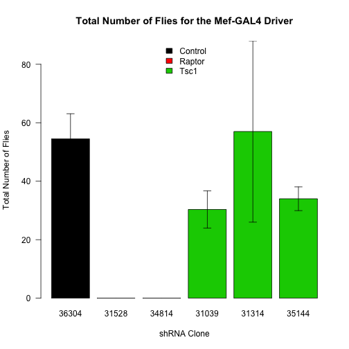 

To analyse these data, first we did an ANOVA testing for whether the UAS has an effect on the number of eclosed flies.  We did a Shaprio-Wilk test to check for normality (p=7.2345 &times; 10<sup>-4</sup>) and a Levene's Test to check for equal variance (p=0.002).  A Levene's Test if we remove the +/+ control gives a p-value of 0.027 and the Shapiro-Wilk test was p=0.0249, so using that model, the assumptions of normality and equal variance are met.

The p-value for that comparason is **NA** for the UAS.  To test if the driver alone had an effect with did a Student's t-test comparing the +/+ and *Mef/+* progeny.  The p-value for the Driver having an effect is **0.583**.  

Due to the significant ANOVA we performed a post-hoc Dunnett's test using the *Mef/+* progeny as the controls.  An ANOVA analysis excluding the +/+ flies had a p-value of **1.0458 &times; 10<sup>-4</sup>** for the UAS.  A Dunnett's test results are shown below.

<!-- html table generated in R 3.1.0 by xtable 1.7-3 package -->
<!-- Fri Jun 27 09:08:51 2014 -->
<TABLE border=1>
<CAPTION ALIGN="bottom"> Dunnett's Test for the Number of Flies Comparing to Control (Mef-Gal4/+) </CAPTION>
<TR> <TH>  </TH> <TH> Effect Size (%) </TH> <TH> p-value </TH>  </TR>
  <TR> <TD align="right"> 31039 - 36304 </TD> <TD align="right"> -24.2 </TD> <TD align="right"> 0.1768659 </TD> </TR>
  <TR> <TD align="right"> 31314 - 36304 </TD> <TD align="right"> 2.5 </TD> <TD align="right"> 0.9998456 </TD> </TR>
  <TR> <TD align="right"> 31528 - 36304 </TD> <TD align="right"> -54.5 </TD> <TD align="right"> 0.0001721 </TD> </TR>
  <TR> <TD align="right"> 34814 - 36304 </TD> <TD align="right"> -54.5 </TD> <TD align="right"> 0.0002017 </TD> </TR>
  <TR> <TD align="right"> 35144 - 36304 </TD> <TD align="right"> -20.5 </TD> <TD align="right"> 0.1522019 </TD> </TR>
   <A NAME=tab:total-flies-dunnett-mef></A>
</TABLE>

#### Raptor Knockdown Flies Only

<!-- html table generated in R 3.1.0 by xtable 1.7-3 package -->
<!-- Fri Jun 27 09:08:51 2014 -->
<TABLE border=1>
<CAPTION ALIGN="bottom"> Summary of the Number of Flies by Driver and UAS for Mef-GAL4 </CAPTION>
<TR> <TH> Gene </TH> <TH> UAS </TH> <TH> mean </TH> <TH> se </TH> <TH> sd </TH> <TH> rel.error </TH> <TH> n </TH>  </TR>
  <TR> <TD> Control </TD> <TD> 36304 </TD> <TD align="right"> 54.50 </TD> <TD align="right"> 8.58 </TD> <TD align="right"> 21.01 </TD> <TD align="right"> 38.55 </TD> <TD align="right">   6 </TD> </TR>
  <TR> <TD> Raptor </TD> <TD> 31528 </TD> <TD align="right"> 0.00 </TD> <TD align="right"> 0.00 </TD> <TD align="right"> 0.00 </TD> <TD align="right">  </TD> <TD align="right">   4 </TD> </TR>
  <TR> <TD> Raptor </TD> <TD> 34814 </TD> <TD align="right"> 0.00 </TD> <TD align="right"> 0.00 </TD> <TD align="right"> 0.00 </TD> <TD align="right">  </TD> <TD align="right">   4 </TD> </TR>
   <A NAME=tab:total-flies-summary-mef></A>
</TABLE>


```
## Warning: zero-length arrow is of indeterminate angle and so skipped
## Warning: zero-length arrow is of indeterminate angle and so skipped
```

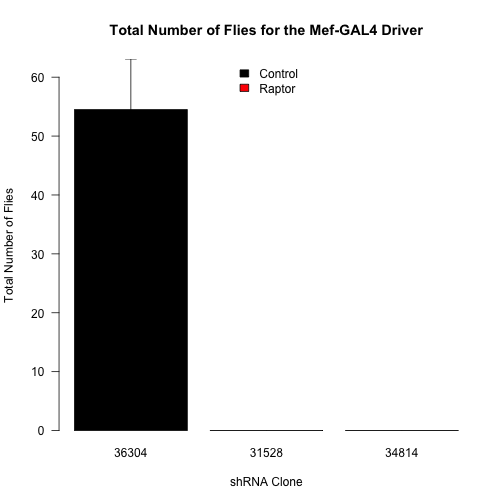 

To analyse these data, first we did an ANOVA testing for whether the UAS has an effect on the number of eclosed flies.  We did a Shaprio-Wilk test to check for normality (p=7.2345 &times; 10<sup>-4</sup>) and a Levene's Test to check for equal variance (p=0.002).  A Levene's Test if we remove the +/+ control gives a p-value of 0.027 and the Shapiro-Wilk test was p=0.0249, so using that model, neither the assumptions of normality and equal variance are met.

We therefore did a Kruskal-Wallis omnibus test, the p-value for that comparason is **0.0028** for the UAS.  To test if the driver alone had an effect with did a Student's t-test comparing the +/+ and *Mef/+* progeny.  The p-value for the Driver having an effect is **0.583**.  

Due to the significant Kruskal-Wallis test we performed post-hoc Wilcoxon tests using the *Mef/+* progeny as the controls.  

<!-- html table generated in R 3.1.0 by xtable 1.7-3 package -->
<!-- Fri Jun 27 09:08:51 2014 -->
<TABLE border=1>
<CAPTION ALIGN="bottom"> Wilcoxon Tests for the Number of Flies Comparing to Control (Mef-Gal4/+) </CAPTION>
<TR> <TH>  </TH> <TH> pval </TH> <TH> padj </TH>  </TR>
  <TR> <TD align="right"> 31528 </TD> <TD align="right"> 0.0 </TD> <TD align="right"> 0.0114172 </TD> </TR>
  <TR> <TD align="right"> 34814 </TD> <TD align="right"> 0.0 </TD> <TD align="right"> 0.0114172 </TD> </TR>
   <A NAME=tab:total-flies-dunnett-mef></A>
</TABLE>

### Analysis of Number of Flies by Gender


For the flies which had been born, we could separate these data based on gender.  The separated data is summarized in Tables \ref{tab:total-flies-summary-males} and \ref{tab:total-flies-summary-females}.  These data are graphed in Figure \ref{fig:total-flies-barplot-gendered}.  

For Males, first we did an ANOVA testing for whether the UAS has an effect on the number of eclosed flies.  The p-value for that comparason is **0.0498** for the UAS.  The results of this ANOVA are shown in Table \ref{tab:total-flies-anova-males-mef}.  To test if the driver alone had an effect with did a Student's t-test comparing the +/+ and *Mef/+* progeny.  The p-value for the Driver having an effect is **0.4983**. 

For Females, first we did an ANOVA testing for whether the UAS has an effect on the number of eclosed flies.  The p-value for that comparason is **0.0347** for the UAS.  The results of this ANOVA are shown in Table \ref{tab:total-flies-anova-females}.  To test if the driver alone had an effect with did a Student's t-test comparing the +/+ and *Mef/+* progeny.  The p-value for the Driver having an effect is **0.6788**. 

Due to the significant ANOVA we performed a post-hoc Dunnett's test using the *Mef/+* progeny as the controls.  An ANOVA analysis excluding the +/+ flies had a p-value of **1.5453 &times; 10<sup>-5</sup>** for the UAS for males and a p-value of **8.4509 &times; 10<sup>-4</sup>** for the UAS for the females.  The results of that test are in Tables \ref{tab:total-flies-dunnett-gendered}.  This test indicates that each of the three Raptor shRNA knockdowns cause a reduction in the number of male flies, but only 34814 had significantly less females.

<!-- html table generated in R 3.1.0 by xtable 1.7-3 package -->
<!-- Fri Jun 27 09:08:51 2014 -->
<TABLE border=1>
<CAPTION ALIGN="bottom"> Summary of the Number of Male Flies by Driver and UAS for Mef-GAL4 </CAPTION>
<TR> <TH> Gene </TH> <TH> UAS </TH> <TH> mean </TH> <TH> se </TH> <TH> sd </TH> <TH> rel.error </TH> <TH> n </TH>  </TR>
  <TR> <TD> Control </TD> <TD> 36304 </TD> <TD align="right"> 27.33 </TD> <TD align="right"> 3.41 </TD> <TD align="right"> 8.36 </TD> <TD align="right"> 30.58 </TD> <TD align="right">   6 </TD> </TR>
  <TR> <TD> Raptor </TD> <TD> 31528 </TD> <TD align="right"> 0.00 </TD> <TD align="right"> 0.00 </TD> <TD align="right"> 0.00 </TD> <TD align="right">  </TD> <TD align="right">   4 </TD> </TR>
  <TR> <TD> Raptor </TD> <TD> 34814 </TD> <TD align="right"> 0.00 </TD> <TD align="right"> 0.00 </TD> <TD align="right"> 0.00 </TD> <TD align="right">  </TD> <TD align="right">   4 </TD> </TR>
  <TR> <TD> Tsc1 </TD> <TD> 31039 </TD> <TD align="right"> 16.67 </TD> <TD align="right"> 4.06 </TD> <TD align="right"> 7.02 </TD> <TD align="right"> 42.14 </TD> <TD align="right">   3 </TD> </TR>
  <TR> <TD> Tsc1 </TD> <TD> 31314 </TD> <TD align="right"> 23.00 </TD> <TD align="right"> 13.00 </TD> <TD align="right"> 18.38 </TD> <TD align="right"> 79.93 </TD> <TD align="right">   2 </TD> </TR>
  <TR> <TD> Tsc1 </TD> <TD> 35144 </TD> <TD align="right"> 14.67 </TD> <TD align="right"> 1.31 </TD> <TD align="right"> 3.20 </TD> <TD align="right"> 21.85 </TD> <TD align="right">   6 </TD> </TR>
   <A NAME=tab:total-flies-summary-males-mef></A>
</TABLE>
<!-- html table generated in R 3.1.0 by xtable 1.7-3 package -->
<!-- Fri Jun 27 09:08:51 2014 -->
<TABLE border=1>
<CAPTION ALIGN="bottom"> Summary of the Number of Female Flies by Driver and UAS for Mef-GAL4 </CAPTION>
<TR> <TH> Gene </TH> <TH> UAS </TH> <TH> mean </TH> <TH> se </TH> <TH> sd </TH> <TH> rel.error </TH> <TH> n </TH>  </TR>
  <TR> <TD> Control </TD> <TD> 36304 </TD> <TD align="right"> 27.17 </TD> <TD align="right"> 5.49 </TD> <TD align="right"> 13.44 </TD> <TD align="right"> 49.46 </TD> <TD align="right">   6 </TD> </TR>
  <TR> <TD> Raptor </TD> <TD> 31528 </TD> <TD align="right"> 0.00 </TD> <TD align="right"> 0.00 </TD> <TD align="right"> 0.00 </TD> <TD align="right">  </TD> <TD align="right">   4 </TD> </TR>
  <TR> <TD> Raptor </TD> <TD> 34814 </TD> <TD align="right"> 0.00 </TD> <TD align="right"> 0.00 </TD> <TD align="right"> 0.00 </TD> <TD align="right">  </TD> <TD align="right">   4 </TD> </TR>
  <TR> <TD> Tsc1 </TD> <TD> 31039 </TD> <TD align="right"> 13.67 </TD> <TD align="right"> 2.91 </TD> <TD align="right"> 5.03 </TD> <TD align="right"> 36.83 </TD> <TD align="right">   3 </TD> </TR>
  <TR> <TD> Tsc1 </TD> <TD> 31314 </TD> <TD align="right"> 34.00 </TD> <TD align="right"> 18.00 </TD> <TD align="right"> 25.46 </TD> <TD align="right"> 74.87 </TD> <TD align="right">   2 </TD> </TR>
  <TR> <TD> Tsc1 </TD> <TD> 35144 </TD> <TD align="right"> 19.33 </TD> <TD align="right"> 3.46 </TD> <TD align="right"> 8.48 </TD> <TD align="right"> 43.85 </TD> <TD align="right">   6 </TD> </TR>
   <A NAME=tab:total-flies-summary-females-mef></A>
</TABLE>
<!-- html table generated in R 3.1.0 by xtable 1.7-3 package -->
<!-- Fri Jun 27 09:08:51 2014 -->
<TABLE border=1>
<CAPTION ALIGN="bottom"> ANOVA for the Number of Male Flies by Driver and UAS for Mef-GAL4 </CAPTION>
<TR> <TH>  </TH> <TH> Df </TH> <TH> Sum Sq </TH> <TH> Mean Sq </TH> <TH> F value </TH> <TH> Pr(&gt;F) </TH>  </TR>
  <TR> <TD> Driver </TD> <TD align="right"> 1 </TD> <TD align="right"> 154.19 </TD> <TD align="right"> 154.19 </TD> <TD align="right"> 0.68 </TD> <TD align="right"> 0.4152 </TD> </TR>
  <TR> <TD> UAS </TD> <TD align="right"> 5 </TD> <TD align="right"> 2820.51 </TD> <TD align="right"> 564.10 </TD> <TD align="right"> 2.49 </TD> <TD align="right"> 0.0498 </TD> </TR>
  <TR> <TD> Residuals </TD> <TD align="right"> 35 </TD> <TD align="right"> 7937.80 </TD> <TD align="right"> 226.79 </TD> <TD align="right">  </TD> <TD align="right">  </TD> </TR>
   <A NAME=tab:total-flies-anova-males-mef></A>
</TABLE>
<!-- html table generated in R 3.1.0 by xtable 1.7-3 package -->
<!-- Fri Jun 27 09:08:51 2014 -->
<TABLE border=1>
<CAPTION ALIGN="bottom"> ANOVA for the Number of Female Flies by Driver and UAS for Mef-GAL4 </CAPTION>
<TR> <TH>  </TH> <TH> Df </TH> <TH> Sum Sq </TH> <TH> Mean Sq </TH> <TH> F value </TH> <TH> Pr(&gt;F) </TH>  </TR>
  <TR> <TD> Driver </TD> <TD align="right"> 1 </TD> <TD align="right"> 62.24 </TD> <TD align="right"> 62.24 </TD> <TD align="right"> 0.24 </TD> <TD align="right"> 0.6263 </TD> </TR>
  <TR> <TD> UAS </TD> <TD align="right"> 5 </TD> <TD align="right"> 3521.41 </TD> <TD align="right"> 704.28 </TD> <TD align="right"> 2.73 </TD> <TD align="right"> 0.0347 </TD> </TR>
  <TR> <TD> Residuals </TD> <TD align="right"> 35 </TD> <TD align="right"> 9022.83 </TD> <TD align="right"> 257.80 </TD> <TD align="right">  </TD> <TD align="right">  </TD> </TR>
   <A NAME=tab:total-flies-anova-females-mef></A>
</TABLE>
<!-- html table generated in R 3.1.0 by xtable 1.7-3 package -->
<!-- Fri Jun 27 09:08:51 2014 -->
<TABLE border=1>
<CAPTION ALIGN="bottom"> Dunnett's Test for the Number of Males and Females Comparing to Control (Mef-Gal4/+) </CAPTION>
<TR> <TH>  </TH> <TH> Male Effect Size (%) </TH> <TH> Male p-value </TH> <TH> Female Effect Size (%) </TH> <TH> Female p-value </TH>  </TR>
  <TR> <TD align="right"> 31039 - 36304 </TD> <TD align="right"> -10.7 </TD> <TD align="right"> 0.1374948 </TD> <TD align="right"> -13.5 </TD> <TD align="right"> 0.2742980 </TD> </TR>
  <TR> <TD align="right"> 31314 - 36304 </TD> <TD align="right"> -4.3 </TD> <TD align="right"> 0.9077465 </TD> <TD align="right"> 6.8 </TD> <TD align="right"> 0.8973538 </TD> </TR>
  <TR> <TD align="right"> 31528 - 36304 </TD> <TD align="right"> -27.3 </TD> <TD align="right"> 0.0000142 </TD> <TD align="right"> -27.2 </TD> <TD align="right"> 0.0026393 </TD> </TR>
  <TR> <TD align="right"> 34814 - 36304 </TD> <TD align="right"> -27.3 </TD> <TD align="right"> 0.0000144 </TD> <TD align="right"> -27.2 </TD> <TD align="right"> 0.0025103 </TD> </TR>
  <TR> <TD align="right"> 35144 - 36304 </TD> <TD align="right"> -12.7 </TD> <TD align="right"> 0.0164614 </TD> <TD align="right"> -7.8 </TD> <TD align="right"> 0.5884170 </TD> </TR>
   <A NAME=tab:total-flies-dunnett-gendered-mef></A>
</TABLE>


```
## Warning: zero-length arrow is of indeterminate angle and so skipped
## Warning: zero-length arrow is of indeterminate angle and so skipped
## Warning: zero-length arrow is of indeterminate angle and so skipped
## Warning: zero-length arrow is of indeterminate angle and so skipped
```

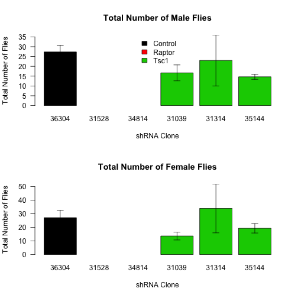 

## Session Information

```
## R version 3.1.0 (2014-04-10)
## Platform: x86_64-apple-darwin13.1.0 (64-bit)
## 
## locale:
## [1] en_US.UTF-8/en_US.UTF-8/en_US.UTF-8/C/en_US.UTF-8/en_US.UTF-8
## 
## attached base packages:
## [1] splines   stats     graphics  grDevices utils     datasets  methods  
## [8] base     
## 
## other attached packages:
## [1] multcomp_1.3-3    TH.data_1.0-3     survival_2.37-7   mvtnorm_0.9-99992
## [5] xtable_1.7-3      car_2.0-20        plyr_1.8.1        reshape2_1.4     
## [9] knitr_1.6        
## 
## loaded via a namespace (and not attached):
##  [1] evaluate_0.5.5  formatR_0.10    grid_3.1.0      lattice_0.20-29
##  [5] MASS_7.3-33     nnet_7.3-8      Rcpp_0.11.2     sandwich_2.3-0 
##  [9] stringr_0.6.2   tools_3.1.0     zoo_1.7-11
```
