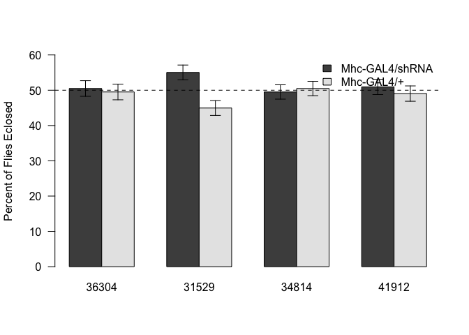

# Quantification of Effects of Rapamycin on MyoD Levels
Erika Yates and Dave Bridges  
December 1, 2014  

# Experimental Design


The raw data saved in../Data/mhc_birth_worksheet.csv.  This script was most recently run on Thu Dec 11 12:40:29 2014.

## Strain Summaries


This analysis includes 1.162\times 10^{4} flies.


```
## Loading required package: xtable
```

<!-- html table generated in R 3.1.1 by xtable 1.7-4 package -->
<!-- Thu Dec 11 12:40:29 2014 -->
<table border=1>
<caption align="bottom"> Gene Level Summarised Data </caption>
<tr> <th> Driver </th> <th> Gene </th> <th> WT </th> <th> Cyo.Sb </th> <th> Sb </th> <th> Cyo </th> <th> Cyo.sb.1 </th> <th> Total </th>  </tr>
  <tr> <td> 24B-GAL4 </td> <td> Control </td> <td align="right"> 284 </td> <td align="right"> 253 </td> <td align="right">  </td> <td align="right">  </td> <td align="right">  </td> <td align="right"> 537 </td> </tr>
  <tr> <td> 24B-GAL4 </td> <td>  </td> <td align="right"> 380 </td> <td align="right"> 711 </td> <td align="right">  </td> <td align="right">  </td> <td align="right">  </td> <td align="right"> 1091 </td> </tr>
  <tr> <td> C179-GAL4 </td> <td> Control </td> <td align="right"> 525 </td> <td align="right"> 0 </td> <td align="right">  </td> <td align="right">  </td> <td align="right">  </td> <td align="right"> 525 </td> </tr>
  <tr> <td> C179-GAL4 </td> <td>  </td> <td align="right"> 981 </td> <td align="right"> 0 </td> <td align="right">  </td> <td align="right">  </td> <td align="right">  </td> <td align="right"> 981 </td> </tr>
  <tr> <td> Hand-GAL4 </td> <td> Control </td> <td align="right"> 444 </td> <td align="right"> 0 </td> <td align="right">  </td> <td align="right">  </td> <td align="right">  </td> <td align="right"> 444 </td> </tr>
  <tr> <td> Mef-GAL4 </td> <td> Control </td> <td align="right"> 603 </td> <td align="right"> 0 </td> <td align="right">  </td> <td align="right">  </td> <td align="right">  </td> <td align="right"> 603 </td> </tr>
  <tr> <td> Mef-GAL4 </td> <td> Raptor </td> <td align="right"> 232 </td> <td align="right"> 0 </td> <td align="right">  </td> <td align="right">  </td> <td align="right">  </td> <td align="right"> 232 </td> </tr>
  <tr> <td> Mef-GAL4 </td> <td> Tsc1 </td> <td align="right"> 1031 </td> <td align="right"> 346 </td> <td align="right">  </td> <td align="right">  </td> <td align="right">  </td> <td align="right"> 1377 </td> </tr>
  <tr> <td> Mef-GAL4 </td> <td>  </td> <td align="right"> 435 </td> <td align="right"> 0 </td> <td align="right">  </td> <td align="right">  </td> <td align="right">  </td> <td align="right"> 435 </td> </tr>
  <tr> <td> Mhc-GAL4 </td> <td> Control </td> <td align="right"> 257 </td> <td align="right"> 252 </td> <td align="right">  </td> <td align="right">  </td> <td align="right">  </td> <td align="right"> 509 </td> </tr>
  <tr> <td> Mhc-GAL4 </td> <td> Raptor </td> <td align="right"> 1240 </td> <td align="right">  </td> <td align="right">  </td> <td align="right">  </td> <td align="right">  </td> <td align="right"> 2350 </td> </tr>
  <tr> <td> Mhc-GAL4 </td> <td> Tsc1 </td> <td align="right"> 1107 </td> <td align="right">  </td> <td align="right">  </td> <td align="right">  </td> <td align="right">  </td> <td align="right"> 2511 </td> </tr>
  <tr> <td>  </td> <td> Tsc1 </td> <td align="right"> 9 </td> <td align="right">  </td> <td align="right"> 9 </td> <td align="right"> 7 </td> <td align="right"> 0 </td> <td align="right"> 25 </td> </tr>
   <a name=tab:gene_summarised_data></a>
</table>
<!-- html table generated in R 3.1.1 by xtable 1.7-4 package -->
<!-- Thu Dec 11 12:40:29 2014 -->
<table border=1>
<caption align="bottom"> UAS Level Summarised Data </caption>
<tr> <th> Driver </th> <th> UAS </th> <th> Gene </th> <th> WT </th> <th> Cyo.Sb </th> <th> Sb </th> <th> Cyo </th> <th> Cyo.sb.1 </th> <th> Total </th>  </tr>
  <tr> <td> 24B-GAL4 </td> <td> 32371 </td> <td>  </td> <td align="right"> 265 </td> <td align="right"> 295 </td> <td align="right">  </td> <td align="right">  </td> <td align="right">  </td> <td align="right"> 560 </td> </tr>
  <tr> <td> 24B-GAL4 </td> <td> 35137 </td> <td>  </td> <td align="right"> 115 </td> <td align="right"> 416 </td> <td align="right">  </td> <td align="right">  </td> <td align="right">  </td> <td align="right"> 531 </td> </tr>
  <tr> <td> 24B-GAL4 </td> <td> 36304 </td> <td> Control </td> <td align="right"> 284 </td> <td align="right"> 253 </td> <td align="right">  </td> <td align="right">  </td> <td align="right">  </td> <td align="right"> 537 </td> </tr>
  <tr> <td> C179-GAL4 </td> <td> 32371 </td> <td>  </td> <td align="right"> 501 </td> <td align="right"> 0 </td> <td align="right">  </td> <td align="right">  </td> <td align="right">  </td> <td align="right"> 501 </td> </tr>
  <tr> <td> C179-GAL4 </td> <td> 35137 </td> <td>  </td> <td align="right"> 480 </td> <td align="right"> 0 </td> <td align="right">  </td> <td align="right">  </td> <td align="right">  </td> <td align="right"> 480 </td> </tr>
  <tr> <td> C179-GAL4 </td> <td> 36304 </td> <td> Control </td> <td align="right"> 525 </td> <td align="right"> 0 </td> <td align="right">  </td> <td align="right">  </td> <td align="right">  </td> <td align="right"> 525 </td> </tr>
  <tr> <td> Hand-GAL4 </td> <td> 36304 </td> <td> Control </td> <td align="right"> 444 </td> <td align="right"> 0 </td> <td align="right">  </td> <td align="right">  </td> <td align="right">  </td> <td align="right"> 444 </td> </tr>
  <tr> <td> Mef-GAL4 </td> <td> 31039 </td> <td> Tsc1 </td> <td align="right"> 380 </td> <td align="right"> 0 </td> <td align="right">  </td> <td align="right">  </td> <td align="right">  </td> <td align="right"> 380 </td> </tr>
  <tr> <td> Mef-GAL4 </td> <td> 31314 </td> <td> Tsc1 </td> <td align="right"> 433 </td> <td align="right"> 0 </td> <td align="right">  </td> <td align="right">  </td> <td align="right">  </td> <td align="right"> 433 </td> </tr>
  <tr> <td> Mef-GAL4 </td> <td> 31529 </td> <td> Raptor </td> <td align="right"> 232 </td> <td align="right"> 0 </td> <td align="right">  </td> <td align="right">  </td> <td align="right">  </td> <td align="right"> 232 </td> </tr>
  <tr> <td> Mef-GAL4 </td> <td> 32371 </td> <td>  </td> <td align="right"> 424 </td> <td align="right"> 0 </td> <td align="right">  </td> <td align="right">  </td> <td align="right">  </td> <td align="right"> 424 </td> </tr>
  <tr> <td> Mef-GAL4 </td> <td> 35137 </td> <td>  </td> <td align="right"> 11 </td> <td align="right"> 0 </td> <td align="right">  </td> <td align="right">  </td> <td align="right">  </td> <td align="right"> 11 </td> </tr>
  <tr> <td> Mef-GAL4 </td> <td> 35144 </td> <td> Tsc1 </td> <td align="right"> 218 </td> <td align="right"> 346 </td> <td align="right">  </td> <td align="right">  </td> <td align="right">  </td> <td align="right"> 564 </td> </tr>
  <tr> <td> Mef-GAL4 </td> <td> 36304 </td> <td> Control </td> <td align="right"> 603 </td> <td align="right"> 0 </td> <td align="right">  </td> <td align="right">  </td> <td align="right">  </td> <td align="right"> 603 </td> </tr>
  <tr> <td> Mhc-GAL4 </td> <td> 31039 </td> <td> Tsc1 </td> <td align="right"> 465 </td> <td align="right"> 433 </td> <td align="right">  </td> <td align="right">  </td> <td align="right">  </td> <td align="right"> 898 </td> </tr>
  <tr> <td> Mhc-GAL4 </td> <td> 31314 </td> <td> Tsc1 </td> <td align="right"> 323 </td> <td align="right"> 294 </td> <td align="right">  </td> <td align="right">  </td> <td align="right">  </td> <td align="right"> 617 </td> </tr>
  <tr> <td> Mhc-GAL4 </td> <td> 31528 </td> <td> Raptor </td> <td align="right"> 359 </td> <td align="right">  </td> <td align="right">  </td> <td align="right">  </td> <td align="right">  </td> <td align="right"> 649 </td> </tr>
  <tr> <td> Mhc-GAL4 </td> <td> 31529 </td> <td> Raptor </td> <td align="right"> 311 </td> <td align="right"> 254 </td> <td align="right">  </td> <td align="right">  </td> <td align="right">  </td> <td align="right"> 565 </td> </tr>
  <tr> <td> Mhc-GAL4 </td> <td> 34814 </td> <td> Raptor </td> <td align="right"> 301 </td> <td align="right"> 307 </td> <td align="right">  </td> <td align="right">  </td> <td align="right">  </td> <td align="right"> 608 </td> </tr>
  <tr> <td> Mhc-GAL4 </td> <td> 35144 </td> <td> Tsc1 </td> <td align="right"> 319 </td> <td align="right">  </td> <td align="right"> 261 </td> <td align="right"> 247 </td> <td align="right"> 169 </td> <td align="right"> 996 </td> </tr>
  <tr> <td> Mhc-GAL4 </td> <td> 36304 </td> <td> Control </td> <td align="right"> 257 </td> <td align="right"> 252 </td> <td align="right">  </td> <td align="right">  </td> <td align="right">  </td> <td align="right"> 509 </td> </tr>
  <tr> <td> Mhc-GAL4 </td> <td> 41912 </td> <td> Raptor </td> <td align="right"> 269 </td> <td align="right"> 259 </td> <td align="right">  </td> <td align="right">  </td> <td align="right">  </td> <td align="right"> 528 </td> </tr>
  <tr> <td>  </td> <td> 35144 </td> <td> Tsc1 </td> <td align="right"> 9 </td> <td align="right">  </td> <td align="right"> 9 </td> <td align="right"> 7 </td> <td align="right"> 0 </td> <td align="right"> 25 </td> </tr>
   <a name=tab:driver_summarised_data></a>
</table>
<!-- html table generated in R 3.1.1 by xtable 1.7-4 package -->
<!-- Thu Dec 11 12:40:29 2014 -->
<table border=1>
<caption align="bottom"> UAS Level Summarised Data Separated by Gender </caption>
<tr> <th> Driver </th> <th> UAS </th> <th> Gene </th> <th> Gender </th> <th> WT </th> <th> Cyo.Sb </th> <th> Sb </th> <th> Cyo </th> <th> Cyo.sb.1 </th> <th> Total </th>  </tr>
  <tr> <td> 24B-GAL4 </td> <td> 32371 </td> <td>  </td> <td> Female </td> <td align="right"> 141 </td> <td align="right"> 142 </td> <td align="right">  </td> <td align="right">  </td> <td align="right">  </td> <td align="right"> 283 </td> </tr>
  <tr> <td> 24B-GAL4 </td> <td> 32371 </td> <td>  </td> <td> Male </td> <td align="right"> 124 </td> <td align="right"> 153 </td> <td align="right">  </td> <td align="right">  </td> <td align="right">  </td> <td align="right"> 277 </td> </tr>
  <tr> <td> 24B-GAL4 </td> <td> 35137 </td> <td>  </td> <td> Female </td> <td align="right"> 95 </td> <td align="right"> 214 </td> <td align="right">  </td> <td align="right">  </td> <td align="right">  </td> <td align="right"> 309 </td> </tr>
  <tr> <td> 24B-GAL4 </td> <td> 35137 </td> <td>  </td> <td> Male </td> <td align="right"> 20 </td> <td align="right"> 202 </td> <td align="right">  </td> <td align="right">  </td> <td align="right">  </td> <td align="right"> 222 </td> </tr>
  <tr> <td> 24B-GAL4 </td> <td> 36304 </td> <td> Control </td> <td> Female </td> <td align="right"> 157 </td> <td align="right"> 120 </td> <td align="right">  </td> <td align="right">  </td> <td align="right">  </td> <td align="right"> 277 </td> </tr>
  <tr> <td> 24B-GAL4 </td> <td> 36304 </td> <td> Control </td> <td> Male </td> <td align="right"> 127 </td> <td align="right"> 133 </td> <td align="right">  </td> <td align="right">  </td> <td align="right">  </td> <td align="right"> 260 </td> </tr>
  <tr> <td> C179-GAL4 </td> <td> 32371 </td> <td>  </td> <td> Female </td> <td align="right"> 256 </td> <td align="right"> 0 </td> <td align="right">  </td> <td align="right">  </td> <td align="right">  </td> <td align="right"> 256 </td> </tr>
  <tr> <td> C179-GAL4 </td> <td> 32371 </td> <td>  </td> <td> Male </td> <td align="right"> 245 </td> <td align="right"> 0 </td> <td align="right">  </td> <td align="right">  </td> <td align="right">  </td> <td align="right"> 245 </td> </tr>
  <tr> <td> C179-GAL4 </td> <td> 35137 </td> <td>  </td> <td> Female </td> <td align="right"> 257 </td> <td align="right"> 0 </td> <td align="right">  </td> <td align="right">  </td> <td align="right">  </td> <td align="right"> 257 </td> </tr>
  <tr> <td> C179-GAL4 </td> <td> 35137 </td> <td>  </td> <td> Male </td> <td align="right"> 223 </td> <td align="right"> 0 </td> <td align="right">  </td> <td align="right">  </td> <td align="right">  </td> <td align="right"> 223 </td> </tr>
  <tr> <td> C179-GAL4 </td> <td> 36304 </td> <td> Control </td> <td> Female </td> <td align="right"> 256 </td> <td align="right"> 0 </td> <td align="right">  </td> <td align="right">  </td> <td align="right">  </td> <td align="right"> 256 </td> </tr>
  <tr> <td> C179-GAL4 </td> <td> 36304 </td> <td> Control </td> <td> Male </td> <td align="right"> 269 </td> <td align="right"> 0 </td> <td align="right">  </td> <td align="right">  </td> <td align="right">  </td> <td align="right"> 269 </td> </tr>
  <tr> <td> Hand-GAL4 </td> <td> 36304 </td> <td> Control </td> <td> Female </td> <td align="right"> 229 </td> <td align="right"> 0 </td> <td align="right">  </td> <td align="right">  </td> <td align="right">  </td> <td align="right"> 229 </td> </tr>
  <tr> <td> Hand-GAL4 </td> <td> 36304 </td> <td> Control </td> <td> Male </td> <td align="right"> 215 </td> <td align="right"> 0 </td> <td align="right">  </td> <td align="right">  </td> <td align="right">  </td> <td align="right"> 215 </td> </tr>
  <tr> <td> Mef-GAL4 </td> <td> 31039 </td> <td> Tsc1 </td> <td> Female </td> <td align="right"> 226 </td> <td align="right"> 0 </td> <td align="right">  </td> <td align="right">  </td> <td align="right">  </td> <td align="right"> 226 </td> </tr>
  <tr> <td> Mef-GAL4 </td> <td> 31039 </td> <td> Tsc1 </td> <td> Male </td> <td align="right"> 154 </td> <td align="right"> 0 </td> <td align="right">  </td> <td align="right">  </td> <td align="right">  </td> <td align="right"> 154 </td> </tr>
  <tr> <td> Mef-GAL4 </td> <td> 31314 </td> <td> Tsc1 </td> <td> Female </td> <td align="right"> 238 </td> <td align="right"> 0 </td> <td align="right">  </td> <td align="right">  </td> <td align="right">  </td> <td align="right"> 238 </td> </tr>
  <tr> <td> Mef-GAL4 </td> <td> 31314 </td> <td> Tsc1 </td> <td> Male </td> <td align="right"> 195 </td> <td align="right"> 0 </td> <td align="right">  </td> <td align="right">  </td> <td align="right">  </td> <td align="right"> 195 </td> </tr>
  <tr> <td> Mef-GAL4 </td> <td> 31529 </td> <td> Raptor </td> <td> Female </td> <td align="right"> 130 </td> <td align="right"> 0 </td> <td align="right">  </td> <td align="right">  </td> <td align="right">  </td> <td align="right"> 130 </td> </tr>
  <tr> <td> Mef-GAL4 </td> <td> 31529 </td> <td> Raptor </td> <td> Male </td> <td align="right"> 102 </td> <td align="right"> 0 </td> <td align="right">  </td> <td align="right">  </td> <td align="right">  </td> <td align="right"> 102 </td> </tr>
  <tr> <td> Mef-GAL4 </td> <td> 32371 </td> <td>  </td> <td> Female </td> <td align="right"> 225 </td> <td align="right"> 0 </td> <td align="right">  </td> <td align="right">  </td> <td align="right">  </td> <td align="right"> 225 </td> </tr>
  <tr> <td> Mef-GAL4 </td> <td> 32371 </td> <td>  </td> <td> Male </td> <td align="right"> 199 </td> <td align="right"> 0 </td> <td align="right">  </td> <td align="right">  </td> <td align="right">  </td> <td align="right"> 199 </td> </tr>
  <tr> <td> Mef-GAL4 </td> <td> 35137 </td> <td>  </td> <td> Female </td> <td align="right"> 6 </td> <td align="right"> 0 </td> <td align="right">  </td> <td align="right">  </td> <td align="right">  </td> <td align="right"> 6 </td> </tr>
  <tr> <td> Mef-GAL4 </td> <td> 35137 </td> <td>  </td> <td> Male </td> <td align="right"> 5 </td> <td align="right"> 0 </td> <td align="right">  </td> <td align="right">  </td> <td align="right">  </td> <td align="right"> 5 </td> </tr>
  <tr> <td> Mef-GAL4 </td> <td> 35144 </td> <td> Tsc1 </td> <td> Female </td> <td align="right"> 109 </td> <td align="right"> 185 </td> <td align="right">  </td> <td align="right">  </td> <td align="right">  </td> <td align="right"> 294 </td> </tr>
  <tr> <td> Mef-GAL4 </td> <td> 35144 </td> <td> Tsc1 </td> <td> Male </td> <td align="right"> 109 </td> <td align="right"> 161 </td> <td align="right">  </td> <td align="right">  </td> <td align="right">  </td> <td align="right"> 270 </td> </tr>
  <tr> <td> Mef-GAL4 </td> <td> 36304 </td> <td> Control </td> <td> Female </td> <td align="right"> 309 </td> <td align="right"> 0 </td> <td align="right">  </td> <td align="right">  </td> <td align="right">  </td> <td align="right"> 309 </td> </tr>
  <tr> <td> Mef-GAL4 </td> <td> 36304 </td> <td> Control </td> <td> Male </td> <td align="right"> 294 </td> <td align="right"> 0 </td> <td align="right">  </td> <td align="right">  </td> <td align="right">  </td> <td align="right"> 294 </td> </tr>
  <tr> <td> Mhc-GAL4 </td> <td> 31039 </td> <td> Tsc1 </td> <td> Female </td> <td align="right"> 239 </td> <td align="right"> 215 </td> <td align="right">  </td> <td align="right">  </td> <td align="right">  </td> <td align="right"> 454 </td> </tr>
  <tr> <td> Mhc-GAL4 </td> <td> 31039 </td> <td> Tsc1 </td> <td> Male </td> <td align="right"> 226 </td> <td align="right"> 218 </td> <td align="right">  </td> <td align="right">  </td> <td align="right">  </td> <td align="right"> 444 </td> </tr>
  <tr> <td> Mhc-GAL4 </td> <td> 31314 </td> <td> Tsc1 </td> <td> Female </td> <td align="right"> 163 </td> <td align="right"> 148 </td> <td align="right">  </td> <td align="right">  </td> <td align="right">  </td> <td align="right"> 311 </td> </tr>
  <tr> <td> Mhc-GAL4 </td> <td> 31314 </td> <td> Tsc1 </td> <td> Male </td> <td align="right"> 160 </td> <td align="right"> 146 </td> <td align="right">  </td> <td align="right">  </td> <td align="right">  </td> <td align="right"> 306 </td> </tr>
  <tr> <td> Mhc-GAL4 </td> <td> 31528 </td> <td> Raptor </td> <td> Female </td> <td align="right"> 188 </td> <td align="right"> 140 </td> <td align="right">  </td> <td align="right">  </td> <td align="right">  </td> <td align="right"> 328 </td> </tr>
  <tr> <td> Mhc-GAL4 </td> <td> 31528 </td> <td> Raptor </td> <td> Male </td> <td align="right"> 171 </td> <td align="right">  </td> <td align="right">  </td> <td align="right">  </td> <td align="right">  </td> <td align="right"> 321 </td> </tr>
  <tr> <td> Mhc-GAL4 </td> <td> 31529 </td> <td> Raptor </td> <td> Female </td> <td align="right"> 152 </td> <td align="right"> 125 </td> <td align="right">  </td> <td align="right">  </td> <td align="right">  </td> <td align="right"> 277 </td> </tr>
  <tr> <td> Mhc-GAL4 </td> <td> 31529 </td> <td> Raptor </td> <td> Male </td> <td align="right"> 159 </td> <td align="right"> 129 </td> <td align="right">  </td> <td align="right">  </td> <td align="right">  </td> <td align="right"> 288 </td> </tr>
  <tr> <td> Mhc-GAL4 </td> <td> 34814 </td> <td> Raptor </td> <td> Female </td> <td align="right"> 154 </td> <td align="right"> 153 </td> <td align="right">  </td> <td align="right">  </td> <td align="right">  </td> <td align="right"> 307 </td> </tr>
  <tr> <td> Mhc-GAL4 </td> <td> 34814 </td> <td> Raptor </td> <td> Male </td> <td align="right"> 147 </td> <td align="right"> 154 </td> <td align="right">  </td> <td align="right">  </td> <td align="right">  </td> <td align="right"> 301 </td> </tr>
  <tr> <td> Mhc-GAL4 </td> <td> 35144 </td> <td> Tsc1 </td> <td> Female </td> <td align="right"> 181 </td> <td align="right">  </td> <td align="right"> 142 </td> <td align="right"> 125 </td> <td align="right"> 80 </td> <td align="right"> 528 </td> </tr>
  <tr> <td> Mhc-GAL4 </td> <td> 35144 </td> <td> Tsc1 </td> <td> Male </td> <td align="right"> 138 </td> <td align="right">  </td> <td align="right"> 119 </td> <td align="right"> 122 </td> <td align="right"> 89 </td> <td align="right"> 468 </td> </tr>
  <tr> <td> Mhc-GAL4 </td> <td> 36304 </td> <td> Control </td> <td> Female </td> <td align="right"> 129 </td> <td align="right"> 124 </td> <td align="right">  </td> <td align="right">  </td> <td align="right">  </td> <td align="right"> 253 </td> </tr>
  <tr> <td> Mhc-GAL4 </td> <td> 36304 </td> <td> Control </td> <td> Male </td> <td align="right"> 128 </td> <td align="right"> 128 </td> <td align="right">  </td> <td align="right">  </td> <td align="right">  </td> <td align="right"> 256 </td> </tr>
  <tr> <td> Mhc-GAL4 </td> <td> 41912 </td> <td> Raptor </td> <td> Female </td> <td align="right"> 147 </td> <td align="right"> 136 </td> <td align="right">  </td> <td align="right">  </td> <td align="right">  </td> <td align="right"> 283 </td> </tr>
  <tr> <td> Mhc-GAL4 </td> <td> 41912 </td> <td> Raptor </td> <td> Male </td> <td align="right"> 122 </td> <td align="right"> 123 </td> <td align="right">  </td> <td align="right">  </td> <td align="right">  </td> <td align="right"> 245 </td> </tr>
  <tr> <td>  </td> <td> 35144 </td> <td> Tsc1 </td> <td> Male </td> <td align="right"> 9 </td> <td align="right">  </td> <td align="right"> 9 </td> <td align="right"> 7 </td> <td align="right"> 0 </td> <td align="right"> 25 </td> </tr>
   <a name=tab:driver_summarised_data></a>
</table>

## Effects of Mhc-GAL4 Driver on Birth Rates

 

## Session Information

```
## R version 3.1.1 (2014-07-10)
## Platform: x86_64-apple-darwin13.1.0 (64-bit)
## 
## locale:
## [1] en_US.UTF-8/en_US.UTF-8/en_US.UTF-8/C/en_US.UTF-8/en_US.UTF-8
## 
## attached base packages:
## [1] stats     graphics  grDevices utils     datasets  methods   base     
## 
## other attached packages:
## [1] xtable_1.7-4 plyr_1.8.1  
## 
## loaded via a namespace (and not attached):
##  [1] digest_0.6.5     evaluate_0.5.5   formatR_1.0      htmltools_0.2.6 
##  [5] knitr_1.8        Rcpp_0.11.3      rmarkdown_0.3.10 stringr_0.6.2   
##  [9] tools_3.1.1      yaml_2.1.13
```
