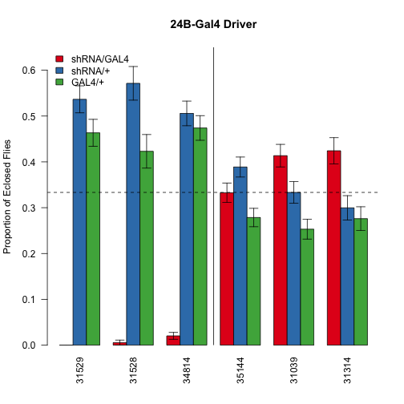
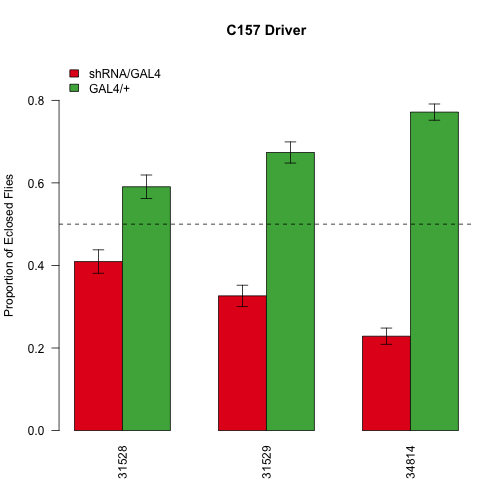
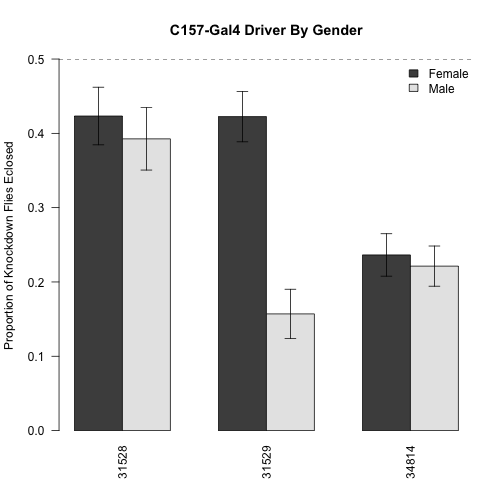
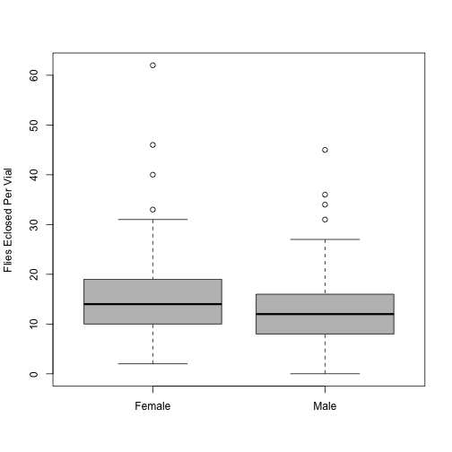

Analysis of Birth Ratios
==========================

Experimental Design
--------------------


These data are stored with the raw data saved in../Data/birth_worksheet.csv.  This script was most recently run on Mon Jun 23 09:36:27 2014.

Strain Summaries
------------------


So far this analysis includes 6488 flies from 18 crosses.  Statistics are based on a Chi Squared Test, and are  adjusted for multiple observation by the method of Benjamini and Hochberg.  These statistics exclude the genotypically WT (dual balancer chromosome) strains, which have significantly less progeny in nearly all cases (see Table \ref{tab:all_progeny_data}).  Counts and p-values are shown in Table \ref{tab:driver_summarised_data} and Figures \ref{fig:24b-barplot} and \ref{fig:hand-barplot} for all drivers, Table \ref{tab:summarised_data} for all crosses and Table \ref{tab:gendered_data} with gendered crossed data.  Summarized per cross the data are below.

## Pre-Eclosure Lethality of Raptor Strains with 24B-Gal4

The three Raptor knockout strains all had much less progeny than would be expected with 24B-GAL4 driven expression.  The adjusted p-values for these effects are 1.30925507135797e-31, 6.61466969174944e-33, 0.01059795534579 respectively for shRNA's 31529, 34814, 35144.

## Crosses with C179-Gal4
Since there was embryonic lethality of the Raptor strains with 24B-Gal4 we repeated these crosses with C179-Gal4.  These results are shown in Tables \ref{tab:179-all} and \ref{tab:179-gendered} as well as Figure \ref{fig:c157-figure}.  There is a gender specific effect for only one of these crosses (see Table \ref{tab:179-fisher} for Fisher tests comparing gender for each shRNA strain and Figure \ref{fig:179-gendered}).

### Effects of 18C
Since we observed few births at 24C, we repeated several crosses at 18C using the TSC shRNA lines.  These data are summarised in Table \ref{tab:18c-data} and Figure \ref{fig:24b-barplot-18c}


```
## Loading required package: xtable
```

<!-- html table generated in R 3.1.0 by xtable 1.7-3 package -->
<!-- Mon Jun 23 09:36:28 2014 -->
<TABLE border=1>
<CAPTION ALIGN="bottom"> Gene Level Summarised Data </CAPTION>
<TR> <TH> Driver </TH> <TH> Gene </TH> <TH> KD </TH> <TH> shRNA </TH> <TH> GAL4 </TH> <TH> WT </TH> <TH> Total </TH> <TH> pval </TH> <TH> padj </TH>  </TR>
  <TR> <TD> 24B-Gal4 </TD> <TD> Raptor </TD> <TD align="right"> 8 </TD> <TD align="right"> 433 </TD> <TD align="right"> 374 </TD> <TD align="right"> 188 </TD> <TD align="right"> 1003 </TD> <TD align="right"> 0.00000 </TD> <TD align="right"> 0.00000 </TD> </TR>
  <TR> <TD> 24B-Gal4 </TD> <TD> Tsc1 </TD> <TD align="right"> 457 </TD> <TD align="right"> 416 </TD> <TD align="right"> 322 </TD> <TD align="right"> 168 </TD> <TD align="right"> 1363 </TD> <TD align="right"> 0.00001 </TD> <TD align="right"> 0.00001 </TD> </TR>
  <TR> <TD> Hand-Gal4 </TD> <TD> Raptor </TD> <TD align="right"> 385 </TD> <TD align="right"> 489 </TD> <TD align="right"> 311 </TD> <TD align="right"> 244 </TD> <TD align="right"> 1429 </TD> <TD align="right"> 0.00000 </TD> <TD align="right"> 0.00000 </TD> </TR>
  <TR> <TD> Hand-Gal4 </TD> <TD> Tsc1 </TD> <TD align="right"> 400 </TD> <TD align="right"> 320 </TD> <TD align="right"> 240 </TD> <TD align="right"> 102 </TD> <TD align="right"> 1062 </TD> <TD align="right"> 0.00000 </TD> <TD align="right"> 0.00000 </TD> </TR>
   <A NAME=tab:gene_summarised_data></A>
</TABLE>
<!-- html table generated in R 3.1.0 by xtable 1.7-3 package -->
<!-- Mon Jun 23 09:36:28 2014 -->
<TABLE border=1>
<CAPTION ALIGN="bottom"> Driver Level Summarised Data </CAPTION>
<TR> <TH> Driver </TH> <TH> UAS </TH> <TH> KD </TH> <TH> shRNA </TH> <TH> GAL4 </TH> <TH> WT </TH> <TH> Total </TH> <TH> pval </TH> <TH> padj </TH>  </TR>
  <TR> <TD> 24B-Gal4 </TD> <TD align="right"> 31039 </TD> <TD align="right"> 165 </TD> <TD align="right"> 133 </TD> <TD align="right"> 101 </TD> <TD align="right"> 47 </TD> <TD align="right"> 446 </TD> <TD align="right"> 0.00045 </TD> <TD align="right"> 0.00091 </TD> </TR>
  <TR> <TD> 24B-Gal4 </TD> <TD align="right"> 31314 </TD> <TD align="right"> 126 </TD> <TD align="right"> 89 </TD> <TD align="right"> 82 </TD> <TD align="right"> 36 </TD> <TD align="right"> 333 </TD> <TD align="right"> 0.00353 </TD> <TD align="right"> 0.00471 </TD> </TR>
  <TR> <TD> 24B-Gal4 </TD> <TD align="right"> 31528 </TD> <TD align="right"> 1 </TD> <TD align="right"> 104 </TD> <TD align="right"> 77 </TD> <TD align="right"> 48 </TD> <TD align="right"> 230 </TD> <TD align="right"> 0.00000 </TD> <TD align="right"> 0.00000 </TD> </TR>
  <TR> <TD> 24B-Gal4 </TD> <TD align="right"> 31529 </TD> <TD align="right"> 0 </TD> <TD align="right"> 154 </TD> <TD align="right"> 133 </TD> <TD align="right"> 55 </TD> <TD align="right"> 342 </TD> <TD align="right"> 0.00000 </TD> <TD align="right"> 0.00000 </TD> </TR>
  <TR> <TD> 24B-Gal4 </TD> <TD align="right"> 34814 </TD> <TD align="right"> 7 </TD> <TD align="right"> 175 </TD> <TD align="right"> 164 </TD> <TD align="right"> 85 </TD> <TD align="right"> 431 </TD> <TD align="right"> 0.00000 </TD> <TD align="right"> 0.00000 </TD> </TR>
  <TR> <TD> 24B-Gal4 </TD> <TD align="right"> 35144 </TD> <TD align="right"> 166 </TD> <TD align="right"> 194 </TD> <TD align="right"> 139 </TD> <TD align="right"> 85 </TD> <TD align="right"> 584 </TD> <TD align="right"> 0.01060 </TD> <TD align="right"> 0.01060 </TD> </TR>
  <TR> <TD> Hand-Gal4 </TD> <TD align="right"> 31039 </TD> <TD align="right"> 195 </TD> <TD align="right"> 180 </TD> <TD align="right"> 112 </TD> <TD align="right"> 44 </TD> <TD align="right"> 531 </TD> <TD align="right"> 0.00001 </TD> <TD align="right"> 0.00001 </TD> </TR>
  <TR> <TD> Hand-Gal4 </TD> <TD align="right"> 31314 </TD> <TD align="right"> 80 </TD> <TD align="right"> 56 </TD> <TD align="right"> 41 </TD> <TD align="right"> 19 </TD> <TD align="right"> 196 </TD> <TD align="right"> 0.00142 </TD> <TD align="right"> 0.00213 </TD> </TR>
  <TR> <TD> Hand-Gal4 </TD> <TD align="right"> 31528 </TD> <TD align="right"> 105 </TD> <TD align="right"> 174 </TD> <TD align="right"> 102 </TD> <TD align="right"> 65 </TD> <TD align="right"> 446 </TD> <TD align="right"> 0.00000 </TD> <TD align="right"> 0.00001 </TD> </TR>
  <TR> <TD> Hand-Gal4 </TD> <TD align="right"> 31529 </TD> <TD align="right"> 116 </TD> <TD align="right"> 147 </TD> <TD align="right"> 89 </TD> <TD align="right"> 72 </TD> <TD align="right"> 424 </TD> <TD align="right"> 0.00076 </TD> <TD align="right"> 0.00131 </TD> </TR>
  <TR> <TD> Hand-Gal4 </TD> <TD align="right"> 34814 </TD> <TD align="right"> 164 </TD> <TD align="right"> 168 </TD> <TD align="right"> 120 </TD> <TD align="right"> 107 </TD> <TD align="right"> 559 </TD> <TD align="right"> 0.00902 </TD> <TD align="right"> 0.00984 </TD> </TR>
  <TR> <TD> Hand-Gal4 </TD> <TD align="right"> 35144 </TD> <TD align="right"> 125 </TD> <TD align="right"> 84 </TD> <TD align="right"> 87 </TD> <TD align="right"> 39 </TD> <TD align="right"> 335 </TD> <TD align="right"> 0.00502 </TD> <TD align="right"> 0.00603 </TD> </TR>
   <A NAME=tab:driver_summarised_data></A>
</TABLE>
<!-- html table generated in R 3.1.0 by xtable 1.7-3 package -->
<!-- Mon Jun 23 09:36:28 2014 -->
<TABLE border=1>
<CAPTION ALIGN="bottom"> Driver Level Summarized Data for C179-Gal4 Crosses </CAPTION>
<TR> <TH> Driver </TH> <TH> UAS </TH> <TH> KD </TH> <TH> shRNA </TH> <TH> GAL4 </TH> <TH> WT </TH> <TH> Total </TH> <TH> pval </TH> <TH> padj </TH>  </TR>
  <TR> <TD> C179-Gal4 </TD> <TD align="right"> 31528 </TD> <TD align="right"> 122 </TD> <TD align="right"> 0 </TD> <TD align="right"> 176 </TD> <TD align="right"> 0 </TD> <TD align="right"> 298 </TD> <TD align="right"> 0.002 </TD> <TD align="right"> 0.002 </TD> </TR>
  <TR> <TD> C179-Gal4 </TD> <TD align="right"> 31529 </TD> <TD align="right"> 109 </TD> <TD align="right"> 0 </TD> <TD align="right"> 225 </TD> <TD align="right"> 0 </TD> <TD align="right"> 334 </TD> <TD align="right"> 0.000 </TD> <TD align="right"> 0.000 </TD> </TR>
  <TR> <TD> C179-Gal4 </TD> <TD align="right"> 34814 </TD> <TD align="right"> 104 </TD> <TD align="right"> 0 </TD> <TD align="right"> 351 </TD> <TD align="right"> 0 </TD> <TD align="right"> 455 </TD> <TD align="right"> 0.000 </TD> <TD align="right"> 0.000 </TD> </TR>
   <A NAME=tab:179-all></A>
</TABLE>
<!-- html table generated in R 3.1.0 by xtable 1.7-3 package -->
<!-- Mon Jun 23 09:36:28 2014 -->
<TABLE border=1>
<CAPTION ALIGN="bottom"> Driver Level, Gender Separated Summarized Data for C179-Gal4 Crosses </CAPTION>
<TR> <TH> UAS </TH> <TH> Driver </TH> <TH> Gender </TH> <TH> KD </TH> <TH> shRNA </TH> <TH> GAL4 </TH> <TH> WT </TH> <TH> Total </TH> <TH> pval </TH> <TH> padj </TH>  </TR>
  <TR> <TD align="right"> 31528 </TD> <TD> C179-Gal4 </TD> <TD> Female </TD> <TD align="right"> 69 </TD> <TD align="right"> 0 </TD> <TD align="right"> 94 </TD> <TD align="right"> 0 </TD> <TD align="right"> 163 </TD> <TD align="right"> 0.0502 </TD> <TD align="right"> 0.0502 </TD> </TR>
  <TR> <TD align="right"> 31528 </TD> <TD> C179-Gal4 </TD> <TD> Male </TD> <TD align="right"> 53 </TD> <TD align="right"> 0 </TD> <TD align="right"> 82 </TD> <TD align="right"> 0 </TD> <TD align="right"> 135 </TD> <TD align="right"> 0.0126 </TD> <TD align="right"> 0.0188 </TD> </TR>
  <TR> <TD align="right"> 31529 </TD> <TD> C179-Gal4 </TD> <TD> Female </TD> <TD align="right"> 90 </TD> <TD align="right"> 0 </TD> <TD align="right"> 123 </TD> <TD align="right"> 0 </TD> <TD align="right"> 213 </TD> <TD align="right"> 0.0238 </TD> <TD align="right"> 0.0285 </TD> </TR>
  <TR> <TD align="right"> 31529 </TD> <TD> C179-Gal4 </TD> <TD> Male </TD> <TD align="right"> 19 </TD> <TD align="right"> 0 </TD> <TD align="right"> 102 </TD> <TD align="right"> 0 </TD> <TD align="right"> 121 </TD> <TD align="right"> 0.0000 </TD> <TD align="right"> 0.0000 </TD> </TR>
  <TR> <TD align="right"> 34814 </TD> <TD> C179-Gal4 </TD> <TD> Female </TD> <TD align="right"> 52 </TD> <TD align="right"> 0 </TD> <TD align="right"> 168 </TD> <TD align="right"> 0 </TD> <TD align="right"> 220 </TD> <TD align="right"> 0.0000 </TD> <TD align="right"> 0.0000 </TD> </TR>
  <TR> <TD align="right"> 34814 </TD> <TD> C179-Gal4 </TD> <TD> Male </TD> <TD align="right"> 52 </TD> <TD align="right"> 0 </TD> <TD align="right"> 183 </TD> <TD align="right"> 0 </TD> <TD align="right"> 235 </TD> <TD align="right"> 0.0000 </TD> <TD align="right"> 0.0000 </TD> </TR>
   <A NAME=tab:179-gendered></A>
</TABLE>

```
## Warning: data length exceeds size of matrix
```

<!-- html table generated in R 3.1.0 by xtable 1.7-3 package -->
<!-- Mon Jun 23 09:36:28 2014 -->
<TABLE border=1>
<CAPTION ALIGN="bottom"> Fisher Tests Comparing Gender Effects on C157/Raptor shRNA Crosses </CAPTION>
<TR> <TH>  </TH> <TH> pval </TH> <TH> padj </TH>  </TR>
  <A NAME=tab:179-fisher></A>
</TABLE>
<!-- html table generated in R 3.1.0 by xtable 1.7-3 package -->
<!-- Mon Jun 23 09:36:28 2014 -->
<TABLE border=1>
<CAPTION ALIGN="bottom"> Driver Level Summarized Data for 18C Crosses </CAPTION>
<TR> <TH> Driver </TH> <TH> UAS </TH> <TH> KD </TH> <TH> shRNA </TH> <TH> GAL4 </TH> <TH> WT </TH> <TH> Total </TH> <TH> pval </TH> <TH> padj </TH>  </TR>
  <TR> <TD> 24B-Gal4 </TD> <TD align="right"> 31528 </TD> <TD align="right"> 0 </TD> <TD align="right"> 68 </TD> <TD align="right"> 58 </TD> <TD align="right"> 51 </TD> <TD align="right"> 177 </TD> <TD align="right"> 0.0000000 </TD> <TD align="right"> 0.0000000 </TD> </TR>
  <TR> <TD> 24B-Gal4 </TD> <TD align="right"> 31529 </TD> <TD align="right"> 0 </TD> <TD align="right"> 65 </TD> <TD align="right"> 43 </TD> <TD align="right"> 31 </TD> <TD align="right"> 139 </TD> <TD align="right"> 0.0000000 </TD> <TD align="right"> 0.0000000 </TD> </TR>
  <TR> <TD> 24B-Gal4 </TD> <TD align="right"> 34814 </TD> <TD align="right"> 0 </TD> <TD align="right"> 95 </TD> <TD align="right"> 72 </TD> <TD align="right"> 61 </TD> <TD align="right"> 228 </TD> <TD align="right"> 0.0000000 </TD> <TD align="right"> 0.0000000 </TD> </TR>
   <A NAME=tab:18c-data></A>
</TABLE>
<!-- html table generated in R 3.1.0 by xtable 1.7-3 package -->
<!-- Mon Jun 23 09:36:28 2014 -->
<TABLE border=1>
<CAPTION ALIGN="bottom"> Cross Level Summarised Data </CAPTION>
<TR> <TH> Cross </TH> <TH> KD </TH> <TH> shRNA </TH> <TH> GAL4 </TH> <TH> WT </TH> <TH> Total </TH> <TH> pval </TH> <TH> padj </TH>  </TR>
  <TR> <TD> 31039/Tm6B x 24B-Gal4/Tm3-sb </TD> <TD align="right"> 83 </TD> <TD align="right"> 55 </TD> <TD align="right"> 36 </TD> <TD align="right"> 4 </TD> <TD align="right"> 178 </TD> <TD align="right"> 0.00007 </TD> <TD align="right"> 0.00013 </TD> </TR>
  <TR> <TD> 31039/Tm6B x 24B-Gal4/Tm3-ser </TD> <TD align="right"> 82 </TD> <TD align="right"> 78 </TD> <TD align="right"> 65 </TD> <TD align="right"> 43 </TD> <TD align="right"> 268 </TD> <TD align="right"> 0.34877 </TD> <TD align="right"> 0.36929 </TD> </TR>
  <TR> <TD> 31039/Tm6B x Hand-Gal4/Tm3-ser </TD> <TD align="right"> 195 </TD> <TD align="right"> 180 </TD> <TD align="right"> 112 </TD> <TD align="right"> 44 </TD> <TD align="right"> 531 </TD> <TD align="right"> 0.00001 </TD> <TD align="right"> 0.00001 </TD> </TR>
  <TR> <TD> 31314/Tm6B x 24B-Gal4/Tm3-sb </TD> <TD align="right"> 80 </TD> <TD align="right"> 57 </TD> <TD align="right"> 45 </TD> <TD align="right"> 18 </TD> <TD align="right"> 200 </TD> <TD align="right"> 0.00544 </TD> <TD align="right"> 0.00753 </TD> </TR>
  <TR> <TD> 31314/Tm6B x 24B-Gal4/Tm3-ser </TD> <TD align="right"> 46 </TD> <TD align="right"> 32 </TD> <TD align="right"> 37 </TD> <TD align="right"> 18 </TD> <TD align="right"> 133 </TD> <TD align="right"> 0.26900 </TD> <TD align="right"> 0.30263 </TD> </TR>
  <TR> <TD> 31314/Tm6B x Hand-Gal4/Tm3-ser </TD> <TD align="right"> 80 </TD> <TD align="right"> 56 </TD> <TD align="right"> 41 </TD> <TD align="right"> 19 </TD> <TD align="right"> 196 </TD> <TD align="right"> 0.00142 </TD> <TD align="right"> 0.00232 </TD> </TR>
  <TR> <TD> 31528/Tm6B x 24B-Gal4/Tm3-sb </TD> <TD align="right"> 0 </TD> <TD align="right"> 58 </TD> <TD align="right"> 41 </TD> <TD align="right"> 17 </TD> <TD align="right"> 116 </TD> <TD align="right"> 0.00000 </TD> <TD align="right"> 0.00000 </TD> </TR>
  <TR> <TD> 31528/Tm6B x 24B-Gal4/Tm3-ser </TD> <TD align="right"> 1 </TD> <TD align="right"> 46 </TD> <TD align="right"> 36 </TD> <TD align="right"> 31 </TD> <TD align="right"> 114 </TD> <TD align="right"> 0.00000 </TD> <TD align="right"> 0.00000 </TD> </TR>
  <TR> <TD> 31528/Tm6B x Hand-Gal4/Tm3-ser </TD> <TD align="right"> 105 </TD> <TD align="right"> 174 </TD> <TD align="right"> 102 </TD> <TD align="right"> 65 </TD> <TD align="right"> 446 </TD> <TD align="right"> 0.00000 </TD> <TD align="right"> 0.00001 </TD> </TR>
  <TR> <TD> 31529/Tm6B x 24B-Gal4/Tm3-sb </TD> <TD align="right"> 0 </TD> <TD align="right"> 82 </TD> <TD align="right"> 57 </TD> <TD align="right"> 14 </TD> <TD align="right"> 153 </TD> <TD align="right"> 0.00000 </TD> <TD align="right"> 0.00000 </TD> </TR>
  <TR> <TD> 31529/Tm6B x 24B-Gal4/Tm3-ser </TD> <TD align="right"> 0 </TD> <TD align="right"> 72 </TD> <TD align="right"> 76 </TD> <TD align="right"> 41 </TD> <TD align="right"> 189 </TD> <TD align="right"> 0.00000 </TD> <TD align="right"> 0.00000 </TD> </TR>
  <TR> <TD> 31529/Tm6B x Hand-Gal4/Tm3-ser </TD> <TD align="right"> 116 </TD> <TD align="right"> 147 </TD> <TD align="right"> 89 </TD> <TD align="right"> 72 </TD> <TD align="right"> 424 </TD> <TD align="right"> 0.00076 </TD> <TD align="right"> 0.00137 </TD> </TR>
  <TR> <TD> 34814/Tm6B x 24B-Gal4/Tm3-sb </TD> <TD align="right"> 0 </TD> <TD align="right"> 96 </TD> <TD align="right"> 77 </TD> <TD align="right"> 37 </TD> <TD align="right"> 210 </TD> <TD align="right"> 0.00000 </TD> <TD align="right"> 0.00000 </TD> </TR>
  <TR> <TD> 34814/Tm6B x 24B-Gal4/Tm3-ser </TD> <TD align="right"> 7 </TD> <TD align="right"> 79 </TD> <TD align="right"> 87 </TD> <TD align="right"> 48 </TD> <TD align="right"> 221 </TD> <TD align="right"> 0.00000 </TD> <TD align="right"> 0.00000 </TD> </TR>
  <TR> <TD> 34814/Tm6B x Hand-Gal4/Tm3-ser </TD> <TD align="right"> 164 </TD> <TD align="right"> 168 </TD> <TD align="right"> 120 </TD> <TD align="right"> 107 </TD> <TD align="right"> 559 </TD> <TD align="right"> 0.00902 </TD> <TD align="right"> 0.01083 </TD> </TR>
  <TR> <TD> 35144/Tm6B x 24B-Gal4/Tm3-sb </TD> <TD align="right"> 50 </TD> <TD align="right"> 55 </TD> <TD align="right"> 48 </TD> <TD align="right"> 19 </TD> <TD align="right"> 172 </TD> <TD align="right"> 0.77499 </TD> <TD align="right"> 0.77499 </TD> </TR>
  <TR> <TD> 35144/Tm6B x 24B-Gal4/Tm3-ser </TD> <TD align="right"> 116 </TD> <TD align="right"> 139 </TD> <TD align="right"> 91 </TD> <TD align="right"> 66 </TD> <TD align="right"> 412 </TD> <TD align="right"> 0.00676 </TD> <TD align="right"> 0.00869 </TD> </TR>
  <TR> <TD> 35144/Tm6B x Hand-Gal4/Tm3-ser </TD> <TD align="right"> 125 </TD> <TD align="right"> 84 </TD> <TD align="right"> 87 </TD> <TD align="right"> 39 </TD> <TD align="right"> 335 </TD> <TD align="right"> 0.00502 </TD> <TD align="right"> 0.00753 </TD> </TR>
   <A NAME=tab:summarised_data></A>
</TABLE>
<!-- html table generated in R 3.1.0 by xtable 1.7-3 package -->
<!-- Mon Jun 23 09:36:28 2014 -->
<TABLE border=1>
<CAPTION ALIGN="bottom"> Gendered and Cross Level Summarised Data </CAPTION>
<TR> <TH> UAS </TH> <TH> Driver </TH> <TH> Gender </TH> <TH> KD </TH> <TH> shRNA </TH> <TH> GAL4 </TH> <TH> WT </TH> <TH> Total </TH> <TH> pval </TH> <TH> padj </TH>  </TR>
  <TR> <TD align="right"> 31039 </TD> <TD> 24B-Gal4 </TD> <TD> Female </TD> <TD align="right"> 95 </TD> <TD align="right"> 67 </TD> <TD align="right"> 57 </TD> <TD align="right"> 31 </TD> <TD align="right"> 250 </TD> <TD align="right"> 0.00492 </TD> <TD align="right"> 0.01180 </TD> </TR>
  <TR> <TD align="right"> 31039 </TD> <TD> 24B-Gal4 </TD> <TD> Male </TD> <TD align="right"> 70 </TD> <TD align="right"> 66 </TD> <TD align="right"> 44 </TD> <TD align="right"> 16 </TD> <TD align="right"> 196 </TD> <TD align="right"> 0.03813 </TD> <TD align="right"> 0.05384 </TD> </TR>
  <TR> <TD align="right"> 31314 </TD> <TD> 24B-Gal4 </TD> <TD> Female </TD> <TD align="right"> 56 </TD> <TD align="right"> 49 </TD> <TD align="right"> 43 </TD> <TD align="right"> 16 </TD> <TD align="right"> 164 </TD> <TD align="right"> 0.42396 </TD> <TD align="right"> 0.42396 </TD> </TR>
  <TR> <TD align="right"> 31314 </TD> <TD> 24B-Gal4 </TD> <TD> Male </TD> <TD align="right"> 70 </TD> <TD align="right"> 40 </TD> <TD align="right"> 39 </TD> <TD align="right"> 20 </TD> <TD align="right"> 169 </TD> <TD align="right"> 0.00193 </TD> <TD align="right"> 0.00516 </TD> </TR>
  <TR> <TD align="right"> 31528 </TD> <TD> 24B-Gal4 </TD> <TD> Female </TD> <TD align="right"> 1 </TD> <TD align="right"> 55 </TD> <TD align="right"> 36 </TD> <TD align="right"> 34 </TD> <TD align="right"> 126 </TD> <TD align="right"> 0.00000 </TD> <TD align="right"> 0.00000 </TD> </TR>
  <TR> <TD align="right"> 31528 </TD> <TD> 24B-Gal4 </TD> <TD> Male </TD> <TD align="right"> 0 </TD> <TD align="right"> 49 </TD> <TD align="right"> 41 </TD> <TD align="right"> 14 </TD> <TD align="right"> 104 </TD> <TD align="right"> 0.00000 </TD> <TD align="right"> 0.00000 </TD> </TR>
  <TR> <TD align="right"> 31529 </TD> <TD> 24B-Gal4 </TD> <TD> Female </TD> <TD align="right"> 0 </TD> <TD align="right"> 85 </TD> <TD align="right"> 83 </TD> <TD align="right"> 29 </TD> <TD align="right"> 197 </TD> <TD align="right"> 0.00000 </TD> <TD align="right"> 0.00000 </TD> </TR>
  <TR> <TD align="right"> 31529 </TD> <TD> 24B-Gal4 </TD> <TD> Male </TD> <TD align="right"> 0 </TD> <TD align="right"> 69 </TD> <TD align="right"> 50 </TD> <TD align="right"> 26 </TD> <TD align="right"> 145 </TD> <TD align="right"> 0.00000 </TD> <TD align="right"> 0.00000 </TD> </TR>
  <TR> <TD align="right"> 34814 </TD> <TD> 24B-Gal4 </TD> <TD> Female </TD> <TD align="right"> 5 </TD> <TD align="right"> 88 </TD> <TD align="right"> 87 </TD> <TD align="right"> 45 </TD> <TD align="right"> 225 </TD> <TD align="right"> 0.00000 </TD> <TD align="right"> 0.00000 </TD> </TR>
  <TR> <TD align="right"> 34814 </TD> <TD> 24B-Gal4 </TD> <TD> Male </TD> <TD align="right"> 2 </TD> <TD align="right"> 87 </TD> <TD align="right"> 77 </TD> <TD align="right"> 40 </TD> <TD align="right"> 206 </TD> <TD align="right"> 0.00000 </TD> <TD align="right"> 0.00000 </TD> </TR>
  <TR> <TD align="right"> 35144 </TD> <TD> 24B-Gal4 </TD> <TD> Female </TD> <TD align="right"> 94 </TD> <TD align="right"> 113 </TD> <TD align="right"> 80 </TD> <TD align="right"> 51 </TD> <TD align="right"> 338 </TD> <TD align="right"> 0.05684 </TD> <TD align="right"> 0.07052 </TD> </TR>
  <TR> <TD align="right"> 35144 </TD> <TD> 24B-Gal4 </TD> <TD> Male </TD> <TD align="right"> 72 </TD> <TD align="right"> 81 </TD> <TD align="right"> 59 </TD> <TD align="right"> 34 </TD> <TD align="right"> 246 </TD> <TD align="right"> 0.17708 </TD> <TD align="right"> 0.18478 </TD> </TR>
  <TR> <TD align="right"> 31039 </TD> <TD> Hand-Gal4 </TD> <TD> Female </TD> <TD align="right"> 104 </TD> <TD align="right"> 95 </TD> <TD align="right"> 70 </TD> <TD align="right"> 26 </TD> <TD align="right"> 295 </TD> <TD align="right"> 0.03140 </TD> <TD align="right"> 0.05254 </TD> </TR>
  <TR> <TD align="right"> 31039 </TD> <TD> Hand-Gal4 </TD> <TD> Male </TD> <TD align="right"> 91 </TD> <TD align="right"> 85 </TD> <TD align="right"> 42 </TD> <TD align="right"> 18 </TD> <TD align="right"> 236 </TD> <TD align="right"> 0.00005 </TD> <TD align="right"> 0.00016 </TD> </TR>
  <TR> <TD align="right"> 31314 </TD> <TD> Hand-Gal4 </TD> <TD> Female </TD> <TD align="right"> 43 </TD> <TD align="right"> 24 </TD> <TD align="right"> 23 </TD> <TD align="right"> 7 </TD> <TD align="right"> 97 </TD> <TD align="right"> 0.01450 </TD> <TD align="right"> 0.02678 </TD> </TR>
  <TR> <TD align="right"> 31314 </TD> <TD> Hand-Gal4 </TD> <TD> Male </TD> <TD align="right"> 37 </TD> <TD align="right"> 32 </TD> <TD align="right"> 18 </TD> <TD align="right"> 12 </TD> <TD align="right"> 99 </TD> <TD align="right"> 0.03527 </TD> <TD align="right"> 0.05290 </TD> </TR>
  <TR> <TD align="right"> 31528 </TD> <TD> Hand-Gal4 </TD> <TD> Female </TD> <TD align="right"> 64 </TD> <TD align="right"> 89 </TD> <TD align="right"> 63 </TD> <TD align="right"> 33 </TD> <TD align="right"> 249 </TD> <TD align="right"> 0.04910 </TD> <TD align="right"> 0.06547 </TD> </TR>
  <TR> <TD align="right"> 31528 </TD> <TD> Hand-Gal4 </TD> <TD> Male </TD> <TD align="right"> 41 </TD> <TD align="right"> 85 </TD> <TD align="right"> 39 </TD> <TD align="right"> 32 </TD> <TD align="right"> 197 </TD> <TD align="right"> 0.00000 </TD> <TD align="right"> 0.00002 </TD> </TR>
  <TR> <TD align="right"> 31529 </TD> <TD> Hand-Gal4 </TD> <TD> Female </TD> <TD align="right"> 64 </TD> <TD align="right"> 78 </TD> <TD align="right"> 51 </TD> <TD align="right"> 40 </TD> <TD align="right"> 233 </TD> <TD align="right"> 0.05877 </TD> <TD align="right"> 0.07052 </TD> </TR>
  <TR> <TD align="right"> 31529 </TD> <TD> Hand-Gal4 </TD> <TD> Male </TD> <TD align="right"> 52 </TD> <TD align="right"> 69 </TD> <TD align="right"> 38 </TD> <TD align="right"> 32 </TD> <TD align="right"> 191 </TD> <TD align="right"> 0.01060 </TD> <TD align="right"> 0.02119 </TD> </TR>
  <TR> <TD align="right"> 34814 </TD> <TD> Hand-Gal4 </TD> <TD> Female </TD> <TD align="right"> 94 </TD> <TD align="right"> 90 </TD> <TD align="right"> 71 </TD> <TD align="right"> 57 </TD> <TD align="right"> 312 </TD> <TD align="right"> 0.16923 </TD> <TD align="right"> 0.18478 </TD> </TR>
  <TR> <TD align="right"> 34814 </TD> <TD> Hand-Gal4 </TD> <TD> Male </TD> <TD align="right"> 70 </TD> <TD align="right"> 78 </TD> <TD align="right"> 49 </TD> <TD align="right"> 50 </TD> <TD align="right"> 247 </TD> <TD align="right"> 0.03284 </TD> <TD align="right"> 0.05254 </TD> </TR>
  <TR> <TD align="right"> 35144 </TD> <TD> Hand-Gal4 </TD> <TD> Female </TD> <TD align="right"> 70 </TD> <TD align="right"> 38 </TD> <TD align="right"> 50 </TD> <TD align="right"> 19 </TD> <TD align="right"> 177 </TD> <TD align="right"> 0.00700 </TD> <TD align="right"> 0.01527 </TD> </TR>
  <TR> <TD align="right"> 35144 </TD> <TD> Hand-Gal4 </TD> <TD> Male </TD> <TD align="right"> 55 </TD> <TD align="right"> 46 </TD> <TD align="right"> 37 </TD> <TD align="right"> 20 </TD> <TD align="right"> 158 </TD> <TD align="right"> 0.17190 </TD> <TD align="right"> 0.18478 </TD> </TR>
   <A NAME=tab:gendered_data></A>
</TABLE>
<!-- html table generated in R 3.1.0 by xtable 1.7-3 package -->
<!-- Mon Jun 23 09:36:28 2014 -->
<TABLE border=1>
<CAPTION ALIGN="bottom"> Summarized Data Including Double Balancer Strains </CAPTION>
<TR> <TH>  </TH> <TH> pval </TH> <TH> padj </TH>  </TR>
  <TR> <TD align="right"> 31039/Tm6B x 24B-Gal4/Tm3-sb </TD> <TD align="right"> 0.00000 </TD> <TD align="right"> 0.00000 </TD> </TR>
  <TR> <TD align="right"> 31039/Tm6B x 24B-Gal4/Tm3-ser </TD> <TD align="right"> 0.00316 </TD> <TD align="right"> 0.00335 </TD> </TR>
  <TR> <TD align="right"> 31039/Tm6B x Hand-Gal4/Tm3-ser </TD> <TD align="right"> 0.00000 </TD> <TD align="right"> 0.00000 </TD> </TR>
  <TR> <TD align="right"> 31314/Tm6B x 24B-Gal4/Tm3-sb </TD> <TD align="right"> 0.00000 </TD> <TD align="right"> 0.00000 </TD> </TR>
  <TR> <TD align="right"> 31314/Tm6B x 24B-Gal4/Tm3-ser </TD> <TD align="right"> 0.00627 </TD> <TD align="right"> 0.00627 </TD> </TR>
  <TR> <TD align="right"> 31314/Tm6B x Hand-Gal4/Tm3-ser </TD> <TD align="right"> 0.00000 </TD> <TD align="right"> 0.00000 </TD> </TR>
  <TR> <TD align="right"> 31528/Tm6B x 24B-Gal4/Tm3-sb </TD> <TD align="right"> 0.00000 </TD> <TD align="right"> 0.00000 </TD> </TR>
  <TR> <TD align="right"> 31528/Tm6B x 24B-Gal4/Tm3-ser </TD> <TD align="right"> 0.00000 </TD> <TD align="right"> 0.00000 </TD> </TR>
  <TR> <TD align="right"> 31528/Tm6B x Hand-Gal4/Tm3-ser </TD> <TD align="right"> 0.00000 </TD> <TD align="right"> 0.00000 </TD> </TR>
  <TR> <TD align="right"> 31529/Tm6B x 24B-Gal4/Tm3-sb </TD> <TD align="right"> 0.00000 </TD> <TD align="right"> 0.00000 </TD> </TR>
  <TR> <TD align="right"> 31529/Tm6B x 24B-Gal4/Tm3-ser </TD> <TD align="right"> 0.00000 </TD> <TD align="right"> 0.00000 </TD> </TR>
  <TR> <TD align="right"> 31529/Tm6B x Hand-Gal4/Tm3-ser </TD> <TD align="right"> 0.00000 </TD> <TD align="right"> 0.00000 </TD> </TR>
  <TR> <TD align="right"> 34814/Tm6B x 24B-Gal4/Tm3-sb </TD> <TD align="right"> 0.00000 </TD> <TD align="right"> 0.00000 </TD> </TR>
  <TR> <TD align="right"> 34814/Tm6B x 24B-Gal4/Tm3-ser </TD> <TD align="right"> 0.00000 </TD> <TD align="right"> 0.00000 </TD> </TR>
  <TR> <TD align="right"> 34814/Tm6B x Hand-Gal4/Tm3-ser </TD> <TD align="right"> 0.00014 </TD> <TD align="right"> 0.00017 </TD> </TR>
  <TR> <TD align="right"> 35144/Tm6B x 24B-Gal4/Tm3-sb </TD> <TD align="right"> 0.00035 </TD> <TD align="right"> 0.00040 </TD> </TR>
  <TR> <TD align="right"> 35144/Tm6B x 24B-Gal4/Tm3-ser </TD> <TD align="right"> 0.00000 </TD> <TD align="right"> 0.00000 </TD> </TR>
  <TR> <TD align="right"> 35144/Tm6B x Hand-Gal4/Tm3-ser </TD> <TD align="right"> 0.00000 </TD> <TD align="right"> 0.00000 </TD> </TR>
   <A NAME=tab:all_progeny_data></A>
</TABLE>

## Crosses with no Knockdown Progeny

So far some crosses have produced no knockdown progeny.  These are described in Table \ref{tab:no_kd_flies}

% latex table generated in R 3.1.0 by xtable 1.7-3 package
% Mon Jun 23 09:36:28 2014
\begin{table}[ht]
\centering
\begin{tabular}{rrllrrr}
  \hline
 & UAS & Driver & Gender & KD & shRNA & GAL4 \\ 
  \hline
10 & 31528 & 24B-Gal4 & Male &   0 &  49 &  41 \\ 
  13 & 31529 & 24B-Gal4 & Female &   0 &  85 &  83 \\ 
  14 & 31529 & 24B-Gal4 & Male &   0 &  69 &  50 \\ 
   \hline
\end{tabular}
\caption{Crosses with no Knockdown Flies} 
\label{tab:no_kd_flies}
\end{table}


```
## Warning: zero-length arrow is of indeterminate angle and so skipped
```

 


```
## Warning: zero-length arrow is of indeterminate angle and so skipped
## Warning: zero-length arrow is of indeterminate angle and so skipped
## Warning: zero-length arrow is of indeterminate angle and so skipped
```

 

 

 


```
## Loading required package: reshape2
```

 

## General Traits

 


 

To test how many generations we can get out of 10 female flies in a vial, we examined the number of births in a vial, vs the generation of that vial.  These data are in Figure \ref{fig:generations}.  There is no detectable decrease in fecundity over time (p=0.5234).

On the other hand, there was a significant difference between the number of Male flies born vs the number of Female flies born (p=7.6526 &times; 10<sup>-4</sup>).  This is visulized in Figure \ref{fig:gender}
     

## Session Information

```
## R version 3.1.0 (2014-04-10)
## Platform: x86_64-apple-darwin13.1.0 (64-bit)
## 
## locale:
## [1] en_US.UTF-8/en_US.UTF-8/en_US.UTF-8/C/en_US.UTF-8/en_US.UTF-8
## 
## attached base packages:
## [1] stats     graphics  grDevices utils     datasets  methods   base     
## 
## other attached packages:
## [1] reshape2_1.4       RColorBrewer_1.0-5 xtable_1.7-3      
## [4] plyr_1.8.1         knitr_1.6         
## 
## loaded via a namespace (and not attached):
## [1] evaluate_0.5.5 formatR_0.10   Rcpp_0.11.2    stringr_0.6.2 
## [5] tools_3.1.0
```
