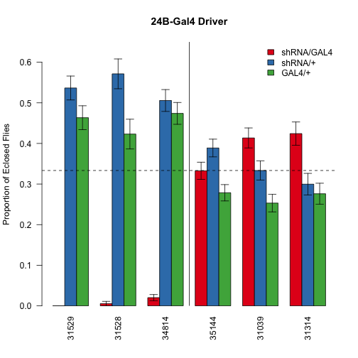
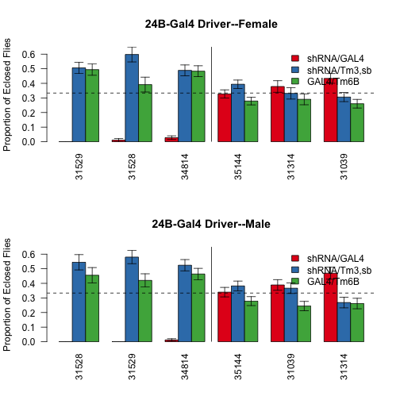
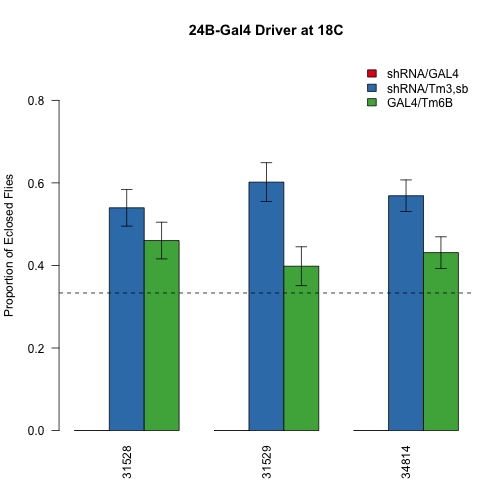
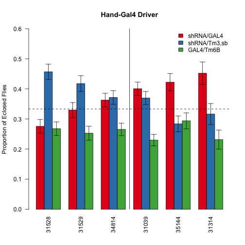
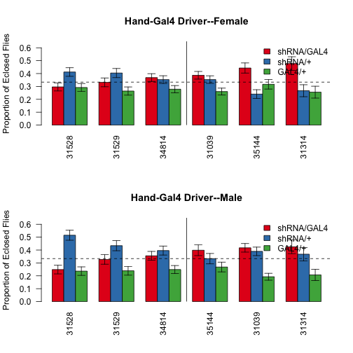

Analysis of Birth Ratios
==========================

Experimental Design
--------------------


These data are stored with the raw data saved in../Data/birth_worksheet.csv.  This script was most recently run on Mon Jun 23 11:36:17 2014.

Strain Summaries
------------------


So far this analysis includes 6488 flies from 18 crosses.  Statistics are based on a Chi Squared Test, and are  adjusted for multiple observation by the method of Benjamini and Hochberg.  These statistics exclude the genotypically WT (dual balancer chromosome) strains, which have significantly less progeny in nearly all cases (see Table below):

<!-- html table generated in R 3.1.0 by xtable 1.7-3 package -->
<!-- Mon Jun 23 11:36:17 2014 -->
<TABLE border=1>
<CAPTION ALIGN="bottom"> Summarized Data Including Double Balancer Strains.  The values are all significant because including the double balancer strain is sublethal in every case </CAPTION>
<TR> <TH>  </TH> <TH> pval </TH> <TH> padj </TH>  </TR>
  <TR> <TD align="right"> 31039/Tm6B x 24B-Gal4/Tm3-sb </TD> <TD align="right"> 0.000000 </TD> <TD align="right"> 0.000000 </TD> </TR>
  <TR> <TD align="right"> 31039/Tm6B x 24B-Gal4/Tm3-ser </TD> <TD align="right"> 0.003159 </TD> <TD align="right"> 0.003345 </TD> </TR>
  <TR> <TD align="right"> 31039/Tm6B x Hand-Gal4/Tm3-ser </TD> <TD align="right"> 0.000000 </TD> <TD align="right"> 0.000000 </TD> </TR>
  <TR> <TD align="right"> 31314/Tm6B x 24B-Gal4/Tm3-sb </TD> <TD align="right"> 0.000000 </TD> <TD align="right"> 0.000000 </TD> </TR>
  <TR> <TD align="right"> 31314/Tm6B x 24B-Gal4/Tm3-ser </TD> <TD align="right"> 0.006266 </TD> <TD align="right"> 0.006266 </TD> </TR>
  <TR> <TD align="right"> 31314/Tm6B x Hand-Gal4/Tm3-ser </TD> <TD align="right"> 0.000000 </TD> <TD align="right"> 0.000000 </TD> </TR>
  <TR> <TD align="right"> 31528/Tm6B x 24B-Gal4/Tm3-sb </TD> <TD align="right"> 0.000000 </TD> <TD align="right"> 0.000000 </TD> </TR>
  <TR> <TD align="right"> 31528/Tm6B x 24B-Gal4/Tm3-ser </TD> <TD align="right"> 0.000000 </TD> <TD align="right"> 0.000000 </TD> </TR>
  <TR> <TD align="right"> 31528/Tm6B x Hand-Gal4/Tm3-ser </TD> <TD align="right"> 0.000000 </TD> <TD align="right"> 0.000000 </TD> </TR>
  <TR> <TD align="right"> 31529/Tm6B x 24B-Gal4/Tm3-sb </TD> <TD align="right"> 0.000000 </TD> <TD align="right"> 0.000000 </TD> </TR>
  <TR> <TD align="right"> 31529/Tm6B x 24B-Gal4/Tm3-ser </TD> <TD align="right"> 0.000000 </TD> <TD align="right"> 0.000000 </TD> </TR>
  <TR> <TD align="right"> 31529/Tm6B x Hand-Gal4/Tm3-ser </TD> <TD align="right"> 0.000001 </TD> <TD align="right"> 0.000002 </TD> </TR>
  <TR> <TD align="right"> 34814/Tm6B x 24B-Gal4/Tm3-sb </TD> <TD align="right"> 0.000000 </TD> <TD align="right"> 0.000000 </TD> </TR>
  <TR> <TD align="right"> 34814/Tm6B x 24B-Gal4/Tm3-ser </TD> <TD align="right"> 0.000000 </TD> <TD align="right"> 0.000000 </TD> </TR>
  <TR> <TD align="right"> 34814/Tm6B x Hand-Gal4/Tm3-ser </TD> <TD align="right"> 0.000141 </TD> <TD align="right"> 0.000170 </TD> </TR>
  <TR> <TD align="right"> 35144/Tm6B x 24B-Gal4/Tm3-sb </TD> <TD align="right"> 0.000353 </TD> <TD align="right"> 0.000397 </TD> </TR>
  <TR> <TD align="right"> 35144/Tm6B x 24B-Gal4/Tm3-ser </TD> <TD align="right"> 0.000002 </TD> <TD align="right"> 0.000003 </TD> </TR>
  <TR> <TD align="right"> 35144/Tm6B x Hand-Gal4/Tm3-ser </TD> <TD align="right"> 0.000000 </TD> <TD align="right"> 0.000000 </TD> </TR>
   <A NAME=tab:all_progeny_data></A>
</TABLE>

After excluding the double balancer strains from the analysis, counts and p-values are shown in the table and figures below for all genes:

<!-- html table generated in R 3.1.0 by xtable 1.7-3 package -->
<!-- Mon Jun 23 11:36:17 2014 -->
<TABLE border=1>
<CAPTION ALIGN="bottom"> Gene Level Summarised Data </CAPTION>
<TR> <TH> Driver </TH> <TH> Gene </TH> <TH> KD </TH> <TH> shRNA </TH> <TH> GAL4 </TH> <TH> WT </TH> <TH> Total </TH> <TH> pval </TH> <TH> padj </TH>  </TR>
  <TR> <TD> 24B-Gal4 </TD> <TD> Raptor </TD> <TD align="right"> 8 </TD> <TD align="right"> 433 </TD> <TD align="right"> 374 </TD> <TD align="right"> 188 </TD> <TD align="right"> 1003 </TD> <TD align="right"> 0.00000000 </TD> <TD align="right"> 0.00000000 </TD> </TR>
  <TR> <TD> 24B-Gal4 </TD> <TD> Tsc1 </TD> <TD align="right"> 457 </TD> <TD align="right"> 416 </TD> <TD align="right"> 322 </TD> <TD align="right"> 168 </TD> <TD align="right"> 1363 </TD> <TD align="right"> 0.00000599 </TD> <TD align="right"> 0.00000599 </TD> </TR>
  <TR> <TD> Hand-Gal4 </TD> <TD> Raptor </TD> <TD align="right"> 385 </TD> <TD align="right"> 489 </TD> <TD align="right"> 311 </TD> <TD align="right"> 244 </TD> <TD align="right"> 1429 </TD> <TD align="right"> 0.00000000 </TD> <TD align="right"> 0.00000000 </TD> </TR>
  <TR> <TD> Hand-Gal4 </TD> <TD> Tsc1 </TD> <TD align="right"> 400 </TD> <TD align="right"> 320 </TD> <TD align="right"> 240 </TD> <TD align="right"> 102 </TD> <TD align="right"> 1062 </TD> <TD align="right"> 0.00000000 </TD> <TD align="right"> 0.00000000 </TD> </TR>
   <A NAME=tab:gene_summarised_data></A>
</TABLE>

And summarized at the level of the shRNA clone

<!-- html table generated in R 3.1.0 by xtable 1.7-3 package -->
<!-- Mon Jun 23 11:36:17 2014 -->
<TABLE border=1>
<CAPTION ALIGN="bottom"> Driver Level Summarised Data </CAPTION>
<TR> <TH> Driver </TH> <TH> UAS </TH> <TH> KD </TH> <TH> shRNA </TH> <TH> GAL4 </TH> <TH> WT </TH> <TH> Total </TH> <TH> pval </TH> <TH> padj </TH>  </TR>
  <TR> <TD> 24B-Gal4 </TD> <TD align="right"> 31039 </TD> <TD align="right"> 165 </TD> <TD align="right"> 133 </TD> <TD align="right"> 101 </TD> <TD align="right"> 47 </TD> <TD align="right"> 446 </TD> <TD align="right"> 0.00045 </TD> <TD align="right"> 0.00091 </TD> </TR>
  <TR> <TD> 24B-Gal4 </TD> <TD align="right"> 31314 </TD> <TD align="right"> 126 </TD> <TD align="right"> 89 </TD> <TD align="right"> 82 </TD> <TD align="right"> 36 </TD> <TD align="right"> 333 </TD> <TD align="right"> 0.00353 </TD> <TD align="right"> 0.00471 </TD> </TR>
  <TR> <TD> 24B-Gal4 </TD> <TD align="right"> 31528 </TD> <TD align="right"> 1 </TD> <TD align="right"> 104 </TD> <TD align="right"> 77 </TD> <TD align="right"> 48 </TD> <TD align="right"> 230 </TD> <TD align="right"> 0.00000 </TD> <TD align="right"> 0.00000 </TD> </TR>
  <TR> <TD> 24B-Gal4 </TD> <TD align="right"> 31529 </TD> <TD align="right"> 0 </TD> <TD align="right"> 154 </TD> <TD align="right"> 133 </TD> <TD align="right"> 55 </TD> <TD align="right"> 342 </TD> <TD align="right"> 0.00000 </TD> <TD align="right"> 0.00000 </TD> </TR>
  <TR> <TD> 24B-Gal4 </TD> <TD align="right"> 34814 </TD> <TD align="right"> 7 </TD> <TD align="right"> 175 </TD> <TD align="right"> 164 </TD> <TD align="right"> 85 </TD> <TD align="right"> 431 </TD> <TD align="right"> 0.00000 </TD> <TD align="right"> 0.00000 </TD> </TR>
  <TR> <TD> 24B-Gal4 </TD> <TD align="right"> 35144 </TD> <TD align="right"> 166 </TD> <TD align="right"> 194 </TD> <TD align="right"> 139 </TD> <TD align="right"> 85 </TD> <TD align="right"> 584 </TD> <TD align="right"> 0.01060 </TD> <TD align="right"> 0.01060 </TD> </TR>
  <TR> <TD> Hand-Gal4 </TD> <TD align="right"> 31039 </TD> <TD align="right"> 195 </TD> <TD align="right"> 180 </TD> <TD align="right"> 112 </TD> <TD align="right"> 44 </TD> <TD align="right"> 531 </TD> <TD align="right"> 0.00001 </TD> <TD align="right"> 0.00001 </TD> </TR>
  <TR> <TD> Hand-Gal4 </TD> <TD align="right"> 31314 </TD> <TD align="right"> 80 </TD> <TD align="right"> 56 </TD> <TD align="right"> 41 </TD> <TD align="right"> 19 </TD> <TD align="right"> 196 </TD> <TD align="right"> 0.00142 </TD> <TD align="right"> 0.00213 </TD> </TR>
  <TR> <TD> Hand-Gal4 </TD> <TD align="right"> 31528 </TD> <TD align="right"> 105 </TD> <TD align="right"> 174 </TD> <TD align="right"> 102 </TD> <TD align="right"> 65 </TD> <TD align="right"> 446 </TD> <TD align="right"> 0.00000 </TD> <TD align="right"> 0.00001 </TD> </TR>
  <TR> <TD> Hand-Gal4 </TD> <TD align="right"> 31529 </TD> <TD align="right"> 116 </TD> <TD align="right"> 147 </TD> <TD align="right"> 89 </TD> <TD align="right"> 72 </TD> <TD align="right"> 424 </TD> <TD align="right"> 0.00076 </TD> <TD align="right"> 0.00131 </TD> </TR>
  <TR> <TD> Hand-Gal4 </TD> <TD align="right"> 34814 </TD> <TD align="right"> 164 </TD> <TD align="right"> 168 </TD> <TD align="right"> 120 </TD> <TD align="right"> 107 </TD> <TD align="right"> 559 </TD> <TD align="right"> 0.00902 </TD> <TD align="right"> 0.00984 </TD> </TR>
  <TR> <TD> Hand-Gal4 </TD> <TD align="right"> 35144 </TD> <TD align="right"> 125 </TD> <TD align="right"> 84 </TD> <TD align="right"> 87 </TD> <TD align="right"> 39 </TD> <TD align="right"> 335 </TD> <TD align="right"> 0.00502 </TD> <TD align="right"> 0.00603 </TD> </TR>
   <A NAME=tab:driver_summarised_data></A>
</TABLE>

## 24B-GAL4 Mediated Knockdown

We observed nearly no flies born from this cross, either from males or females.

 

 

### Effects of 18C
Since we observed few births at 24C, we repeated several crosses at 18C using the TSC shRNA lines.  These data are summarised in Table and Figure below:

<!-- html table generated in R 3.1.0 by xtable 1.7-3 package -->
<!-- Mon Jun 23 11:36:18 2014 -->
<TABLE border=1>
<CAPTION ALIGN="bottom"> Driver Level Summarized Data for 18C Crosses </CAPTION>
<TR> <TH> Driver </TH> <TH> UAS </TH> <TH> KD </TH> <TH> shRNA </TH> <TH> GAL4 </TH> <TH> WT </TH> <TH> Total </TH> <TH> pval </TH> <TH> padj </TH>  </TR>
  <TR> <TD> 24B-Gal4 </TD> <TD align="right"> 31528 </TD> <TD align="right"> 0 </TD> <TD align="right"> 68 </TD> <TD align="right"> 58 </TD> <TD align="right"> 51 </TD> <TD align="right"> 177 </TD> <TD align="right"> 0.0000000 </TD> <TD align="right"> 0.0000000 </TD> </TR>
  <TR> <TD> 24B-Gal4 </TD> <TD align="right"> 31529 </TD> <TD align="right"> 0 </TD> <TD align="right"> 65 </TD> <TD align="right"> 43 </TD> <TD align="right"> 31 </TD> <TD align="right"> 139 </TD> <TD align="right"> 0.0000000 </TD> <TD align="right"> 0.0000000 </TD> </TR>
  <TR> <TD> 24B-Gal4 </TD> <TD align="right"> 34814 </TD> <TD align="right"> 0 </TD> <TD align="right"> 95 </TD> <TD align="right"> 72 </TD> <TD align="right"> 61 </TD> <TD align="right"> 228 </TD> <TD align="right"> 0.0000000 </TD> <TD align="right"> 0.0000000 </TD> </TR>
   <A NAME=tab:18c-data></A>
</TABLE>

 

## Hand-GAL4 Mediated Knockdown

Hand-GAL4 no obvious deficiencies in the number of flies born:

 

And separated out by gender:

 


## C179 Driven Knockdown

There was also complete lethality observed for C179 driven knockdowns.  Below is the data shown at the shRNA and shRNA/gendered levels

<!-- html table generated in R 3.1.0 by xtable 1.7-3 package -->
<!-- Mon Jun 23 11:36:18 2014 -->
<TABLE border=1>
<CAPTION ALIGN="bottom"> Driver Level Summarized Data for C179-Gal4 Crosses </CAPTION>
<TR> <TH> Driver </TH> <TH> UAS </TH> <TH> KD </TH> <TH> shRNA </TH> <TH> GAL4 </TH> <TH> WT </TH> <TH> Total </TH> <TH> pval </TH> <TH> padj </TH>  </TR>
  <TR> <TD> C179-Gal4 </TD> <TD align="right"> 31528 </TD> <TD align="right"> 122 </TD> <TD align="right"> 0 </TD> <TD align="right"> 176 </TD> <TD align="right"> 0 </TD> <TD align="right"> 298 </TD> <TD align="right"> 0.002 </TD> <TD align="right"> 0.002 </TD> </TR>
  <TR> <TD> C179-Gal4 </TD> <TD align="right"> 31529 </TD> <TD align="right"> 109 </TD> <TD align="right"> 0 </TD> <TD align="right"> 225 </TD> <TD align="right"> 0 </TD> <TD align="right"> 334 </TD> <TD align="right"> 0.000 </TD> <TD align="right"> 0.000 </TD> </TR>
  <TR> <TD> C179-Gal4 </TD> <TD align="right"> 34814 </TD> <TD align="right"> 104 </TD> <TD align="right"> 0 </TD> <TD align="right"> 351 </TD> <TD align="right"> 0 </TD> <TD align="right"> 455 </TD> <TD align="right"> 0.000 </TD> <TD align="right"> 0.000 </TD> </TR>
   <A NAME=tab:179-all></A>
</TABLE>
<!-- html table generated in R 3.1.0 by xtable 1.7-3 package -->
<!-- Mon Jun 23 11:36:18 2014 -->
<TABLE border=1>
<CAPTION ALIGN="bottom"> Driver Level, Gender Separated Summarized Data for C179-Gal4 Crosses </CAPTION>
<TR> <TH> UAS </TH> <TH> Driver </TH> <TH> Gender </TH> <TH> KD </TH> <TH> shRNA </TH> <TH> GAL4 </TH> <TH> WT </TH> <TH> Total </TH> <TH> pval </TH> <TH> padj </TH>  </TR>
  <TR> <TD align="right"> 31528 </TD> <TD> C179-Gal4 </TD> <TD> Female </TD> <TD align="right"> 69 </TD> <TD align="right"> 0 </TD> <TD align="right"> 94 </TD> <TD align="right"> 0 </TD> <TD align="right"> 163 </TD> <TD align="right"> 0.0502 </TD> <TD align="right"> 0.0502 </TD> </TR>
  <TR> <TD align="right"> 31528 </TD> <TD> C179-Gal4 </TD> <TD> Male </TD> <TD align="right"> 53 </TD> <TD align="right"> 0 </TD> <TD align="right"> 82 </TD> <TD align="right"> 0 </TD> <TD align="right"> 135 </TD> <TD align="right"> 0.0126 </TD> <TD align="right"> 0.0188 </TD> </TR>
  <TR> <TD align="right"> 31529 </TD> <TD> C179-Gal4 </TD> <TD> Female </TD> <TD align="right"> 90 </TD> <TD align="right"> 0 </TD> <TD align="right"> 123 </TD> <TD align="right"> 0 </TD> <TD align="right"> 213 </TD> <TD align="right"> 0.0238 </TD> <TD align="right"> 0.0285 </TD> </TR>
  <TR> <TD align="right"> 31529 </TD> <TD> C179-Gal4 </TD> <TD> Male </TD> <TD align="right"> 19 </TD> <TD align="right"> 0 </TD> <TD align="right"> 102 </TD> <TD align="right"> 0 </TD> <TD align="right"> 121 </TD> <TD align="right"> 0.0000 </TD> <TD align="right"> 0.0000 </TD> </TR>
  <TR> <TD align="right"> 34814 </TD> <TD> C179-Gal4 </TD> <TD> Female </TD> <TD align="right"> 52 </TD> <TD align="right"> 0 </TD> <TD align="right"> 168 </TD> <TD align="right"> 0 </TD> <TD align="right"> 220 </TD> <TD align="right"> 0.0000 </TD> <TD align="right"> 0.0000 </TD> </TR>
  <TR> <TD align="right"> 34814 </TD> <TD> C179-Gal4 </TD> <TD> Male </TD> <TD align="right"> 52 </TD> <TD align="right"> 0 </TD> <TD align="right"> 183 </TD> <TD align="right"> 0 </TD> <TD align="right"> 235 </TD> <TD align="right"> 0.0000 </TD> <TD align="right"> 0.0000 </TD> </TR>
   <A NAME=tab:179-gendered></A>
</TABLE>

 

The differences in lethality between genders was only present for clone 31529.  The p-value for this was 4.7741 &times; 10<sup>-7</sup>.  This is shown below:


```
## Loading required package: reshape2
```

 

`
## General Traits

### Fecundity over time

 

To test how many generations we can get out of 10 female flies in a vial, we examined the number of births in a vial, vs the generation of that vial.  These data are in the figure above.  There is no detectable decrease in fecundity over time (p=0.5234).

### Gender Differences

On the other hand, there was a significant difference between the number of Male flies born vs the number of Female flies born (p=7.6526 &times; 10<sup>-4</sup>).  This is visulized in the figure below:

 
     

## Session Information

```
## R version 3.1.0 (2014-04-10)
## Platform: x86_64-apple-darwin13.1.0 (64-bit)
## 
## locale:
## [1] en_US.UTF-8/en_US.UTF-8/en_US.UTF-8/C/en_US.UTF-8/en_US.UTF-8
## 
## attached base packages:
## [1] stats     graphics  grDevices utils     datasets  methods   base     
## 
## other attached packages:
## [1] reshape2_1.4       RColorBrewer_1.0-5 xtable_1.7-3      
## [4] plyr_1.8.1         knitr_1.6         
## 
## loaded via a namespace (and not attached):
## [1] evaluate_0.5.5 formatR_0.10   Rcpp_0.11.2    stringr_0.6.2 
## [5] tools_3.1.0
```
