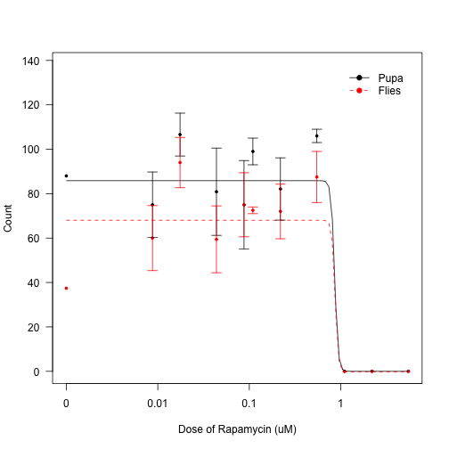

Analysis of Rapamycin Dose Response Experiments
================================================
Data Entry
-----------

These data are stored in /Users/davebridges/Documents/Source/DrosophilaMuscleFunction/Births and the script was most recently run on Mon Jun 23 09:00:05 2014. 


This uses the input file dose-response.csv.

Total Flies and Pupae
----------------------


<!-- html table generated in R 3.1.0 by xtable 1.7-3 package -->
<!-- Mon Jun 23 09:00:07 2014 -->
<TABLE border=1>
<CAPTION ALIGN="bottom"> EC50 Estimates </CAPTION>
<TR> <TH>  </TH> <TH> Estimate </TH> <TH> Std. Error </TH> <TH> t-value </TH> <TH> p-value </TH>  </TR>
  <TR> <TD align="right"> b:Pupa </TD> <TD align="right"> 23.266 </TD> <TD align="right"> 215.929 </TD> <TD align="right"> 0.108 </TD> <TD align="right"> 0.914 </TD> </TR>
  <TR> <TD align="right"> b:Flies </TD> <TD align="right"> 25.641 </TD> <TD align="right"> 677.128 </TD> <TD align="right"> 0.038 </TD> <TD align="right"> 0.970 </TD> </TR>
  <TR> <TD align="right"> c:Pupa </TD> <TD align="right"> 0.012 </TD> <TD align="right"> 23.000 </TD> <TD align="right"> 0.001 </TD> <TD align="right"> 1.000 </TD> </TR>
  <TR> <TD align="right"> c:Flies </TD> <TD align="right"> -0.251 </TD> <TD align="right"> 30.712 </TD> <TD align="right"> -0.008 </TD> <TD align="right"> 0.993 </TD> </TR>
  <TR> <TD align="right"> d:Pupa </TD> <TD align="right"> 85.854 </TD> <TD align="right"> 5.694 </TD> <TD align="right"> 15.077 </TD> <TD align="right"> 0.000 </TD> </TR>
  <TR> <TD align="right"> d:Flies </TD> <TD align="right"> 68.000 </TD> <TD align="right"> 5.694 </TD> <TD align="right"> 11.942 </TD> <TD align="right"> 0.000 </TD> </TR>
  <TR> <TD align="right"> e:Pupa </TD> <TD align="right"> 0.857 </TD> <TD align="right"> 2.736 </TD> <TD align="right"> 0.313 </TD> <TD align="right"> 0.755 </TD> </TR>
  <TR> <TD align="right"> e:Flies </TD> <TD align="right"> 0.866 </TD> <TD align="right"> 9.430 </TD> <TD align="right"> 0.092 </TD> <TD align="right"> 0.927 </TD> </TR>
   <A NAME=tab:ed50-summary></A>
</TABLE>


We fitted this data to a 4-parameter log-logistic model for both the number of pupae and flies born.  The b parameter is the EC50 for this model.
We tested this model's validity by checking for the normality of redisuals with a shapiro test.  According to this the model assumptions were **not** met (p=9.9715 &times; 10<sup>-5</sup>).

 

Dead Pupa
----------

 

 

Larvae
-------

 


Session Information
---------------------


```
## R version 3.1.0 (2014-04-10)
## Platform: x86_64-apple-darwin13.1.0 (64-bit)
## 
## locale:
## [1] en_US.UTF-8/en_US.UTF-8/en_US.UTF-8/C/en_US.UTF-8/en_US.UTF-8
## 
## attached base packages:
## [1] stats     graphics  grDevices utils     datasets  methods   base     
## 
## other attached packages:
##  [1] xtable_1.7-3  reshape2_1.4  drc_2.3-96    plotrix_3.5-7 magic_1.5-6  
##  [6] abind_1.4-0   MASS_7.3-33   gtools_3.4.1  car_2.0-20    plyr_1.8.1   
## [11] knitr_1.6    
## 
## loaded via a namespace (and not attached):
## [1] evaluate_0.5.5 formatR_0.10   nnet_7.3-8     Rcpp_0.11.2   
## [5] stringr_0.6.2  tools_3.1.0
```
