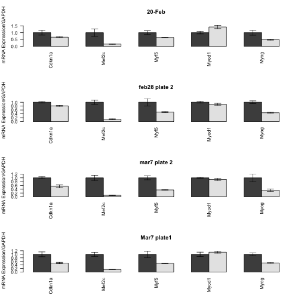
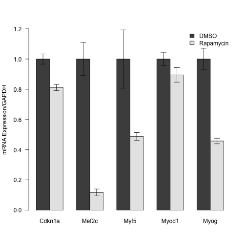

Effect of Rapamycin on Expression of Differentiation Markers
==============================================================


This uses the input file qRT-PCR combined data.csv.  This is located in /Users/davebridges/Documents/Source/DrosophilaMuscleFunction/CellCulture.  It was most recently run on Sat May 17 07:12:02 2014.

Omnibums ANOVA, All Experiments Combined
------------------------------------------

First we did an ANOVA looking at all of the genes, treatments and experiments together.  These results are shown below:


```
##                     Df Sum Sq Mean Sq F value  Pr(>F)    
## gene                 5  18.38    3.68   39.43 < 2e-16 ***
## treatment            3   2.69    0.90    9.61 1.2e-05 ***
## Exp                  4   1.72    0.43    4.62 0.00179 ** 
## gene:treatment      13  15.70    1.21   12.96 < 2e-16 ***
## gene:Exp            18   2.56    0.14    1.52 0.09658 .  
## treatment:Exp        4   2.04    0.51    5.47 0.00049 ***
## gene:treatment:Exp  16   1.97    0.12    1.32 0.19991    
## Residuals          104   9.70    0.09                    
## ---
## Signif. codes:  0 '***' 0.001 '**' 0.01 '*' 0.05 '.' 0.1 ' ' 1
```


Since we saw an interaction between the experiment and gene and treatment terms we separated out the experiments and did 2-way ANOVA analyses on each.  These results are below:


Testing ANOVA Assumptions
----------------------------

We next tested our ANOVA analyses for normality and equal variance by first looking at a Shapiro-Wilk test and then potentially a log-transformed Shapiro-Wilk test, followed by a Levene's Test.  Based on these results we did Student's T-Tests for each gene

### Feb 28 Experiment


```r
# test that the data are normally distributed run shapiro
shapiro.test(residuals(aov(value ~ gene * treatment, data = subset(data.of.interest, 
    Exp == "feb28 plate 2"))))
```

```
## 
## 	Shapiro-Wilk normality test
## 
## data:  residuals(aov(value ~ gene * treatment, data = subset(data.of.interest,     Exp == "feb28 plate 2")))
## W = 0.8009, p-value = 1.699e-05
```

```r
print("log transformed")
```

```
## [1] "log transformed"
```

```r
shapiro.test(residuals(aov(log(value) ~ gene * treatment, data = subset(data.of.interest, 
    Exp == "feb28 plate 2"))))
```

```
## 
## 	Shapiro-Wilk normality test
## 
## data:  residuals(aov(log(value) ~ gene * treatment, data = subset(data.of.interest,     Exp == "feb28 plate 2")))
## W = 0.9764, p-value = 0.6229
```

```r
# run levene's test for equal variance
library(car)
leveneTest(log(value) ~ gene * treatment, data = subset(data.of.interest, Exp == 
    "feb28 plate 2"))
```

```
## Levene's Test for Homogeneity of Variance (center = median)
##       Df F value Pr(>F)
## group 11    0.59   0.81
##       24
```

```r
# so the assumptions for this model are OK
print("ANOVA")
```

```
## [1] "ANOVA"
```

```r
summary(aov(log(value) ~ gene * treatment, data = subset(data.of.interest, Exp == 
    "feb28 plate 2")))
```

```
##                Df Sum Sq Mean Sq F value  Pr(>F)    
## gene            5   7.43   1.485    36.3 2.0e-10 ***
## treatment       1   2.44   2.445    59.8 5.7e-08 ***
## gene:treatment  5   7.40   1.481    36.2 2.0e-10 ***
## Residuals      24   0.98   0.041                    
## ---
## Signif. codes:  0 '***' 0.001 '**' 0.01 '*' 0.05 '.' 0.1 ' ' 1
```

```r

# pos hoc testing for this model
print("post hoc T-test")
```

```
## [1] "post hoc T-test"
```

```r
feb28.t.tests <- data.frame(row.names = levels(data.of.interest$gene))
for (test.gene in levels(data.of.interest$gene)) {
    feb28.t.tests[test.gene, "pval"] <- t.test(log(value) ~ treatment, data = subset(data.of.interest, 
        Exp == "feb28 plate 2" & gene == test.gene), var.equal = T)$p.value
}
feb28.t.tests
```

```
##             pval
## Actb   0.0220569
## Cdkn1a 0.0072971
## Mef2c  0.0009336
## Myf5   0.0223319
## Myod1  0.1805853
## Myog   0.0007129
```


### March 7 Plate 2 Experiment


```r
shapiro.test(residuals(aov(value ~ gene * treatment, data = subset(data.of.interest, 
    Exp == "mar7 plate 2"))))
```

```
## 
## 	Shapiro-Wilk normality test
## 
## data:  residuals(aov(value ~ gene * treatment, data = subset(data.of.interest,     Exp == "mar7 plate 2")))
## W = 0.9278, p-value = 0.0215
```

```r
print("log tansformed")
```

```
## [1] "log tansformed"
```

```r
shapiro.test(residuals(aov(log(value) ~ gene * treatment, data = subset(data.of.interest, 
    Exp == "mar7 plate 2"))))
```

```
## 
## 	Shapiro-Wilk normality test
## 
## data:  residuals(aov(log(value) ~ gene * treatment, data = subset(data.of.interest,     Exp == "mar7 plate 2")))
## W = 0.9761, p-value = 0.6135
```

```r
leveneTest(log(value) ~ gene * treatment, data = subset(data.of.interest, Exp == 
    "mar7 plate 2"))
```

```
## Levene's Test for Homogeneity of Variance (center = median)
##       Df F value Pr(>F)
## group 11    0.73    0.7
##       24
```

```r
# assumptions for this model are OK
print("ANOVA")
```

```
## [1] "ANOVA"
```

```r
summary(aov(log(value) ~ gene * treatment, data = subset(data.of.interest, Exp == 
    "mar7 plate 2")))
```

```
##                Df Sum Sq Mean Sq F value  Pr(>F)    
## gene            5   9.16    1.83    41.0 5.4e-11 ***
## treatment       1   5.50    5.50   123.1 6.2e-11 ***
## gene:treatment  5   8.88    1.78    39.8 7.5e-11 ***
## Residuals      24   1.07    0.04                    
## ---
## Signif. codes:  0 '***' 0.001 '**' 0.01 '*' 0.05 '.' 0.1 ' ' 1
```

```r

# post hoc testing for this model
print("post hoc T-test")
```

```
## [1] "post hoc T-test"
```

```r
mar7.2.t.tests <- data.frame(row.names = levels(data.of.interest$gene))
for (test.gene in levels(data.of.interest$gene)) {
    mar7.2.t.tests[test.gene, "pval"] <- t.test(log(value) ~ treatment, data = subset(data.of.interest, 
        Exp == "mar7 plate 2" & gene == test.gene), var.equal = T)$p.value
}
mar7.2.t.tests
```

```
##             pval
## Actb   0.0077264
## Cdkn1a 0.0119573
## Mef2c  0.0003567
## Myf5   0.0006424
## Myod1  0.2006888
## Myog   0.0194950
```


### March 7 Plate 1 Experiment

```r
shapiro.test(residuals(aov(value ~ gene * treatment, data = subset(data.of.interest, 
    Exp == "Mar7 plate1"))))
```

```
## 
## 	Shapiro-Wilk normality test
## 
## data:  residuals(aov(value ~ gene * treatment, data = subset(data.of.interest,     Exp == "Mar7 plate1")))
## W = 0.9762, p-value = 0.6176
```

```r
print("no need for log transform")
```

```
## [1] "no need for log transform"
```

```r
leveneTest(value ~ gene * treatment, data = subset(data.of.interest, Exp == 
    "Mar7 plate1"))
```

```
## Levene's Test for Homogeneity of Variance (center = median)
##       Df F value Pr(>F)
## group 11    0.78   0.66
##       24
```

```r
# assumptions for this model are OK (no log transform needed)
print("ANOVA")
```

```
## [1] "ANOVA"
```

```r
summary(aov(value ~ gene * treatment, data = subset(data.of.interest, Exp == 
    "Mar7 plate1")))
```

```
##                Df Sum Sq Mean Sq F value  Pr(>F)    
## gene            5  2.450   0.490    18.9 1.3e-07 ***
## treatment       1  0.568   0.568    21.9 9.4e-05 ***
## gene:treatment  5  2.450   0.490    18.9 1.3e-07 ***
## Residuals      24  0.622   0.026                    
## ---
## Signif. codes:  0 '***' 0.001 '**' 0.01 '*' 0.05 '.' 0.1 ' ' 1
```

```r
# post hoc testing for this model
print("post hoc T-test")
```

```
## [1] "post hoc T-test"
```

```r
mar7.1.t.tests <- data.frame(row.names = levels(data.of.interest$gene))
for (test.gene in levels(data.of.interest$gene)) {
    mar7.1.t.tests[test.gene, "pval"] <- t.test(value ~ treatment, data = subset(data.of.interest, 
        Exp == "Mar7 plate1" & gene == test.gene), var.equal = T)$p.value
}
mar7.1.t.tests
```

```
##            pval
## Actb   0.003494
## Cdkn1a 0.024728
## Mef2c  0.001769
## Myf5   0.048016
## Myod1  0.418955
## Myog   0.004333
```


### Feb20 Experiments

```r
shapiro.test(residuals(aov(value ~ gene * treatment, data = subset(data.of.interest, 
    Exp == "20-Feb"))))
```

```
## 
## 	Shapiro-Wilk normality test
## 
## data:  residuals(aov(value ~ gene * treatment, data = subset(data.of.interest,     Exp == "20-Feb")))
## W = 0.7907, p-value = 1.071e-05
```

```r
print("log transformed")
```

```
## [1] "log transformed"
```

```r
shapiro.test(residuals(aov(log(value) ~ gene * treatment, data = subset(data.of.interest, 
    Exp == "20-Feb"))))
```

```
## 
## 	Shapiro-Wilk normality test
## 
## data:  residuals(aov(log(value) ~ gene * treatment, data = subset(data.of.interest,     Exp == "20-Feb")))
## W = 0.9749, p-value = 0.5724
```

```r
leveneTest(log(value) ~ gene * treatment, data = subset(data.of.interest, Exp == 
    "20-Feb"))
```

```
## Levene's Test for Homogeneity of Variance (center = median)
##       Df F value Pr(>F)
## group 11    0.64   0.77
##       24
```

```r
# assumptions for this model are OK
print("ANOVA")
```

```
## [1] "ANOVA"
```

```r
summary(aov(log(value) ~ gene * treatment, data = subset(data.of.interest, Exp == 
    "20-Feb")))
```

```
##                Df Sum Sq Mean Sq F value  Pr(>F)    
## gene            5   7.01   1.403    16.9 3.4e-07 ***
## treatment       1   0.84   0.840    10.2   0.004 ** 
## gene:treatment  5   6.75   1.349    16.3 4.9e-07 ***
## Residuals      24   1.99   0.083                    
## ---
## Signif. codes:  0 '***' 0.001 '**' 0.01 '*' 0.05 '.' 0.1 ' ' 1
```

```r

# pos hoc testing for this model
print("post hoc T-test")
```

```
## [1] "post hoc T-test"
```

```r
feb20.t.tests <- data.frame(row.names = levels(data.of.interest$gene))
for (test.gene in levels(data.of.interest$gene)) {
    feb20.t.tests[test.gene, "pval"] <- t.test(log(value) ~ treatment, data = subset(data.of.interest, 
        Exp == "20-Feb" & gene == test.gene), var.equal = T)$p.value
}
feb20.t.tests
```

```
##            pval
## Actb   0.047362
## Cdkn1a 0.098430
## Mef2c  0.004045
## Myf5   0.035141
## Myod1  0.044238
## Myog   0.031918
```


### Dose Response Experiment

```r
print("dose response ")
```

```
## [1] "dose response "
```

```r
shapiro.test(residuals(aov(value ~ gene * treatment, data = subset(data.of.interest, 
    Exp == "dose response "))))
```

```
## 
## 	Shapiro-Wilk normality test
## 
## data:  residuals(aov(value ~ gene * treatment, data = subset(data.of.interest,     Exp == "dose response ")))
## W = 0.7866, p-value = 0.0001792
```

```r
print("log transformed")
```

```
## [1] "log transformed"
```

```r
shapiro.test(residuals(aov(log(value) ~ gene * treatment, data = subset(data.of.interest, 
    Exp == "dose response "))))
```

```
## 
## 	Shapiro-Wilk normality test
## 
## data:  residuals(aov(log(value) ~ gene * treatment, data = subset(data.of.interest,     Exp == "dose response ")))
## W = 0.9458, p-value = 0.2191
```

```r
leveneTest(log(value) ~ gene * treatment, data = subset(data.of.interest, Exp == 
    "dose response "))
```

```
## Warning: ANOVA F-tests on an essentially perfect fit are unreliable
```

```
## Levene's Test for Homogeneity of Variance (center = median)
##       Df  F value Pr(>F)    
## group 15 3.12e+30 <2e-16 ***
##        8                    
## ---
## Signif. codes:  0 '***' 0.001 '**' 0.01 '*' 0.05 '.' 0.1 ' ' 1
```


Since we did not meet the assumption for equal variance we had to run a Kruskal-Wallis test instead of a normal ANOVA. We were not able to run a T-test since there are 3 groups in this experiment


```r
# dose response need to do anova instead of t-test due to 3 different groups
dose.response.aov <- data.frame(row.names = levels(data.of.interest$gene))

kruskal.test(value ~ treatment, data = subset(data.of.interest, Exp == "dose response " & 
    gene == test.gene))$p.value
```

```
## [1] 0.3116
```

```r
for (test.gene in c("Actb", "Mef2c", "Myod1", "Myog")) {
    dose.response.aov[test.gene, "pval-low"] <- t.test(mu = 1, subset(data.of.interest, 
        Exp == "dose response " & gene == test.gene & treatment == "RAPA (low)")$value)$p.value
    dose.response.aov[test.gene, "pval-high"] <- t.test(mu = 1, subset(data.of.interest, 
        Exp == "dose response " & gene == test.gene & treatment == "RAPA (high)")$value)$p.value
}
dose.response.aov
```

```
##        pval-low pval-high
## Actb   0.133498  0.781207
## Cdkn1a       NA        NA
## Mef2c  0.006423  0.004777
## Myf5         NA        NA
## Myod1  0.030032  0.104139
## Myog   0.013727  0.034780
```


Summary Graphs
----------------


```
## Loading required package: reshape2
```

 


 


 


Session Information
--------------------


```r
sessionInfo()
```

```
## R version 3.1.0 (2014-04-10)
## Platform: x86_64-apple-darwin13.1.0 (64-bit)
## 
## locale:
## [1] en_US.UTF-8/en_US.UTF-8/en_US.UTF-8/C/en_US.UTF-8/en_US.UTF-8
## 
## attached base packages:
## [1] stats     graphics  grDevices utils     datasets  methods   base     
## 
## other attached packages:
## [1] reshape2_1.4 plyr_1.8.1   car_2.0-20   knitr_1.5   
## 
## loaded via a namespace (and not attached):
## [1] evaluate_0.5.5 formatR_0.10   MASS_7.3-33    nnet_7.3-8    
## [5] Rcpp_0.11.1    stringr_0.6.2  tools_3.1.0
```

