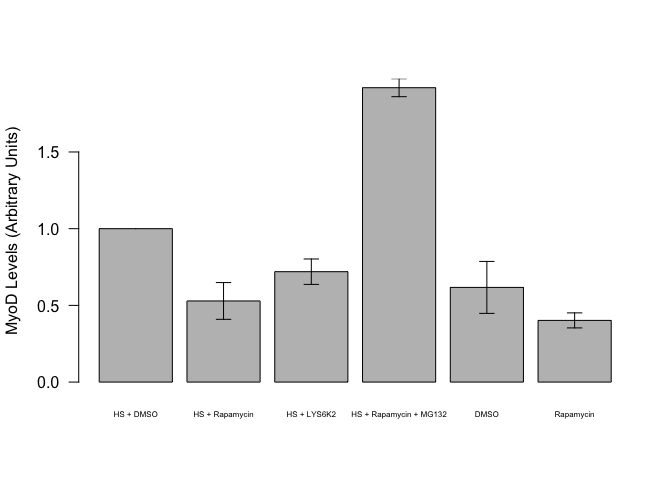
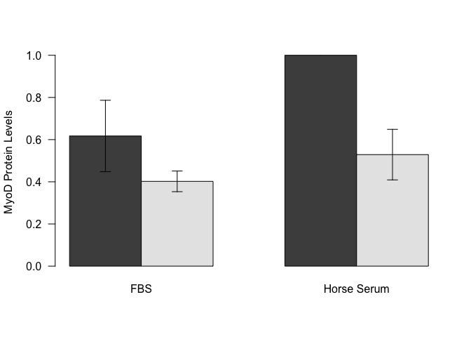
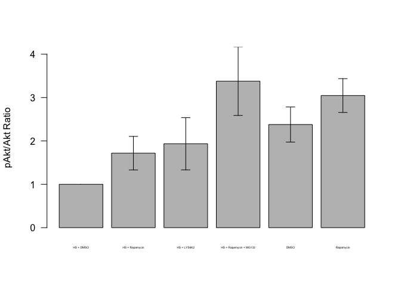
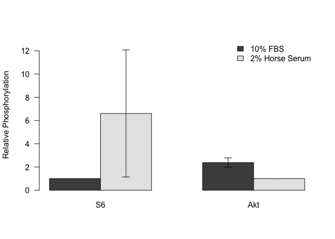
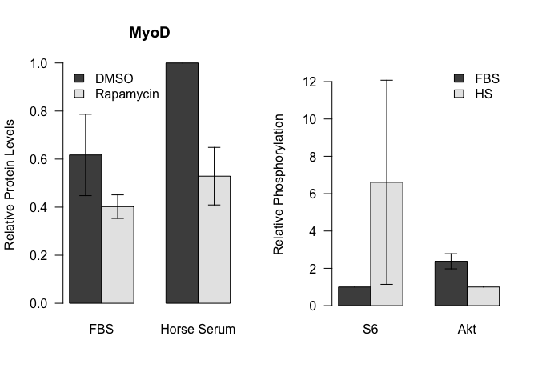

# Quantification of Effects of Rapamycin on MyoD Levels
Dave Bridges  
December 1, 2014  


C2C12 Cells were grown to confluence and then treated for 4h with 500 nM Rapamycin, 1 uM LYS6K2, or 10 uM MG132.  These data include experiments done on 2014-11-26 and 2014-11-29.  These data are located in /Users/davebridges/Documents/Source/DrosophilaMuscleFunction/CellCulture and was most recently updated on Thu Dec 18 10:47:47 2014.


The input files are: Akt Quantification.txt and MyoD Quantification.txt.

# MyoD Quantification

  

##Effects of Rapamycin

Based on these data, Rapamycin treatment reduced MyoD levels in the presence of Horse Serum by 47.1127978% +/- 11.9805243%.  These data were normally distributed based on a Shapiro-Wilk test (p=0.6773713).  The p-value by one-way *t*-test is 0.0146412.  

In the absence of horse serum, there was a 65.150222% reduction.  These data were normally distributed, via a Shapiro-Wilk test (p=0.9802959) and had equal variance based on Levene's test (p=0.4341229).  The p-value from the two-way Student's *t*-test of that comparason is 0.2063568.

##Effects of Horse Serum

The addition of horse serum caused an increase in MyoD levels of 1.6202356 fold (+/- 0.1693663 fold).  The one way *t*-test for this effect had a p-value of 0.0761335.

# pS6/S6 Quantification

 
The addition of horse serum caused an increase in S6 phosphorylation ratio of 6.6082765 fold (+/- 5.4673737 fold).  These data were normally distributed by a Shapiro-Wilk test (p=0.1311373).  The one way *t*-test for this effect had a p-value of 0.7935713.


# pAkt/Akt Quantification

 

The addition of horse serum caused an decrease phosphorylation ratio by 0.5795892 (+/- 0.4047908 fold).  These data were normally distributed based on a Shapiro-Wilk test (p=0.1311373).  The one way *t*-test for this effect had a p-value of 0.4128573.

## General Effects of Horse Serum

 

## Combined Figure

 

## Session Information

```
## R version 3.1.1 (2014-07-10)
## Platform: x86_64-apple-darwin13.1.0 (64-bit)
## 
## locale:
## [1] en_US.UTF-8/en_US.UTF-8/en_US.UTF-8/C/en_US.UTF-8/en_US.UTF-8
## 
## attached base packages:
## [1] stats     graphics  grDevices utils     datasets  methods   base     
## 
## other attached packages:
## [1] car_2.0-22     dplyr_0.3.0.2  reshape2_1.4.1 knitr_1.8     
## 
## loaded via a namespace (and not attached):
##  [1] assertthat_0.1   DBI_0.3.1        digest_0.6.5     evaluate_0.5.5  
##  [5] formatR_1.0      htmltools_0.2.6  lazyeval_0.1.9   magrittr_1.5    
##  [9] MASS_7.3-35      nnet_7.3-8       parallel_3.1.1   plyr_1.8.1      
## [13] Rcpp_0.11.3      rmarkdown_0.3.10 stringr_0.6.2    tools_3.1.1     
## [17] yaml_2.1.13
```
