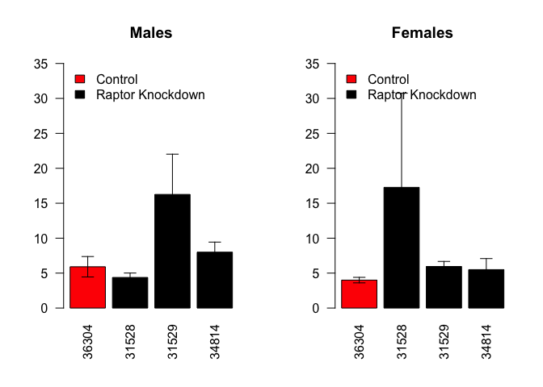
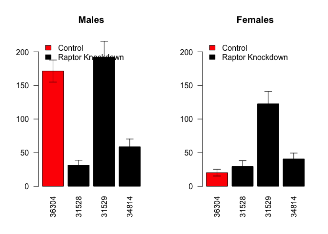

# Climbing Rates of MHC-GAL4 Flies
Erika Yates and Dave Bridges  
December 4, 2014  

This was based on the incomplete climbing data from the summer of 2014.


```r
color.scheme <- c('red',rep('black',3))

mapping.data <- read.csv('../Data/gene_mapping.csv')
mapping.data$UAS <- as.factor(mapping.data$UAS)
climbing_data_file_name <- '../Data/Climbing Data MHC.csv'
climbing.data <- read.csv(climbing_data_file_name)


#get data from what crosses are what
data_file_name <- '../Data/mhc_birth_worksheet.csv'
data <- read.csv(data_file_name)
data$Total <- rowSums(data[,10:14], na.rm=T)
all.flies <- sum(data$Total, na.rm=T)

data$Cross <- as.factor(paste(data$Male, data$Female, sep=" x "))
data$Driver <- as.factor(sapply(strsplit(as.character(data$Female), "/"),"[", 1))
#releveled UAS showing TSC1 then Raptor
data$UAS <- as.factor(sapply(strsplit(as.character(data$Male), "/"),"[", 1))
data$UAS <- relevel(data$UAS, ref='36304')
#remove analyses where incomplete data is presented
data.complete <- data[!(is.na(data$Total)),]
#merged with gene mapping file
annotated.data <- merge(mapping.data, data.complete, by="UAS", all.y=T)
annotations <- annotated.data[,c('UAS','Gene','Driver','CrossName')]
annotations <- unique(annotations[c('UAS','Gene','Driver','CrossName')])

annotated.climbing.data <- merge(climbing.data, annotations, by='CrossName')
#set time as a numeric
annotated.climbing.data$Time <- as.numeric(as.character(annotated.climbing.data$Time))
```

```
## Warning: NAs introduced by coercion
```

```r
#set UAS as a factor
annotated.climbing.data$UAS <- as.factor(annotated.climbing.data$UAS)
require(lubridate)
```

```
## Loading required package: lubridate
```

```r
annotated.climbing.data$Born <- mdy(annotated.climbing.data$Born)
annotated.climbing.data$Assay.Date <- mdy(annotated.climbing.data$Assay.Date)
annotated.climbing.data$age <- annotated.climbing.data$Assay.Date - annotated.climbing.data$Born
annotated.climbing.data <- droplevels(annotated.climbing.data)
```

## MHC-GAL4 Crosses

### Early Climbing Activity

This was defined as flies under 3 weeks of age.


```r
age.cutoff <- 20
library(dplyr)
mhc_summary <-
  subset(annotated.climbing.data, 
         Driver=='Mhc-GAL4'&Gene%in%c('Control','Raptor')&age<age.cutoff&UAS!='41912') %>%
  group_by(Driver,Gene, UAS, Gender) %>%
  summarise(mean = mean(Time, na.rm=T),
            se = sd(Time, na.rm=T)/sqrt(length(Time)),
            sd = sd(Time, na.rm=T),
            n = length(Time),
            age = mean(age, na.rm=T),
            shapiro=shapiro.test(Time)$p.value)

par(mfrow=c(1,2))
plot <- with(subset(mhc_summary, Gender=='M'), barplot(mean, 
          las=2, names.arg=UAS, main="Males", col=color.scheme, ylim=c(0,35)))
legend('topleft',c('Control','Raptor Knockdown'), fill=color.scheme[1:2], bty='n')

superpose.eb <- 
 function (x, y, ebl, ebu = ebl, length = 0.08, ...) 
 arrows(x, y + ebu, x, y - ebl, angle = 90, code = 3, 
 length = length, ...)

superpose.eb(plot, 
             subset(mhc_summary, Gender=='M')$mean,
             subset(mhc_summary, Gender=='M')$se)

plot <- with(subset(mhc_summary, Gender=='F'), barplot(mean, 
          las=2, names.arg=UAS, main="Females", col=color.scheme, ylim=c(0,35)))
legend('topleft',c('Control','Raptor Knockdown'), fill=color.scheme[1:2], bty='n')

superpose.eb(plot, 
             subset(mhc_summary, Gender=='F')$mean,
             subset(mhc_summary, Gender=='F')$se)
```

 


```r
age.cutoff.young <- 19
age.cutoff.late <- 45
library(dplyr)
mhc_summary <-
  subset(annotated.climbing.data, 
         Driver=='Mhc-GAL4'&Gene%in%c('Control','Raptor')&age>age.cutoff.young&age<age.cutoff.late&UAS!='41912') %>%
  group_by(Driver,Gene, UAS, Gender) %>%
  summarise(mean = mean(Time, na.rm=T),
            se = sd(Time, na.rm=T)/sqrt(length(Time)),
            sd = sd(Time, na.rm=T),
            n = length(Time),
            age = mean(age, na.rm=T),
            shapiro=shapiro.test(Time)$p.value)

par(mfrow=c(1,2))
plot <- with(subset(mhc_summary, Gender=='M'), barplot(mean, 
          las=2, names.arg=UAS, main="Males", col=color.scheme, ylim=c(0,220)))
legend('topleft',c('Control','Raptor Knockdown'), fill=color.scheme[1:2], bty='n')

superpose.eb <- 
 function (x, y, ebl, ebu = ebl, length = 0.08, ...) 
 arrows(x, y + ebu, x, y - ebl, angle = 90, code = 3, 
 length = length, ...)

superpose.eb(plot, 
             subset(mhc_summary, Gender=='M')$mean,
             subset(mhc_summary, Gender=='M')$se)

plot <- with(subset(mhc_summary, Gender=='F'), barplot(mean, 
          las=2, names.arg=UAS, main="Females", col=color.scheme, ylim=c(0,220)))
legend('topleft',c('Control','Raptor Knockdown'), fill=color.scheme[1:2], bty='n')

superpose.eb(plot, 
             subset(mhc_summary, Gender=='F')$mean,
             subset(mhc_summary, Gender=='F')$se)
```

 

```r
wilcoxon.test.summary <- data.frame(row.names=unique(mhc_summary$UAS))
for (uas in unique(mhc_summary$UAS)[2:4]){
wilcoxon.test.summary[uas,'Male-Young'] <- wilcox.test(Time~UAS,data = subset(annotated.climbing.data,Driver=='Mhc-GAL4'&Gene%in%c('Control','Raptor')&age<age.cutoff&Gender=='M'&UAS%in%c('36304',uas)))$p.value
wilcoxon.test.summary[uas,'Female-Young'] <- wilcox.test(Time~UAS,data = subset(annotated.climbing.data,Driver=='Mhc-GAL4'&Gene%in%c('Control','Raptor')&age<age.cutoff&Gender=='F'&UAS%in%c('36304',uas)))$p.value
wilcoxon.test.summary[uas,'Male-Old'] <- wilcox.test(Time~UAS,data = subset(annotated.climbing.data,Driver=='Mhc-GAL4'&Gene%in%c('Control','Raptor')&age>age.cutoff.young&age<age.cutoff.late&Gender=='M'&UAS%in%c('36304',uas)))$p.value
wilcoxon.test.summary[uas,'Female-Old'] <- wilcox.test(Time~UAS,data = subset(annotated.climbing.data,Driver=='Mhc-GAL4'&Gene%in%c('Control','Raptor')&age>age.cutoff.young&age<age.cutoff.late&Gender=='F'&UAS%in%c('36304',uas)))$p.value
}

library(xtable)
print(xtable(wilcoxon.test.summary, caption="Wilcoxon Tests Compared to Control Flies"), type='html')
```

<!-- html table generated in R 3.1.1 by xtable 1.7-4 package -->
<!-- Fri Dec 12 16:26:09 2014 -->
<table border=1>
<caption align="bottom"> Wilcoxon Tests Compared to Control Flies </caption>
<tr> <th>  </th> <th> Male-Young </th> <th> Female-Young </th> <th> Male-Old </th> <th> Female-Old </th>  </tr>
  <tr> <td align="right"> 36304 </td> <td align="right">  </td> <td align="right">  </td> <td align="right">  </td> <td align="right">  </td> </tr>
  <tr> <td align="right"> 31528 </td> <td align="right"> 0.08 </td> <td align="right"> 0.41 </td> <td align="right"> 0.00 </td> <td align="right"> 0.39 </td> </tr>
  <tr> <td align="right"> 31529 </td> <td align="right"> 0.23 </td> <td align="right"> 0.39 </td> <td align="right"> 0.48 </td> <td align="right"> 0.00 </td> </tr>
  <tr> <td align="right"> 34814 </td> <td align="right"> 0.09 </td> <td align="right"> 0.89 </td> <td align="right"> 0.00 </td> <td align="right"> 0.55 </td> </tr>
   </table>


## Session Information

```
## R version 3.1.1 (2014-07-10)
## Platform: x86_64-apple-darwin13.1.0 (64-bit)
## 
## locale:
## [1] en_US.UTF-8/en_US.UTF-8/en_US.UTF-8/C/en_US.UTF-8/en_US.UTF-8
## 
## attached base packages:
## [1] stats     graphics  grDevices utils     datasets  methods   base     
## 
## other attached packages:
## [1] xtable_1.7-4    dplyr_0.3.0.2   lubridate_1.3.3
## 
## loaded via a namespace (and not attached):
##  [1] assertthat_0.1   DBI_0.3.1        digest_0.6.5     evaluate_0.5.5  
##  [5] formatR_1.0      htmltools_0.2.6  knitr_1.8        lazyeval_0.1.9  
##  [9] magrittr_1.5     memoise_0.2.1    parallel_3.1.1   plyr_1.8.1      
## [13] Rcpp_0.11.3      rmarkdown_0.3.10 stringr_0.6.2    tools_3.1.1     
## [17] yaml_2.1.13
```
