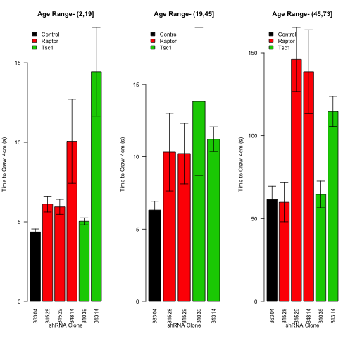
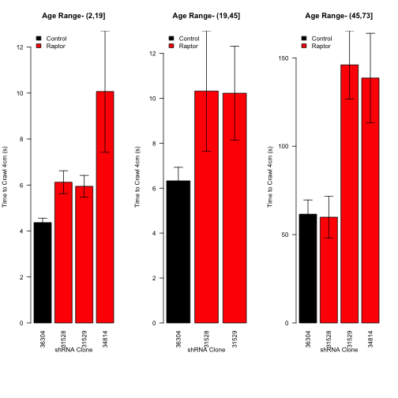
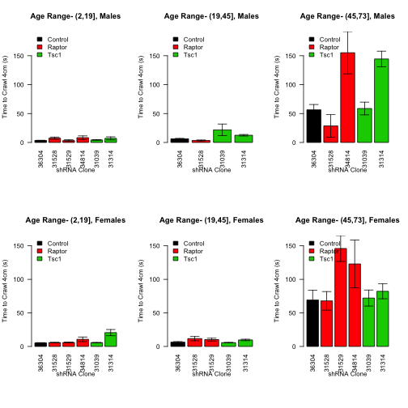
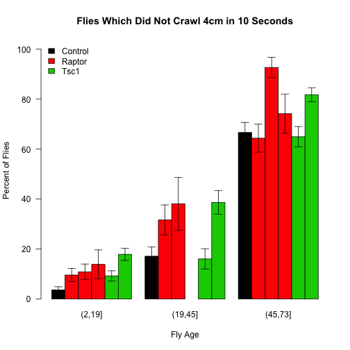

Crawling Assays
=====================


The raw data saved in ../Data/Crawling Data.csv.  This script was most recently run on Fri May  9 15:37:12 2014.

Analysis
---------


 


 


 


 


 

<!-- html table generated in R 3.1.0 by xtable 1.7-3 package -->
<!-- Fri May  9 15:37:13 2014 -->
<TABLE border=1>
<CAPTION ALIGN="bottom"> Summary of Crawling Times per Cross </CAPTION>
<TR> <TH> Age.Range </TH> <TH> Gene </TH> <TH> UAS </TH> <TH> mean </TH> <TH> se </TH> <TH> sd </TH> <TH> rel.error </TH> <TH> n </TH>  </TR>
  <TR> <TD> (2,19] </TD> <TD> Control </TD> <TD> 36304 </TD> <TD align="right"> 4.37 </TD> <TD align="right"> 0.19 </TD> <TD align="right"> 2.82 </TD> <TD align="right"> 64.62 </TD> <TD align="right"> 220 </TD> </TR>
  <TR> <TD> (2,19] </TD> <TD> Raptor </TD> <TD> 31528 </TD> <TD align="right"> 6.12 </TD> <TD align="right"> 0.50 </TD> <TD align="right"> 5.56 </TD> <TD align="right"> 90.84 </TD> <TD align="right"> 125 </TD> </TR>
  <TR> <TD> (2,19] </TD> <TD> Raptor </TD> <TD> 31529 </TD> <TD align="right"> 5.94 </TD> <TD align="right"> 0.47 </TD> <TD align="right"> 4.75 </TD> <TD align="right"> 79.95 </TD> <TD align="right"> 101 </TD> </TR>
  <TR> <TD> (2,19] </TD> <TD> Raptor </TD> <TD> 34814 </TD> <TD align="right"> 10.07 </TD> <TD align="right"> 2.64 </TD> <TD align="right"> 15.85 </TD> <TD align="right"> 157.43 </TD> <TD align="right">  36 </TD> </TR>
  <TR> <TD> (2,19] </TD> <TD> Tsc1 </TD> <TD> 31039 </TD> <TD align="right"> 5.03 </TD> <TD align="right"> 0.22 </TD> <TD align="right"> 3.06 </TD> <TD align="right"> 60.77 </TD> <TD align="right"> 195 </TD> </TR>
  <TR> <TD> (2,19] </TD> <TD> Tsc1 </TD> <TD> 31314 </TD> <TD align="right"> 14.44 </TD> <TD align="right"> 2.78 </TD> <TD align="right"> 43.64 </TD> <TD align="right"> 302.30 </TD> <TD align="right"> 246 </TD> </TR>
  <TR> <TD> (19,45] </TD> <TD> Control </TD> <TD> 36304 </TD> <TD align="right"> 6.32 </TD> <TD align="right"> 0.60 </TD> <TD align="right"> 6.19 </TD> <TD align="right"> 97.84 </TD> <TD align="right"> 105 </TD> </TR>
  <TR> <TD> (19,45] </TD> <TD> Raptor </TD> <TD> 31528 </TD> <TD align="right"> 10.32 </TD> <TD align="right"> 2.68 </TD> <TD align="right"> 20.77 </TD> <TD align="right"> 201.31 </TD> <TD align="right">  60 </TD> </TR>
  <TR> <TD> (19,45] </TD> <TD> Raptor </TD> <TD> 31529 </TD> <TD align="right"> 10.22 </TD> <TD align="right"> 2.09 </TD> <TD align="right"> 9.58 </TD> <TD align="right"> 93.75 </TD> <TD align="right">  21 </TD> </TR>
  <TR> <TD> (19,45] </TD> <TD> Tsc1 </TD> <TD> 31039 </TD> <TD align="right"> 13.82 </TD> <TD align="right"> 5.12 </TD> <TD align="right"> 46.05 </TD> <TD align="right"> 333.21 </TD> <TD align="right">  81 </TD> </TR>
  <TR> <TD> (19,45] </TD> <TD> Tsc1 </TD> <TD> 31314 </TD> <TD align="right"> 11.21 </TD> <TD align="right"> 0.85 </TD> <TD align="right"> 8.78 </TD> <TD align="right"> 78.30 </TD> <TD align="right"> 106 </TD> </TR>
  <TR> <TD> (45,73] </TD> <TD> Control </TD> <TD> 36304 </TD> <TD align="right"> 61.56 </TD> <TD align="right"> 8.01 </TD> <TD align="right"> 94.14 </TD> <TD align="right"> 152.94 </TD> <TD align="right"> 138 </TD> </TR>
  <TR> <TD> (45,73] </TD> <TD> Raptor </TD> <TD> 31528 </TD> <TD align="right"> 59.85 </TD> <TD align="right"> 11.79 </TD> <TD align="right"> 100.77 </TD> <TD align="right"> 168.36 </TD> <TD align="right">  73 </TD> </TR>
  <TR> <TD> (45,73] </TD> <TD> Raptor </TD> <TD> 31529 </TD> <TD align="right"> 146.02 </TD> <TD align="right"> 19.29 </TD> <TD align="right"> 123.53 </TD> <TD align="right"> 84.59 </TD> <TD align="right">  41 </TD> </TR>
  <TR> <TD> (45,73] </TD> <TD> Raptor </TD> <TD> 34814 </TD> <TD align="right"> 138.58 </TD> <TD align="right"> 25.29 </TD> <TD align="right"> 140.83 </TD> <TD align="right"> 101.62 </TD> <TD align="right">  31 </TD> </TR>
  <TR> <TD> (45,73] </TD> <TD> Tsc1 </TD> <TD> 31039 </TD> <TD align="right"> 64.60 </TD> <TD align="right"> 8.06 </TD> <TD align="right"> 94.40 </TD> <TD align="right"> 146.12 </TD> <TD align="right"> 137 </TD> </TR>
  <TR> <TD> (45,73] </TD> <TD> Tsc1 </TD> <TD> 31314 </TD> <TD align="right"> 114.62 </TD> <TD align="right"> 9.06 </TD> <TD align="right"> 125.54 </TD> <TD align="right"> 109.53 </TD> <TD align="right"> 192 </TD> </TR>
  <TR> <TD>  </TD> <TD> Raptor </TD> <TD> 34814 </TD> <TD align="right"> 5.19 </TD> <TD align="right"> 0.58 </TD> <TD align="right"> 2.38 </TD> <TD align="right"> 45.89 </TD> <TD align="right">  17 </TD> </TR>
   <A NAME=tab:summary></A>
</TABLE>


Statistical Analysis
----------------------

To test this effect, first we tested a model in which first the age range was taken into account, and then the uas was included as an interaction.  We tested the assumptions of this model by Shapiro-Wilk (p=8.9059 &times; 10<sup>-16</sup>) and found it did not have normally distributed residuals.  We therefore split the data into the three age bins and looked at them individually.


We then checked whether these had normally distributed residuals and they did not (p=1.6191 &times; 10<sup>-51</sup>, 5.7246 &times; 10<sup>-36</sup> and 8.2443 &times; 10<sup>-26</sup>).  We therefore did individual Wilcoxon-Rank Sum Tests comparing each genotype to the control group.


<!-- html table generated in R 3.1.0 by xtable 1.7-3 package -->
<!-- Fri May  9 15:37:14 2014 -->
<TABLE border=1>
<CAPTION ALIGN="bottom"> Wilcoxon Rank-Sum Tests for each group compared to the control, not adjusted for multiple observations </CAPTION>
<TR> <TH>  </TH> <TH> (2,19] </TH> <TH> (19,45] </TH> <TH> (45,73] </TH>  </TR>
  <TR> <TD align="right"> 36304 </TD> <TD align="right"> 1.00000 </TD> <TD align="right"> 1.00000 </TD> <TD align="right"> 1.00000 </TD> </TR>
  <TR> <TD align="right"> 31039 </TD> <TD align="right"> 0.01350 </TD> <TD align="right"> 0.01478 </TD> <TD align="right"> 0.68313 </TD> </TR>
  <TR> <TD align="right"> 31314 </TD> <TD align="right"> 0.00030 </TD> <TD align="right"> 0.00000 </TD> <TD align="right"> 0.00002 </TD> </TR>
  <TR> <TD align="right"> 31528 </TD> <TD align="right"> 0.00019 </TD> <TD align="right"> 0.01128 </TD> <TD align="right"> 0.44563 </TD> </TR>
  <TR> <TD align="right"> 31529 </TD> <TD align="right"> 0.00113 </TD> <TD align="right"> 0.06633 </TD> <TD align="right"> 0.00000 </TD> </TR>
  <TR> <TD align="right"> 34814 </TD> <TD align="right"> 0.00004 </TD> <TD align="right">  </TD> <TD align="right"> 0.05888 </TD> </TR>
   <A NAME=tab:wilcoxon-tests></A>
</TABLE>
<!-- html table generated in R 3.1.0 by xtable 1.7-3 package -->
<!-- Fri May  9 15:37:14 2014 -->
<TABLE border=1>
<CAPTION ALIGN="bottom"> Raptor Knockdown Wilcoxon Rank-Sum tests for each UAS compared to the control, adjusted by the method of Benjamini and Hochberg </CAPTION>
<TR> <TH>  </TH> <TH> UAS </TH> <TH> age group </TH> <TH> pval </TH> <TH> padj </TH>  </TR>
  <TR> <TD align="right"> 1 </TD> <TD> 31528 </TD> <TD> (2,19] </TD> <TD align="right"> 0.00019 </TD> <TD align="right"> 0.00051 </TD> </TR>
  <TR> <TD align="right"> 2 </TD> <TD> 31529 </TD> <TD> (2,19] </TD> <TD align="right"> 0.00113 </TD> <TD align="right"> 0.00225 </TD> </TR>
  <TR> <TD align="right"> 3 </TD> <TD> 34814 </TD> <TD> (2,19] </TD> <TD align="right"> 0.00004 </TD> <TD align="right"> 0.00016 </TD> </TR>
  <TR> <TD align="right"> 4 </TD> <TD> 31528 </TD> <TD> (19,45] </TD> <TD align="right"> 0.01128 </TD> <TD align="right"> 0.01805 </TD> </TR>
  <TR> <TD align="right"> 5 </TD> <TD> 31529 </TD> <TD> (19,45] </TD> <TD align="right"> 0.06633 </TD> <TD align="right"> 0.07580 </TD> </TR>
  <TR> <TD align="right"> 6 </TD> <TD> 34814 </TD> <TD> (19,45] </TD> <TD align="right">  </TD> <TD align="right">  </TD> </TR>
  <TR> <TD align="right"> 7 </TD> <TD> 31528 </TD> <TD> (45,73] </TD> <TD align="right"> 0.44563 </TD> <TD align="right"> 0.44563 </TD> </TR>
  <TR> <TD align="right"> 8 </TD> <TD> 31529 </TD> <TD> (45,73] </TD> <TD align="right"> 0.00000 </TD> <TD align="right"> 0.00001 </TD> </TR>
  <TR> <TD align="right"> 9 </TD> <TD> 34814 </TD> <TD> (45,73] </TD> <TD align="right"> 0.05888 </TD> <TD align="right"> 0.07580 </TD> </TR>
   <A NAME=tab:raptor-wilcoxon-tests></A>
</TABLE>


<!-- html table generated in R 3.1.0 by xtable 1.7-3 package -->
<!-- Fri May  9 15:37:14 2014 -->
<TABLE border=1>
<CAPTION ALIGN="bottom"> Fisher's Exact Test For Flies Which Do Not Crawl 4cm in 10 Seconds </CAPTION>
<TR> <TH>  </TH> <TH> (2,19] </TH> <TH> (19,45] </TH> <TH> (45,73] </TH>  </TR>
  <TR> <TD align="right"> 36304 </TD> <TD align="right"> 1.00 </TD> <TD align="right"> 1.00 </TD> <TD align="right"> 1.00 </TD> </TR>
  <TR> <TD align="right"> 31039 </TD> <TD align="right"> 0.48 </TD> <TD align="right"> 0.07 </TD> <TD align="right"> 0.56 </TD> </TR>
  <TR> <TD align="right"> 31314 </TD> <TD align="right"> 0.56 </TD> <TD align="right"> 0.00 </TD> <TD align="right"> 0.37 </TD> </TR>
  <TR> <TD align="right"> 31528 </TD> <TD align="right"> 1.00 </TD> <TD align="right"> 0.03 </TD> <TD align="right"> 0.06 </TD> </TR>
  <TR> <TD align="right"> 31529 </TD> <TD align="right"> 0.00 </TD> <TD align="right"> 0.00 </TD> <TD align="right"> 1.00 </TD> </TR>
  <TR> <TD align="right"> 34814 </TD> <TD align="right">  </TD> <TD align="right">  </TD> <TD align="right">  </TD> </TR>
   <A NAME=tab:fisher-test-summary></A>
</TABLE>


Session Information
----------------------


```
## R version 3.1.0 (2014-04-10)
## Platform: x86_64-apple-darwin13.1.0 (64-bit)
## 
## locale:
## [1] en_US.UTF-8/en_US.UTF-8/en_US.UTF-8/C/en_US.UTF-8/en_US.UTF-8
## 
## attached base packages:
## [1] splines   stats     graphics  grDevices utils     datasets  methods  
## [8] base     
## 
## other attached packages:
## [1] xtable_1.7-3     multcomp_1.3-3   TH.data_1.0-3    survival_2.37-7 
## [5] mvtnorm_0.9-9999 plyr_1.8.1       lubridate_1.3.3  reshape2_1.4    
## [9] knitr_1.5       
## 
## loaded via a namespace (and not attached):
##  [1] digest_0.6.4    evaluate_0.5.3  formatR_0.10    grid_3.1.0     
##  [5] lattice_0.20-29 memoise_0.2.1   Rcpp_0.11.1     sandwich_2.3-0 
##  [9] stringr_0.6.2   tools_3.1.0     zoo_1.7-11
```

