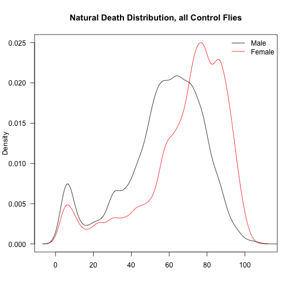

# Analysis of Longevity from Muscle TSC1/Raptor Flies

## Experimental Design


```
## Warning: 30 failed to parse.
```

These data are stored in the \textbf{Data` subfolder.  This script was most recently run on Fri Jun 27 15:41:51 2014.  There has been a total of \textbf{3487 deaths, with \textbf{3435 of natural causes and \textbf{3385 of identifiable genotypes excluding accidental deaths.  The oldest fly recorded so far was \textbf{661097 days old at time of death.

 


```
## Loading required package: RColorBrewer
```

 


### Gene Level Analysis


```
## Loading required package: plyr
## 
## Attaching package: 'plyr'
## 
## The following object is masked from 'package:lubridate':
## 
##     here
## 
## Loading required package: reshape2
```

 


## Number of Flies Examined

The total number of deaths for each cross and genotype ,removing deaths that were accidental or not due to natural causes, the data is shown in Table \ref{tab:analysed-deaths-gene} and \ref{tab:analysed-deaths-gene-gender}.

The distribution of deaths in the samples are shown at a gender level in Figure \ref{fig:histogram-genders} and looking at the controls in Figure \ref{fig:histogram-controls}.  To examine the controls, and whether there are effects of the GAL4 or the shRNA we examined the median age of the controls from each cross.  These data are shown in Figure \ref{fig:barplot-controls}.  Still need to do some statistics to test if this is relevant.


```
## Loading required package: xtable
```

% latex table generated in R 3.1.0 by xtable 1.7-3 package
% Fri Jun 27 15:41:51 2014
\begin{table}[ht]
\centering
\begin{tabular}{llrrrrrrr}
  \hline
Driver & Gene & shRNA/GAL4 & +/+ & GAL4/+ & GAL4/Tm6B & shRNA/Tm3,sb & Tm3,sb/Tm6B & NA \\ 
  \hline
24B-Gal4 & Raptor &   0 &   0 &   0 &  20 &   8 &  10 &   0 \\ 
  24B-Gal4 & Tsc1 & 1442 &   0 &   0 & 1018 & 1278 & 572 &  56 \\ 
  36304 & Control &   0 & 294 &   0 &   0 &   0 &   0 &   0 \\ 
  C179-Gal4 & Control &   0 &   0 & 225 &   0 &   0 &   0 &   0 \\ 
  C179-Gal4 & Raptor & 922 &   0 &   0 & 1134 &   0 &   0 & 394 \\ 
  C179-Gal4 & Tsc1 &   0 &   0 &   0 &   0 &   0 &   0 & 576 \\ 
  Hand-Gal4 & Raptor & 1420 &   0 &   0 & 1228 & 1504 & 692 & 198 \\ 
  Hand-Gal4 & Tsc1 & 1238 &   0 &   0 & 898 & 990 & 238 &  26 \\ 
   \hline
\end{tabular}
\caption{Total Natural Deaths for Each Gene and Genotype} 
\label{tab:analysed-deaths-gene}
\end{table}
% latex table generated in R 3.1.0 by xtable 1.7-3 package
% Fri Jun 27 15:41:51 2014
\begin{table}[ht]
\centering
\begin{tabular}{lllrrrrrrr}
  \hline
Driver & Gene & Gender & shRNA/GAL4 & +/+ & GAL4/+ & GAL4/Tm6B & shRNA/Tm3,sb & Tm3,sb/Tm6B & NA \\ 
  \hline
24B-Gal4 & Raptor & female &   0 &   0 &   0 &  14 &   6 &   6 &   0 \\ 
  24B-Gal4 & Raptor & male &   0 &   0 &   0 &   6 &   2 &   4 &   0 \\ 
  24B-Gal4 & Tsc1 & female & 712 &   0 &   0 & 536 & 678 & 322 &  36 \\ 
  24B-Gal4 & Tsc1 & male & 730 &   0 &   0 & 482 & 600 & 250 &  20 \\ 
  36304 & Control & female &   0 & 142 &   0 &   0 &   0 &   0 &   0 \\ 
  36304 & Control & male &   0 & 152 &   0 &   0 &   0 &   0 &   0 \\ 
  C179-Gal4 & Control & female &   0 &   0 &  75 &   0 &   0 &   0 &   0 \\ 
  C179-Gal4 & Control & male &   0 &   0 & 150 &   0 &   0 &   0 &   0 \\ 
  C179-Gal4 & Raptor & female & 604 &   0 &   0 & 614 &   0 &   0 & 301 \\ 
  C179-Gal4 & Raptor & male & 318 &   0 &   0 & 520 &   0 &   0 &  93 \\ 
  C179-Gal4 & Tsc1 & female &   0 &   0 &   0 &   0 &   0 &   0 & 296 \\ 
  C179-Gal4 & Tsc1 & male &   0 &   0 &   0 &   0 &   0 &   0 & 280 \\ 
  Hand-Gal4 & Raptor & female & 710 &   0 &   0 & 680 & 888 & 424 &  98 \\ 
  Hand-Gal4 & Raptor & male & 710 &   0 &   0 & 548 & 616 & 268 & 100 \\ 
  Hand-Gal4 & Tsc1 & female & 662 &   0 &   0 & 532 & 510 & 122 &  26 \\ 
  Hand-Gal4 & Tsc1 & male & 576 &   0 &   0 & 366 & 480 & 116 &   0 \\ 
   \hline
\end{tabular}
\caption{Total Natural Deaths by Gender for Each Gene and Genotype} 
\label{tab:analysed-deaths-gene-gender}
\end{table}

# Survival Analysis

All of these are relative to the reference Genotype which is the knockdown (GAL4/shRNA).  
\
## 24B-Gal4 Driver Analysis
This analysis is only for the three *Tsc1* shRNA alleles, since there were so few births in the *Raptor* knockdown alleles.  The summary statistics from this analysis are shown in Table \ref{tab:coxph-summary-24b}.


```
## Loading required package: survival
## Loading required package: splines
```

```
## pdf 
##   2
```

<!-- html table generated in R 3.1.0 by xtable 1.7-3 package -->
<!-- Fri Jun 27 15:41:52 2014 -->
<TABLE border=1>
<CAPTION ALIGN="bottom"> Gene Level Tests for 24B-Gal4 Drivers </CAPTION>
<TR> <TH>  </TH> <TH> n </TH> <TH> logtest.p </TH> <TH> waldtest.p </TH> <TH> sctest.p </TH>  </TR>
  <TR> <TD align="right"> Tsc1 </TD> <TD align="right"> 4304 </TD> <TD align="right"> 0.00000 </TD> <TD align="right"> 0.00000 </TD> <TD align="right"> 0.00000 </TD> </TR>
   <A NAME=tab:coxph-summary-24b></A>
</TABLE>
<!-- html table generated in R 3.1.0 by xtable 1.7-3 package -->
<!-- Fri Jun 27 15:41:52 2014 -->
<TABLE border=1>
<CAPTION ALIGN="bottom"> Gene and Gender Level  Tests for 24B-Gal4 Drivers </CAPTION>
<TR> <TH>  </TH> <TH> n </TH> <TH> logtest.p </TH> <TH> waldtest.p </TH> <TH> sctest.p </TH>  </TR>
  <TR> <TD align="right"> Tsc1 male </TD> <TD align="right"> 2056 </TD> <TD align="right"> 0.000000000000000 </TD> <TD align="right"> 0.00000 </TD> <TD align="right"> 0.00000 </TD> </TR>
  <TR> <TD align="right"> Tsc1 female </TD> <TD align="right"> 2248 </TD> <TD align="right"> 0.000000000000000 </TD> <TD align="right"> 0.00000 </TD> <TD align="right"> 0.00000 </TD> </TR>
   <A NAME=tab:coxph-summary-24b-gender></A>
</TABLE>
<!-- html table generated in R 3.1.0 by xtable 1.7-3 package -->
<!-- Fri Jun 27 15:41:52 2014 -->
<TABLE border=1>
<CAPTION ALIGN="bottom"> Gene Level Cox Proportional Hazard Tests for 24B-Gal4 Drivers and Tsc1 Knockdown </CAPTION>
<TR> <TH>  </TH> <TH> Coef </TH> <TH> SE </TH> <TH> Hazard.Ratio </TH> <TH> p </TH>  </TR>
  <TR> <TD align="right"> GenotypeGAL4/Tm6B </TD> <TD align="right"> -0.629 </TD> <TD align="right"> 0.042 </TD> <TD align="right"> 1.876 </TD> <TD align="right"> 0.000000000000000 </TD> </TR>
  <TR> <TD align="right"> GenotypeshRNA/Tm3,sb </TD> <TD align="right"> -0.279 </TD> <TD align="right"> 0.039 </TD> <TD align="right"> 1.322 </TD> <TD align="right"> 0.000000000000545 </TD> </TR>
  <TR> <TD align="right"> GenotypeTm3,sb/Tm6B </TD> <TD align="right"> 0.325 </TD> <TD align="right"> 0.050 </TD> <TD align="right"> 0.723 </TD> <TD align="right"> 0.000000000062608 </TD> </TR>
   <A NAME=tab:coxph.table.24b.tsc1></A>
</TABLE>
<!-- html table generated in R 3.1.0 by xtable 1.7-3 package -->
<!-- Fri Jun 27 15:41:52 2014 -->
<TABLE border=1>
<CAPTION ALIGN="bottom"> Gene Level Cox Proportional Hazard Tests for Males with 24B-Gal4 Drivers and Tsc1 Knockdown </CAPTION>
<TR> <TH>  </TH> <TH> Coef </TH> <TH> SE </TH> <TH> Hazard.Ratio </TH> <TH> p </TH>  </TR>
  <TR> <TD align="right"> GenotypeGAL4/Tm6B </TD> <TD align="right"> -0.402 </TD> <TD align="right"> 0.059 </TD> <TD align="right"> 1.495 </TD> <TD align="right"> 0.000000000012339 </TD> </TR>
  <TR> <TD align="right"> GenotypeshRNA/Tm3,sb </TD> <TD align="right"> -0.195 </TD> <TD align="right"> 0.055 </TD> <TD align="right"> 1.215 </TD> <TD align="right"> 0.000439707086347 </TD> </TR>
  <TR> <TD align="right"> GenotypeTm3,sb/Tm6B </TD> <TD align="right"> 0.756 </TD> <TD align="right"> 0.075 </TD> <TD align="right"> 0.470 </TD> <TD align="right"> 0.000000000000000 </TD> </TR>
   <A NAME=tab:coxph.table.24b.tsc1.male></A>
</TABLE>
<!-- html table generated in R 3.1.0 by xtable 1.7-3 package -->
<!-- Fri Jun 27 15:41:52 2014 -->
<TABLE border=1>
<CAPTION ALIGN="bottom"> Gene Level Cox Proportional Hazard Tests for Females with 24B-Gal4 Drivers and Tsc1 Knockdown </CAPTION>
<TR> <TH>  </TH> <TH> Coef </TH> <TH> SE </TH> <TH> Hazard.Ratio </TH> <TH> p </TH>  </TR>
  <TR> <TD align="right"> GenotypeGAL4/Tm6B </TD> <TD align="right"> -0.772 </TD> <TD align="right"> 0.058 </TD> <TD align="right"> 2.163 </TD> <TD align="right"> 0.00000000000000000 </TD> </TR>
  <TR> <TD align="right"> GenotypeshRNA/Tm3,sb </TD> <TD align="right"> -0.276 </TD> <TD align="right"> 0.054 </TD> <TD align="right"> 1.318 </TD> <TD align="right"> 0.00000036813820803 </TD> </TR>
  <TR> <TD align="right"> GenotypeTm3,sb/Tm6B </TD> <TD align="right"> 0.266 </TD> <TD align="right"> 0.068 </TD> <TD align="right"> 0.766 </TD> <TD align="right"> 0.00008557375959850 </TD> </TR>
   <A NAME=tab:coxph.table.24b.tsc1.female></A>
</TABLE>

 

 


We performed a variety of survival tests for the was a 24B-Gal4 driven *Tsc1* knockdowns (see Tables \ref{tab:coxph-summary-24b} and \ref{tab:coxph-summary-24b-gender}).  These tests removed the Tm3/Tm6B flies, which in all cases died prematurely.  The logrank test was highly significant (p=0) for the combined comparasons and both males (p=0) and females (p=0).

For post-hoc testing, we performed cox proportional hazard tests, shown in Tables \ref{tab:coxph.table.24b.tsc1}, \ref{tab:coxph.table.24b.tsc1.male} and \ref{tab:coxph.table.24b.tsc1.female}.  All comparasons were highly significant all less than 4.3971 &times; 10<sup>-4</sup>.  The instantaneous hazard ratios ranged from 0.4696 to 2.1631, in terms of that much less likely to die than the knockdown flies.  These results are presented graphically in Figures \ref{fig:survival-24b-tsc1} and \ref{fig:survival-24b-tsc1-gender}.

## C179 Driver Analysis

This analysis is only for the three \textit{Raptor} shRNA alleles, since we did not examine the effects of Tsc1 knockdown with this driver.  The summary statistics from this analysis are shown in Table \ref{tab:coxph-summary-c179}.


```
## pdf 
##   2
```

<!-- html table generated in R 3.1.0 by xtable 1.7-3 package -->
<!-- Fri Jun 27 15:41:52 2014 -->
<TABLE border=1>
<CAPTION ALIGN="bottom"> Gene Level Tests for C179-Gal4 Drivers </CAPTION>
<TR> <TH>  </TH> <TH> n </TH> <TH> logtest.p </TH> <TH> waldtest.p </TH> <TH> sctest.p </TH>  </TR>
  <TR> <TD align="right"> Raptor </TD> <TD align="right"> 2277 </TD> <TD align="right"> 0.00000 </TD> <TD align="right"> 0.00000 </TD> <TD align="right"> 0.00000 </TD> </TR>
   <A NAME=tab:coxph-summary-c179></A>
</TABLE>
<!-- html table generated in R 3.1.0 by xtable 1.7-3 package -->
<!-- Fri Jun 27 15:41:52 2014 -->
<TABLE border=1>
<CAPTION ALIGN="bottom"> Gene and Gender Level  Tests for C179-Gal4 Drivers </CAPTION>
<TR> <TH>  </TH> <TH> n </TH> <TH> logtest.p </TH> <TH> waldtest.p </TH> <TH> sctest.p </TH>  </TR>
  <TR> <TD align="right"> Raptor male </TD> <TD align="right"> 984 </TD> <TD align="right"> 0.00000 </TD> <TD align="right"> 0.00000 </TD> <TD align="right"> 0.00000 </TD> </TR>
  <TR> <TD align="right"> Raptor female </TD> <TD align="right"> 1293 </TD> <TD align="right"> 0.00000 </TD> <TD align="right"> 0.00000 </TD> <TD align="right"> 0.00000 </TD> </TR>
   <A NAME=tab:coxph-summary-c179-gender></A>
</TABLE>
<!-- html table generated in R 3.1.0 by xtable 1.7-3 package -->
<!-- Fri Jun 27 15:41:52 2014 -->
<TABLE border=1>
<CAPTION ALIGN="bottom"> Gene Level Cox Proportional Hazard Tests for C179-Gal4 Drivers and Raptor Knockdown </CAPTION>
<TR> <TH>  </TH> <TH> Coef </TH> <TH> SE </TH> <TH> Hazard.Ratio </TH> <TH> p </TH>  </TR>
  <TR> <TD align="right"> GenotypeGAL4/+ </TD> <TD align="right"> -0.777 </TD> <TD align="right"> 0.076 </TD> <TD align="right"> 2.174 </TD> <TD align="right"> 0.000 </TD> </TR>
  <TR> <TD align="right"> GenotypeGAL4/Tm6B </TD> <TD align="right"> 0.219 </TD> <TD align="right"> 0.046 </TD> <TD align="right"> 0.803 </TD> <TD align="right"> 0.000 </TD> </TR>
   <A NAME=tab:coxph.table.c179.raptor></A>
</TABLE>
<!-- html table generated in R 3.1.0 by xtable 1.7-3 package -->
<!-- Fri Jun 27 15:41:52 2014 -->
<TABLE border=1>
<CAPTION ALIGN="bottom"> Gene Level Cox Proportional Hazard Tests for Males with C179-Gal4 Drivers and Raptor Knockdown </CAPTION>
<TR> <TH>  </TH> <TH> Coef </TH> <TH> SE </TH> <TH> Hazard.Ratio </TH> <TH> p </TH>  </TR>
  <TR> <TD align="right"> GenotypeGAL4/+ </TD> <TD align="right"> -1.082 </TD> <TD align="right"> 0.101 </TD> <TD align="right"> 2.950 </TD> <TD align="right"> 0.0000000 </TD> </TR>
  <TR> <TD align="right"> GenotypeGAL4/Tm6B </TD> <TD align="right"> -0.156 </TD> <TD align="right"> 0.075 </TD> <TD align="right"> 1.169 </TD> <TD align="right"> 0.0381241 </TD> </TR>
   <A NAME=tab:coxph.table.c179.raptor.male></A>
</TABLE>
<!-- html table generated in R 3.1.0 by xtable 1.7-3 package -->
<!-- Fri Jun 27 15:41:52 2014 -->
<TABLE border=1>
<CAPTION ALIGN="bottom"> Gene Level Cox Proportional Hazard Tests for Females with C179-Gal4 Drivers and Raptor Knockdown </CAPTION>
<TR> <TH>  </TH> <TH> Coef </TH> <TH> SE </TH> <TH> Hazard.Ratio </TH> <TH> p </TH>  </TR>
  <TR> <TD align="right"> GenotypeGAL4/+ </TD> <TD align="right"> -0.920 </TD> <TD align="right"> 0.133 </TD> <TD align="right"> 2.509 </TD> <TD align="right"> 0.000 </TD> </TR>
  <TR> <TD align="right"> GenotypeGAL4/Tm6B </TD> <TD align="right"> 0.307 </TD> <TD align="right"> 0.059 </TD> <TD align="right"> 0.736 </TD> <TD align="right"> 0.000 </TD> </TR>
   <A NAME=tab:coxph.table.c179.raptor.female></A>
</TABLE>

 

 


We performed a variety of survival tests for the was a C179-Gal4 driven \textit{Raptor} knockdowns (see Tables \ref{tab:coxph-summary-c179} and \ref{tab:coxph-summary-c179-gender}).  These tests removed the Tm3/Tm6B flies, which in all cases died prematurely.  The logrank test was not significant (p=0) for the combined comparason and females (p=0).  There was a significant difference with the males (p=0).

For post-hoc testing, we performed cox proportional hazard tests, shown in Tables \ref{tab:coxph.table.c179.raptor}, \ref{tab:coxph.table.c179.raptor.male} and \ref{tab:coxph.table.c179.raptor.female}. The instantaneous hazard ratios ranged from 0.7355 to 2.9501, in terms of that much less likely to die than the knockdown flies.  These results are presented graphically in Figures \ref{fig:survival-c179-raptor} and \ref{fig:survival-c179-raptor-gender}.


## Hand-Gal4 Analysis

This analysis is for both the three \textit{Tsc1} and the three \textit{Raptor} shRNA alleles.  The summary statistics from this analysis are shown in Table \ref{tab:coxph-summary-hand}.


<!-- html table generated in R 3.1.0 by xtable 1.7-3 package -->
<!-- Fri Jun 27 15:41:53 2014 -->
<TABLE border=1>
<CAPTION ALIGN="bottom"> Gene Level Tests for Hand-Gal4 Drivers </CAPTION>
<TR> <TH>  </TH> <TH> n </TH> <TH> logtest.p </TH> <TH> waldtest.p </TH> <TH> sctest.p </TH>  </TR>
  <TR> <TD align="right"> Control </TD> <TD align="right">  </TD> <TD align="right">  </TD> <TD align="right">  </TD> <TD align="right">  </TD> </TR>
  <TR> <TD align="right"> Raptor </TD> <TD align="right"> 4838 </TD> <TD align="right"> 0.00000000000000000 </TD> <TD align="right"> 0.00000 </TD> <TD align="right"> 0.00000 </TD> </TR>
  <TR> <TD align="right"> Tsc1 </TD> <TD align="right"> 3350 </TD> <TD align="right"> 0.00000000000000000 </TD> <TD align="right"> 0.00000 </TD> <TD align="right"> 0.00000 </TD> </TR>
   <A NAME=tab:coxph-summary-hand></A>
</TABLE>
<!-- html table generated in R 3.1.0 by xtable 1.7-3 package -->
<!-- Fri Jun 27 15:41:53 2014 -->
<TABLE border=1>
<CAPTION ALIGN="bottom"> Gene and Gender Level  Tests for Hand-Gal4 Drivers </CAPTION>
<TR> <TH>  </TH> <TH> n </TH> <TH> logtest.p </TH> <TH> waldtest.p </TH> <TH> sctest.p </TH>  </TR>
  <TR> <TD align="right"> Tsc1 male </TD> <TD align="right"> 1538 </TD> <TD align="right"> 0.00000000000000000 </TD> <TD align="right"> 0.00000 </TD> <TD align="right"> 0.00000 </TD> </TR>
  <TR> <TD align="right"> Tsc1 female </TD> <TD align="right"> 1812 </TD> <TD align="right"> 0.00000000000000000 </TD> <TD align="right"> 0.00000 </TD> <TD align="right"> 0.00000 </TD> </TR>
  <TR> <TD align="right"> Raptor male </TD> <TD align="right"> 2142 </TD> <TD align="right"> 0.00000000000000000 </TD> <TD align="right"> 0.00000 </TD> <TD align="right"> 0.00000 </TD> </TR>
  <TR> <TD align="right"> Raptor female </TD> <TD align="right"> 2696 </TD> <TD align="right"> 0.00000000000000000 </TD> <TD align="right"> 0.00000 </TD> <TD align="right"> 0.00000 </TD> </TR>
   <A NAME=tab:coxph-summary-hand-gender></A>
</TABLE>
<!-- html table generated in R 3.1.0 by xtable 1.7-3 package -->
<!-- Fri Jun 27 15:41:53 2014 -->
<TABLE border=1>
<CAPTION ALIGN="bottom"> Gene Level Cox Proportional Hazard Tests for Hand-Gal4 Drivers and Tsc1 Knockdown </CAPTION>
<TR> <TH>  </TH> <TH> Coef </TH> <TH> SE </TH> <TH> Hazard.Ratio </TH> <TH> p </TH>  </TR>
  <TR> <TD align="right"> GenotypeGAL4/Tm6B </TD> <TD align="right"> 0.766 </TD> <TD align="right"> 0.045 </TD> <TD align="right"> 0.465 </TD> <TD align="right"> 0.000 </TD> </TR>
  <TR> <TD align="right"> GenotypeshRNA/Tm3,sb </TD> <TD align="right"> 0.346 </TD> <TD align="right"> 0.043 </TD> <TD align="right"> 0.708 </TD> <TD align="right"> 0.000 </TD> </TR>
  <TR> <TD align="right"> GenotypeTm3,sb/Tm6B </TD> <TD align="right"> 1.390 </TD> <TD align="right"> 0.073 </TD> <TD align="right"> 0.249 </TD> <TD align="right"> 0.000 </TD> </TR>
   <A NAME=tab:coxph.table.hand.tsc1></A>
</TABLE>
<!-- html table generated in R 3.1.0 by xtable 1.7-3 package -->
<!-- Fri Jun 27 15:41:53 2014 -->
<TABLE border=1>
<CAPTION ALIGN="bottom"> Gene Level Cox Proportional Hazard Tests for Males with Hand-Gal4 Drivers and Tsc1 Knockdown </CAPTION>
<TR> <TH>  </TH> <TH> Coef </TH> <TH> SE </TH> <TH> Hazard.Ratio </TH> <TH> p </TH>  </TR>
  <TR> <TD align="right"> GenotypeGAL4/Tm6B </TD> <TD align="right"> 1.062 </TD> <TD align="right"> 0.071 </TD> <TD align="right"> 0.346 </TD> <TD align="right"> 0.00000000000000000 </TD> </TR>
  <TR> <TD align="right"> GenotypeshRNA/Tm3,sb </TD> <TD align="right"> 0.680 </TD> <TD align="right"> 0.063 </TD> <TD align="right"> 0.507 </TD> <TD align="right"> 0.00000000000000000 </TD> </TR>
  <TR> <TD align="right"> GenotypeTm3,sb/Tm6B </TD> <TD align="right"> 1.826 </TD> <TD align="right"> 0.105 </TD> <TD align="right"> 0.161 </TD> <TD align="right"> 0.00000000000000000 </TD> </TR>
   <A NAME=tab:coxph.table.hand.tsc1.male></A>
</TABLE>
<!-- html table generated in R 3.1.0 by xtable 1.7-3 package -->
<!-- Fri Jun 27 15:41:53 2014 -->
<TABLE border=1>
<CAPTION ALIGN="bottom"> Gene Level Cox Proportional Hazard Tests for Females with Hand-Gal4 Drivers and Tsc1 Knockdown </CAPTION>
<TR> <TH>  </TH> <TH> Coef </TH> <TH> SE </TH> <TH> Hazard.Ratio </TH> <TH> p </TH>  </TR>
  <TR> <TD align="right"> GenotypeGAL4/Tm6B </TD> <TD align="right"> 0.922 </TD> <TD align="right"> 0.062 </TD> <TD align="right"> 0.398 </TD> <TD align="right"> 0.00000000000000000 </TD> </TR>
  <TR> <TD align="right"> GenotypeshRNA/Tm3,sb </TD> <TD align="right"> 0.249 </TD> <TD align="right"> 0.059 </TD> <TD align="right"> 0.779 </TD> <TD align="right"> 0.00002702178604086 </TD> </TR>
  <TR> <TD align="right"> GenotypeTm3,sb/Tm6B </TD> <TD align="right"> 1.480 </TD> <TD align="right"> 0.104 </TD> <TD align="right"> 0.228 </TD> <TD align="right"> 0.00000000000000000 </TD> </TR>
   <A NAME=tab:coxph.table.hand.tsc1.female></A>
</TABLE>
<!-- html table generated in R 3.1.0 by xtable 1.7-3 package -->
<!-- Fri Jun 27 15:41:53 2014 -->
<TABLE border=1>
<CAPTION ALIGN="bottom"> Gene Level Cox Proportional Hazard Tests for Hand-Gal4 Drivers and Raptor Knockdown </CAPTION>
<TR> <TH>  </TH> <TH> Coef </TH> <TH> SE </TH> <TH> Hazard.Ratio </TH> <TH> p </TH>  </TR>
  <TR> <TD align="right"> GenotypeGAL4/Tm6B </TD> <TD align="right"> -0.081 </TD> <TD align="right"> 0.039 </TD> <TD align="right"> 1.084 </TD> <TD align="right"> 0.0404290946 </TD> </TR>
  <TR> <TD align="right"> GenotypeshRNA/Tm3,sb </TD> <TD align="right"> 0.206 </TD> <TD align="right"> 0.038 </TD> <TD align="right"> 0.814 </TD> <TD align="right"> 0.0000000497 </TD> </TR>
  <TR> <TD align="right"> GenotypeTm3,sb/Tm6B </TD> <TD align="right"> 0.469 </TD> <TD align="right"> 0.048 </TD> <TD align="right"> 0.626 </TD> <TD align="right"> 0.0000000000 </TD> </TR>
   <A NAME=tab:coxph.table.hand.raptor></A>
</TABLE>
<!-- html table generated in R 3.1.0 by xtable 1.7-3 package -->
<!-- Fri Jun 27 15:41:53 2014 -->
<TABLE border=1>
<CAPTION ALIGN="bottom"> Gene Level Cox Proportional Hazard Tests for Males with Hand-Gal4 Drivers and Raptor Knockdown </CAPTION>
<TR> <TH>  </TH> <TH> Coef </TH> <TH> SE </TH> <TH> Hazard.Ratio </TH> <TH> p </TH>  </TR>
  <TR> <TD align="right"> GenotypeGAL4/Tm6B </TD> <TD align="right"> -0.410 </TD> <TD align="right"> 0.057 </TD> <TD align="right"> 1.508 </TD> <TD align="right"> 0.0000000000 </TD> </TR>
  <TR> <TD align="right"> GenotypeshRNA/Tm3,sb </TD> <TD align="right"> 0.201 </TD> <TD align="right"> 0.056 </TD> <TD align="right"> 0.818 </TD> <TD align="right"> 0.0002905583 </TD> </TR>
  <TR> <TD align="right"> GenotypeTm3,sb/Tm6B </TD> <TD align="right"> 0.474 </TD> <TD align="right"> 0.072 </TD> <TD align="right"> 0.622 </TD> <TD align="right"> 0.0000000001 </TD> </TR>
   <A NAME=tab:coxph.table.hand.raptor.male></A>
</TABLE>
<!-- html table generated in R 3.1.0 by xtable 1.7-3 package -->
<!-- Fri Jun 27 15:41:53 2014 -->
<TABLE border=1>
<CAPTION ALIGN="bottom"> Gene Level Cox Proportional Hazard Tests for Females with Hand-Gal4 Drivers and Raptor Knockdown </CAPTION>
<TR> <TH>  </TH> <TH> Coef </TH> <TH> SE </TH> <TH> Hazard.Ratio </TH> <TH> p </TH>  </TR>
  <TR> <TD align="right"> GenotypeGAL4/Tm6B </TD> <TD align="right"> 0.184 </TD> <TD align="right"> 0.055 </TD> <TD align="right"> 0.832 </TD> <TD align="right"> 0.0007603801 </TD> </TR>
  <TR> <TD align="right"> GenotypeshRNA/Tm3,sb </TD> <TD align="right"> 0.468 </TD> <TD align="right"> 0.052 </TD> <TD align="right"> 0.626 </TD> <TD align="right"> 0.0000000000 </TD> </TR>
  <TR> <TD align="right"> GenotypeTm3,sb/Tm6B </TD> <TD align="right"> 0.811 </TD> <TD align="right"> 0.065 </TD> <TD align="right"> 0.444 </TD> <TD align="right"> 0.0000000000 </TD> </TR>
   <A NAME=tab:coxph.table.hand.raptor.female></A>
</TABLE>

 

 

 


 


## Tsc1 Knockdown with Hand-Gal4

We performed a variety of survival tests for the was a Hand-Gal4 driven *Tsc1* knockdowns (see Tables \ref{tab:coxph-summary-hand} and \ref{tab:coxph-summary-hand-gender}).  These tests removed the Tm3/Tm6B flies, which in all cases died prematurely.  The logrank test was highly significant (p=0) for the combined comparasons and both males (p=0) and females (p=0).

For post-hoc testing, we performed cox proportional hazard tests, shown in Tables \ref{tab:coxph.table.hand.tsc1}, \ref{tab:coxph.table.hand.tsc1.male} and \ref{tab:coxph.table.hand.tsc1.female}.  All comparasons were highly significant all less than 2.7022 &times; 10<sup>-5</sup>.  The instantaneous hazard ratios ranged from 0.1611 to 0.7792, in terms of that much less likely to die than the knockdown flies.  These results are presented graphically in Figures \ref{fig:survival-hand-tsc1} and \ref{fig:survival-hand-tsc1-gender}.


## Raptor Knockdown with Hand-Gal4

We performed further survival tests for the was a Hand-Gal4 driven \textit{Raptor} knockdowns (see Tables \ref{tab:coxph-summary-hand} and \ref{tab:coxph-summary-hand-gender}).  These tests removed the Tm3/Tm6B flies, which in all cases died prematurely.  The logrank test was highly significant (p=0) for the combined comparasons and both males (p=0) and females (p=0).

For post-hoc testing, we performed cox proportional hazard tests, shown in Tables \ref{tab:coxph.table.hand.raptor}, \ref{tab:coxph.table.hand.raptor.male} and \ref{tab:coxph.table.hand.raptor.female}.  All comparasons were highly significant all less than 7.6038 &times; 10<sup>-4</sup>.  The instantaneous hazard ratios ranged from 0.4444 to 1.5075, in terms of that much less likely to die than the knockdown flies.  These results are presented graphically in Figures \ref{fig:survival-hand-raptor} and \ref{fig:survival-hand-raptor-gender}.


### Strain Level Analysis

 

### Strain Level Graphs for C179-Gal4 Driven Knockdowns

 


 


 


 


## Session Information

```
## R version 3.1.0 (2014-04-10)
## Platform: x86_64-apple-darwin13.1.0 (64-bit)
## 
## locale:
## [1] en_US.UTF-8/en_US.UTF-8/en_US.UTF-8/C/en_US.UTF-8/en_US.UTF-8
## 
## attached base packages:
## [1] splines   stats     graphics  grDevices utils     datasets  methods  
## [8] base     
## 
## other attached packages:
## [1] survival_2.37-7    xtable_1.7-3       reshape2_1.4      
## [4] plyr_1.8.1         RColorBrewer_1.0-5 lubridate_1.3.3   
## [7] RCurl_1.95-4.1     bitops_1.0-6       knitr_1.6         
## 
## loaded via a namespace (and not attached):
## [1] digest_0.6.4   evaluate_0.5.5 formatR_0.10   memoise_0.2.1 
## [5] Rcpp_0.11.2    stringr_0.6.2  tools_3.1.0
```
