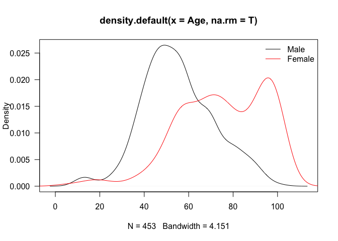
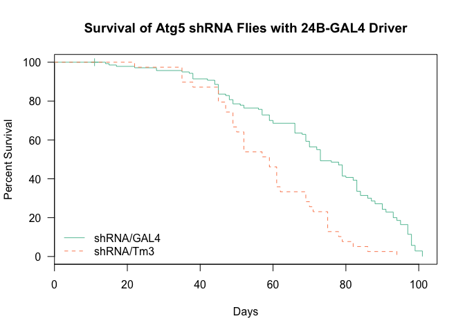
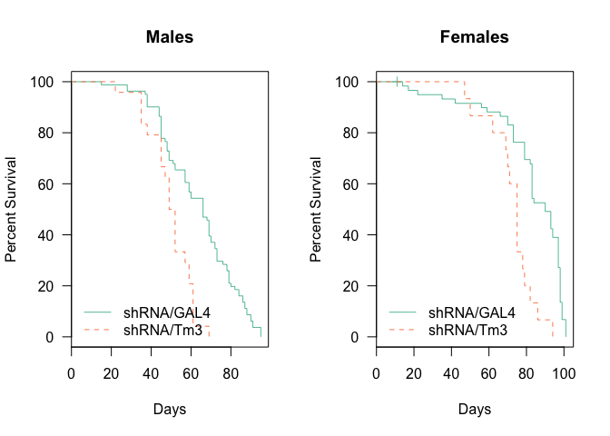
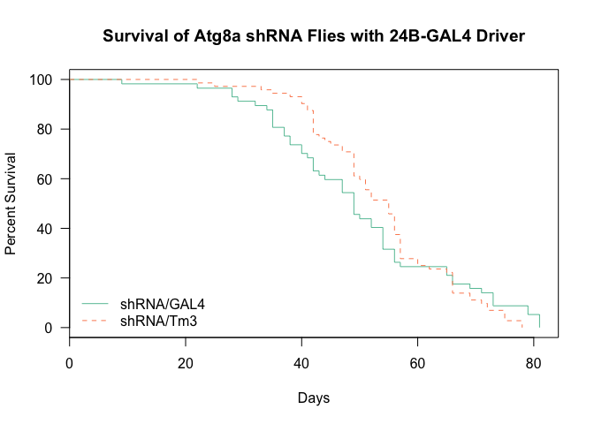
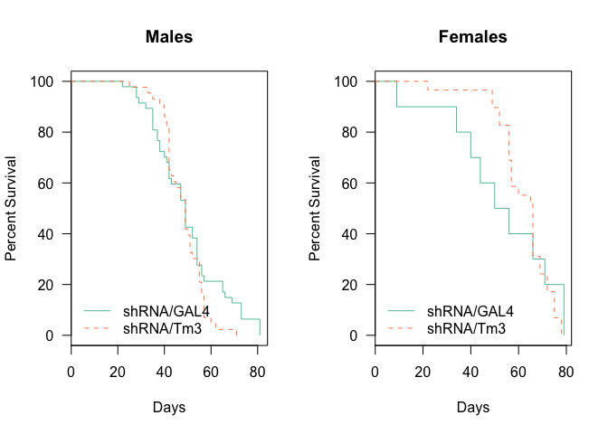
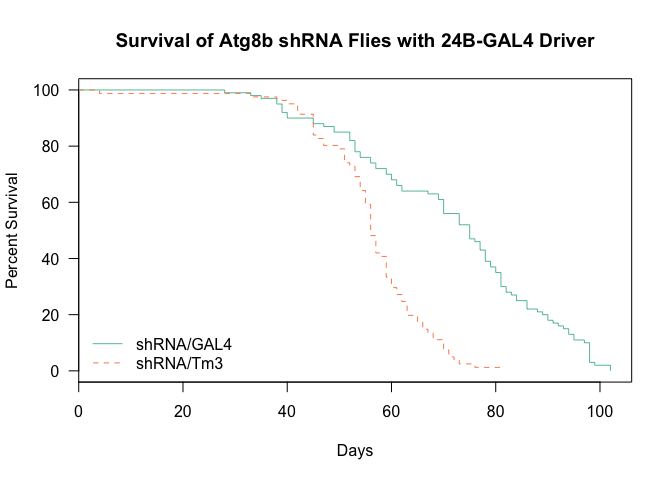
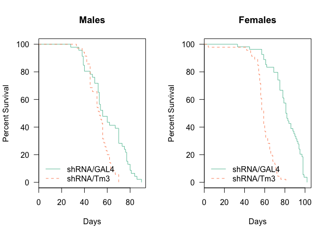
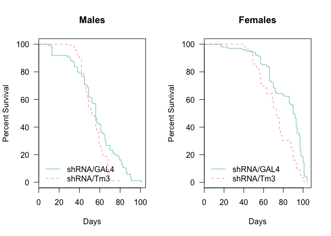

# Analysis of Longevity from Muscle dTORC1 Effector Flies
 Dave Bridges, Isabelle Hatfield and Erika Yates  
February 9, 2015  


These studies evaluate the effects of knockdown of several dTORC1 effectors, including Autophagy genes (*Atg5*, *Atg8a* and *Atg8b*) and the SREBP1 ortholog *Hlh106*  This data is located in /Users/davebridges/Documents/Source/DrosophilaMuscleFunction/Lifespan and was most recently updated on Tue Feb  9 13:06:23 2016.

## Experimental Design


This script was most recently run on Tue Feb  9 13:06:24 2016.  There has been a total of **1117** deaths, with **1113** of natural causes and **1109** of identifiable genotypes excluding accidental deaths.  The oldest fly recorded so far was 104 days old at time of death.

## Gene Level Analysis


## Number of Flies Examined

The total number of deaths for each cross and genotype, removing deaths that were accidental or not due to natural causes, the data is shown in the table below:


Table: Total Natural Deaths by Gender for Each Gene and Genotype

Driver     Gene     Gender    shRNA/GAL4   shRNA/Tm3   NA
---------  -------  -------  -----------  ----------  ---
24B-Gal4   Atg5     female            59          15    0
24B-Gal4   Atg5     male              81          24    0
24B-Gal4   Atg8a    female            10          29    0
24B-Gal4   Atg8a    male              47          43    3
24B-Gal4   Atg8b    female            54          46    2
24B-Gal4   Atg8b    male              46          35    0
24B-Gal4   HLH106   female           101          56    0
24B-Gal4   HLH106   male              86          91    1

The distribution of deaths in the samples are shown at a gender level in the Figure below:

 


## Survival Analysis

All of these are relative to the reference Genotype which is the knockdown (GAL4/shRNA).  The key packages used in this The summary statistics from this analysis are shown in the tables below:


Table: Gene Level Tests for 24B-Gal4 Drivers

            n   logtest.p    waldtest.p      sctest.p
-------  ----  ----------  ------------  ------------
Atg5      179           0   0.000002431   0.000001138
Atg8a     129           1   0.907485407   0.907483753
Atg8b     181           0   0.000000000   0.000000000
HLH106    334           0   0.000000012   0.000000007


Table: Gene and Gender Level  Tests for 24B-Gal4 Drivers

                   n   logtest.p    waldtest.p      sctest.p
--------------  ----  ----------  ------------  ------------
Atg5 male        105           0   0.000021212   0.000008170
Atg5 female       74           0   0.000081610   0.000028967
Atg8a male        90           0   0.202348648   0.200953953
Atg8a female      39           1   0.736828039   0.736655774
Atg8b male        81           0   0.002124445   0.001683301
Atg8b female     100           0   0.000000000   0.000000000
HLH106 male      177           0   0.001603990   0.001438531
HLH106 female    157           0   0.000026097   0.000018073


 


 

 

 

 

 

 

 


Table: Gene Level Cox Proportional Hazard Tests for 24B-Gal4 Drivers and Atg5 Knockdown

          Coef      SE   Hazard.Ratio    p
-------  -----  ------  -------------  ---
Total        1   0.194          0.402    0
Male         1   0.324          0.279    0
Female       1   0.262          0.328    0


Table: Gene Level Cox Proportional Hazard Tests for 24B-Gal4 Drivers and Atg8a Knockdown

          Coef      SE   Hazard.Ratio       p
-------  -----  ------  -------------  ------
Total        0   0.184          1.022   0.907
Male         0   0.410          0.871   0.737
Female       0   0.224          0.751   0.202


Table: Gene Level Cox Proportional Hazard Tests for 24B-Gal4 Drivers and Atg8b Knockdown

          Coef      SE   Hazard.Ratio       p
-------  -----  ------  -------------  ------
Total        1   0.188          0.255   0.000
Male         2   0.284          0.119   0.000
Female       1   0.256          0.455   0.002


Table: Gene Level Cox Proportional Hazard Tests for 24B-Gal4 Drivers and HLH106 Knockdown

          Coef      SE   Hazard.Ratio       p
-------  -----  ------  -------------  ------
Total        1   0.116          0.515   0.000
Male         1   0.175          0.480   0.000
Female       1   0.165          0.594   0.002

## Atg5 Knockdown

The summary statistics from this analysis are shown in the Table below:

\ref{tab:coxph.table.24b.atg5}.  

In the case of muscle *Atg5* knockdown flies, we observed the knockdown flies dying later than the wildtypes with a hazard ratio of 0.40164 (p=0).  This was true for both Males (HR=0.27858, p=0.00008) and Females (HR=0.3279, p=0.00002).


## Atg8a Knockdown

The summary statistics from this analysis are shown in the table below:

Table \ref{tab:coxph.table.24b.atg8a}.  

In the case of muscle *Atg8b* knockdown flies, we observed no significant differences with a hazard ratio of 1.02162 (p=0.90749).  This was true for both Males (HR=0.87117, p=0.73683) and Females (HR=0.75139, p=0.20235).

## Atg8b Knockdown

The summary statistics from this analysis are shown in the Table below


\ref{tab:coxph.table.24b.atg8b}.  

In the case of muscle *Atg8b* knockdown flies, we observed the knockdown flies dying later than the wildtypes with a hazard ratio of 0.25533 (p=3.616\times 10^{-13}).  This was true for both Males (HR=0.11886, p=6.4504\times 10^{-14}) and Females (HR=0.45542, p=0.00212).

## HLH106 Knockdown

The summary statistics from this analysis are shown in the Table below

\ref{tab:coxph.table.24b.HLH106}.  

In the case of muscle *HLH106* knockdown flies, we observed the knockdown flies dying later than the wildtypes with a hazard ratio of 0.51527 (p=0).  This was true for both Males (HR=0.47978, p=0.00003) and Females (HR=0.59387, p=0.0016).


## Session Information


```
## R version 3.2.2 (2015-08-14)
## Platform: x86_64-apple-darwin13.4.0 (64-bit)
## Running under: OS X 10.11.3 (El Capitan)
## 
## locale:
## [1] en_US.UTF-8/en_US.UTF-8/en_US.UTF-8/C/en_US.UTF-8/en_US.UTF-8
## 
## attached base packages:
## [1] stats     graphics  grDevices utils     datasets  methods   base     
## 
## other attached packages:
## [1] survival_2.38-3    RColorBrewer_1.1-2 xtable_1.8-0      
## [4] reshape2_1.4.1     plyr_1.8.3         lubridate_1.5.0   
## [7] RCurl_1.95-4.7     bitops_1.0-6       knitr_1.11        
## 
## loaded via a namespace (and not attached):
##  [1] Rcpp_0.12.2     digest_0.6.8    formatR_1.2.1   magrittr_1.5   
##  [5] evaluate_0.8    highr_0.5.1     stringi_1.0-1   rmarkdown_0.8.1
##  [9] splines_3.2.2   tools_3.2.2     stringr_1.0.0   yaml_2.1.13    
## [13] htmltools_0.2.6
```
