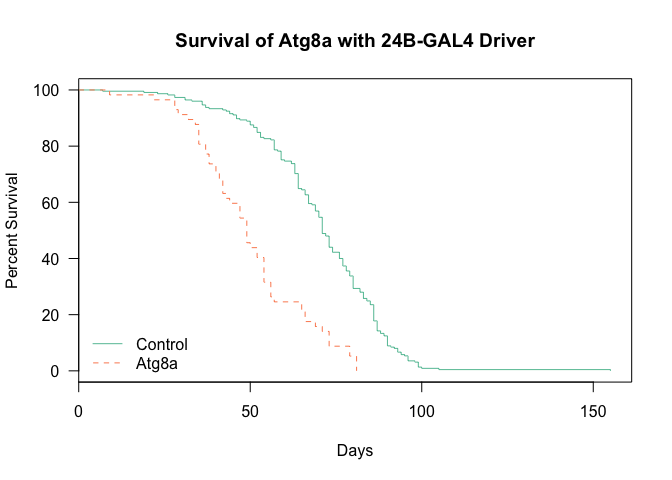
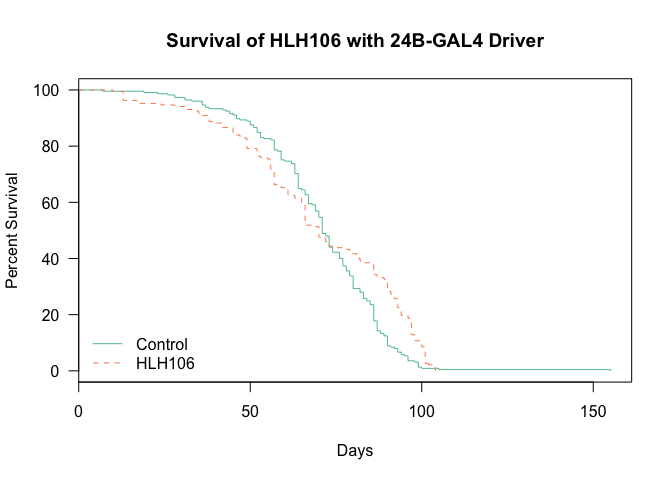
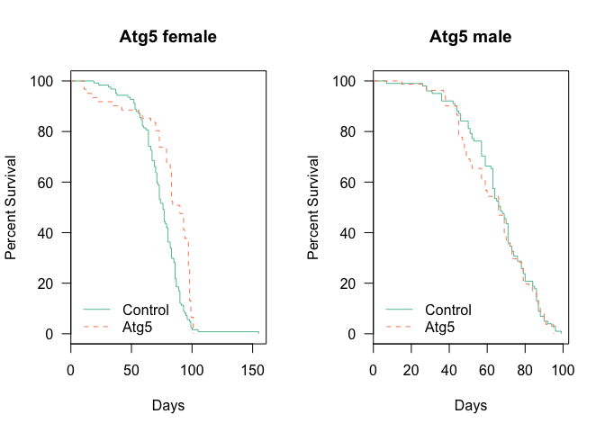
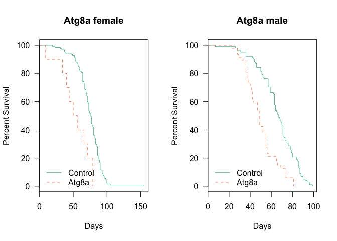
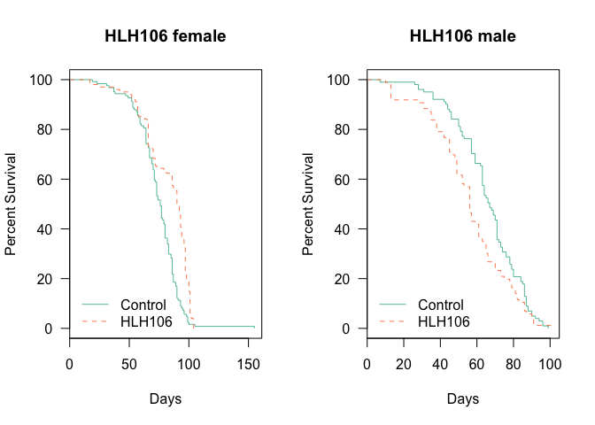
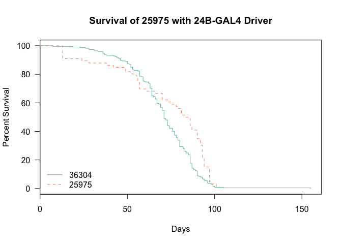
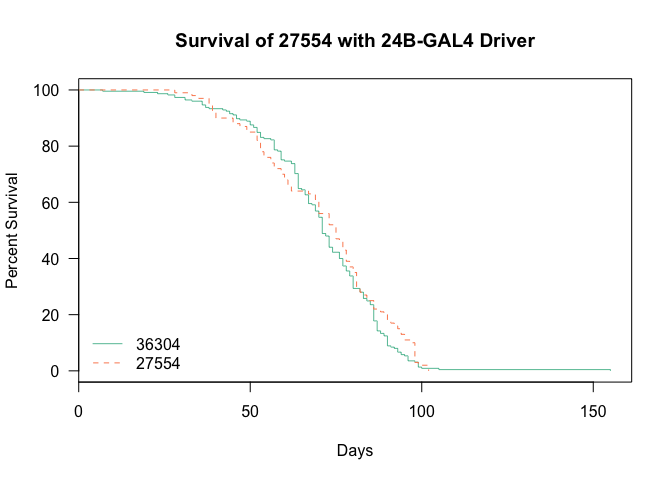
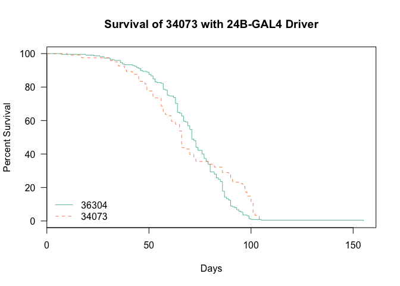
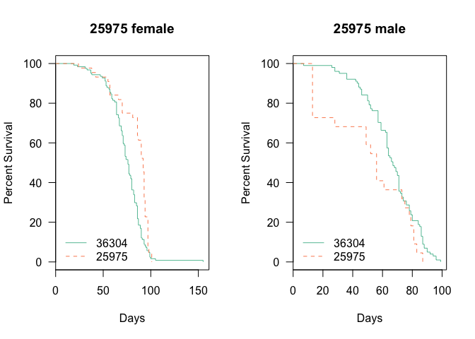
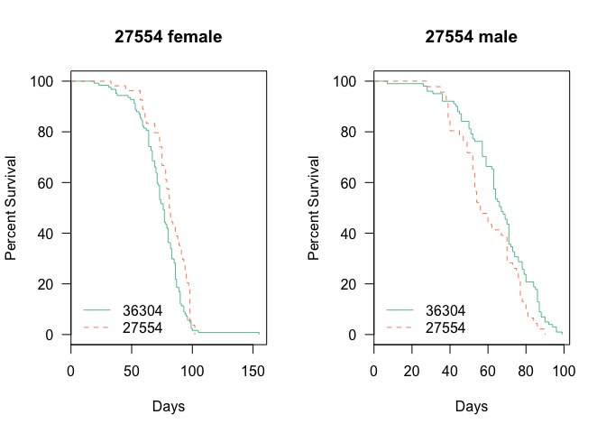

# Analysis of Longevity from Muscle dTORC1 Effector Flies
 Dave Bridges, Isabelle Hatfield and Erika Yates  
February 9, 2015  


These studies evaluate the effects of knockdown of several dTORC1 effectors, including Autophagy genes (*Atg5*, *Atg8a* and *Atg8b*) and the SREBP1 ortholog *Hlh106*  This data is located in /Users/davebridges/Documents/Source/DrosophilaMuscleFunction/Lifespan and was most recently updated on Tue Feb  9 16:16:07 2016.

## Experimental Design


This script was most recently run on Tue Feb  9 16:16:08 2016.  There has been a total of **1117** deaths, with **1113** of natural causes and **1109** of identifiable genotypes excluding accidental deaths.  The oldest fly recorded so far was 155 days old at time of death.

## Gene Level Analysis


## Number of Flies Examined

The total number of deaths for each cross and genotype, removing deaths that were accidental or not due to natural causes, the data is shown in the table below:


Table: Total Natural Deaths by Gender for Each Gene and Genotype

UAS     Gene       female   male
------  --------  -------  -----
25975   HLH106         44     22
27551   Atg5           61     81
27554   Atg8b          54     46
34073   HLH106         57     64
34340   Atg8a          10     47
36304   Control       124    101

## Survival Analysis

All of these are relative to the reference Genotype which is the knockdown (GAL4/shRNA).  The key packages used in this The summary statistics from this analysis are shown in the tables below:

        


Table: Gene Level Tests for 24B-Gal4 Drivers

             n   logtest.p   waldtest.p    sctest.p
--------  ----  ----------  -----------  ----------
Atg5       367   0.0208122    0.0218350   0.0215273
Atg8a      282   0.0000000    0.0000000   0.0000000
Atg8b      325   0.2681544    0.2719850   0.2716462
HLH106     412   0.0032338    0.0033468   0.0032504
Control     NA          NA           NA          NA


Table: Gene and Gender Level  Tests for 24B-Gal4 Drivers

                   n     logtest.p    waldtest.p      sctest.p
--------------  ----  ------------  ------------  ------------
Atg5 male        182   0.562147821   0.561551164   0.561427958
Atg5 female      185   0.000078321   0.000118024   0.000095685
Atg8a male       148   0.000000252   0.000000051   0.000000015
Atg8a female     134   0.001739391   0.000273395   0.000107367
Atg8b male       147   0.017618991   0.014771812   0.014005598
Atg8b female     178   0.015224195   0.017577936   0.016912379
HLH106 male      187   0.013451588   0.012740739   0.012257140
HLH106 female    225   0.000001906   0.000002068   0.000001487

## Analysis by shRNA Clone


          


Table: UAS Level Tests for 24B-Gal4 Drivers

           n   logtest.p   waldtest.p    sctest.p
------  ----  ----------  -----------  ----------
25975    291   0.0012544    0.0018383   0.0017014
27551    367   0.0208122    0.0218350   0.0215273
27554    325   0.2681544    0.2719850   0.2716462
34073    346   0.0581304    0.0607235   0.0603195
34340    282   0.0000000    0.0000000   0.0000000
36304     NA          NA           NA          NA


Table: UAS and Gender Level  Tests for 24B-Gal4 Drivers

                  n     logtest.p    waldtest.p      sctest.p
-------------  ----  ------------  ------------  ------------
female 25975    168   0.000294054   0.000499263   0.000415450
male 25975      123   0.063911798   0.052066030   0.050012278
female 27551    185   0.000078321   0.000118024   0.000095685
male 27551      182   0.562147821   0.561551164   0.561427958
female 27554    178   0.015224195   0.017577936   0.016912379
male 27554      147   0.017618991   0.014771812   0.014005598
female 34073    181   0.000049950   0.000083672   0.000068421
male 34073      165   0.028979399   0.026531128   0.025760116
female 34340    134   0.001739391   0.000273395   0.000107367
male 34340      148   0.000000252   0.000000051   0.000000015
female 36304     NA            NA            NA            NA
male 36304       NA            NA            NA            NA


## Session Information


```
## R version 3.2.2 (2015-08-14)
## Platform: x86_64-apple-darwin13.4.0 (64-bit)
## Running under: OS X 10.11.3 (El Capitan)
## 
## locale:
## [1] en_US.UTF-8/en_US.UTF-8/en_US.UTF-8/C/en_US.UTF-8/en_US.UTF-8
## 
## attached base packages:
## [1] stats     graphics  grDevices utils     datasets  methods   base     
## 
## other attached packages:
## [1] survival_2.38-3    RColorBrewer_1.1-2 tidyr_0.3.1       
## [4] dplyr_0.4.3        lubridate_1.5.0    RCurl_1.95-4.7    
## [7] bitops_1.0-6       knitr_1.11        
## 
## loaded via a namespace (and not attached):
##  [1] Rcpp_0.12.2     assertthat_0.1  digest_0.6.8    R6_2.1.1       
##  [5] DBI_0.3.1       formatR_1.2.1   magrittr_1.5    evaluate_0.8   
##  [9] highr_0.5.1     stringi_1.0-1   lazyeval_0.1.10 rmarkdown_0.8.1
## [13] splines_3.2.2   tools_3.2.2     stringr_1.0.0   parallel_3.2.2 
## [17] yaml_2.1.13     htmltools_0.2.6
```
