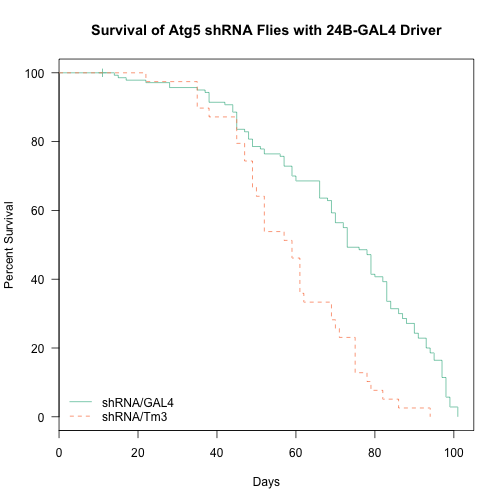
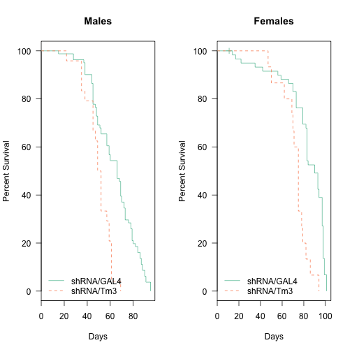
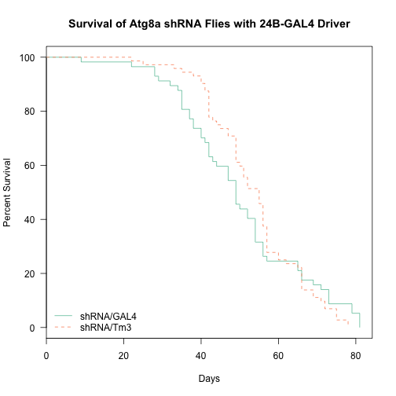
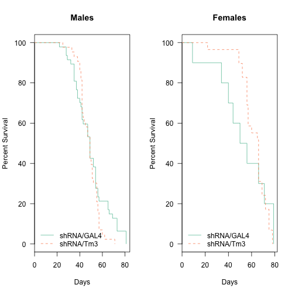
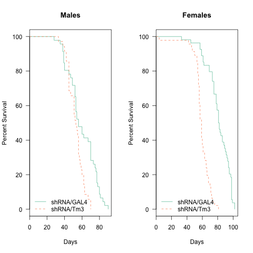
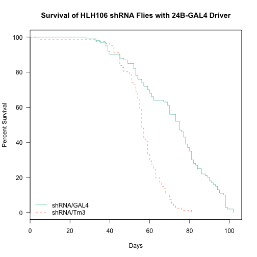
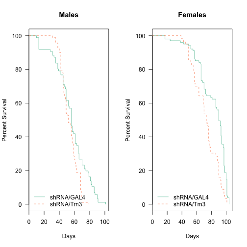

# Analysis of Longevity from Muscle mTORC1 Effector Flies

## Experimental Design


This script was most recently run on Fri Jun 27 14:54:30 2014.  There has been a total of **1117** deaths, with **1113** of natural causes and **1109** of identifiable genotypes excluding accidental deaths.  The oldest fly recorded so far was 104 days old at time of death.

## Gene Level Analysis


```
## Loading required package: plyr
## 
## Attaching package: 'plyr'
## 
## The following object is masked from 'package:lubridate':
## 
##     here
## 
## Loading required package: reshape2
```


## Number of Flies Examined

The total number of deaths for each cross and genotype, removing deaths that were accidental or not due to natural causes, the data is shown in the table below:


```
## Loading required package: xtable
```

<!-- html table generated in R 3.1.0 by xtable 1.7-3 package -->
<!-- Fri Jun 27 14:54:30 2014 -->
<TABLE border=1>
<CAPTION ALIGN="bottom"> Total Natural Deaths by Gender for Each Gene and Genotype </CAPTION>
<TR> <TH> Driver </TH> <TH> Gene </TH> <TH> Gender </TH> <TH> shRNA/GAL4 </TH> <TH> shRNA/Tm3 </TH> <TH> NA </TH>  </TR>
  <TR> <TD> 24B-Gal4 </TD> <TD> Atg5 </TD> <TD> female </TD> <TD align="right">  59 </TD> <TD align="right">  15 </TD> <TD align="right">   0 </TD> </TR>
  <TR> <TD> 24B-Gal4 </TD> <TD> Atg5 </TD> <TD> male </TD> <TD align="right">  81 </TD> <TD align="right">  24 </TD> <TD align="right">   0 </TD> </TR>
  <TR> <TD> 24B-Gal4 </TD> <TD> Atg8a </TD> <TD> female </TD> <TD align="right">  10 </TD> <TD align="right">  29 </TD> <TD align="right">   0 </TD> </TR>
  <TR> <TD> 24B-Gal4 </TD> <TD> Atg8a </TD> <TD> male </TD> <TD align="right">  47 </TD> <TD align="right">  43 </TD> <TD align="right">   3 </TD> </TR>
  <TR> <TD> 24B-Gal4 </TD> <TD> Atg8b </TD> <TD> female </TD> <TD align="right">  54 </TD> <TD align="right">  46 </TD> <TD align="right">   2 </TD> </TR>
  <TR> <TD> 24B-Gal4 </TD> <TD> Atg8b </TD> <TD> male </TD> <TD align="right">  46 </TD> <TD align="right">  35 </TD> <TD align="right">   0 </TD> </TR>
  <TR> <TD> 24B-Gal4 </TD> <TD> HLH106 </TD> <TD> female </TD> <TD align="right"> 101 </TD> <TD align="right">  56 </TD> <TD align="right">   0 </TD> </TR>
  <TR> <TD> 24B-Gal4 </TD> <TD> HLH106 </TD> <TD> male </TD> <TD align="right">  86 </TD> <TD align="right">  91 </TD> <TD align="right">   1 </TD> </TR>
   <A NAME=tab:analysed-deaths-gene-gender></A>
</TABLE>

The distribution of deaths in the samples are shown at a gender level in the Figure below:

 


## Survival Analysis

All of these are relative to the reference Genotype which is the knockdown (GAL4/shRNA).  The key packages used in this The summary statistics from this analysis are shown in the tables below:


```
## Loading required package: RColorBrewer
```

```
## Warning: minimal value for n is 3, returning requested palette with 3 different levels
```

```
## Loading required package: survival
## Loading required package: splines
```

<!-- html table generated in R 3.1.0 by xtable 1.7-3 package -->
<!-- Fri Jun 27 14:54:31 2014 -->
<TABLE border=1>
<CAPTION ALIGN="bottom"> Gene Level Tests for 24B-Gal4 Drivers </CAPTION>
<TR> <TH>  </TH> <TH> n </TH> <TH> logtest.p </TH> <TH> waldtest.p </TH> <TH> sctest.p </TH>  </TR>
  <TR> <TD align="right"> Atg5 </TD> <TD align="right"> 179 </TD> <TD align="right"> 0.000010893 </TD> <TD align="right"> 0.000002431 </TD> <TD align="right"> 0.000001138 </TD> </TR>
  <TR> <TD align="right"> Atg8a </TD> <TD align="right"> 129 </TD> <TD align="right"> 0.907539650 </TD> <TD align="right"> 0.907485407 </TD> <TD align="right"> 0.907483753 </TD> </TR>
  <TR> <TD align="right"> Atg8b </TD> <TD align="right"> 181 </TD> <TD align="right"> 0.000000000 </TD> <TD align="right"> 0.000000000 </TD> <TD align="right"> 0.000000000 </TD> </TR>
  <TR> <TD align="right"> HLH106 </TD> <TD align="right"> 334 </TD> <TD align="right"> 0.000000019 </TD> <TD align="right"> 0.000000012 </TD> <TD align="right"> 0.000000007 </TD> </TR>
   <A NAME=tab:coxph-summary-24b></A>
</TABLE>
<!-- html table generated in R 3.1.0 by xtable 1.7-3 package -->
<!-- Fri Jun 27 14:54:31 2014 -->
<TABLE border=1>
<CAPTION ALIGN="bottom"> Gene and Gender Level  Tests for 24B-Gal4 Drivers </CAPTION>
<TR> <TH>  </TH> <TH> n </TH> <TH> logtest.p </TH> <TH> waldtest.p </TH> <TH> sctest.p </TH>  </TR>
  <TR> <TD align="right"> Atg5 male </TD> <TD align="right"> 105 </TD> <TD align="right"> 0.000064349 </TD> <TD align="right"> 0.000021212 </TD> <TD align="right"> 0.000008170 </TD> </TR>
  <TR> <TD align="right"> Atg5 female </TD> <TD align="right"> 74 </TD> <TD align="right"> 0.000296796 </TD> <TD align="right"> 0.000081610 </TD> <TD align="right"> 0.000028967 </TD> </TR>
  <TR> <TD align="right"> Atg8a male </TD> <TD align="right"> 90 </TD> <TD align="right"> 0.201970740 </TD> <TD align="right"> 0.202348648 </TD> <TD align="right"> 0.200953953 </TD> </TR>
  <TR> <TD align="right"> Atg8a female </TD> <TD align="right"> 39 </TD> <TD align="right"> 0.733739760 </TD> <TD align="right"> 0.736828039 </TD> <TD align="right"> 0.736655774 </TD> </TR>
  <TR> <TD align="right"> Atg8b male </TD> <TD align="right"> 81 </TD> <TD align="right"> 0.002128659 </TD> <TD align="right"> 0.002124445 </TD> <TD align="right"> 0.001683301 </TD> </TR>
  <TR> <TD align="right"> Atg8b female </TD> <TD align="right"> 100 </TD> <TD align="right"> 0.000000000 </TD> <TD align="right"> 0.000000000 </TD> <TD align="right"> 0.000000000 </TD> </TR>
  <TR> <TD align="right"> HLH106 male </TD> <TD align="right"> 177 </TD> <TD align="right"> 0.001456808 </TD> <TD align="right"> 0.001603990 </TD> <TD align="right"> 0.001438531 </TD> </TR>
  <TR> <TD align="right"> HLH106 female </TD> <TD align="right"> 157 </TD> <TD align="right"> 0.000048352 </TD> <TD align="right"> 0.000026097 </TD> <TD align="right"> 0.000018073 </TD> </TR>
   <A NAME=tab:coxph-summary-24b-gender></A>
</TABLE>


 


 

 

 

 

 

 

 


<!-- html table generated in R 3.1.0 by xtable 1.7-3 package -->
<!-- Fri Jun 27 14:54:32 2014 -->
<TABLE border=1>
<CAPTION ALIGN="bottom"> Gene Level Cox Proportional Hazard Tests for 24B-Gal4 Drivers and Atg5 Knockdown </CAPTION>
<TR> <TH>  </TH> <TH> Coef </TH> <TH> SE </TH> <TH> Hazard.Ratio </TH> <TH> p </TH>  </TR>
  <TR> <TD align="right"> Total </TD> <TD align="right"> 0.912 </TD> <TD align="right"> 0.194 </TD> <TD align="right"> 0.402 </TD> <TD align="right"> 0.00000243 </TD> </TR>
  <TR> <TD align="right"> Male </TD> <TD align="right"> 1.278 </TD> <TD align="right"> 0.324 </TD> <TD align="right"> 0.279 </TD> <TD align="right"> 0.00008161 </TD> </TR>
  <TR> <TD align="right"> Female </TD> <TD align="right"> 1.115 </TD> <TD align="right"> 0.262 </TD> <TD align="right"> 0.328 </TD> <TD align="right"> 0.00002121 </TD> </TR>
   <A NAME=tab:coxph.table.24b.atg5></A>
</TABLE>
<!-- html table generated in R 3.1.0 by xtable 1.7-3 package -->
<!-- Fri Jun 27 14:54:32 2014 -->
<TABLE border=1>
<CAPTION ALIGN="bottom"> Gene Level Cox Proportional Hazard Tests for 24B-Gal4 Drivers and Atg8a Knockdown </CAPTION>
<TR> <TH>  </TH> <TH> Coef </TH> <TH> SE </TH> <TH> Hazard.Ratio </TH> <TH> p </TH>  </TR>
  <TR> <TD align="right"> Total </TD> <TD align="right"> -0.021 </TD> <TD align="right"> 0.184 </TD> <TD align="right"> 1.022 </TD> <TD align="right"> 0.907 </TD> </TR>
  <TR> <TD align="right"> Male </TD> <TD align="right"> 0.138 </TD> <TD align="right"> 0.410 </TD> <TD align="right"> 0.871 </TD> <TD align="right"> 0.737 </TD> </TR>
  <TR> <TD align="right"> Female </TD> <TD align="right"> 0.286 </TD> <TD align="right"> 0.224 </TD> <TD align="right"> 0.751 </TD> <TD align="right"> 0.202 </TD> </TR>
   <A NAME=tab:coxph.table.24b.atg8a></A>
</TABLE>
<!-- html table generated in R 3.1.0 by xtable 1.7-3 package -->
<!-- Fri Jun 27 14:54:32 2014 -->
<TABLE border=1>
<CAPTION ALIGN="bottom"> Gene Level Cox Proportional Hazard Tests for 24B-Gal4 Drivers and Atg8b Knockdown </CAPTION>
<TR> <TH>  </TH> <TH> Coef </TH> <TH> SE </TH> <TH> Hazard.Ratio </TH> <TH> p </TH>  </TR>
  <TR> <TD align="right"> Total </TD> <TD align="right"> 1.365 </TD> <TD align="right"> 0.188 </TD> <TD align="right"> 0.255 </TD> <TD align="right"> 0.000000000000362 </TD> </TR>
  <TR> <TD align="right"> Male </TD> <TD align="right"> 2.130 </TD> <TD align="right"> 0.284 </TD> <TD align="right"> 0.119 </TD> <TD align="right"> 0.000000000000065 </TD> </TR>
  <TR> <TD align="right"> Female </TD> <TD align="right"> 0.787 </TD> <TD align="right"> 0.256 </TD> <TD align="right"> 0.455 </TD> <TD align="right"> 0.002124445047858 </TD> </TR>
   <A NAME=tab:coxph.table.24b.atg8b></A>
</TABLE>
<!-- html table generated in R 3.1.0 by xtable 1.7-3 package -->
<!-- Fri Jun 27 14:54:32 2014 -->
<TABLE border=1>
<CAPTION ALIGN="bottom"> Gene Level Cox Proportional Hazard Tests for 24B-Gal4 Drivers and HLH106 Knockdown </CAPTION>
<TR> <TH>  </TH> <TH> Coef </TH> <TH> SE </TH> <TH> Hazard.Ratio </TH> <TH> p </TH>  </TR>
  <TR> <TD align="right"> Total </TD> <TD align="right"> 0.663 </TD> <TD align="right"> 0.116 </TD> <TD align="right"> 0.515 </TD> <TD align="right"> 0.000000011537224 </TD> </TR>
  <TR> <TD align="right"> Male </TD> <TD align="right"> 0.734 </TD> <TD align="right"> 0.175 </TD> <TD align="right"> 0.480 </TD> <TD align="right"> 0.000026096889752 </TD> </TR>
  <TR> <TD align="right"> Female </TD> <TD align="right"> 0.521 </TD> <TD align="right"> 0.165 </TD> <TD align="right"> 0.594 </TD> <TD align="right"> 0.001603989549559 </TD> </TR>
   <A NAME=tab:coxph.table.24b.HLH106></A>
</TABLE>

## Atg5 Knockdown

The summary statistics from this analysis are shown in the Table below:

\ref{tab:coxph.table.24b.atg5}.  

In the case of muscle *Atg5* knockdown flies, we observed the knockdown flies dying later than the wildtypes with a hazard ratio of 0.4016 (p=2.4306 &times; 10<sup>-6</sup>).  This was true for both Males (HR=0.2786, p=8.161 &times; 10<sup>-5</sup>) and Females (HR=0.3279, p=2.1212 &times; 10<sup>-5</sup>).


## Atg8a Knockdown

The summary statistics from this analysis are shown in the table below:

Table \ref{tab:coxph.table.24b.atg8a}.  

In the case of muscle *Atg8b* knockdown flies, we observed no significant differences with a hazard ratio of 1.0216 (p=0.9075).  This was true for both Males (HR=0.8712, p=0.7368) and Females (HR=0.7514, p=0.2023).

## Atg8b Knockdown

The summary statistics from this analysis are shown in the Table below


\ref{tab:coxph.table.24b.atg8b}.  

In the case of muscle *Atg8b* knockdown flies, we observed the knockdown flies dying later than the wildtypes with a hazard ratio of 0.2553 (p=3.616 &times; 10<sup>-13</sup>).  This was true for both Males (HR=0.1189, p=6.4504 &times; 10<sup>-14</sup>) and Females (HR=0.4554, p=0.0021).

## HLH106 Knockdown

The summary statistics from this analysis are shown in the Table below

\ref{tab:coxph.table.24b.HLH106}.  

In the case of muscle *HLH106* knockdown flies, we observed the knockdown flies dying later than the wildtypes with a hazard ratio of 0.5153 (p=1.1537 &times; 10<sup>-8</sup>).  This was true for both Males (HR=0.4798, p=2.6097 &times; 10<sup>-5</sup>) and Females (HR=0.5939, p=0.0016).


## Session Information

```
## R version 3.1.0 (2014-04-10)
## Platform: x86_64-apple-darwin13.1.0 (64-bit)
## 
## locale:
## [1] en_US.UTF-8/en_US.UTF-8/en_US.UTF-8/C/en_US.UTF-8/en_US.UTF-8
## 
## attached base packages:
## [1] splines   stats     graphics  grDevices utils     datasets  methods  
## [8] base     
## 
## other attached packages:
## [1] survival_2.37-7    RColorBrewer_1.0-5 xtable_1.7-3      
## [4] reshape2_1.4       plyr_1.8.1         lubridate_1.3.3   
## [7] RCurl_1.95-4.1     bitops_1.0-6       knitr_1.6         
## 
## loaded via a namespace (and not attached):
## [1] digest_0.6.4   evaluate_0.5.5 formatR_0.10   memoise_0.2.1 
## [5] Rcpp_0.11.2    stringr_0.6.2  tools_3.1.0
```
