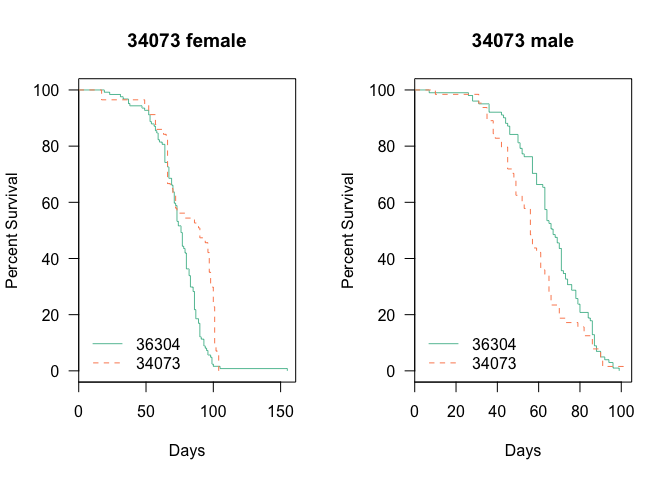

# Analysis of Longevity from Muscle dTORC1 Effector Flies
 Dave Bridges, Isabelle Hatfield and Erika Yates  
February 9, 2015  


These studies evaluate the effects of knockdown of several dTORC1 effectors, including Autophagy genes (*Atg5*, *Atg8a* and *Atg8b*) and the SREBP1 ortholog *Hlh106*  This data is located in /Users/davebridges/Documents/Source/DrosophilaMuscleFunction/Lifespan and was most recently updated on Tue Feb  9 16:49:24 2016.

## Experimental Design


This script was most recently run on Tue Feb  9 16:49:25 2016.  There has been a total of **1117** deaths, with **1113** of natural causes and **1109** of identifiable genotypes excluding accidental deaths.  The oldest fly recorded so far was 155 days old at time of death.

## Gene Level Analysis


## Number of Flies Examined

The total number of deaths for each cross and genotype, removing deaths that were accidental or not due to natural causes, the data is shown in the table below:


Table: Total Natural Deaths by Gender for Each Gene and Genotype

UAS     Gene       female   male
------  --------  -------  -----
36304   Control       124    101
25975   HLH106         44     22
27551   Atg5           61     81
27554   Atg8b          54     46
34073   HLH106         57     64
34340   Atg8a          10     47

## Survival Analysis

All of these are relative to the reference Genotype which is the knockdown (GAL4/shRNA).  The key packages used in this The summary statistics from this analysis are shown in the tables below:

        


Table: Gene Level Tests for 24B-Gal4 Drivers

             n   logtest.p   waldtest.p    sctest.p
--------  ----  ----------  -----------  ----------
Control     NA          NA           NA          NA
Atg5       367   0.0208122    0.0218350   0.0215273
Atg8a      282   0.0000000    0.0000000   0.0000000
Atg8b      325   0.2681544    0.2719850   0.2716462
HLH106     412   0.0032338    0.0033468   0.0032504


Table: Gene and Gender Level  Tests for 24B-Gal4 Drivers

                   n     logtest.p    waldtest.p      sctest.p
--------------  ----  ------------  ------------  ------------
Atg5 male        182   0.562147821   0.561551164   0.561427958
Atg5 female      185   0.000078321   0.000118024   0.000095685
Atg8a male       148   0.000000252   0.000000051   0.000000015
Atg8a female     134   0.001739391   0.000273395   0.000107367
Atg8b male       147   0.017618991   0.014771812   0.014005598
Atg8b female     178   0.015224195   0.017577936   0.016912379
HLH106 male      187   0.013451588   0.012740739   0.012257140
HLH106 female    225   0.000001906   0.000002068   0.000001487

## Analysis by shRNA Clone


          


Table: UAS Level Tests for 24B-Gal4 Drivers

           n   logtest.p   waldtest.p    sctest.p
------  ----  ----------  -----------  ----------
36304     NA          NA           NA          NA
25975    291   0.0012544    0.0018383   0.0017014
27551    367   0.0208122    0.0218350   0.0215273
27554    325   0.2681544    0.2719850   0.2716462
34073    346   0.0581304    0.0607235   0.0603195
34340    282   0.0000000    0.0000000   0.0000000


Table: UAS and Gender Level  Tests for 24B-Gal4 Drivers

                  n     logtest.p    waldtest.p      sctest.p
-------------  ----  ------------  ------------  ------------
female 36304     NA            NA            NA            NA
male 36304       NA            NA            NA            NA
female 25975    168   0.000294054   0.000499263   0.000415450
male 25975      123   0.063911798   0.052066030   0.050012278
female 27551    185   0.000078321   0.000118024   0.000095685
male 27551      182   0.562147821   0.561551164   0.561427958
female 27554    178   0.015224195   0.017577936   0.016912379
male 27554      147   0.017618991   0.014771812   0.014005598
female 34073    181   0.000049950   0.000083672   0.000068421
male 34073      165   0.028979399   0.026531128   0.025760116
female 34340    134   0.001739391   0.000273395   0.000107367
male 34340      148   0.000000252   0.000000051   0.000000015

## Hazard Ratios and Summary Tables


Table: Hazard Ratios for All Comparasons

group                Coef        SE   Hazard.Ratio         p      padj
--------------  ---------  --------  -------------  --------  --------
25975            -0.44645   0.14331        1.56276   0.00184   0.00414
25975.female     -0.62812   0.18043        1.87408   0.00050   0.00123
25975.male        0.46476   0.23925        0.62829   0.05207   0.06390
27551            -0.25092   0.10942        1.28521   0.02184   0.02948
27551.female     -0.62422   0.16213        1.86678   0.00012   0.00040
27551.male        0.08732   0.15041        0.91638   0.56155   0.56155
27554            -0.13321   0.12127        1.14249   0.27199   0.29374
27554.female     -0.39276   0.16542        1.48107   0.01758   0.02637
27554.male        0.44430   0.18224        0.64128   0.01477   0.02493
34073            -0.22341   0.11912        1.25033   0.06072   0.07128
34073.female     -0.68169   0.17330        1.97721   0.00008   0.00038
34073.male        0.35884   0.16176        0.69849   0.02653   0.03411
34340             1.26360   0.15854        0.28264   0.00000   0.00000
34340.female      1.23500   0.33935        0.29083   0.00027   0.00074
34340.male        1.02805   0.18867        0.35770   0.00000   0.00000
Atg5             -0.25092   0.10942        1.28521   0.02184   0.02948
Atg5.female      -0.62422   0.16213        1.86678   0.00012   0.00040
Atg5.male         0.08732   0.15041        0.91638   0.56155   0.56155
Atg8a             1.26360   0.15854        0.28264   0.00000   0.00000
Atg8a.female      1.23500   0.33935        0.29083   0.00027   0.00074
Atg8a.male        1.02805   0.18867        0.35770   0.00000   0.00000
Atg8b            -0.13321   0.12127        1.14249   0.27199   0.29374
Atg8b.female     -0.39276   0.16542        1.48107   0.01758   0.02637
Atg8b.male        0.44430   0.18224        0.64128   0.01477   0.02493
HLH106           -0.30339   0.10341        1.35444   0.00335   0.00695
HLH106.female    -0.67425   0.14205        1.96256   0.00000   0.00001
HLH106.male       0.36866   0.14800        0.69166   0.01274   0.02457


## Session Information


```
## R version 3.2.2 (2015-08-14)
## Platform: x86_64-apple-darwin13.4.0 (64-bit)
## Running under: OS X 10.11.3 (El Capitan)
## 
## locale:
## [1] en_US.UTF-8/en_US.UTF-8/en_US.UTF-8/C/en_US.UTF-8/en_US.UTF-8
## 
## attached base packages:
## [1] stats     graphics  grDevices utils     datasets  methods   base     
## 
## other attached packages:
## [1] survival_2.38-3    RColorBrewer_1.1-2 tidyr_0.3.1       
## [4] dplyr_0.4.3        lubridate_1.5.0    RCurl_1.95-4.7    
## [7] bitops_1.0-6       knitr_1.11        
## 
## loaded via a namespace (and not attached):
##  [1] Rcpp_0.12.2     assertthat_0.1  digest_0.6.8    R6_2.1.1       
##  [5] DBI_0.3.1       formatR_1.2.1   magrittr_1.5    evaluate_0.8   
##  [9] highr_0.5.1     stringi_1.0-1   lazyeval_0.1.10 rmarkdown_0.8.1
## [13] splines_3.2.2   tools_3.2.2     stringr_1.0.0   parallel_3.2.2 
## [17] yaml_2.1.13     htmltools_0.2.6
```
