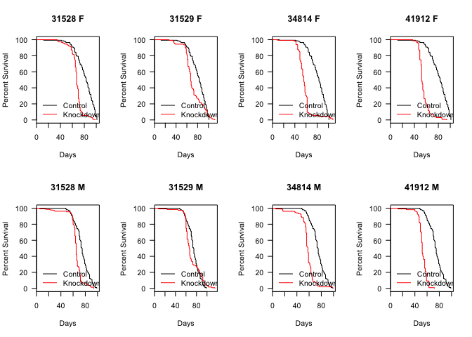
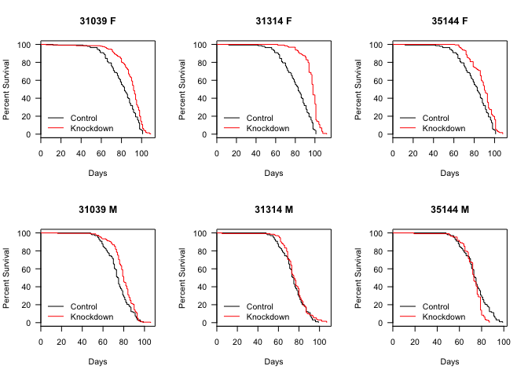

# Longevity Analysis of MHC-GAL4 Flies
Erika Yates and Dave Bridges  
December 4, 2014  


This was based on the incomplete lifespan data from the summer of 2014.


# *Mhc*-GAL4 Crosses

## *Raptor* Knockdowns

<!-- html table generated in R 3.1.1 by xtable 1.7-4 package -->
<!-- Sun Dec 14 14:14:26 2014 -->
<table border=1>
<caption align="bottom"> Summary statistics for effects of Mhc-GAL4 > Raptor knockdown flies </caption>
<tr> <th>  </th> <th> Gene </th> <th> Gender </th> <th> UAS </th> <th> mean </th> <th> median </th> <th> se </th> <th> n </th>  </tr>
  <tr> <td align="right"> 1 </td> <td> Control </td> <td> F </td> <td> 36304 </td> <td align="right"> 80.72 </td> <td align="right"> 83.00 </td> <td align="right"> 1.26 </td> <td align="right"> 141 </td> </tr>
  <tr> <td align="right"> 2 </td> <td> Control </td> <td> M </td> <td> 36304 </td> <td align="right"> 74.19 </td> <td align="right"> 74.50 </td> <td align="right"> 1.15 </td> <td align="right">  98 </td> </tr>
  <tr> <td align="right"> 3 </td> <td> Raptor </td> <td> F </td> <td> 31528 </td> <td align="right"> 66.97 </td> <td align="right"> 67.00 </td> <td align="right"> 0.83 </td> <td align="right"> 146 </td> </tr>
  <tr> <td align="right"> 4 </td> <td> Raptor </td> <td> F </td> <td> 31529 </td> <td align="right"> 71.40 </td> <td align="right"> 67.00 </td> <td align="right"> 1.49 </td> <td align="right"> 126 </td> </tr>
  <tr> <td align="right"> 5 </td> <td> Raptor </td> <td> F </td> <td> 34814 </td> <td align="right"> 57.00 </td> <td align="right"> 56.00 </td> <td align="right"> 1.16 </td> <td align="right"> 129 </td> </tr>
  <tr> <td align="right"> 6 </td> <td> Raptor </td> <td> F </td> <td> 41912 </td> <td align="right"> 55.13 </td> <td align="right"> 52.00 </td> <td align="right"> 0.74 </td> <td align="right"> 140 </td> </tr>
  <tr> <td align="right"> 7 </td> <td> Raptor </td> <td> M </td> <td> 31528 </td> <td align="right"> 64.80 </td> <td align="right"> 65.00 </td> <td align="right"> 1.00 </td> <td align="right"> 133 </td> </tr>
  <tr> <td align="right"> 8 </td> <td> Raptor </td> <td> M </td> <td> 31529 </td> <td align="right"> 70.47 </td> <td align="right"> 66.50 </td> <td align="right"> 1.49 </td> <td align="right"> 114 </td> </tr>
  <tr> <td align="right"> 9 </td> <td> Raptor </td> <td> M </td> <td> 34814 </td> <td align="right"> 57.17 </td> <td align="right"> 58.00 </td> <td align="right"> 1.23 </td> <td align="right"> 103 </td> </tr>
  <tr> <td align="right"> 10 </td> <td> Raptor </td> <td> M </td> <td> 41912 </td> <td align="right"> 52.46 </td> <td align="right"> 52.00 </td> <td align="right"> 0.70 </td> <td align="right"> 108 </td> </tr>
   </table>

We looked at a total of 1238 flies in this group, with at least 98 flies of each gender for each UAS.  We used the survival package to test if these changes are significant

## *Mhc*-GAL4 > *Raptor* Survival Analysis

 <!-- html table generated in R 3.1.1 by xtable 1.7-4 package -->
<!-- Sun Dec 14 14:14:26 2014 -->
<table border=1>
<tr> <th>  </th> <th> Coef </th> <th> SE </th> <th> p </th> <th> padj </th> <th> Hazard </th>  </tr>
  <tr> <td align="right"> 31528 F </td> <td align="right"> 1.281 </td> <td align="right"> 0.134 </td> <td align="right"> 0.00000 </td> <td align="right"> 0.00000 </td> <td align="right"> 3.598 </td> </tr>
  <tr> <td align="right"> 31529 F </td> <td align="right"> 0.328 </td> <td align="right"> 0.126 </td> <td align="right"> 0.00935 </td> <td align="right"> 0.01069 </td> <td align="right"> 1.388 </td> </tr>
  <tr> <td align="right"> 34814 F </td> <td align="right"> 1.227 </td> <td align="right"> 0.135 </td> <td align="right"> 0.00000 </td> <td align="right"> 0.00000 </td> <td align="right"> 3.412 </td> </tr>
  <tr> <td align="right"> 41912 F </td> <td align="right"> 2.001 </td> <td align="right"> 0.149 </td> <td align="right"> 0.00000 </td> <td align="right"> 0.00000 </td> <td align="right"> 7.397 </td> </tr>
  <tr> <td align="right"> 31528 M </td> <td align="right"> 0.902 </td> <td align="right"> 0.142 </td> <td align="right"> 0.00000 </td> <td align="right"> 0.00000 </td> <td align="right"> 2.464 </td> </tr>
  <tr> <td align="right"> 31529 M </td> <td align="right"> 0.084 </td> <td align="right"> 0.142 </td> <td align="right"> 0.55411 </td> <td align="right"> 0.55411 </td> <td align="right"> 1.088 </td> </tr>
  <tr> <td align="right"> 34814 M </td> <td align="right"> 1.313 </td> <td align="right"> 0.156 </td> <td align="right"> 0.00000 </td> <td align="right"> 0.00000 </td> <td align="right"> 3.717 </td> </tr>
  <tr> <td align="right"> 41912 M </td> <td align="right"> 2.680 </td> <td align="right"> 0.231 </td> <td align="right"> 0.00000 </td> <td align="right"> 0.00000 </td> <td align="right"> 14.580 </td> </tr>
   </table>

## *Tsc1* Knockdowns

<!-- html table generated in R 3.1.1 by xtable 1.7-4 package -->
<!-- Sun Dec 14 14:14:26 2014 -->
<table border=1>
<caption align="bottom"> Summary statistics for effects of Mhc-GAL4 > Tsc1 knockdown flies </caption>
<tr> <th>  </th> <th> Gene </th> <th> Gender </th> <th> UAS </th> <th> mean </th> <th> median </th> <th> se </th> <th> n </th>  </tr>
  <tr> <td align="right"> 1 </td> <td> Control </td> <td> F </td> <td> 36304 </td> <td align="right"> 80.72 </td> <td align="right"> 83.00 </td> <td align="right"> 1.26 </td> <td align="right"> 141 </td> </tr>
  <tr> <td align="right"> 2 </td> <td> Control </td> <td> M </td> <td> 36304 </td> <td align="right"> 74.19 </td> <td align="right"> 74.50 </td> <td align="right"> 1.15 </td> <td align="right">  98 </td> </tr>
  <tr> <td align="right"> 3 </td> <td> Tsc1 </td> <td> F </td> <td> 31039 </td> <td align="right"> 89.19 </td> <td align="right"> 92.00 </td> <td align="right"> 0.92 </td> <td align="right"> 206 </td> </tr>
  <tr> <td align="right"> 4 </td> <td> Tsc1 </td> <td> F </td> <td> 31314 </td> <td align="right"> 96.56 </td> <td align="right"> 98.00 </td> <td align="right"> 0.71 </td> <td align="right"> 128 </td> </tr>
  <tr> <td align="right"> 5 </td> <td> Tsc1 </td> <td> F </td> <td> 35144 </td> <td align="right"> 88.51 </td> <td align="right"> 90.00 </td> <td align="right"> 0.83 </td> <td align="right"> 172 </td> </tr>
  <tr> <td align="right"> 6 </td> <td> Tsc1 </td> <td> M </td> <td> 31039 </td> <td align="right"> 79.45 </td> <td align="right"> 80.00 </td> <td align="right"> 0.82 </td> <td align="right"> 181 </td> </tr>
  <tr> <td align="right"> 7 </td> <td> Tsc1 </td> <td> M </td> <td> 31314 </td> <td align="right"> 76.00 </td> <td align="right"> 75.00 </td> <td align="right"> 1.06 </td> <td align="right"> 131 </td> </tr>
  <tr> <td align="right"> 8 </td> <td> Tsc1 </td> <td> M </td> <td> 35144 </td> <td align="right"> 72.00 </td> <td align="right"> 73.00 </td> <td align="right"> 0.89 </td> <td align="right"> 108 </td> </tr>
   </table>

We looked at a total of 1165 flies in this group, with at least 98 flies of each gender for each UAS.  We used the survival package to test if these changes are significant

## *Mhc*-GAL4 > *Tsc1* Survival Analysis

 <!-- html table generated in R 3.1.1 by xtable 1.7-4 package -->
<!-- Sun Dec 14 14:14:26 2014 -->
<table border=1>
<tr> <th>  </th> <th> Coef </th> <th> SE </th> <th> p </th> <th> padj </th> <th> Hazard </th>  </tr>
  <tr> <td align="right"> 31039 F </td> <td align="right"> -0.626 </td> <td align="right"> 0.112 </td> <td align="right"> 0.00000 </td> <td align="right"> 0.00000 </td> <td align="right"> 0.535 </td> </tr>
  <tr> <td align="right"> 31314 F </td> <td align="right"> -1.329 </td> <td align="right"> 0.137 </td> <td align="right"> 0.00000 </td> <td align="right"> 0.00000 </td> <td align="right"> 0.265 </td> </tr>
  <tr> <td align="right"> 35144 F </td> <td align="right"> -0.550 </td> <td align="right"> 0.117 </td> <td align="right"> 0.00000 </td> <td align="right"> 0.00001 </td> <td align="right"> 0.577 </td> </tr>
  <tr> <td align="right"> 31039 M </td> <td align="right"> -0.382 </td> <td align="right"> 0.126 </td> <td align="right"> 0.00249 </td> <td align="right"> 0.00331 </td> <td align="right"> 0.683 </td> </tr>
  <tr> <td align="right"> 31314 M </td> <td align="right"> -0.148 </td> <td align="right"> 0.135 </td> <td align="right"> 0.27423 </td> <td align="right"> 0.27423 </td> <td align="right"> 0.863 </td> </tr>
  <tr> <td align="right"> 35144 M </td> <td align="right"> 0.451 </td> <td align="right"> 0.151 </td> <td align="right"> 0.00276 </td> <td align="right"> 0.00331 </td> <td align="right"> 1.570 </td> </tr>
   </table>


## Session Information

```
## R version 3.1.1 (2014-07-10)
## Platform: x86_64-apple-darwin13.1.0 (64-bit)
## 
## locale:
## [1] en_US.UTF-8/en_US.UTF-8/en_US.UTF-8/C/en_US.UTF-8/en_US.UTF-8
## 
## attached base packages:
## [1] splines   stats     graphics  grDevices utils     datasets  methods  
## [8] base     
## 
## other attached packages:
## [1] survival_2.37-7 xtable_1.7-4    dplyr_0.3.0.2   lubridate_1.3.3
## [5] knitr_1.8      
## 
## loaded via a namespace (and not attached):
##  [1] assertthat_0.1   DBI_0.3.1        digest_0.6.5     evaluate_0.5.5  
##  [5] formatR_1.0      htmltools_0.2.6  lazyeval_0.1.9   magrittr_1.5    
##  [9] memoise_0.2.1    parallel_3.1.1   plyr_1.8.1       Rcpp_0.11.3     
## [13] rmarkdown_0.3.10 stringr_0.6.2    tools_3.1.1      yaml_2.1.13
```
