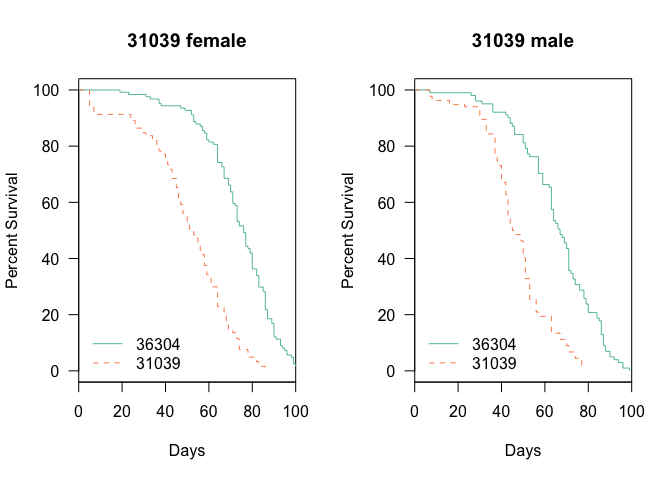
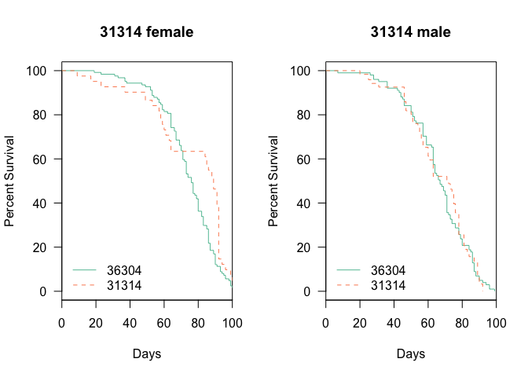
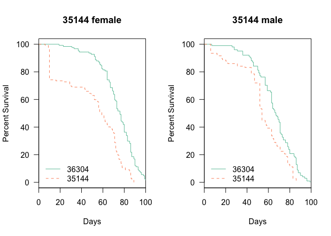

# Analysis of Longevity from Muscle dTORC1 Effector Flies
 Dave Bridges, Isabelle Hatfield and Erika Yates  
February 9, 2015  


These studies evaluate the effects of knockdown of the dTORC1 negative regulator *Tsc1*.  This data is located in /Users/davebridges/Documents/Source/DrosophilaMuscleFunction/Lifespan and was most recently updated on Wed Feb 17 17:03:51 2016.

## Experimental Design


This script was most recently run on Wed Feb 17 17:03:52 2016.  There has been a total of **` dim(death_data)[1]`** deaths, with **` dim(death_data[death_data$Accidental==FALSE,])[1]`** of natural causes and **` dim(death_data[death_data$Phenotype!='?'&death_data$Accidental==FALSE,])[1]`** of identifiable genotypes excluding accidental deaths.  The oldest fly recorded so far was 155 days old at time of death.

## Gene Level Analysis


## Number of Flies Examined

The total number of deaths for each cross and genotype, removing deaths that were accidental or not due to natural causes, the data is shown in the table below:


Table: Total Natural Deaths by Gender for Each Gene and Genotype

UAS     Gene       female   male
------  --------  -------  -----
36304   Control       124    101
31039   Tsc1          368    268
31314   Tsc1          164    242
35144   Tsc1          264    214

## Survival Analysis - 24B Driver

All of these are relative to the reference Genotype which is the knockdown (GAL4/shRNA).  The key packages used in this The summary statistics from this analysis are shown in the tables below:

  


Table: Gene Level Tests for 24B-Gal4 Drivers

              n   logtest.p   waldtest.p   sctest.p
--------  -----  ----------  -----------  ---------
Control      NA          NA           NA         NA
Raptor       NA          NA           NA         NA
Tsc1       1745           0            0          0


Table: Gene and Gender Level  Tests for 24B-Gal4 Drivers

                 n     logtest.p    waldtest.p      sctest.p
------------  ----  ------------  ------------  ------------
Tsc1 male      825   0.000002221   0.000008299   0.000006816
Tsc1 female    920   0.000000007   0.000000051   0.000000036

### Analysis by shRNA Clone - 24B


      


Table: UAS Level Tests for 24B-Gal4 Drivers

           n   logtest.p   waldtest.p   sctest.p
------  ----  ----------  -----------  ---------
36304     NA          NA           NA         NA
31039    861     0.00000      0.00000    0.00000
31314    631     0.11797      0.11561    0.11535
31528     NA          NA           NA         NA
31529     NA          NA           NA         NA
34814     NA          NA           NA         NA
35144    703     0.00000      0.00000    0.00000


Table: UAS and Gender Level  Tests for 24B-Gal4 Drivers

                  n     logtest.p    waldtest.p      sctest.p
-------------  ----  ------------  ------------  ------------
female 36304     NA            NA            NA            NA
male 36304       NA            NA            NA            NA
female 31039    492   0.000000000   0.000000000   0.000000000
male 31039      369   0.000000000   0.000000000   0.000000000
female 31314    288   0.001586835   0.001407535   0.001323685
male 31314      343   0.893582544   0.893702490   0.893701377
female 35144    388   0.000000000   0.000000000   0.000000000
male 35144      315   0.000000339   0.000000907   0.000000619

### Hazard Ratios and Summary Tables - 24B


Table: Hazard Ratios for All Comparasons

group               Coef        SE   Hazard.Ratio         p      padj
-------------  ---------  --------  -------------  --------  --------
31039            1.25381   0.09007        3.50365   0.00000   0.00000
31039.female     1.33444   0.12226        3.79786   0.00000   0.00000
31039.male       1.24163   0.13839        3.46124   0.00000   0.00000
31314           -0.13237   0.08413        0.87601   0.11561   0.12612
31314.female    -0.39268   0.12298        0.67524   0.00141   0.00169
31314.male       0.01619   0.12117        1.01632   0.89370   0.89370
35144            0.80070   0.08767        2.22710   0.00000   0.00000
35144.female     0.95373   0.12027        2.59537   0.00000   0.00000
35144.male       0.64178   0.13069        1.89986   0.00000   0.00000
Tsc1             0.49979   0.07208        1.64837   0.00000   0.00000
Tsc1.female      0.53222   0.09772        1.70271   0.00000   0.00000
Tsc1.male        0.48710   0.10928        1.62759   0.00001   0.00001

## Survival Analysis - Hand

  


Table: Gene Level Tests for Hand-Gal4 Drivers

              n   logtest.p   waldtest.p   sctest.p
--------  -----  ----------  -----------  ---------
Control      NA          NA           NA         NA
Raptor     1790           0            0          0
Tsc1         NA          NA           NA         NA


Table: Gene and Gender Level  Tests for Hand-Gal4 Drivers

                   n   logtest.p   waldtest.p   sctest.p
--------------  ----  ----------  -----------  ---------
Raptor male      886           0            0          0
Raptor female    904           0            0          0

## Analysis by shRNA Clone


    


Table: UAS Level Tests for Hand-Gal4 Drivers

           n     logtest.p    waldtest.p      sctest.p
------  ----  ------------  ------------  ------------
36304     NA            NA            NA            NA
31039    912   0.000000169   0.000000243   0.000000211
31314    580   0.030774235   0.029692170   0.029449464
31528     NA            NA            NA            NA
31529     NA            NA            NA            NA
34814     NA            NA            NA            NA
35144     NA            NA            NA            NA


Table: UAS and Gender Level  Tests for Hand-Gal4 Drivers

                  n     logtest.p    waldtest.p      sctest.p
-------------  ----  ------------  ------------  ------------
female 36304     NA            NA            NA            NA
male 36304       NA            NA            NA            NA
female 31039    456   0.002626763   0.002871653   0.002778001
male 31039      456   0.000006044   0.000009365   0.000007978
female 31314    336   0.090368416   0.089450552   0.088961761
male 31314      244   0.000009441   0.000005477   0.000003653
female 31528     NA            NA            NA            NA
male 31528       NA            NA            NA            NA
female 31529     NA            NA            NA            NA
male 31529       NA            NA            NA            NA
female 34814     NA            NA            NA            NA
male 34814       NA            NA            NA            NA
female 35144     NA            NA            NA            NA
male 35144       NA            NA            NA            NA

## Hazard Ratios and Summary Tables


Table: Hazard Ratios for All Comparasons

group               Coef        SE   Hazard.Ratio         p      padj
--------------  --------  --------  -------------  --------  --------
31039            0.36668   0.07102         1.4429   0.00000   0.00000
31039.female     0.29872   0.10020         1.3481   0.00287   0.00369
31039.male       0.46079   0.10399         1.5853   0.00001   0.00001
31314            0.19205   0.08833         1.2117   0.02969   0.03340
31314.female     0.19659   0.11575         1.2172   0.08945   0.08945
31314.male       0.69464   0.15281         2.0030   0.00001   0.00001
Raptor           1.07540   0.06514         2.9312   0.00000   0.00000
Raptor.female    1.02366   0.09209         2.7834   0.00000   0.00000
Raptor.male      1.70176   0.10514         5.4836   0.00000   0.00000


## Session Information


```
## R version 3.2.2 (2015-08-14)
## Platform: x86_64-apple-darwin13.4.0 (64-bit)
## Running under: OS X 10.11.3 (El Capitan)
## 
## locale:
## [1] en_US.UTF-8/en_US.UTF-8/en_US.UTF-8/C/en_US.UTF-8/en_US.UTF-8
## 
## attached base packages:
## [1] stats     graphics  grDevices utils     datasets  methods   base     
## 
## other attached packages:
## [1] survival_2.38-3    RColorBrewer_1.1-2 tidyr_0.3.1       
## [4] dplyr_0.4.3        lubridate_1.5.0    knitr_1.11        
## 
## loaded via a namespace (and not attached):
##  [1] Rcpp_0.12.2     digest_0.6.8    assertthat_0.1  R6_2.1.1       
##  [5] DBI_0.3.1       formatR_1.2.1   magrittr_1.5    evaluate_0.8   
##  [9] highr_0.5.1     stringi_1.0-1   lazyeval_0.1.10 rmarkdown_0.8.1
## [13] splines_3.2.2   tools_3.2.2     stringr_1.0.0   parallel_3.2.2 
## [17] yaml_2.1.13     htmltools_0.2.6
```
