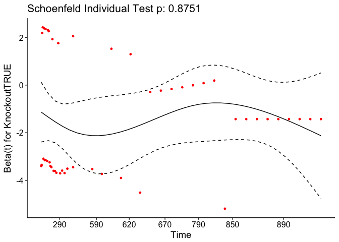

# Aging Analysis of Mck-TSC1
Dave Bridges, Kaleigh Fisher and Binbin Lu  
February 9, 2015  


# Data Entry

These data are accumulated from the database.  The analysis includes all alive animals, animals which were sacrificed and animals which died of natural causes (denoted in the database as "Unknown").  Animals which died with an estimated death date are excluded from the analysis.  We are testing the effects of age on death by natural causes.  This script is located in /Users/davebrid/Documents/GitHub/DrosophilaMuscleFunction/Lifespan and was most recently run on Sun Jan 22 11:35:56 2017.


# Mck-TSC1 Mice

```
## [1] 292
```

## Analysis

The data is saved in /Users/davebrid/Documents/GitHub/DrosophilaMuscleFunction/Lifespan with the data saved as ../Data/Mouse Log.csv and analysed using R \cite{base}.
The data was analysed using the survival package \cite{survival1, survival2}.  Log rank tests were performed using the coin package \cite{coin1, coin2}.
This plot analyses all of the natural deaths (marked in the database as unknown).  The median age at death was 272.5 for knockout mice and 623 for control mice

<!-- -->
This analysis contains a total of **625** animals, from which we have detected **49** natural deaths.  See Table below for a summary of natural deaths and see the figure below for the combined death curves with errors.

## Comparing all Four Genotypes
This analysis looks at all four genotypes for *Ckmm-Tsc1*.


```
## 
## 	Asymptotic K-Sample Logrank Test
## 
## data:  survobj.mck by
## 	 Genotype (fl/fl; Tg/+, +/+; +/+, +/+; Tg/+, fl/fl; +/+)
## chi-squared = 20, df = 3, p-value = 0.001
```

The chi-squared test for comparing all four genotypes is significant, with a p-value of 0.  The results of these tests are in the table below.  The effects of each genotype, relative to the knockout strains are in Table \ref{tab:mck-coef}. These data are visualised in the figure.  This means that the knockout mice are 3.667 to 5.347 times more likely to die at any given time, depending on the strain.


Table: Muscle TSC1 Knockout Tests

                         test   df     pvalue
----------------------  -----  ---  ---------
Likelihood ratio test      19    3   0.000322
Wald test                  18    3   0.000348
Score (logrank) test       21    3   0.000088


Table: Muscle TSC1 Knockout Coefficients, relative to Knockout

                       beta      se   2.5 %   97.5 %          p
-------------------  ------  ------  ------  -------  ---------
Genotype+/+; +/+      -1.68   0.187   -2.65   -0.705   0.000719
Genotype+/+; Tg/+     -1.46   0.232   -2.48   -0.440   0.004996
Genotypefl/fl; +/+    -1.30   0.273   -2.04   -0.561   0.000565

# Comparing Floxed to Knockout
This section only compares fl/fl;+/+ to fl/fl;Tg/+.


The chi-squared test for comparing the two genotypes is significant, with a p-value of 0.002.  The results of these tests are in the table below.  The effects of each genotype, relative to the knockout strains are in the table below. These results are presented graphically in the figure below.  This means that the knockout mice are 3.277 times more likely to die at any given time.


Table: Muscle TSC1 Knockout Tests (WT vs KO)

                         test   df   pvalue
----------------------  -----  ---  -------
Likelihood ratio test      10    1   0.0015
Wald test                   9    1   0.0026
Score (logrank) test       10    1   0.0015


Table: Muscle TSC1 Knockout Coefficients, relative to Knockout

                       beta      se   2.5 %   97.5 %        p
-------------------  ------  ------  ------  -------  -------
Genotypefl/fl; +/+    -1.19   0.305   -1.96   -0.415   0.0026

# Comparing Control Strains


The chi-squared test for comparing the three control genotypes is not significant, with a p-value of 0.772. 


# Death Logs
This table shows the age, and at risk individuals for each natural death, along with the \% survival and the confidence intervals.

 time   n.risk   n.event   n.censor    surv   std.err   upper   lower  strata               
-----  -------  --------  ---------  ------  --------  ------  ------  ---------------------
   10      188         1          0   0.995     0.005   1.000   0.984  Genotype=fl/fl; Tg/+ 
   17      187         0          3   0.995     0.005   1.000   0.984  Genotype=fl/fl; Tg/+ 
   18      184         1          7   0.989     0.008   1.000   0.975  Genotype=fl/fl; Tg/+ 
   19      176         0          1   0.989     0.008   1.000   0.975  Genotype=fl/fl; Tg/+ 
   21      175         0          3   0.989     0.008   1.000   0.975  Genotype=fl/fl; Tg/+ 
   22      172         0          1   0.989     0.008   1.000   0.975  Genotype=fl/fl; Tg/+ 
   28      171         0          2   0.989     0.008   1.000   0.975  Genotype=fl/fl; Tg/+ 
   30      169         0          1   0.989     0.008   1.000   0.975  Genotype=fl/fl; Tg/+ 
   31      168         0          2   0.989     0.008   1.000   0.975  Genotype=fl/fl; Tg/+ 
   33      166         0          1   0.989     0.008   1.000   0.975  Genotype=fl/fl; Tg/+ 
   34      165         0          1   0.989     0.008   1.000   0.975  Genotype=fl/fl; Tg/+ 
   41      164         0          3   0.989     0.008   1.000   0.975  Genotype=fl/fl; Tg/+ 
   42      161         0          3   0.989     0.008   1.000   0.975  Genotype=fl/fl; Tg/+ 
   43      158         0          1   0.989     0.008   1.000   0.975  Genotype=fl/fl; Tg/+ 
   48      157         0          2   0.989     0.008   1.000   0.975  Genotype=fl/fl; Tg/+ 
   50      155         0          1   0.989     0.008   1.000   0.975  Genotype=fl/fl; Tg/+ 
   58      154         0          1   0.989     0.008   1.000   0.975  Genotype=fl/fl; Tg/+ 
   60      153         0          1   0.989     0.008   1.000   0.975  Genotype=fl/fl; Tg/+ 
   62      152         0          2   0.989     0.008   1.000   0.975  Genotype=fl/fl; Tg/+ 
   63      150         0          3   0.989     0.008   1.000   0.975  Genotype=fl/fl; Tg/+ 
   64      147         0          1   0.989     0.008   1.000   0.975  Genotype=fl/fl; Tg/+ 
   69      146         0          1   0.989     0.008   1.000   0.975  Genotype=fl/fl; Tg/+ 
   71      145         1          0   0.982     0.010   1.000   0.963  Genotype=fl/fl; Tg/+ 
   78      144         0          2   0.982     0.010   1.000   0.963  Genotype=fl/fl; Tg/+ 
   85      142         0          2   0.982     0.010   1.000   0.963  Genotype=fl/fl; Tg/+ 
   89      140         0          2   0.982     0.010   1.000   0.963  Genotype=fl/fl; Tg/+ 
  102      138         0          2   0.982     0.010   1.000   0.963  Genotype=fl/fl; Tg/+ 
  103      136         0          3   0.982     0.010   1.000   0.963  Genotype=fl/fl; Tg/+ 
  108      133         0          4   0.982     0.010   1.000   0.963  Genotype=fl/fl; Tg/+ 
  110      129         1          0   0.975     0.013   1.000   0.950  Genotype=fl/fl; Tg/+ 
  111      128         0          1   0.975     0.013   1.000   0.950  Genotype=fl/fl; Tg/+ 
  112      127         0          1   0.975     0.013   1.000   0.950  Genotype=fl/fl; Tg/+ 
  114      126         1          0   0.967     0.015   0.996   0.939  Genotype=fl/fl; Tg/+ 
  123      125         0          1   0.967     0.015   0.996   0.939  Genotype=fl/fl; Tg/+ 
  124      124         0          3   0.967     0.015   0.996   0.939  Genotype=fl/fl; Tg/+ 
  125      121         1          0   0.959     0.017   0.992   0.927  Genotype=fl/fl; Tg/+ 
  130      120         0          1   0.959     0.017   0.992   0.927  Genotype=fl/fl; Tg/+ 
  132      119         0          6   0.959     0.017   0.992   0.927  Genotype=fl/fl; Tg/+ 
  137      113         0          1   0.959     0.017   0.992   0.927  Genotype=fl/fl; Tg/+ 
  138      112         1          0   0.951     0.019   0.988   0.915  Genotype=fl/fl; Tg/+ 
  147      111         0          1   0.951     0.019   0.988   0.915  Genotype=fl/fl; Tg/+ 
  148      110         0          3   0.951     0.019   0.988   0.915  Genotype=fl/fl; Tg/+ 
  150      107         0          3   0.951     0.019   0.988   0.915  Genotype=fl/fl; Tg/+ 
  153      104         0          2   0.951     0.019   0.988   0.915  Genotype=fl/fl; Tg/+ 
  160      102         0          3   0.951     0.019   0.988   0.915  Genotype=fl/fl; Tg/+ 
  164       99         0          2   0.951     0.019   0.988   0.915  Genotype=fl/fl; Tg/+ 
  172       97         0          4   0.951     0.019   0.988   0.915  Genotype=fl/fl; Tg/+ 
  174       93         0          1   0.951     0.019   0.988   0.915  Genotype=fl/fl; Tg/+ 
  177       92         0          6   0.951     0.019   0.988   0.915  Genotype=fl/fl; Tg/+ 
  180       86         1          3   0.939     0.023   0.982   0.899  Genotype=fl/fl; Tg/+ 
  182       82         1          0   0.928     0.026   0.976   0.882  Genotype=fl/fl; Tg/+ 
  191       81         0          2   0.928     0.026   0.976   0.882  Genotype=fl/fl; Tg/+ 
  195       79         0          1   0.928     0.026   0.976   0.882  Genotype=fl/fl; Tg/+ 
  196       78         0          1   0.928     0.026   0.976   0.882  Genotype=fl/fl; Tg/+ 
  200       77         0          4   0.928     0.026   0.976   0.882  Genotype=fl/fl; Tg/+ 
  202       73         0          3   0.928     0.026   0.976   0.882  Genotype=fl/fl; Tg/+ 
  204       70         0          3   0.928     0.026   0.976   0.882  Genotype=fl/fl; Tg/+ 
  209       67         0          3   0.928     0.026   0.976   0.882  Genotype=fl/fl; Tg/+ 
  216       64         0          1   0.928     0.026   0.976   0.882  Genotype=fl/fl; Tg/+ 
  221       63         0          1   0.928     0.026   0.976   0.882  Genotype=fl/fl; Tg/+ 
  225       62         0          3   0.928     0.026   0.976   0.882  Genotype=fl/fl; Tg/+ 
  243       59         0          1   0.928     0.026   0.976   0.882  Genotype=fl/fl; Tg/+ 
  244       58         1          0   0.912     0.031   0.969   0.858  Genotype=fl/fl; Tg/+ 
  245       57         0          1   0.912     0.031   0.969   0.858  Genotype=fl/fl; Tg/+ 
  248       56         0          1   0.912     0.031   0.969   0.858  Genotype=fl/fl; Tg/+ 
  251       55         0          1   0.912     0.031   0.969   0.858  Genotype=fl/fl; Tg/+ 
  256       54         0          2   0.912     0.031   0.969   0.858  Genotype=fl/fl; Tg/+ 
  257       52         0          1   0.912     0.031   0.969   0.858  Genotype=fl/fl; Tg/+ 
  261       51         0          2   0.912     0.031   0.969   0.858  Genotype=fl/fl; Tg/+ 
  264       49         1          0   0.893     0.037   0.961   0.830  Genotype=fl/fl; Tg/+ 
  266       48         0          3   0.893     0.037   0.961   0.830  Genotype=fl/fl; Tg/+ 
  267       45         0          1   0.893     0.037   0.961   0.830  Genotype=fl/fl; Tg/+ 
  270       44         0          1   0.893     0.037   0.961   0.830  Genotype=fl/fl; Tg/+ 
  273       43         0          2   0.893     0.037   0.961   0.830  Genotype=fl/fl; Tg/+ 
  276       41         0          1   0.893     0.037   0.961   0.830  Genotype=fl/fl; Tg/+ 
  280       40         0          2   0.893     0.037   0.961   0.830  Genotype=fl/fl; Tg/+ 
  281       38         1          0   0.870     0.046   0.952   0.795  Genotype=fl/fl; Tg/+ 
  283       37         0          1   0.870     0.046   0.952   0.795  Genotype=fl/fl; Tg/+ 
  287       36         0          1   0.870     0.046   0.952   0.795  Genotype=fl/fl; Tg/+ 
  292       35         1          0   0.845     0.054   0.940   0.760  Genotype=fl/fl; Tg/+ 
  296       34         0          1   0.845     0.054   0.940   0.760  Genotype=fl/fl; Tg/+ 
  297       33         0          1   0.845     0.054   0.940   0.760  Genotype=fl/fl; Tg/+ 
  299       32         0          1   0.845     0.054   0.940   0.760  Genotype=fl/fl; Tg/+ 
  308       31         0          1   0.845     0.054   0.940   0.760  Genotype=fl/fl; Tg/+ 
  309       30         1          0   0.817     0.064   0.926   0.721  Genotype=fl/fl; Tg/+ 
  310       29         0          2   0.817     0.064   0.926   0.721  Genotype=fl/fl; Tg/+ 
  313       27         0          2   0.817     0.064   0.926   0.721  Genotype=fl/fl; Tg/+ 
  314       25         0          1   0.817     0.064   0.926   0.721  Genotype=fl/fl; Tg/+ 
  316       24         1          1   0.783     0.077   0.910   0.673  Genotype=fl/fl; Tg/+ 
  317       22         0          1   0.783     0.077   0.910   0.673  Genotype=fl/fl; Tg/+ 
  318       21         0          1   0.783     0.077   0.910   0.673  Genotype=fl/fl; Tg/+ 
  319       20         0          1   0.783     0.077   0.910   0.673  Genotype=fl/fl; Tg/+ 
  320       19         0          1   0.783     0.077   0.910   0.673  Genotype=fl/fl; Tg/+ 
  323       18         0          1   0.783     0.077   0.910   0.673  Genotype=fl/fl; Tg/+ 
  324       17         0          1   0.783     0.077   0.910   0.673  Genotype=fl/fl; Tg/+ 
  338       16         0          1   0.783     0.077   0.910   0.673  Genotype=fl/fl; Tg/+ 
  343       15         0          1   0.783     0.077   0.910   0.673  Genotype=fl/fl; Tg/+ 
  352       14         0          1   0.783     0.077   0.910   0.673  Genotype=fl/fl; Tg/+ 
  371       13         1          0   0.723     0.111   0.898   0.581  Genotype=fl/fl; Tg/+ 
  375       12         0          2   0.723     0.111   0.898   0.581  Genotype=fl/fl; Tg/+ 
  396       10         0          1   0.723     0.111   0.898   0.581  Genotype=fl/fl; Tg/+ 
  411        9         0          1   0.723     0.111   0.898   0.581  Genotype=fl/fl; Tg/+ 
  452        8         1          0   0.632     0.174   0.889   0.450  Genotype=fl/fl; Tg/+ 
  586        7         1          0   0.542     0.232   0.855   0.344  Genotype=fl/fl; Tg/+ 
  595        6         1          0   0.452     0.295   0.806   0.253  Genotype=fl/fl; Tg/+ 
  601        5         1          0   0.361     0.371   0.747   0.175  Genotype=fl/fl; Tg/+ 
  635        4         0          1   0.361     0.371   0.747   0.175  Genotype=fl/fl; Tg/+ 
  638        3         1          1   0.241     0.551   0.710   0.082  Genotype=fl/fl; Tg/+ 
  832        1         1          0   0.000       Inf      NA      NA  Genotype=fl/fl; Tg/+ 
   15      125         0          5   1.000     0.000   1.000   1.000  Genotype=+/+; +/+    
   16      120         0          5   1.000     0.000   1.000   1.000  Genotype=+/+; +/+    
   17      115         0          2   1.000     0.000   1.000   1.000  Genotype=+/+; +/+    
   18      113         0         12   1.000     0.000   1.000   1.000  Genotype=+/+; +/+    
   19      101         0          3   1.000     0.000   1.000   1.000  Genotype=+/+; +/+    
   20       98         1          6   0.990     0.010   1.000   0.970  Genotype=+/+; +/+    
   21       91         0          3   0.990     0.010   1.000   0.970  Genotype=+/+; +/+    
   22       88         0          7   0.990     0.010   1.000   0.970  Genotype=+/+; +/+    
   24       81         0          1   0.990     0.010   1.000   0.970  Genotype=+/+; +/+    
   28       80         0          1   0.990     0.010   1.000   0.970  Genotype=+/+; +/+    
   30       79         0          1   0.990     0.010   1.000   0.970  Genotype=+/+; +/+    
   31       78         0          2   0.990     0.010   1.000   0.970  Genotype=+/+; +/+    
   32       76         0          2   0.990     0.010   1.000   0.970  Genotype=+/+; +/+    
   34       74         0          1   0.990     0.010   1.000   0.970  Genotype=+/+; +/+    
   38       73         0          2   0.990     0.010   1.000   0.970  Genotype=+/+; +/+    
   41       71         0          1   0.990     0.010   1.000   0.970  Genotype=+/+; +/+    
   43       70         0          1   0.990     0.010   1.000   0.970  Genotype=+/+; +/+    
   49       69         0          1   0.990     0.010   1.000   0.970  Genotype=+/+; +/+    
   50       68         0          2   0.990     0.010   1.000   0.970  Genotype=+/+; +/+    
   70       66         0          2   0.990     0.010   1.000   0.970  Genotype=+/+; +/+    
   86       64         0          1   0.990     0.010   1.000   0.970  Genotype=+/+; +/+    
  100       63         0          2   0.990     0.010   1.000   0.970  Genotype=+/+; +/+    
  103       61         0          1   0.990     0.010   1.000   0.970  Genotype=+/+; +/+    
  112       60         0          2   0.990     0.010   1.000   0.970  Genotype=+/+; +/+    
  138       58         0          1   0.990     0.010   1.000   0.970  Genotype=+/+; +/+    
  143       57         0          1   0.990     0.010   1.000   0.970  Genotype=+/+; +/+    
  156       56         0          1   0.990     0.010   1.000   0.970  Genotype=+/+; +/+    
  170       55         0          1   0.990     0.010   1.000   0.970  Genotype=+/+; +/+    
  193       54         0          1   0.990     0.010   1.000   0.970  Genotype=+/+; +/+    
  195       53         0          3   0.990     0.010   1.000   0.970  Genotype=+/+; +/+    
  198       50         0          1   0.990     0.010   1.000   0.970  Genotype=+/+; +/+    
  206       49         0          1   0.990     0.010   1.000   0.970  Genotype=+/+; +/+    
  216       48         0          1   0.990     0.010   1.000   0.970  Genotype=+/+; +/+    
  217       47         0          1   0.990     0.010   1.000   0.970  Genotype=+/+; +/+    
  225       46         0          1   0.990     0.010   1.000   0.970  Genotype=+/+; +/+    
  247       45         0          1   0.990     0.010   1.000   0.970  Genotype=+/+; +/+    
  251       44         0          1   0.990     0.010   1.000   0.970  Genotype=+/+; +/+    
  254       43         0          1   0.990     0.010   1.000   0.970  Genotype=+/+; +/+    
  259       42         0          2   0.990     0.010   1.000   0.970  Genotype=+/+; +/+    
  261       40         0          1   0.990     0.010   1.000   0.970  Genotype=+/+; +/+    
  262       39         0          2   0.990     0.010   1.000   0.970  Genotype=+/+; +/+    
  263       37         0          1   0.990     0.010   1.000   0.970  Genotype=+/+; +/+    
  266       36         0          2   0.990     0.010   1.000   0.970  Genotype=+/+; +/+    
  267       34         0          1   0.990     0.010   1.000   0.970  Genotype=+/+; +/+    
  268       33         0          2   0.990     0.010   1.000   0.970  Genotype=+/+; +/+    
  273       31         0          1   0.990     0.010   1.000   0.970  Genotype=+/+; +/+    
  276       30         0          2   0.990     0.010   1.000   0.970  Genotype=+/+; +/+    
  280       28         0          1   0.990     0.010   1.000   0.970  Genotype=+/+; +/+    
  283       27         0          1   0.990     0.010   1.000   0.970  Genotype=+/+; +/+    
  284       26         0          1   0.990     0.010   1.000   0.970  Genotype=+/+; +/+    
  286       25         0          2   0.990     0.010   1.000   0.970  Genotype=+/+; +/+    
  296       23         0          3   0.990     0.010   1.000   0.970  Genotype=+/+; +/+    
  306       20         0          1   0.990     0.010   1.000   0.970  Genotype=+/+; +/+    
  312       19         0          1   0.990     0.010   1.000   0.970  Genotype=+/+; +/+    
  313       18         0          1   0.990     0.010   1.000   0.970  Genotype=+/+; +/+    
  317       17         0          1   0.990     0.010   1.000   0.970  Genotype=+/+; +/+    
  320       16         0          1   0.990     0.010   1.000   0.970  Genotype=+/+; +/+    
  325       15         0          1   0.990     0.010   1.000   0.970  Genotype=+/+; +/+    
  343       14         0          1   0.990     0.010   1.000   0.970  Genotype=+/+; +/+    
  365       13         0          1   0.990     0.010   1.000   0.970  Genotype=+/+; +/+    
  368       12         0          1   0.990     0.010   1.000   0.970  Genotype=+/+; +/+    
  372       11         0          2   0.990     0.010   1.000   0.970  Genotype=+/+; +/+    
  396        9         0          3   0.990     0.010   1.000   0.970  Genotype=+/+; +/+    
  642        6         1          0   0.825     0.183   1.000   0.576  Genotype=+/+; +/+    
  665        5         1          0   0.660     0.289   1.000   0.375  Genotype=+/+; +/+    
  678        4         1          0   0.495     0.408   1.000   0.222  Genotype=+/+; +/+    
  857        3         1          0   0.330     0.577   1.000   0.106  Genotype=+/+; +/+    
  885        2         1          0   0.165     0.913   0.987   0.028  Genotype=+/+; +/+    
  938        1         1          0   0.000       Inf      NA      NA  Genotype=+/+; +/+    
   14      104         0          1   1.000     0.000   1.000   1.000  Genotype=+/+; Tg/+   
   16      103         0          4   1.000     0.000   1.000   1.000  Genotype=+/+; Tg/+   
   17       99         0          3   1.000     0.000   1.000   1.000  Genotype=+/+; Tg/+   
   18       96         0          6   1.000     0.000   1.000   1.000  Genotype=+/+; Tg/+   
   19       90         0          2   1.000     0.000   1.000   1.000  Genotype=+/+; Tg/+   
   20       88         0          5   1.000     0.000   1.000   1.000  Genotype=+/+; Tg/+   
   21       83         0          6   1.000     0.000   1.000   1.000  Genotype=+/+; Tg/+   
   22       77         0          4   1.000     0.000   1.000   1.000  Genotype=+/+; Tg/+   
   24       73         0          2   1.000     0.000   1.000   1.000  Genotype=+/+; Tg/+   
   28       71         0          1   1.000     0.000   1.000   1.000  Genotype=+/+; Tg/+   
   29       70         0          2   1.000     0.000   1.000   1.000  Genotype=+/+; Tg/+   
   30       68         0          1   1.000     0.000   1.000   1.000  Genotype=+/+; Tg/+   
   31       67         0          4   1.000     0.000   1.000   1.000  Genotype=+/+; Tg/+   
   32       63         0          2   1.000     0.000   1.000   1.000  Genotype=+/+; Tg/+   
   33       61         0          1   1.000     0.000   1.000   1.000  Genotype=+/+; Tg/+   
   35       60         0          1   1.000     0.000   1.000   1.000  Genotype=+/+; Tg/+   
   38       59         0          1   1.000     0.000   1.000   1.000  Genotype=+/+; Tg/+   
   46       58         0          4   1.000     0.000   1.000   1.000  Genotype=+/+; Tg/+   
   47       54         0          1   1.000     0.000   1.000   1.000  Genotype=+/+; Tg/+   
  100       53         0          2   1.000     0.000   1.000   1.000  Genotype=+/+; Tg/+   
  112       51         0          1   1.000     0.000   1.000   1.000  Genotype=+/+; Tg/+   
  114       50         1          0   0.980     0.020   1.000   0.942  Genotype=+/+; Tg/+   
  170       49         0          1   0.980     0.020   1.000   0.942  Genotype=+/+; Tg/+   
  188       48         0          2   0.980     0.020   1.000   0.942  Genotype=+/+; Tg/+   
  245       46         0          1   0.980     0.020   1.000   0.942  Genotype=+/+; Tg/+   
  248       45         0          1   0.980     0.020   1.000   0.942  Genotype=+/+; Tg/+   
  259       44         0          2   0.980     0.020   1.000   0.942  Genotype=+/+; Tg/+   
  261       42         0          1   0.980     0.020   1.000   0.942  Genotype=+/+; Tg/+   
  262       41         0          2   0.980     0.020   1.000   0.942  Genotype=+/+; Tg/+   
  266       39         0          3   0.980     0.020   1.000   0.942  Genotype=+/+; Tg/+   
  267       36         0          1   0.980     0.020   1.000   0.942  Genotype=+/+; Tg/+   
  268       35         0          1   0.980     0.020   1.000   0.942  Genotype=+/+; Tg/+   
  273       34         0          1   0.980     0.020   1.000   0.942  Genotype=+/+; Tg/+   
  280       33         0          1   0.980     0.020   1.000   0.942  Genotype=+/+; Tg/+   
  295       32         0          2   0.980     0.020   1.000   0.942  Genotype=+/+; Tg/+   
  296       30         0          1   0.980     0.020   1.000   0.942  Genotype=+/+; Tg/+   
  298       29         0          2   0.980     0.020   1.000   0.942  Genotype=+/+; Tg/+   
  299       27         0          1   0.980     0.020   1.000   0.942  Genotype=+/+; Tg/+   
  306       26         0          2   0.980     0.020   1.000   0.942  Genotype=+/+; Tg/+   
  310       24         0          1   0.980     0.020   1.000   0.942  Genotype=+/+; Tg/+   
  312       23         0          3   0.980     0.020   1.000   0.942  Genotype=+/+; Tg/+   
  313       20         0          2   0.980     0.020   1.000   0.942  Genotype=+/+; Tg/+   
  319       18         0          2   0.980     0.020   1.000   0.942  Genotype=+/+; Tg/+   
  322       16         0          1   0.980     0.020   1.000   0.942  Genotype=+/+; Tg/+   
  325       15         0          1   0.980     0.020   1.000   0.942  Genotype=+/+; Tg/+   
  337       14         0          2   0.980     0.020   1.000   0.942  Genotype=+/+; Tg/+   
  343       12         0          1   0.980     0.020   1.000   0.942  Genotype=+/+; Tg/+   
  354       11         0          2   0.980     0.020   1.000   0.942  Genotype=+/+; Tg/+   
  360        9         0          1   0.980     0.020   1.000   0.942  Genotype=+/+; Tg/+   
  368        8         0          1   0.980     0.020   1.000   0.942  Genotype=+/+; Tg/+   
  372        7         0          1   0.980     0.020   1.000   0.942  Genotype=+/+; Tg/+   
  380        6         0          2   0.980     0.020   1.000   0.942  Genotype=+/+; Tg/+   
  452        4         1          0   0.735     0.289   1.000   0.417  Genotype=+/+; Tg/+   
  773        3         1          0   0.490     0.500   1.000   0.184  Genotype=+/+; Tg/+   
  805        2         1          0   0.245     0.866   1.000   0.045  Genotype=+/+; Tg/+   
  935        1         1          0   0.000       Inf      NA      NA  Genotype=+/+; Tg/+   
   15      208         0          1   1.000     0.000   1.000   1.000  Genotype=fl/fl; +/+  
   17      207         0          3   1.000     0.000   1.000   1.000  Genotype=fl/fl; +/+  
   18      204         0          9   1.000     0.000   1.000   1.000  Genotype=fl/fl; +/+  
   19      195         0          1   1.000     0.000   1.000   1.000  Genotype=fl/fl; +/+  
   21      194         0          4   1.000     0.000   1.000   1.000  Genotype=fl/fl; +/+  
   22      190         0          3   1.000     0.000   1.000   1.000  Genotype=fl/fl; +/+  
   23      187         0          1   1.000     0.000   1.000   1.000  Genotype=fl/fl; +/+  
   24      186         0          1   1.000     0.000   1.000   1.000  Genotype=fl/fl; +/+  
   28      185         0          2   1.000     0.000   1.000   1.000  Genotype=fl/fl; +/+  
   31      183         0          8   1.000     0.000   1.000   1.000  Genotype=fl/fl; +/+  
   32      175         0          3   1.000     0.000   1.000   1.000  Genotype=fl/fl; +/+  
   36      172         0          1   1.000     0.000   1.000   1.000  Genotype=fl/fl; +/+  
   37      171         0          1   1.000     0.000   1.000   1.000  Genotype=fl/fl; +/+  
   38      170         0          1   1.000     0.000   1.000   1.000  Genotype=fl/fl; +/+  
   39      169         0          3   1.000     0.000   1.000   1.000  Genotype=fl/fl; +/+  
   41      166         0          6   1.000     0.000   1.000   1.000  Genotype=fl/fl; +/+  
   42      160         0          1   1.000     0.000   1.000   1.000  Genotype=fl/fl; +/+  
   43      159         0          1   1.000     0.000   1.000   1.000  Genotype=fl/fl; +/+  
   45      158         0          1   1.000     0.000   1.000   1.000  Genotype=fl/fl; +/+  
   48      157         0          1   1.000     0.000   1.000   1.000  Genotype=fl/fl; +/+  
   49      156         0          1   1.000     0.000   1.000   1.000  Genotype=fl/fl; +/+  
   50      155         1          1   0.994     0.006   1.000   0.981  Genotype=fl/fl; +/+  
   58      153         0          1   0.994     0.006   1.000   0.981  Genotype=fl/fl; +/+  
   59      152         0          1   0.994     0.006   1.000   0.981  Genotype=fl/fl; +/+  
   62      151         0          4   0.994     0.006   1.000   0.981  Genotype=fl/fl; +/+  
   69      147         0          1   0.994     0.006   1.000   0.981  Genotype=fl/fl; +/+  
   70      146         0          1   0.994     0.006   1.000   0.981  Genotype=fl/fl; +/+  
   78      145         0          2   0.994     0.006   1.000   0.981  Genotype=fl/fl; +/+  
   81      143         0          1   0.994     0.006   1.000   0.981  Genotype=fl/fl; +/+  
   85      142         0          1   0.994     0.006   1.000   0.981  Genotype=fl/fl; +/+  
   86      141         0          1   0.994     0.006   1.000   0.981  Genotype=fl/fl; +/+  
   89      140         0          1   0.994     0.006   1.000   0.981  Genotype=fl/fl; +/+  
   97      139         1          0   0.986     0.010   1.000   0.968  Genotype=fl/fl; +/+  
  103      138         0          2   0.986     0.010   1.000   0.968  Genotype=fl/fl; +/+  
  106      136         0          1   0.986     0.010   1.000   0.968  Genotype=fl/fl; +/+  
  111      135         0          1   0.986     0.010   1.000   0.968  Genotype=fl/fl; +/+  
  112      134         0          3   0.986     0.010   1.000   0.968  Genotype=fl/fl; +/+  
  124      131         0          1   0.986     0.010   1.000   0.968  Genotype=fl/fl; +/+  
  126      130         0          1   0.986     0.010   1.000   0.968  Genotype=fl/fl; +/+  
  131      129         0          2   0.986     0.010   1.000   0.968  Genotype=fl/fl; +/+  
  132      127         1          1   0.979     0.013   1.000   0.955  Genotype=fl/fl; +/+  
  134      125         0          1   0.979     0.013   1.000   0.955  Genotype=fl/fl; +/+  
  135      124         1          0   0.971     0.015   1.000   0.943  Genotype=fl/fl; +/+  
  141      123         0          1   0.971     0.015   1.000   0.943  Genotype=fl/fl; +/+  
  143      122         0          3   0.971     0.015   1.000   0.943  Genotype=fl/fl; +/+  
  150      119         0          1   0.971     0.015   1.000   0.943  Genotype=fl/fl; +/+  
  153      118         0          2   0.971     0.015   1.000   0.943  Genotype=fl/fl; +/+  
  154      116         0          1   0.971     0.015   1.000   0.943  Genotype=fl/fl; +/+  
  155      115         0          1   0.971     0.015   1.000   0.943  Genotype=fl/fl; +/+  
  160      114         0          2   0.971     0.015   1.000   0.943  Genotype=fl/fl; +/+  
  164      112         0          2   0.971     0.015   1.000   0.943  Genotype=fl/fl; +/+  
  170      110         0          1   0.971     0.015   1.000   0.943  Genotype=fl/fl; +/+  
  171      109         0          2   0.971     0.015   1.000   0.943  Genotype=fl/fl; +/+  
  172      107         0          4   0.971     0.015   1.000   0.943  Genotype=fl/fl; +/+  
  174      103         0          3   0.971     0.015   1.000   0.943  Genotype=fl/fl; +/+  
  177      100         0          2   0.971     0.015   1.000   0.943  Genotype=fl/fl; +/+  
  180       98         0          1   0.971     0.015   1.000   0.943  Genotype=fl/fl; +/+  
  181       97         0          1   0.971     0.015   1.000   0.943  Genotype=fl/fl; +/+  
  188       96         0          2   0.971     0.015   1.000   0.943  Genotype=fl/fl; +/+  
  193       94         0          1   0.971     0.015   1.000   0.943  Genotype=fl/fl; +/+  
  195       93         0          2   0.971     0.015   1.000   0.943  Genotype=fl/fl; +/+  
  196       91         0          2   0.971     0.015   1.000   0.943  Genotype=fl/fl; +/+  
  200       89         0          1   0.971     0.015   1.000   0.943  Genotype=fl/fl; +/+  
  202       88         0          2   0.971     0.015   1.000   0.943  Genotype=fl/fl; +/+  
  204       86         0          2   0.971     0.015   1.000   0.943  Genotype=fl/fl; +/+  
  207       84         0          3   0.971     0.015   1.000   0.943  Genotype=fl/fl; +/+  
  209       81         0          3   0.971     0.015   1.000   0.943  Genotype=fl/fl; +/+  
  210       78         0          1   0.971     0.015   1.000   0.943  Genotype=fl/fl; +/+  
  212       77         0          1   0.971     0.015   1.000   0.943  Genotype=fl/fl; +/+  
  218       76         1          0   0.958     0.020   0.996   0.921  Genotype=fl/fl; +/+  
  221       75         0          1   0.958     0.020   0.996   0.921  Genotype=fl/fl; +/+  
  223       74         0          2   0.958     0.020   0.996   0.921  Genotype=fl/fl; +/+  
  225       72         0          3   0.958     0.020   0.996   0.921  Genotype=fl/fl; +/+  
  240       69         0          1   0.958     0.020   0.996   0.921  Genotype=fl/fl; +/+  
  243       68         0          1   0.958     0.020   0.996   0.921  Genotype=fl/fl; +/+  
  247       67         0          1   0.958     0.020   0.996   0.921  Genotype=fl/fl; +/+  
  251       66         0          2   0.958     0.020   0.996   0.921  Genotype=fl/fl; +/+  
  256       64         0          2   0.958     0.020   0.996   0.921  Genotype=fl/fl; +/+  
  261       62         0          2   0.958     0.020   0.996   0.921  Genotype=fl/fl; +/+  
  263       60         0          1   0.958     0.020   0.996   0.921  Genotype=fl/fl; +/+  
  266       59         0          3   0.958     0.020   0.996   0.921  Genotype=fl/fl; +/+  
  270       56         0          1   0.958     0.020   0.996   0.921  Genotype=fl/fl; +/+  
  273       55         0          2   0.958     0.020   0.996   0.921  Genotype=fl/fl; +/+  
  276       53         0          1   0.958     0.020   0.996   0.921  Genotype=fl/fl; +/+  
  280       52         0          1   0.958     0.020   0.996   0.921  Genotype=fl/fl; +/+  
  284       51         1          0   0.939     0.028   0.992   0.889  Genotype=fl/fl; +/+  
  286       50         0          1   0.939     0.028   0.992   0.889  Genotype=fl/fl; +/+  
  287       49         0          1   0.939     0.028   0.992   0.889  Genotype=fl/fl; +/+  
  293       48         0          1   0.939     0.028   0.992   0.889  Genotype=fl/fl; +/+  
  294       47         0          1   0.939     0.028   0.992   0.889  Genotype=fl/fl; +/+  
  296       46         0          2   0.939     0.028   0.992   0.889  Genotype=fl/fl; +/+  
  297       44         0          3   0.939     0.028   0.992   0.889  Genotype=fl/fl; +/+  
  298       41         0          1   0.939     0.028   0.992   0.889  Genotype=fl/fl; +/+  
  305       40         0          1   0.939     0.028   0.992   0.889  Genotype=fl/fl; +/+  
  306       39         0          1   0.939     0.028   0.992   0.889  Genotype=fl/fl; +/+  
  310       38         0          1   0.939     0.028   0.992   0.889  Genotype=fl/fl; +/+  
  314       37         0          2   0.939     0.028   0.992   0.889  Genotype=fl/fl; +/+  
  316       35         0          4   0.939     0.028   0.992   0.889  Genotype=fl/fl; +/+  
  317       31         0          6   0.939     0.028   0.992   0.889  Genotype=fl/fl; +/+  
  318       25         0          2   0.939     0.028   0.992   0.889  Genotype=fl/fl; +/+  
  333       23         0          3   0.939     0.028   0.992   0.889  Genotype=fl/fl; +/+  
  343       20         0          1   0.939     0.028   0.992   0.889  Genotype=fl/fl; +/+  
  360       19         0          2   0.939     0.028   0.992   0.889  Genotype=fl/fl; +/+  
  368       17         0          2   0.939     0.028   0.992   0.889  Genotype=fl/fl; +/+  
  375       15         0          1   0.939     0.028   0.992   0.889  Genotype=fl/fl; +/+  
  376       14         0          1   0.939     0.028   0.992   0.889  Genotype=fl/fl; +/+  
  378       13         0          1   0.939     0.028   0.992   0.889  Genotype=fl/fl; +/+  
  402       12         0          1   0.939     0.028   0.992   0.889  Genotype=fl/fl; +/+  
  427       11         0          2   0.939     0.028   0.992   0.889  Genotype=fl/fl; +/+  
  596        9         1          0   0.835     0.121   1.000   0.658  Genotype=fl/fl; +/+  
  623        8         1          0   0.730     0.180   1.000   0.513  Genotype=fl/fl; +/+  
  718        7         1          0   0.626     0.237   0.997   0.393  Genotype=fl/fl; +/+  
  819        6         1          0   0.522     0.299   0.938   0.290  Genotype=fl/fl; +/+  
  869        5         1          0   0.417     0.374   0.868   0.201  Genotype=fl/fl; +/+  
  879        4         1          0   0.313     0.472   0.790   0.124  Genotype=fl/fl; +/+  
  886        3         1          0   0.209     0.624   0.709   0.061  Genotype=fl/fl; +/+  
  894        2         1          0   0.104     0.943   0.663   0.016  Genotype=fl/fl; +/+  
  936        1         1          0   0.000       Inf      NA      NA  Genotype=fl/fl; +/+  

<!-- -->

<!-- -->


Table: Muscle TSC1 Knockout Summary

                        Total Animals   Natural Deaths
---------------------  --------------  ---------------
Genotype=fl/fl; Tg/+              188               22
Genotype=+/+; +/+                 125                7
Genotype=+/+; Tg/+                104                5
Genotype=fl/fl; +/+               208               15


## Combining the Control Mice

<!-- -->


The chi-squared test for comparing the two genotypes is significant, with a p-value of 4.703&times; 10^-6^.  The results of these tests are in the table below.  The effects of each genotype, relative to the knockout strains are in the table below. These results are presented graphically in the figure below.  This means that the knockout mice are 4.171 times more likely to die at any given time.

## Testing Model Assumptions


                  rho   chisq       p
-------------  ------  ------  ------
KnockoutTRUE    0.023   0.025   0.875



We checked for correlation between scaled Schoenfeld residuals with time, and found no violation of the proportional hazard assumption (p = 0.875).


Table: Muscle TSC1 Knockout Tests controls combined

                         test   df      pvalue
----------------------  -----  ---  ----------
Likelihood ratio test      18    1   0.0000219
Wald test                  18    1   0.0000202
Score (logrank) test       21    1   0.0000047


Table: Muscle TSC1 Knockout Coefficients, relative to Knockout, controls combined

                 beta     se   2.5 %   97.5 %           p
-------------  ------  -----  ------  -------  ----------
KnockoutTRUE    -1.43   0.24   -2.08   -0.771   0.0000202


\bibliography{references}
\bibliographystyle{unsrt}

# Session Information


```
## R version 3.3.0 (2016-05-03)
## Platform: x86_64-apple-darwin13.4.0 (64-bit)
## Running under: OS X 10.12.2 (unknown)
## 
## locale:
## [1] en_US.UTF-8/en_US.UTF-8/en_US.UTF-8/C/en_US.UTF-8/en_US.UTF-8
## 
## attached base packages:
## [1] stats     graphics  grDevices utils     datasets  methods   base     
## 
## other attached packages:
## [1] bibtex_0.4.0        survminer_0.2.4.999 RColorBrewer_1.1-2 
## [4] ggfortify_0.3.0.0   ggplot2_2.2.1       xtable_1.8-2       
## [7] coin_1.1-3          survival_2.40-1     knitr_1.15.1       
## 
## loaded via a namespace (and not attached):
##  [1] Rcpp_0.12.9       highr_0.6         plyr_1.8.4       
##  [4] tools_3.3.0       digest_0.6.11     evaluate_0.10    
##  [7] tibble_1.2        gtable_0.2.0      lattice_0.20-34  
## [10] Matrix_1.2-7.1    DBI_0.5-1         yaml_2.1.14      
## [13] mvtnorm_1.0-5     gridExtra_2.2.1   stringr_1.1.0    
## [16] dplyr_0.5.0       stats4_3.3.0      rprojroot_1.1    
## [19] grid_3.3.0        R6_2.2.0          rmarkdown_1.3    
## [22] multcomp_1.4-6    TH.data_1.0-7     tidyr_0.6.1      
## [25] magrittr_1.5      backports_1.0.4   scales_0.4.1     
## [28] codetools_0.2-15  htmltools_0.3.5   modeltools_0.2-21
## [31] MASS_7.3-45       splines_3.3.0     assertthat_0.1   
## [34] colorspace_1.3-2  labeling_0.3      sandwich_2.3-4   
## [37] stringi_1.1.2     lazyeval_0.2.0    munsell_0.4.3    
## [40] zoo_1.7-14
```
