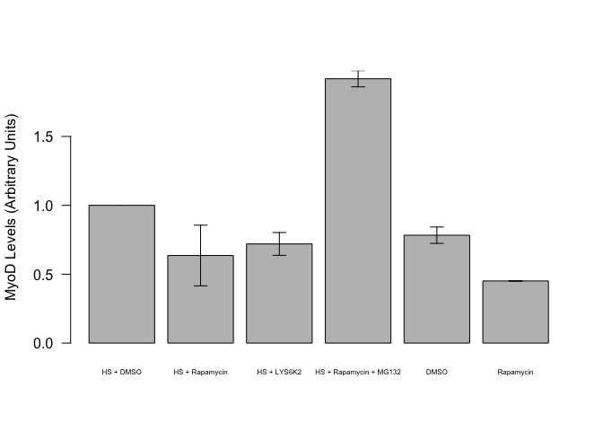
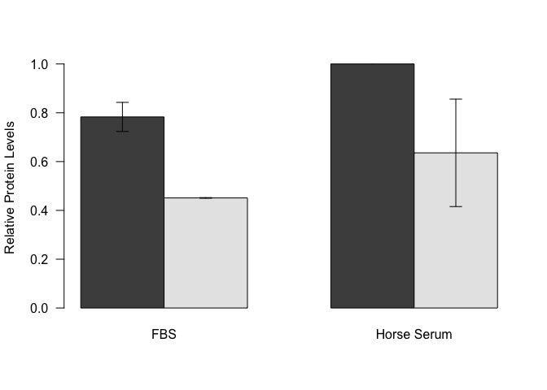
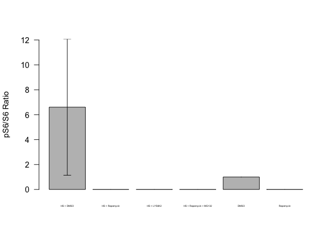
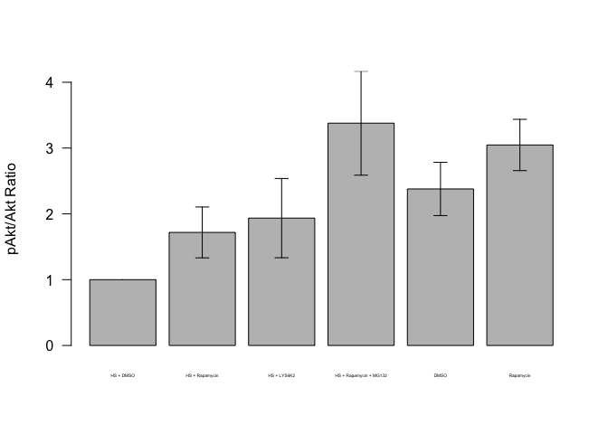
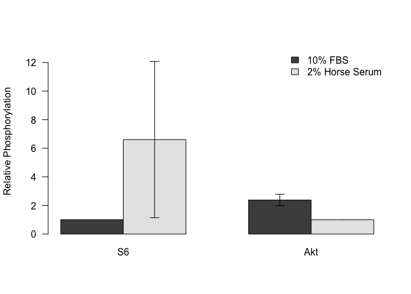
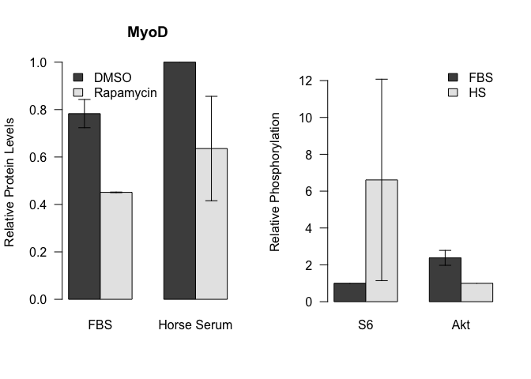

# Quantification of Effects of Rapamycin on MyoD Levels
Dave Bridges  
December 1, 2014  

C2C12 Cells were grown to confluence and then treated for 4h with 500 nM Rapamycin, 1 uM LYS6K2, or 10 uM MG132.  These data include experiments done on 2014-11-26 and 2014-11-29.  These data are located in /Users/davebridges/Documents/Source/DrosophilaMuscleFunction/Protein Analysis and was most recently updated on Thu Dec 11 09:13:12 2014.


```r
myod_data_file <- '2014-11-29/MyoD Quantification.txt'
myod_data_file_2 <- '2014-11-29/MyoD Quantification-2.txt'
myod_data <- read.csv(myod_data_file)

akt_data_file <- '2014-11-29/Akt Quantification.txt'
akt_data_file_2 <- '2014-11-29/Akt Quantification-2.txt'
akt_data <- rbind(read.csv(akt_data_file), read.csv(akt_data_file_2))

s6_data_file <- '2014-11-29/S6 Quantification.txt'
s6_data_file_2 <- '2014-11-29/S6 Quantification-2.txt'
s6_data <- rbind(read.csv(s6_data_file), read.csv(s6_data_file_2))
```

The input files are: 2014-11-29/Akt Quantification.txt and 2014-11-29/MyoD Quantification.txt.

# MyoD Quantification


```r
myod_data <- myod_data[grepl("Lane", myod_data$Lane.Name),]
myod_data <- myod_data[myod_data$Channel == 800,]
myod_data$Lane.Number <- as.integer(sapply(strsplit(as.character(myod_data$Lane.Name), " "),  "[", 2))
myod_data$Protein <- rep(c('MyoD'),12)

library(reshape2)
myod_lane_summary <- dcast(myod_data, Scan + Lane.Number ~ Protein, value.var='I.I..K.Counts.')
myod_lane_summary$Treatment <- as.factor(rep(c("DMSO",
                                               "Rapamycin",
                                               "HS + DMSO",
                                               "HS + Rapamycin",
                                               "HS + Rapamycin + MG132",
                                               "HS + LYS6K2"),2))
myod_lane_summary$Treatment <- factor(myod_lane_summary$Treatment, 
                                      levels(myod_lane_summary$Treatment)[c(2,4,3,5,1,6)])

myod_lane_summary$MyoD_Norm <- c(
  myod_lane_summary[c(1:6), 'MyoD']/myod_lane_summary[myod_lane_summary$Treatment=='HS + DMSO', 'MyoD'][1], 
  myod_lane_summary[c(7:12), 'MyoD']/myod_lane_summary[myod_lane_summary$Treatment=='HS + DMSO', 'MyoD'][2])

library(dplyr)
se <- function(x) sd(x)/sqrt(length(x))
myod_summary <-
  myod_lane_summary %>%
  group_by(Treatment) %>%
  summarize(mean=mean(MyoD_Norm),
            se = se(MyoD_Norm),
            sd = sd(MyoD_Norm),
            n = length(MyoD_Norm))

ymax = max(myod_summary$mean + myod_summary$se)
plot <- with(myod_summary, barplot(mean, names.arg=Treatment,
                           las=1, ylim=c(0,ymax),cex.names=0.5,
                           ylab="MyoD Levels (Arbitrary Units)"))

superpose.eb <- function (x, y, ebl, ebu = ebl, length = 0.08, ...)
  arrows(x, y + ebu, x, y - ebl, angle = 90, code = 3,
  length = length, ...)

superpose.eb(plot, myod_summary$mean, myod_summary$se)
```

 

```r
myod_summary$Serum <- c(rep("Horse Serum",4), rep("FBS",2))
myod_summary$Drug <- c("DMSO","Rapamycin","LYS6K","Rapamycin + MG132", "DMSO", "Rapamycin")
plot <- barplot(as.matrix(dcast(subset(myod_summary, Drug %in% c("DMSO","Rapamycin")), 
                        Drug~Serum, value.var='mean')[2:3]),
                        beside=T, las=1, ylab="Relative Protein Levels")
superpose.eb(plot,
            as.matrix(dcast(subset(myod_summary, Drug %in% c("DMSO","Rapamycin")), 
                        Drug~Serum, value.var='mean')[2:3]),
            as.matrix(dcast(subset(myod_summary, Drug %in% c("DMSO","Rapamycin")), 
                        Drug~Serum, value.var='se')[2:3]))
```

 

Based on these data, Rapamycin treatment reduced MyoD levels in the presence of Horse Serum by 36.4243043% +/- 22.0096815%.  The p-value by one-way t-test is 0.1730156.

In the absence of horse serum, there was a 57.6058284% reduction.  The p-value from the two-way t-test of that comparason is 0.1391155.

# pS6/S6 Quantification


```r
#for the first experiment
s6_data <- s6_data[grepl("Lane", s6_data$Lane.Name),]
s6_data <- s6_data[s6_data$Name == "Band 1",]
s6_data$Lane.Number <- as.integer(sapply(strsplit(as.character(s6_data$Lane.Name), " "),  "[", 2))
s6_data <- s6_data[order(s6_data$Lane.Number, s6_data$Channel),]
for (row.name in rownames(s6_data)) {
  if (s6_data[row.name,'Channel'] == '700')
     s6_data[row.name,'Protein'] <- 'pS6'
  else 
    s6_data[row.name,'Protein'] <- 'S6'
}

s6_lane_summary <- dcast(s6_data, Scan + Lane.Number ~ Protein, value.var='I.I..K.Counts.', mean)
s6_lane_summary$Ratio <- s6_lane_summary$pS6/s6_lane_summary$S6 
s6_lane_summary$Treatment <- as.factor(rep(c("DMSO",
                                               "Rapamycin",
                                               "HS + DMSO",
                                               "HS + Rapamycin",
                                               "HS + Rapamycin + MG132",
                                               "HS + LYS6K2"),3))

s6_lane_summary$Treatment <- factor(s6_lane_summary$Treatment, 
                                      levels(s6_lane_summary$Treatment)[c(2,4,3,5,1,6)])
s6_lane_summary$Ratio.norm <- c(
  s6_lane_summary[c(1:6), 'Ratio']/s6_lane_summary[s6_lane_summary$Treatment=='DMSO', 'Ratio'][1], 
  s6_lane_summary[c(7:12), 'Ratio']/s6_lane_summary[s6_lane_summary$Treatment=='DMSO', 'Ratio'][2],
  s6_lane_summary[c(13:18), 'Ratio']/s6_lane_summary[s6_lane_summary$Treatment=='DMSO', 'Ratio'][3])

s6_lane_summary[is.na(s6_lane_summary$Ratio.norm),'Ratio.norm'] <- 0

s6_summary <-
  s6_lane_summary %>%
  group_by(Treatment) %>%
  summarize(mean=mean(Ratio.norm),
            se = se(Ratio.norm),
            sd = sd(Ratio.norm),
            n = length(Ratio.norm))

ymax = max(s6_summary$mean + s6_summary$se)
plot <- with(s6_summary, barplot(mean, names.arg=Treatment,
                           las=1, ylim=c(0,ymax), cex.names=0.3,
                           ylab="pS6/S6 Ratio"))

superpose.eb(plot, s6_summary$mean, s6_summary$se)
```

 
The addition of horse serum caused an increase in S6 phosphorylation ratio of 6.6082765 fold (+/- 5.4673737 fold).  The one way t-test for this effect had a p-value of 0.


# pAkt/Akt Quantification


```r
akt_data <- akt_data[grepl("Lane", akt_data$Lane.Name),]
akt_data$Lane.Number <- as.integer(sapply(strsplit(as.character(akt_data$Lane.Name), " "),  "[", 2))

for (row.name in rownames(akt_data)) {
  if (akt_data[row.name,'Channel'] == '700')
     akt_data[row.name,'Protein'] <- 'pAkt'
  else 
    akt_data[row.name,'Protein'] <- 'Akt'
}
akt_data <- akt_data[akt_data$Lane.Name!='Lane 8',]

akt_lane_summary <- dcast(akt_data, Scan + Lane.Number ~ Protein, value.var='I.I..K.Counts.')
akt_lane_summary$Ratio <- akt_lane_summary$pAkt/akt_lane_summary$Akt 
akt_lane_summary$Treatment <- as.factor(rep(c("DMSO",
                                               "Rapamycin",
                                               "HS + DMSO",
                                               "HS + Rapamycin",
                                               "HS + Rapamycin + MG132",
                                               "HS + LYS6K2"),3))
akt_lane_summary$Treatment <- factor(akt_lane_summary$Treatment, 
                                      levels(akt_lane_summary$Treatment)[c(2,4,3,5,1,6)])
akt_lane_summary$Ratio.norm <- c(
  akt_lane_summary[c(1:6), 'Ratio']/akt_lane_summary[akt_lane_summary$Treatment=='HS + DMSO', 'Ratio'][1], 
  akt_lane_summary[c(7:12), 'Ratio']/akt_lane_summary[akt_lane_summary$Treatment=='HS + DMSO', 'Ratio'][2],
  akt_lane_summary[c(13:18), 'Ratio']/akt_lane_summary[akt_lane_summary$Treatment=='HS + DMSO', 'Ratio'][3])

akt_summary <-
  akt_lane_summary %>%
  group_by(Treatment) %>%
  summarize(mean=mean(Ratio.norm),
            se = se(Ratio.norm),
            sd = sd(Ratio.norm),
            n = length(Ratio.norm))

ymax = max(akt_summary$mean + akt_summary$se)
plot <- with(akt_summary, barplot(mean, names.arg=Treatment,
                           las=1, ylim=c(0,ymax), cex.names=0.3,
                           ylab="pAkt/Akt Ratio"))

superpose.eb(plot, akt_summary$mean, akt_summary$se)
```

 

The addition of horse serum caused an increase in Akt phosphorylation ratio of 2.3786261 fold (+/- 0.4047908 fold).  The one way t-test for this effect had a p-value of 0.

## General Effects of Horse Serum


```r
plot <- barplot(as.matrix(cbind(
  s6_summary[grepl("DMSO", s6_summary$Treatment),'mean'][c(2:1),],
  akt_summary[grepl("DMSO", akt_summary$Treatment),'mean',][c(2:1),])),
              beside=TRUE, las=1, ylim=c(0,13),
  names.arg=c('S6','Akt'), ylab='Relative Phosphorylation')
legend("topright", c('10% FBS','2% Horse Serum'), bty='n', fill=grey.colors(2))
superpose.eb(plot,
             as.matrix(cbind(
  s6_summary[grepl("DMSO", s6_summary$Treatment),'mean'][c(2:1),],
  akt_summary[grepl("DMSO", akt_summary$Treatment),'mean',][c(2:1),])),
             as.matrix(cbind(
  s6_summary[grepl("DMSO", s6_summary$Treatment),'se'][c(2:1),],
  akt_summary[grepl("DMSO", akt_summary$Treatment),'se',][c(2:1),])))
```

```
## Warning in arrows(x, y + ebu, x, y - ebl, angle = 90, code = 3, length =
## length, : zero-length arrow is of indeterminate angle and so skipped
```

```
## Warning in arrows(x, y + ebu, x, y - ebl, angle = 90, code = 3, length =
## length, : zero-length arrow is of indeterminate angle and so skipped
```

 

## Combined Figure


```r
par(mfrow=c(1,2))
plot <- barplot(as.matrix(dcast(subset(myod_summary, Drug %in% c("DMSO","Rapamycin")), 
                        Drug~Serum, value.var='mean')[2:3]),
                        beside=T, las=1, ylab="Relative Protein Levels", main="MyoD")
legend("topleft", c('DMSO','Rapamycin'), bty='n', fill=grey.colors(2))
superpose.eb(plot,
            as.matrix(dcast(subset(myod_summary, Drug %in% c("DMSO","Rapamycin")), 
                        Drug~Serum, value.var='mean')[2:3]),
            as.matrix(dcast(subset(myod_summary, Drug %in% c("DMSO","Rapamycin")), 
                        Drug~Serum, value.var='se')[2:3]))
```

```
## Warning in arrows(x, y + ebu, x, y - ebl, angle = 90, code = 3, length =
## length, : zero-length arrow is of indeterminate angle and so skipped
```

```r
plot <- barplot(as.matrix(cbind(
  s6_summary[grepl("DMSO", s6_summary$Treatment),'mean'][c(2:1),],
  akt_summary[grepl("DMSO", akt_summary$Treatment),'mean',][c(2:1),])),
              beside=TRUE, las=1, ylim=c(0,13),
  names.arg=c('S6','Akt'), ylab='Relative Phosphorylation')
legend("topright", c('FBS','HS'), bty='n', fill=grey.colors(2))
superpose.eb(plot,
             as.matrix(cbind(
  s6_summary[grepl("DMSO", s6_summary$Treatment),'mean'][c(2:1),],
  akt_summary[grepl("DMSO", akt_summary$Treatment),'mean',][c(2:1),])),
             as.matrix(cbind(
  s6_summary[grepl("DMSO", s6_summary$Treatment),'se'][c(2:1),],
  akt_summary[grepl("DMSO", akt_summary$Treatment),'se',][c(2:1),])))
```

```
## Warning in arrows(x, y + ebu, x, y - ebl, angle = 90, code = 3, length =
## length, : zero-length arrow is of indeterminate angle and so skipped
```

```
## Warning in arrows(x, y + ebu, x, y - ebl, angle = 90, code = 3, length =
## length, : zero-length arrow is of indeterminate angle and so skipped
```

 

## Session Information

```r
sessionInfo()
```

```
## R version 3.1.1 (2014-07-10)
## Platform: x86_64-apple-darwin13.1.0 (64-bit)
## 
## locale:
## [1] en_US.UTF-8/en_US.UTF-8/en_US.UTF-8/C/en_US.UTF-8/en_US.UTF-8
## 
## attached base packages:
## [1] stats     graphics  grDevices utils     datasets  methods   base     
## 
## other attached packages:
## [1] dplyr_0.3.0.2  reshape2_1.4.1
## 
## loaded via a namespace (and not attached):
##  [1] assertthat_0.1   DBI_0.3.1        digest_0.6.5     evaluate_0.5.5  
##  [5] formatR_1.0      htmltools_0.2.6  knitr_1.8        lazyeval_0.1.9  
##  [9] magrittr_1.5     parallel_3.1.1   plyr_1.8.1       Rcpp_0.11.3     
## [13] rmarkdown_0.3.10 stringr_0.6.2    tools_3.1.1      yaml_2.1.13
```
