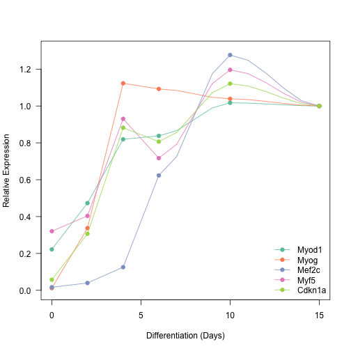

qPCR Analysis for Differentiation
========================================================

This is to  generate the graphs for the differentiation time course.


These data are in the file ../Data/3-18-14 time courseqPCRplusgenes.xlsx as worksheet `sheet_name`.  This script was most recently updated on Thu Oct 23 14:09:13 2014.

Graphs
-------

 

Session Information
-------------------


```
## R version 3.1.1 (2014-07-10)
## Platform: x86_64-apple-darwin13.1.0 (64-bit)
## 
## locale:
## [1] en_US.UTF-8/en_US.UTF-8/en_US.UTF-8/C/en_US.UTF-8/en_US.UTF-8
## 
## attached base packages:
## [1] stats     graphics  grDevices utils     datasets  methods   base     
## 
## other attached packages:
## [1] RColorBrewer_1.0-5 xlsx_0.5.7         xlsxjars_0.6.1    
## [4] rJava_0.9-6        knitr_1.6         
## 
## loaded via a namespace (and not attached):
## [1] evaluate_0.5.5 formatR_1.0    stringr_0.6.2  tools_3.1.1
```


